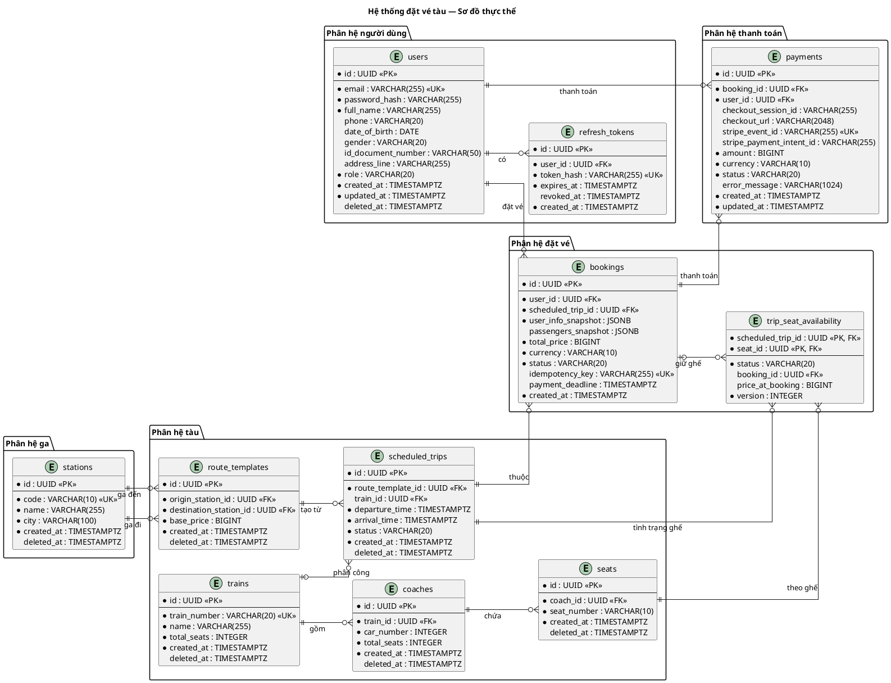
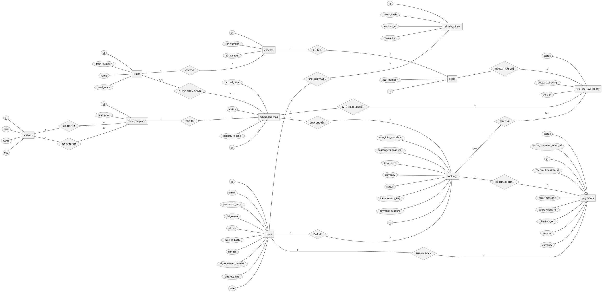

# Lược đồ cơ sở dữ liệu — Hệ thống đặt vé tàu

## 1. Tổng quan

Hệ thống đặt vé tàu hỏa trực tuyến sử dụng **PostgreSQL** làm cơ sở dữ liệu quan
hệ. Thiết kế cơ sở dữ liệu tuân theo kiến trúc **Domain-Driven Design (DDD)**
với các bounded context tách biệt: User, Station, Train, Booking và Payment.

### Công nghệ

| Thành phần | Chi tiết                                                      |
| ---------- | ------------------------------------------------------------- |
| RDBMS      | PostgreSQL                                                    |
| Khóa chính | UUID v7 (thời gian sắp xếp tự nhiên)                          |
| ORM        | JPA / Hibernate                                               |
| Migration  | Flyway                                                        |
| Múi giờ    | Tất cả timestamp lưu trữ dạng UTC (`TIMESTAMPTZ`)             |
| Tiền tệ    | Lưu trữ đơn vị nhỏ nhất (VND nguyên, USD cents) kiểu `BIGINT` |

### Quy ước chung

-  **Soft delete**: Các bảng chính sử dụng cột `deleted_at TIMESTAMPTZ`. Bản ghi
  đang hoạt động có `deleted_at IS NULL`.
-  **Unique constraints**: Sử dụng partial unique index với điều kiện
  `WHERE deleted_at IS NULL` để cho phép tái sử dụng giá trị đã xóa.
-  **Audit timestamps**: `created_at` (bắt buộc, không cập nhật), `updated_at`
  (nếu có, tự động cập nhật).
-  **Naming**: Tên bảng số nhiều tiếng Anh (`users`, `trains`), tên cột
  `snake_case`.
-  **Source of truth**: Tài liệu này dựa trên **JPA entities** (code là truth)
   và **Flyway baseline migration** (`B3_0_0__baseline.sql`).

---

## 2. ERD / Lược đồ thực thể

### 2.1 Sơ đồ thực thể — Class Entity Diagram



---

### 2.2 Sơ đồ quan hệ — Chen Notation ER Diagram

Sơ đồ Chen dưới đây là góc nhìn ý niệm: chỉ giữ các thuộc tính nghiệp vụ cốt
lõi, lược bỏ kiểu dữ liệu và các cột khóa ngoại đã được thể hiện bằng quan hệ.
Các trường audit như `created_at`, `updated_at`, `deleted_at` cũng được lược bỏ.
Chi tiết physical schema xem ở mục 3. `trip_seat_availability` được biểu diễn
như thực thể kết hợp giữa chuyến tàu và ghế.



---

## 3. Bảng chi tiết (3NF)

### 3.1 User Module

#### `users`

Người dùng hệ thống — bao gồm khách hàng và quản trị viên. Hỗ trợ soft delete.

| Cột                  | Kiểu dữ liệu   | Cho phép `NULL` | Mặc định            | Mô tả                                      |
| -------------------- | -------------- | --------------- | ------------------- | ------------------------------------------ |
| `id`                 | `UUID`         | NOT NULL        | `uuidv7()`          | Khóa chính                                 |
| `email`              | `VARCHAR(255)` | NOT NULL        | —                   | Địa chỉ email (duy nhất khi active)        |
| `password_hash`      | `VARCHAR(255)` | NOT NULL        | —                   | Mật khẩu đã băm                            |
| `full_name`          | `VARCHAR(255)` | NOT NULL        | —                   | Họ và tên                                  |
| `phone`              | `VARCHAR(20)`  | NULL            | —                   | Số điện thoại                              |
| `date_of_birth`      | `DATE`         | NULL            | —                   | Ngày sinh                                  |
| `gender`             | `VARCHAR(20)`  | NULL            | —                   | Giới tính                                  |
| `id_document_number` | `VARCHAR(50)`  | NULL            | —                   | Số giấy tờ tùy thân (CMND/CCCD/hộ chiếu)   |
| `address_line`       | `VARCHAR(255)` | NULL            | —                   | Địa chỉ                                    |
| `role`               | `VARCHAR(20)`  | NOT NULL        | `'CUSTOMER'`        | Vai trò: `CUSTOMER`, `ADMIN`               |
| `created_at`         | `TIMESTAMPTZ`  | NOT NULL        | `CURRENT_TIMESTAMP` | Thời điểm tạo (UTC)                        |
| `updated_at`         | `TIMESTAMPTZ`  | NOT NULL        | `CURRENT_TIMESTAMP` | Thời điểm cập nhật cuối (UTC)              |
| `deleted_at`         | `TIMESTAMPTZ`  | NULL            | —                   | Thời điểm xóa mềm; `NULL` = đang hoạt động |

**Ràng buộc:**

| Tên                     | Loại             | Mô tả                                      |
| ----------------------- | ---------------- | ------------------------------------------ |
| `pk_users`              | PRIMARY KEY      | `id`                                       |
| `chk_users_role`        | CHECK            | `role IN ('CUSTOMER', 'ADMIN')`            |
| `uq_users_email_active` | UNIQUE (partial) | `email` với điều kiện `deleted_at IS NULL` |

---

#### `refresh_tokens`

Token làm mới phiên đăng nhập. Hỗ trợ thu hồi (revoke) bằng cột `revoked_at`.

| Cột          | Kiểu dữ liệu   | Cho phép `NULL` | Mặc định            | Mô tả                                    |
| ------------ | -------------- | --------------- | ------------------- | ---------------------------------------- |
| `id`         | `UUID`         | NOT NULL        | `uuidv7()`          | Khóa chính                               |
| `user_id`    | `UUID`         | NOT NULL        | —                   | Người dùng sở hữu token                  |
| `token_hash` | `VARCHAR(255)` | NOT NULL        | —                   | Giá trị token đã băm (duy nhất)          |
| `expires_at` | `TIMESTAMPTZ`  | NOT NULL        | —                   | Thời điểm hết hạn (UTC)                  |
| `revoked_at` | `TIMESTAMPTZ`  | NULL            | —                   | Thời điểm thu hồi; `NULL` = còn hiệu lực |
| `created_at` | `TIMESTAMPTZ`  | NOT NULL        | `CURRENT_TIMESTAMP` | Thời điểm tạo (UTC)                      |

**Ràng buộc:**

| Tên                             | Loại        | Mô tả                   |
| ------------------------------- | ----------- | ----------------------- |
| `pk_refresh_tokens`             | PRIMARY KEY | `id`                    |
| `refresh_tokens_user_id_fkey`   | FOREIGN KEY | `user_id` → `users(id)` |
| `idx_refresh_tokens_token_hash` | UNIQUE      | `token_hash`            |

---

### 3.2 Station Module

#### `stations`

Ga tàu hỏa. Hỗ trợ soft delete.

| Cột          | Kiểu dữ liệu   | Cho phép `NULL` | Mặc định            | Mô tả                                         |
| ------------ | -------------- | --------------- | ------------------- | --------------------------------------------- |
| `id`         | `UUID`         | NOT NULL        | `uuidv7()`          | Khóa chính                                    |
| `code`       | `VARCHAR(10)`  | NOT NULL        | —                   | Mã ga (vd: `HNO`, `SGN`), duy nhất khi active |
| `name`       | `VARCHAR(255)` | NOT NULL        | —                   | Tên ga                                        |
| `city`       | `VARCHAR(100)` | NOT NULL        | —                   | Thành phố                                     |
| `created_at` | `TIMESTAMPTZ`  | NOT NULL        | `CURRENT_TIMESTAMP` | Thời điểm tạo (UTC)                           |
| `deleted_at` | `TIMESTAMPTZ`  | NULL            | —                   | Thời điểm xóa mềm; `NULL` = đang hoạt động    |

**Ràng buộc:**

| Tên                       | Loại             | Mô tả                                     |
| ------------------------- | ---------------- | ----------------------------------------- |
| `pk_stations`             | PRIMARY KEY      | `id`                                      |
| `uq_stations_code_active` | UNIQUE (partial) | `code` với điều kiện `deleted_at IS NULL` |

---

### 3.3 Train Module

#### `trains`

Tàu hỏa. Hỗ trợ soft delete.

| Cột            | Kiểu dữ liệu   | Cho phép `NULL` | Mặc định            | Mô tả                                        |
| -------------- | -------------- | --------------- | ------------------- | -------------------------------------------- |
| `id`           | `UUID`         | NOT NULL        | `uuidv7()`          | Khóa chính                                   |
| `train_number` | `VARCHAR(20)`  | NOT NULL        | —                   | Số hiệu tàu (vd: `SE1`), duy nhất khi active |
| `name`         | `VARCHAR(255)` | NOT NULL        | —                   | Tên tàu                                      |
| `total_seats`  | `INTEGER`      | NOT NULL        | `0`                 | Tổng số ghế (tính từ toa)                    |
| `created_at`   | `TIMESTAMPTZ`  | NOT NULL        | `CURRENT_TIMESTAMP` | Thời điểm tạo (UTC)                          |
| `deleted_at`   | `TIMESTAMPTZ`  | NULL            | —                   | Thời điểm xóa mềm                            |

**Ràng buộc:**

| Tên                             | Loại             | Mô tả                                             |
| ------------------------------- | ---------------- | ------------------------------------------------- |
| `pk_trains`                     | PRIMARY KEY      | `id`                                              |
| `uq_trains_train_number_active` | UNIQUE (partial) | `train_number` với điều kiện `deleted_at IS NULL` |

---

#### `coaches`

Toa tàu — lớp trung gian giữa tàu và ghế.

| Cột           | Kiểu dữ liệu  | Cho phép `NULL` | Mặc định            | Mô tả                                                  |
| ------------- | ------------- | --------------- | ------------------- | ------------------------------------------------------ |
| `id`          | `UUID`        | NOT NULL        | `uuidv7()`          | Khóa chính                                             |
| `train_id`    | `UUID`        | NOT NULL        | —                   | Tàu chứa toa này                                       |
| `car_number`  | `INTEGER`     | NOT NULL        | —                   | Vị trí vật lý của toa trong tàu (bắt đầu từ 1)         |
| `total_seats` | `INTEGER`     | NOT NULL        | `0`                 | Số ghế trong toa (tự động cập nhật bởi event listener) |
| `created_at`  | `TIMESTAMPTZ` | NOT NULL        | `CURRENT_TIMESTAMP` | Thời điểm tạo (UTC)                                    |
| `deleted_at`  | `TIMESTAMPTZ` | NULL            | —                   | Thời điểm xóa mềm                                      |

**Ràng buộc:**

| Tên                           | Loại             | Mô tả                                                       |
| ----------------------------- | ---------------- | ----------------------------------------------------------- |
| `pk_coaches`                  | PRIMARY KEY      | `id`                                                        |
| `fk_coaches_train`            | FOREIGN KEY      | `train_id` → `trains(id)`                                   |
| `chk_coaches_car_number`      | CHECK            | `car_number > 0`                                            |
| `uq_coaches_train_car_active` | UNIQUE (partial) | `(train_id, car_number)` với điều kiện `deleted_at IS NULL` |

---

#### `seats`

Ghế ngồi trong toa tàu.

| Cột           | Kiểu dữ liệu  | Cho phép `NULL` | Mặc định            | Mô tả                   |
| ------------- | ------------- | --------------- | ------------------- | ----------------------- |
| `id`          | `UUID`        | NOT NULL        | `uuidv7()`          | Khóa chính              |
| `coach_id`    | `UUID`        | NOT NULL        | —                   | Toa chứa ghế này        |
| `seat_number` | `VARCHAR(10)` | NOT NULL        | —                   | Số ghế (vd: `A1`, `B3`) |
| `created_at`  | `TIMESTAMPTZ` | NOT NULL        | `CURRENT_TIMESTAMP` | Thời điểm tạo (UTC)     |
| `deleted_at`  | `TIMESTAMPTZ` | NULL            | —                   | Thời điểm xóa mềm       |

**Ràng buộc:**

| Tên                          | Loại             | Mô tả                                                        |
| ---------------------------- | ---------------- | ------------------------------------------------------------ |
| `pk_seats`                   | PRIMARY KEY      | `id`                                                         |
| `fk_seats_coach`             | FOREIGN KEY      | `coach_id` → `coaches(id)`                                   |
| `uq_seats_coach_seat_active` | UNIQUE (partial) | `(coach_id, seat_number)` với điều kiện `deleted_at IS NULL` |

---

#### `route_templates`

Mẫu tuyến đường — định nghĩa ga đi, ga đến và giá cơ bản. Được tái sử dụng bởi
nhiều chuyến tàu theo lịch.

| Cột                      | Kiểu dữ liệu  | Cho phép `NULL` | Mặc định            | Mô tả                                        |
| ------------------------ | ------------- | --------------- | ------------------- | -------------------------------------------- |
| `id`                     | `UUID`        | NOT NULL        | `uuidv7()`          | Khóa chính                                   |
| `origin_station_id`      | `UUID`        | NOT NULL        | —                   | Ga đi                                        |
| `destination_station_id` | `UUID`        | NOT NULL        | —                   | Ga đến                                       |
| `base_price`             | `BIGINT`      | NOT NULL        | —                   | Giá cơ bản (đơn vị nhỏ nhất, vd: VND nguyên) |
| `created_at`             | `TIMESTAMPTZ` | NOT NULL        | `CURRENT_TIMESTAMP` | Thời điểm tạo (UTC)                          |
| `deleted_at`             | `TIMESTAMPTZ` | NULL            | —                   | Thời điểm xóa mềm                            |

**Ràng buộc:**

| Tên                                      | Loại        | Mô tả                                     |
| ---------------------------------------- | ----------- | ----------------------------------------- |
| `pk_route_templates`                     | PRIMARY KEY | `id`                                      |
| `fk_route_templates_origin_station`      | FOREIGN KEY | `origin_station_id` → `stations(id)`      |
| `fk_route_templates_destination_station` | FOREIGN KEY | `destination_station_id` → `stations(id)` |

---

#### `scheduled_trips`

Chuyến tàu cụ thể theo lịch — được tạo từ mẫu tuyến đường (`route_templates`).
Mỗi bản ghi là một chuyến khởi hành cụ thể với thời gian và trạng thái riêng.

| Cột                 | Kiểu dữ liệu  | Cho phép `NULL` | Mặc định            | Mô tả                         |
| ------------------- | ------------- | --------------- | ------------------- | ----------------------------- |
| `id`                | `UUID`        | NOT NULL        | `uuidv7()`          | Khóa chính                    |
| `route_template_id` | `UUID`        | NOT NULL        | —                   | Mẫu tuyến đường gốc           |
| `train_id`          | `UUID`        | NULL            | —                   | Tàu được phân công (tùy chọn) |
| `departure_time`    | `TIMESTAMPTZ` | NOT NULL        | —                   | Thời gian khởi hành (UTC)     |
| `arrival_time`      | `TIMESTAMPTZ` | NOT NULL        | —                   | Thời gian đến (UTC)           |
| `status`            | `VARCHAR(20)` | NOT NULL        | `'SCHEDULED'`       | Trạng thái chuyến tàu         |
| `created_at`        | `TIMESTAMPTZ` | NOT NULL        | `CURRENT_TIMESTAMP` | Thời điểm tạo (UTC)           |
| `deleted_at`        | `TIMESTAMPTZ` | NULL            | —                   | Thời điểm xóa mềm             |

**Ràng buộc:**

| Tên                           | Loại        | Mô tả                                                                     |
| ----------------------------- | ----------- | ------------------------------------------------------------------------- |
| `pk_scheduled_trips`          | PRIMARY KEY | `id`                                                                      |
| `fk_scheduled_trips_template` | FOREIGN KEY | `route_template_id` → `route_templates(id)`                               |
| `fk_scheduled_trips_train`    | FOREIGN KEY | `train_id` → `trains(id)`                                                 |
| `chk_scheduled_trips_status`  | CHECK       | `status IN ('SCHEDULED', 'BOARDING', 'DEPARTED', 'ARRIVED', 'CANCELLED')` |
| `chk_scheduled_trips_times`   | CHECK       | `arrival_time > departure_time`                                           |

---

### 3.4 Booking Module

#### `bookings`

Đơn đặt vé — lưu thông tin đặt chỗ, giá, trạng thái thanh toán. Cột
`user_info_snapshot` lưu bản chụp thông tin người đặt vé tại thời điểm đặt. Cột
`passengers_snapshot` lưu danh sách hành khách kèm ghế ngồi dưới dạng JSONB.

**Cấu trúc `user_info_snapshot` (JSONB):**

```json
{
    "fullName": "string",
    "email": "string",
    "phone": "string | null",
    "dateOfBirth": "yyyy-MM-dd | null",
    "gender": "string | null",
    "idDocumentNumber": "string | null",
    "addressLine": "string | null"
}
```

**Cấu trúc `passengers_snapshot` (JSONB — mảng):**

```json
[
    {
        "seatId": "UUID",
        "fullName": "string",
        "idDocumentNumber": "string",
        "dateOfBirth": "yyyy-MM-dd | null",
        "gender": "string | null"
    }
]
```

| Cột                    | Kiểu dữ liệu   | Cho phép `NULL` | Mặc định            | Mô tả                                             |
| ---------------------- | -------------- | --------------- | ------------------- | ------------------------------------------------- |
| `id`                   | `UUID`         | NOT NULL        | `uuidv7()`          | Khóa chính                                        |
| `user_id`              | `UUID`         | NOT NULL        | —                   | Người đặt vé                                      |
| `scheduled_trip_id`    | `UUID`         | NOT NULL        | —                   | Chuyến tàu được đặt                               |
| `user_info_snapshot`   | `JSONB`        | NOT NULL        | —                   | Bản chụp thông tin người đặt (xem cấu trúc trên)  |
| `passengers_snapshot`  | `JSONB`        | NULL            | —                   | Bản chụp danh sách hành khách; `NULL` cho booking cũ |
| `total_price`          | `BIGINT`       | NOT NULL        | —                   | Tổng giá (đơn vị nhỏ nhất)                        |
| `currency`             | `VARCHAR(10)`  | NOT NULL        | `'VND'`             | Mã tiền tệ                                        |
| `status`               | `VARCHAR(20)`  | NOT NULL        | —                   | Trạng thái đặt vé                                 |
| `idempotency_key`      | `VARCHAR(255)` | NULL            | —                   | Khóa idempotency (duy nhất, chống đặt trùng)      |
| `payment_deadline`     | `TIMESTAMPTZ`  | NULL            | —                   | Hạn thanh toán (UTC)                              |
| `created_at`           | `TIMESTAMPTZ`  | NOT NULL        | `CURRENT_TIMESTAMP` | Thời điểm tạo (UTC)                               |

**Ràng buộc:**

| Tên                                 | Loại             | Mô tả                                                                                                        |
| ----------------------------------- | ---------------- | ------------------------------------------------------------------------------------------------------------ |
| `pk_bookings`                       | PRIMARY KEY      | `id`                                                                                                         |
| `bookings_user_id_fkey`             | FOREIGN KEY      | `user_id` → `users(id)`                                                                                      |
| `bookings_scheduled_trip_id_fkey`   | FOREIGN KEY      | `scheduled_trip_id` → `scheduled_trips(id)`                                                                  |
| `uq_bookings_idempotency`           | UNIQUE           | `idempotency_key`                                                                                            |
| `chk_booking_status`                | CHECK            | `status IN ('HELD', 'CONFIRMED', 'CANCELLED')`                                                               |
| `idx_one_active_hold_per_user_trip` | UNIQUE (partial) | `(user_id, scheduled_trip_id)` với điều kiện `status = 'HELD'` — mỗi người chỉ giữ 1 đơn HELD cho mỗi chuyến |

---

#### `trip_seat_availability`

Tình trạng ghế theo chuyến tàu — bảng liên kết giữa `scheduled_trips` và
`seats`. Đây là bảng cốt lõi cho xử lý đồng thời (concurrency), khóa lạc quan
(optimistic locking) và phân công ghế.

| Cột                 | Kiểu dữ liệu  | Cho phép `NULL` | Mặc định      | Mô tả                                            |
| ------------------- | ------------- | --------------- | ------------- | ------------------------------------------------ |
| `scheduled_trip_id` | `UUID`        | NOT NULL        | —             | Chuyến tàu (thành phần khóa chính phức hợp)      |
| `seat_id`           | `UUID`        | NOT NULL        | —             | Ghế (thành phần khóa chính phức hợp)             |
| `status`            | `VARCHAR(20)` | NOT NULL        | `'AVAILABLE'` | Trạng thái ghế cho chuyến này                    |
| `booking_id`        | `UUID`        | NULL            | —             | Đơn đặt vé đang giữ/đã đặt ghế này               |
| `price_at_booking`  | `BIGINT`      | NULL            | —             | Bản chụp giá tại thời điểm đặt                   |
| `version`           | `INTEGER`     | NOT NULL        | `1`           | Phiên bản cho khóa lạc quan (optimistic locking) |

**Ràng buộc:**

| Tên                         | Loại        | Mô tả                                                    |
| --------------------------- | ----------- | -------------------------------------------------------- |
| `pk_trip_seat_availability` | PRIMARY KEY | `(scheduled_trip_id, seat_id)` — khóa chính phức hợp     |
| `fk_tsa_scheduled_trip`     | FOREIGN KEY | `scheduled_trip_id` → `scheduled_trips(id)`              |
| `fk_tsa_seat`               | FOREIGN KEY | `seat_id` → `seats(id)`                                  |
| `fk_tsa_booking`            | FOREIGN KEY | `booking_id` → `bookings(id)`                            |
| `chk_tsa_status`            | CHECK       | `status IN ('AVAILABLE', 'HELD', 'BOOKED', 'CANCELLED')` |

---

### 3.5 Payment Module

#### `payments`

Bản ghi thanh toán qua Stripe Checkout Session. Mỗi thanh toán gắn với một đơn
đặt vé.

| Cột                        | Kiểu dữ liệu    | Cho phép `NULL` | Mặc định            | Mô tả                                          |
| -------------------------- | --------------- | --------------- | ------------------- | ---------------------------------------------- |
| `id`                       | `UUID`          | NOT NULL        | `uuidv7()`          | Khóa chính                                     |
| `booking_id`               | `UUID`          | NOT NULL        | —                   | Đơn đặt vé liên kết                            |
| `user_id`                  | `UUID`          | NOT NULL        | —                   | Người dùng thực hiện thanh toán                |
| `checkout_session_id`      | `VARCHAR(255)`  | NOT NULL        | —                   | Stripe Checkout Session ID (`cs_...`)          |
| `checkout_url`             | `VARCHAR(2048)` | NULL            | —                   | URL trang thanh toán Stripe                    |
| `stripe_event_id`          | `VARCHAR(255)`  | NULL            | —                   | Stripe webhook event ID (dùng cho idempotency) |
| `stripe_payment_intent_id` | `VARCHAR(255)`  | NULL            | —                   | Stripe Payment Intent ID                       |
| `amount`                   | `BIGINT`        | NOT NULL        | —                   | Số tiền (đơn vị nhỏ nhất)                      |
| `currency`                 | `VARCHAR(10)`   | NOT NULL        | `'VND'`             | Mã tiền tệ                                     |
| `status`                   | `VARCHAR(20)`   | NOT NULL        | —                   | Trạng thái thanh toán                          |
| `error_message`            | `TEXT`          | NULL            | —                   | Thông báo lỗi (nếu thất bại)                   |
| `created_at`               | `TIMESTAMPTZ`   | NOT NULL        | `CURRENT_TIMESTAMP` | Thời điểm tạo (UTC)                            |
| `updated_at`               | `TIMESTAMPTZ`   | NOT NULL        | `CURRENT_TIMESTAMP` | Thời điểm cập nhật cuối (UTC)                  |

**Ràng buộc:**

| Tên                                      | Loại        | Mô tả                                                              |
| ---------------------------------------- | ----------- | ------------------------------------------------------------------ |
| `pk_payments`                            | PRIMARY KEY | `id`                                                               |
| `fk_payments_booking`                    | FOREIGN KEY | `booking_id` → `bookings(id)`                                      |
| `fk_payments_user`                       | FOREIGN KEY | `user_id` → `users(id)`                                            |
| `uq_payments_checkout_session_id`        | UNIQUE      | `checkout_session_id`                                              |
| `uq_payments_stripe_event_id`            | UNIQUE      | `stripe_event_id`                                                  |
| `uq_payments_stripe_payment_intent_id`   | UNIQUE      | `stripe_payment_intent_id`                                         |
| `chk_payments_status`                    | CHECK       | `status IN ('PENDING', 'PAID', 'CANCELLED', 'FAILED', 'REFUNDED')` |

---

## 4. Stored Procedure

Bổ sung sau.

---

## 5. Trigger

Bổ sung sau.

---

## 6. Giá trị enum / CHECK constraint

### `UserRole`

| Giá trị    | Mô tả         |
| ---------- | ------------- |
| `CUSTOMER` | Khách hàng    |
| `ADMIN`    | Quản trị viên |

### `ScheduledTripStatus`

| Giá trị     | Mô tả        |
| ----------- | ------------ |
| `SCHEDULED` | Đã lên lịch  |
| `BOARDING`  | Đang lên tàu |
| `DEPARTED`  | Đã khởi hành |
| `ARRIVED`   | Đã đến       |
| `CANCELLED` | Đã hủy       |

### `BookingStatus`

| Giá trị     | Mô tả                                           |
| ----------- | ----------------------------------------------- |
| `HELD`      | Ghế đang giữ chỗ; chờ thanh toán trong thời hạn |
| `CONFIRMED` | Thanh toán thành công; đặt vé xác nhận          |
| `CANCELLED` | Đặt vé đã hủy bởi người dùng hoặc hết hạn       |

### `RouteSeatAvailabilityStatus`

Trạng thái ghế theo chuyến tàu. Các chuyển đổi cho phép:

```
AVAILABLE → HELD       (giữ chỗ khi đặt vé)
HELD → BOOKED          (xác nhận sau thanh toán)
HELD → AVAILABLE       (hết hạn giữ chỗ)
AVAILABLE → BOOKED     (đặt trực tiếp)
BOOKED → CANCELLED     (hủy đặt)
CANCELLED → AVAILABLE  (giải phóng ghế)
```

| Giá trị     | Mô tả                        |
| ----------- | ---------------------------- |
| `AVAILABLE` | Ghế trống, có thể đặt        |
| `HELD`      | Đang giữ chỗ, chờ thanh toán |
| `BOOKED`    | Đã đặt, đã thanh toán        |
| `CANCELLED` | Đã hủy                       |

### `PaymentStatus`

Vòng đời thanh toán:

```
PENDING → PAID         (thanh toán thành công qua Stripe)
PENDING → CANCELLED    (hủy thanh toán)
PENDING → FAILED       (thanh toán thất bại)
PAID → REFUNDED        (hoàn tiền)
```

| Giá trị     | Mô tả                    |
| ----------- | ------------------------ |
| `PENDING`   | Đang chờ thanh toán      |
| `PAID`      | Đã thanh toán thành công |
| `CANCELLED` | Đã hủy                   |
| `FAILED`    | Thanh toán thất bại      |
| `REFUNDED`  | Đã hoàn tiền             |

---

## 7. Bảng tham chiếu
