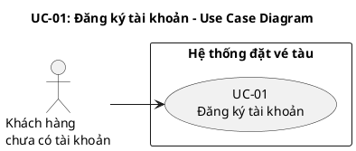
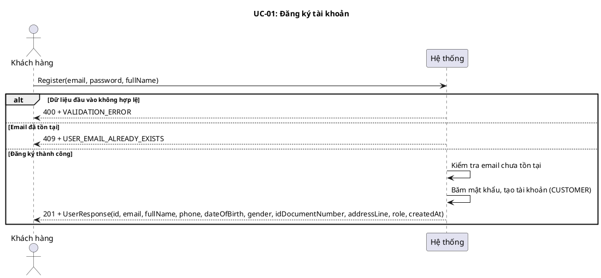
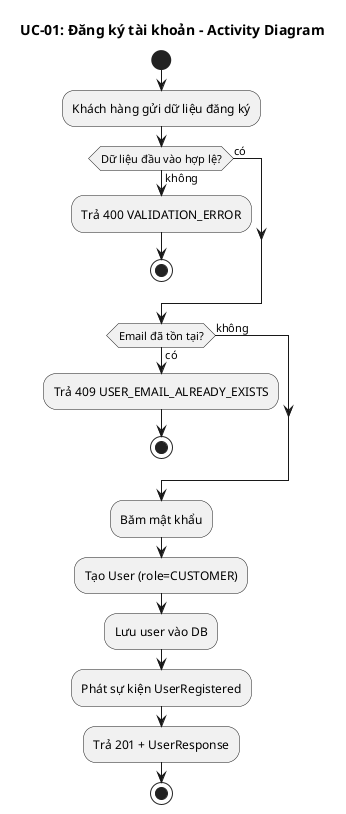
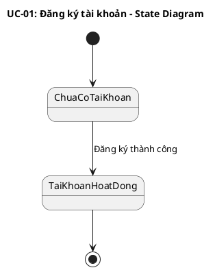
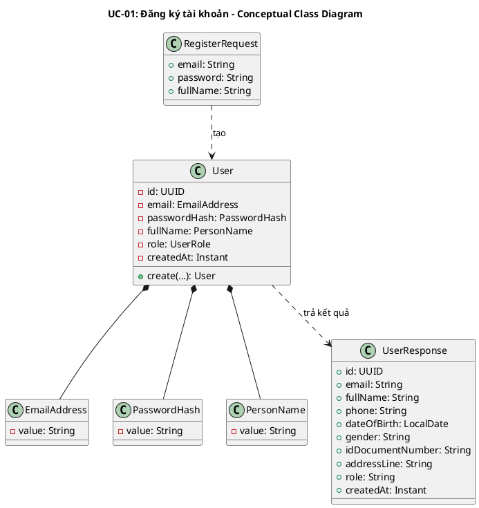
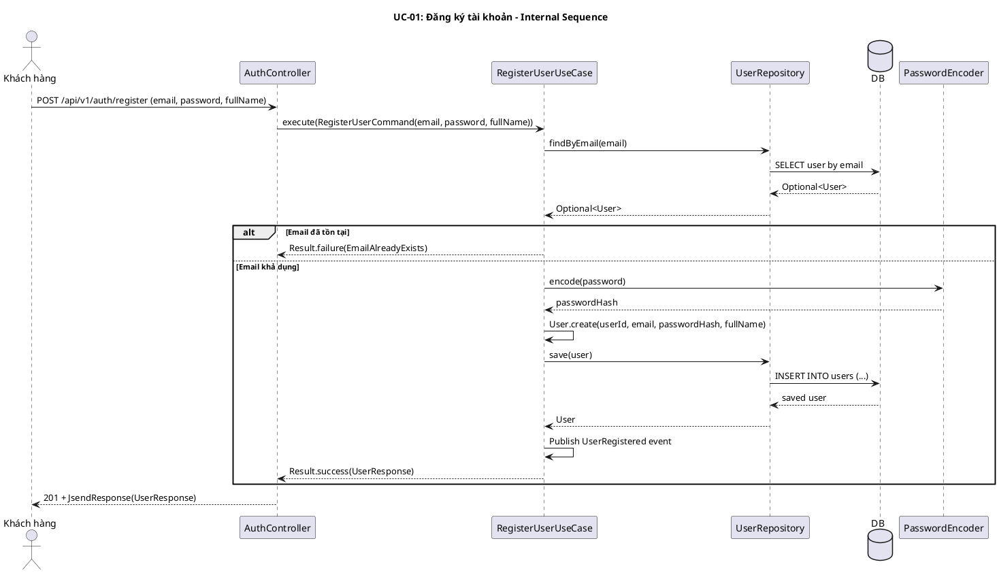
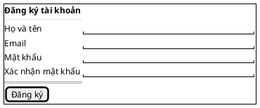

# UC-01: Đăng ký tài khoản

# Mô tả use case

| Mục                         | Nội dung                                                                                                                                                                                                                                                                                                                                                                                                                                             |
| --------------------------- | ---------------------------------------------------------------------------------------------------------------------------------------------------------------------------------------------------------------------------------------------------------------------------------------------------------------------------------------------------------------------------------------------------------------------------------------------------- |
| Quan hệ UC                  | **`<<includes>>` (bắt buộc)**: Không   **`<<extends>>` (tùy chọn)**: Không   **Generalization**: Không |
| Mục đích                    | Khách hàng chưa có tài khoản cần đăng ký để sử dụng các chức năng yêu cầu xác thực như đăng nhập, đặt vé và quản lý thông tin cá nhân. PM tiếp nhận thông tin đăng ký, tạo tài khoản mới với vai trò `CUSTOMER` và lưu tài khoản vào hệ thống. |
| Mô tả                       | Khách hàng tạo tài khoản mới bằng email, mật khẩu và họ tên để sử dụng các chức năng dành cho người dùng đã xác thực. |
| Actor chính                 | Khách hàng chưa có tài khoản |
| Actor liên quan             | Không |
| Tiền điều kiện              | Khách hàng chưa có tài khoản đang hoạt động với email muốn đăng ký. |
| Luồng chính                 | 1. Khách hàng gửi yêu cầu đăng ký gồm `email`, `password`, `fullName`.   2. Hệ thống kiểm tra dữ liệu đầu vào hợp lệ.   3. Hệ thống kiểm tra email chưa được sử dụng bởi tài khoản đang hoạt động.   4. Hệ thống băm mật khẩu và tạo tài khoản mới với vai trò `CUSTOMER`.   5. Hệ thống lưu tài khoản vào cơ sở dữ liệu.   6. Hệ thống phát sự kiện miền `UserRegistered`.   7. Hệ thống trả về thông tin tài khoản vừa được tạo. |
| Hậu điều kiện (thành công)  | Một tài khoản khách hàng mới được tạo trong hệ thống ở trạng thái hoạt động, có thể dùng để đăng nhập. |
| Hậu điều kiện (thất bại)    | Không có tài khoản nào được tạo. Dữ liệu trong hệ thống không thay đổi. |
| Luồng ngoại lệ              | Email đã tồn tại → Hệ thống từ chối đăng ký và trả về lỗi `USER_EMAIL_ALREADY_EXISTS`.   Dữ liệu đầu vào không hợp lệ, thiếu trường bắt buộc, email sai định dạng hoặc mật khẩu ngắn hơn 8 ký tự → Hệ thống trả về lỗi `VALIDATION_ERROR`. |

# Lược đồ Use Case

# Lược đồ tuần tự

# Lược đồ hoạt động

# Lược đồ trạng thái

# Lược đồ lớp ý niệm

# Phân rã thành phần PM

## Controller: `AuthController`

- **Nhiệm vụ**: Nhận yêu cầu đăng ký từ khách hàng, kiểm tra tính hợp lệ của
  payload và ủy thác cho lớp xử lý nghiệp vụ.
- **Endpoint**: `POST /api/v1/auth/register`
- **Input**: `RegisterRequest` —
  `{ email: String, password: String, fullName: String }`
- **Output thành công**: `201 Created` + `UserResponse` —
  `{ id, email, fullName, phone, dateOfBirth, gender, idDocumentNumber, addressLine, role, createdAt }`
- **Output lỗi**: `400/409` + `JsendResponse` — `{ errorCode, message }`

## UseCase: `RegisterUserUseCase`

- **Nhiệm vụ**: Kiểm tra email trùng lặp, băm mật khẩu, tạo `User` mới và phát
  sự kiện miền sau khi lưu thành công.
- **Input**: `RegisterUserCommand` —
  `{ email: String, password: String, fullName: String }`
- **Output**: `Result<UserResponse, UserError>`
- **Gọi đến**:
    - `UserRepository.findByEmail(email)` — kiểm tra email đã tồn tại chưa
    - `PasswordEncoder.encode(password)` — băm mật khẩu trước khi lưu
    - `UserRepository.save(user)` — lưu tài khoản mới
- **Phát sinh sự kiện**: `UserRegistered(userId, email, occurredAt)`

## Repository: `UserRepository`

- **Nhiệm vụ**: Truy xuất và lưu trữ domain entity `User`.
- **Phương thức liên quan đến UC**:
    - `findByEmail(email): Optional<User>` — kiểm tra email đã tồn tại trong hệ
      thống
    - `save(user): User` — lưu tài khoản khách hàng mới
- **Table**: `users`

## Thiết kế cơ sở dữ liệu

### ERD

- **Tham chiếu ERD**: Bảng `users` trong schema chung của hệ thống
- **Bảng/View liên quan**: `users`

### Stored Procedure

Không sử dụng Stored Procedure cho UC này.

### Trigger

Không sử dụng Trigger cho UC này.

## Port: `PasswordEncoder`

- **Nhiệm vụ**: Băm mật khẩu thô trước khi lưu vào cơ sở dữ liệu.
- **Phương thức liên quan đến UC**:
    - `encode(password): String` — trả về chuỗi băm của mật khẩu

## Lược đồ tuần tự nội bộ PM

## Giao diện

### Giao diện mẫu

| Control              | Nhiệm vụ                                          | Inputs                                        | Outputs                        | Gọi API                          |
| -------------------- | ------------------------------------------------- | --------------------------------------------- | ------------------------------ | -------------------------------- |
| `RegisterForm`       | Thu thập thông tin đăng ký và validate phía client | `fullName`, `email`, `password`, `confirmPassword` | `UserResponse` hoặc `Error`   | `POST /api/v1/auth/register`     |
| `[Đăng ký]` Button  | Gửi form đăng ký đến hệ thống                     | `RegisterRequest(email, password, fullName)`   | `201 + UserResponse` hoặc lỗi  | `POST /api/v1/auth/register`     |

### Giao diện ứng dụng

Chưa hiện thực. Sẽ bổ sung ảnh chụp màn hình khi hoàn thành.

# Bảng tham chiếu dò vết

| Use Case | Controller     | Endpoint                     | UseCase             | Repository                               | SP   | Table   |
| -------- | -------------- | ---------------------------- | ------------------- | ---------------------------------------- | ---- | ------- |
| UC-01    | AuthController | `POST /api/v1/auth/register` | RegisterUserUseCase | `UserRepository.findByEmail()`, `save()` | Không | `users` |

# Tiêu chí kiểm thử

## Mức phân tích

| Tiêu chí             | Phép thử                                                                   | Kết quả mong đợi                          | Ghi chú                              |
| -------------------- | -------------------------------------------------------------------------- | ----------------------------------------- | ------------------------------------ |
| Toàn diện (coverage) | Đối chiếu Activity Diagram ↔ Sequence Diagram: mọi luồng đều được thể hiện | Không bỏ sót luồng chính lẫn ngoại lệ     | Rà soát chéo giữa mục 3 và mục 4     |
| Nhất quán            | Rà soát tên lớp, trạng thái, API giữa các lược đồ trong cùng UC            | Không mâu thuẫn giữa các mục 2–7          | Đặc biệt kiểm tra tên trong mục 6–7  |
| Truy vết             | Đối chiếu bảng tham chiếu (mục 8) với lược đồ tuần tự nội bộ (mục 7.6)     | Mọi tương tác trong sequence đều có entry | Kiểm tra không thiếu endpoint/method |

## Mức thiết kế

| Tiêu chí      | Phép thử                                                                          | Kết quả mong đợi                                       | Ghi chú                                |
| ------------- | --------------------------------------------------------------------------------- | ------------------------------------------------------ | -------------------------------------- |
| Chuẩn hóa     | Rà soát thiết kế AuthController, RegisterUserUseCase, UserRepository, PasswordEncoder | Tuân thủ Clean Architecture, quy ước đặt tên và hợp đồng | Walkthrough/inspection                 |
| Testability   | Rà soát khả năng mock PasswordEncoder, UserRepository trong unit test              | Có thể kiểm thử UseCase độc lập không cần DB thật       | PasswordEncoder và Repository là port  |
| Modularity    | Rà soát ranh giới trách nhiệm: Controller chỉ validate + route, UseCase chỉ orchestrate, Repository chỉ persistence | Không trùng lặp trách nhiệm, coupling thấp             | Kiểm tra không có logic nghiệp vụ trong Controller |

## Mức hiện thực

| Tiêu chí          | Phép thử                                                                                  | Kết quả mong đợi                                                    | Ghi chú                                    |
| ----------------- | ----------------------------------------------------------------------------------------- | ------------------------------------------------------------------- | ------------------------------------------ |
| Xử lý chính xác   | Test luồng chính (register thành công), luồng lỗi (email trùng, validation fail)          | 201 + UserResponse đúng fields; 409 + USER_EMAIL_ALREADY_EXISTS; 400 + VALIDATION_ERROR | Kết hợp unit test UseCase + integration test endpoint |
| Hiệu năng         | Benchmark endpoint POST /api/v1/auth/register với 100 concurrent requests                  | Response time p95 < 500ms trong điều kiện tải bình thường            | Ghi rõ môi trường test                     |
| Bảo mật           | Kiểm tra password không trả về trong response, password được hash BCrypt, input validation | Không lộ password, hash không reversible, reject input không hợp lệ  | Kiểm tra cả race condition email duplicate |

## Danh sách test thỏa mãn mức hiện thực

### Backend

| # | Tên test case | Mô tả | Endpoint / SP | Table liên quan | Kết quả mong đợi | File test |
|---|---------------|--------|---------------|-----------------|-------------------|-----------|
| 1 | `register_returnsCreatedUserResponse` | Đăng ký thành công với dữ liệu hợp lệ | `POST /api/v1/auth/register` | `users` | `201` + `UserResponse` (JSend success) | `backend/src/test/java/.../infrastructure/web/AuthControllerRegisterTest.java:72` |
| 2 | `register_detectsInvalidEmailFormat` | Email sai định dạng bị từ chối | `POST /api/v1/auth/register` | `users` | Validation error trên field `email` | `backend/src/test/java/.../infrastructure/web/AuthControllerRegisterTest.java:107` |
| 3 | `register_detectsMissingRequiredFields` | Thiếu trường bắt buộc bị từ chối | `POST /api/v1/auth/register` | `users` | 3 validation errors | `backend/src/test/java/.../infrastructure/web/AuthControllerRegisterTest.java:116` |
| 4 | `register_detectsShortPassword` | Mật khẩu < 8 ký tự bị từ chối | `POST /api/v1/auth/register` | `users` | Validation error trên field `password` | `backend/src/test/java/.../infrastructure/web/AuthControllerRegisterTest.java:124` |
| 5 | `register_returnsConflictForDuplicateEmail` | Email đã tồn tại trả 409 | `POST /api/v1/auth/register` | `users` | `409` + `USER_EMAIL_ALREADY_EXISTS` | `backend/src/test/java/.../infrastructure/web/AuthControllerRegisterTest.java:133` |
| 6 | `execute_createsCustomerUserAndReturnsUserResponse` | UseCase tạo user CUSTOMER và trả UserResponse | `POST /api/v1/auth/register` | `users` | `Result.success(UserResponse)` với role=CUSTOMER | `backend/src/test/java/.../application/usecase/RegisterUserUseCaseTest.java:58` |
| 7 | `execute_publishesUserRegisteredEvent` | UseCase phát sự kiện UserRegistered sau khi lưu | `POST /api/v1/auth/register` | `users` | Event `UserRegistered` được publish | `backend/src/test/java/.../application/usecase/RegisterUserUseCaseTest.java:84` |
| 8 | `execute_returnsEmailAlreadyExistsFailure` | UseCase trả lỗi khi email đã tồn tại | `POST /api/v1/auth/register` | `users` | `Result.failure(EmailAlreadyExists)` | `backend/src/test/java/.../application/usecase/RegisterUserUseCaseTest.java:120` |
| 9 | `allowsExactlyOneSuccessWhen50ThreadsRegisterSameEmail` | Stress test: 50 threads cùng email chỉ 1 thành công | `POST /api/v1/auth/register` | `users` | Đúng 1 success, còn lại failure | `backend/src/test/java/.../application/usecase/RegisterUserStressTest.java:54` |
| 10 | `register_rejectsSqlInjectionEmail` | SQL injection trong email bị từ chối | `POST /api/v1/auth/register` | `users` | Validation error (email invalid) | `backend/src/test/java/.../infrastructure/web/AuthControllerSecurityTest.java:71` |
| 11 | `register_returnsXssPayloadAsDataOnly` | XSS payload trong fullName trả về dạng data thuần | `POST /api/v1/auth/register` | `users` | Response chứa XSS string as-is, không có password | `backend/src/test/java/.../infrastructure/web/AuthControllerSecurityTest.java:80` |
| 12 | `register_doesNotExposePasswordField` | Response không chứa field password | `POST /api/v1/auth/register` | `users` | `data.password` không tồn tại | `backend/src/test/java/.../infrastructure/web/AuthControllerSecurityTest.java:113` |

### Frontend

| # | Tên test case | Mô tả | Endpoint / SP | Table liên quan | Kết quả mong đợi | File test |
|---|---------------|--------|---------------|-----------------|-------------------|-----------|
| 1 | `renders all fields and the submit button in Vietnamese` | Form đăng ký hiển thị đầy đủ fields | `POST /api/v1/auth/register` | `users` | Render đúng fullName, email, password, confirmPassword, button | `frontend/customer/src/components/auth/register-form.test.tsx:62` |
| 2 | `shows all required-field errors when submitting an empty form` | Validate client-side khi submit form rỗng | `POST /api/v1/auth/register` | `users` | Hiển thị lỗi required cho tất cả fields | `frontend/customer/src/components/auth/register-form.test.tsx:78` |
| 3 | `shows "password min length" when password is shorter than 8 chars` | Validate password tối thiểu 8 ký tự | `POST /api/v1/auth/register` | `users` | Hiển thị lỗi minLength cho password | `frontend/customer/src/components/auth/register-form.test.tsx:99` |
| 4 | `shows "password mismatch" when confirm password does not match` | Validate confirmPassword khớp password | `POST /api/v1/auth/register` | `users` | Hiển thị lỗi mismatch | `frontend/customer/src/components/auth/register-form.test.tsx:119` |
| 5 | `calls registerMutation with correct payload when form is valid` | Gọi API đúng payload khi form hợp lệ | `POST /api/v1/auth/register` | `users` | Mutation được gọi với email, password, fullName | `frontend/customer/src/components/auth/register-form.test.tsx:165` |
| 6 | `registerSchema rejects fullName shorter than 2 characters` | Zod schema reject fullName < 2 chars | `POST /api/v1/auth/register` | `users` | Validation error key `fullName.minLength` | `frontend/customer/src/lib/validations/auth.test.ts:73` |
| 7 | `registerSchema rejects mismatched confirmPassword` | Zod schema reject confirmPassword mismatch | `POST /api/v1/auth/register` | `users` | Validation error key `confirmPassword.mismatch` | `frontend/customer/src/lib/validations/auth.test.ts:121` |
| 8 | `resolveRegisterError returns emailExists for USER_EMAIL_ALREADY_EXISTS` | Error handler nhận diện lỗi email trùng | `POST /api/v1/auth/register` | `users` | Message emailExists + showLoginLink=true | `frontend/customer/src/lib/auth-errors.test.ts:65` |

## Bảng tiêu chí chất lượng theo chức năng

| Chức năng trong UC       | Tiêu chí mức Ý niệm                                                  | Tiêu chí mức Thiết kế                                                          | Tiêu chí mức Hiện thực                                                              |
| ------------------------ | -------------------------------------------------------------------- | ------------------------------------------------------------------------------ | ----------------------------------------------------------------------------------- |
| Đăng ký tài khoản        | Đúng nhu cầu: khách hàng tạo được tài khoản mới với email/password/fullName | Luồng xử lý chuẩn hóa qua Controller→UseCase→Repository, dễ test với mock      | Unit test UseCase (3 cases), integration test endpoint (happy + error paths)          |
| Kiểm tra email trùng lặp | Không cho phép 2 tài khoản hoạt động cùng email                       | UseCase kiểm tra qua Repository + DB constraint đảm bảo race condition safe     | Test concurrent register cùng email, verify chỉ 1 thành công                         |
| Băm mật khẩu             | Mật khẩu không lưu dạng plaintext                                     | PasswordEncoder port tách biệt, dễ thay đổi thuật toán                          | Verify hash output khác plaintext, verify không thể decode ngược                     |

# Yêu cầu phi chức năng

| Loại yêu cầu  | Nội dung                                                                                          | Nguồn gốc                                          |
| -------------- | ------------------------------------------------------------------------------------------------- | -------------------------------------------------- |
| Business       | Mỗi email chỉ được đăng ký một tài khoản hoạt động duy nhất                                       | Quy tắc nghiệp vụ hệ thống đặt vé                  |
| Operation      | Mật khẩu phải được băm bằng BCrypt trước khi lưu; endpoint cần rate limiting để chống brute-force | Chính sách bảo mật hệ thống                         |
| Development    | Email validate theo RFC 5322; password tối thiểu 8 ký tự; response tuân thủ JSend format           | Quy ước kỹ thuật nhóm phát triển                    |
