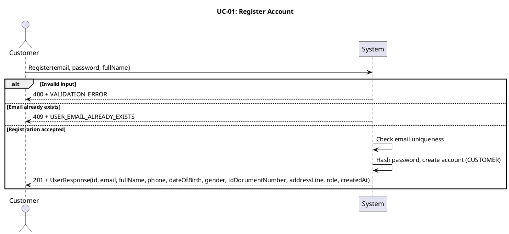
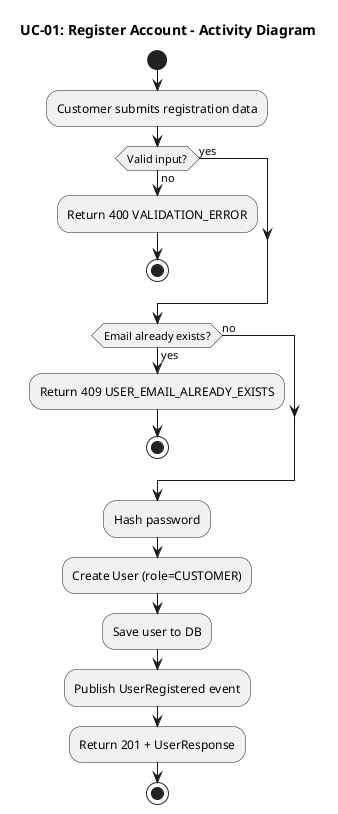
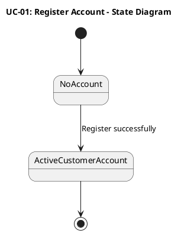
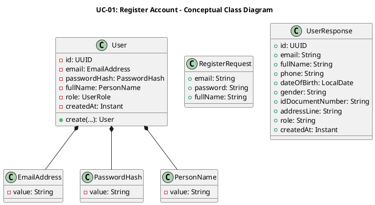
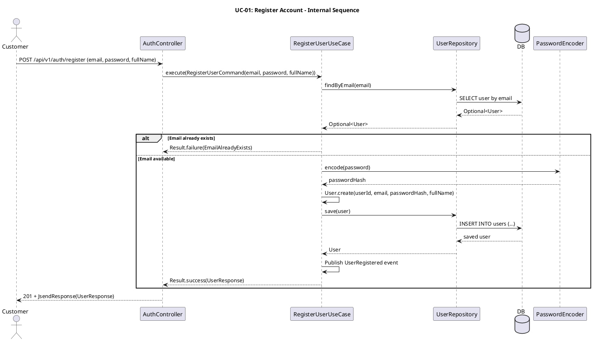
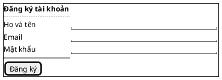

## UC-01: Đăng ký tài khoản

### 1. Mô tả use case

| Mục                            | Nội dung                                                                                                                                                                                                                                                                                                                                                                                                                                             |
| ------------------------------ | ---------------------------------------------------------------------------------------------------------------------------------------------------------------------------------------------------------------------------------------------------------------------------------------------------------------------------------------------------------------------------------------------------------------------------------------------------- |
| Phụ thuộc                      | Không                                                                                                                                                                                                                                                                                                                                                                                                                                                |
| Mục đích                       | Khách hàng chưa có tài khoản cần đăng ký để sử dụng các chức năng yêu cầu xác thực như đăng nhập, đặt vé và quản lý thông tin cá nhân. PM tiếp nhận thông tin đăng ký, tạo tài khoản mới với vai trò `CUSTOMER` và lưu tài khoản vào hệ thống.                                                                                                                                                                                                       |
| Mô tả                          | Khách hàng tạo tài khoản mới bằng email, mật khẩu và họ tên để sử dụng các chức năng dành cho người dùng đã xác thực.                                                                                                                                                                                                                                                                                                                                |
| Actor chính                    | Khách hàng chưa có tài khoản                                                                                                                                                                                                                                                                                                                                                                                                                         |
| Actor liên quan                | Không                                                                                                                                                                                                                                                                                                                                                                                                                                                |
| Tiền điều kiện                 | Khách hàng chưa có tài khoản đang hoạt động với email muốn đăng ký.                                                                                                                                                                                                                                                                                                                                                                                  |
| Dãy lệnh thực hiện bình thường | 1. Khách hàng gửi yêu cầu đăng ký gồm `email`, `password`, `fullName`.   2. Hệ thống kiểm tra dữ liệu đầu vào hợp lệ.   3. Hệ thống kiểm tra email chưa được sử dụng bởi tài khoản đang hoạt động.   4. Hệ thống băm mật khẩu và tạo tài khoản mới với vai trò `CUSTOMER`.   5. Hệ thống lưu tài khoản vào cơ sở dữ liệu.   6. Hệ thống phát sự kiện miền `UserRegistered`.   7. Hệ thống trả về thông tin tài khoản vừa được tạo. |
| Hậu điều kiện (thành công)     | Một tài khoản khách hàng mới được tạo trong hệ thống ở trạng thái hoạt động, có thể dùng để đăng nhập.                                                                                                                                                                                                                                                                                                                                               |
| Hậu điều kiện (thất bại)       | Không có tài khoản nào được tạo. Dữ liệu trong hệ thống không thay đổi.                                                                                                                                                                                                                                                                                                                                                                              |
| Xử lý ngoại lệ                 | Email đã tồn tại → Hệ thống từ chối đăng ký và trả về lỗi `USER_EMAIL_ALREADY_EXISTS`.   Dữ liệu đầu vào không hợp lệ, thiếu trường bắt buộc, email sai định dạng hoặc mật khẩu ngắn hơn 8 ký tự → Hệ thống trả về lỗi `VALIDATION_ERROR`.                                                                                                                                                                                                        |

### 2. Lược đồ tuần tự

### 3. Lược đồ hoạt động

### 4. Lược đồ trạng thái

### 5. Lược đồ lớp ý niệm

### 6. Phân rã thành phần PM

#### 6.1 Controller: `AuthController`

- **Nhiệm vụ**: Nhận yêu cầu đăng ký từ khách hàng, kiểm tra tính hợp lệ của
  payload và ủy thác cho lớp xử lý nghiệp vụ.
- **Endpoint**: `POST /api/v1/auth/register`
- **Input**: `RegisterRequest` —
  `{ email: String, password: String, fullName: String }`
- **Output thành công**: `201 Created` + `UserResponse` —
  `{ id, email, fullName, phone, dateOfBirth, gender, idDocumentNumber, addressLine, role, createdAt }`
- **Output lỗi**: `400/409` + `JsendResponse` — `{ errorCode, message }`

#### 6.2 UseCase: `RegisterUserUseCase`

- **Nhiệm vụ**: Kiểm tra email trùng lặp, băm mật khẩu, tạo `User` mới và phát
  sự kiện miền sau khi lưu thành công.
- **Input**: `RegisterUserCommand` —
  `{ email: String, password: String, fullName: String }`
- **Output**: `Result<UserResponse, UserError>`
- **Gọi đến**:
    - `UserRepository.findByEmail(email)` — kiểm tra email đã tồn tại chưa
    - `PasswordEncoder.encode(password)` — băm mật khẩu trước khi lưu
    - `UserRepository.save(user)` — lưu tài khoản mới
- **Phát sinh sự kiện**: `UserRegistered(userId, email, occurredAt)`

#### 6.3 Repository: `UserRepository`

- **Nhiệm vụ**: Truy xuất và lưu trữ domain entity `User`.
- **Phương thức liên quan đến UC**:
    - `findByEmail(email): Optional<User>` — kiểm tra email đã tồn tại trong hệ
      thống
    - `save(user): User` — lưu tài khoản khách hàng mới
- **Table**: `users`

#### 6.4 Port: `PasswordEncoder`

- **Nhiệm vụ**: Băm mật khẩu thô trước khi lưu vào cơ sở dữ liệu.
- **Phương thức liên quan đến UC**:
    - `encode(password): String` — trả về chuỗi băm của mật khẩu

#### 6.5 Lược đồ tuần tự nội bộ PM

#### 6.6 Giao diện

##### 6.6.1 Giao diện mẫu

##### 6.6.2 Giao diện ứng dụng

Chưa hiện thực. Sẽ bổ sung ảnh chụp màn hình khi hoàn thành.

### 7. Bảng tham chiếu dò vết

| Use Case | Controller     | Endpoint                     | UseCase             | Repository                               | Table   |
| -------- | -------------- | ---------------------------- | ------------------- | ---------------------------------------- | ------- |
| UC-01    | AuthController | `POST /api/v1/auth/register` | RegisterUserUseCase | `UserRepository.findByEmail()`, `save()` | `users` |

### 8. Tiêu chí kiểm thử

| Tiêu chí             | Phép thử                                                                   | Kết quả mong đợi                          | Ghi chú                              |
| -------------------- | -------------------------------------------------------------------------- | ----------------------------------------- | ------------------------------------ |
| Toàn diện (coverage) | Đối chiếu Activity Diagram ↔ Sequence Diagram: mọi luồng đều được thể hiện | Không bỏ sót luồng chính lẫn ngoại lệ     | Rà soát chéo giữa mục 2 và mục 3     |
| Nhất quán            | Rà soát tên lớp, trạng thái, API giữa các lược đồ trong cùng UC            | Không mâu thuẫn giữa các mục 2–6          | Đặc biệt kiểm tra tên trong mục 5–6  |
| Truy vết             | Đối chiếu bảng tham chiếu (mục 7) với lược đồ tuần tự nội bộ (mục 6.5)     | Mọi tương tác trong sequence đều có entry | Kiểm tra không thiếu endpoint/method |
