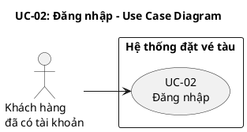
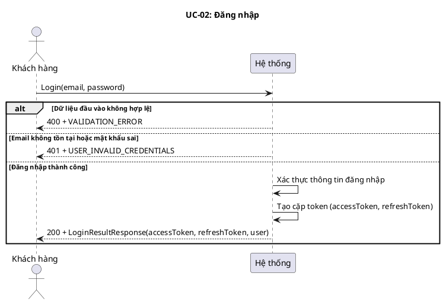
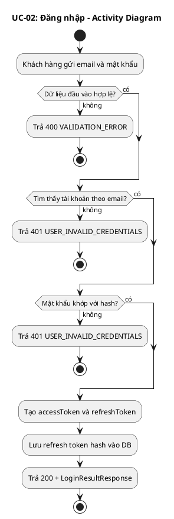
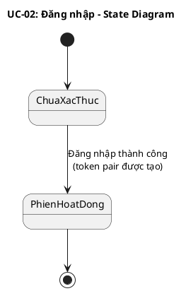
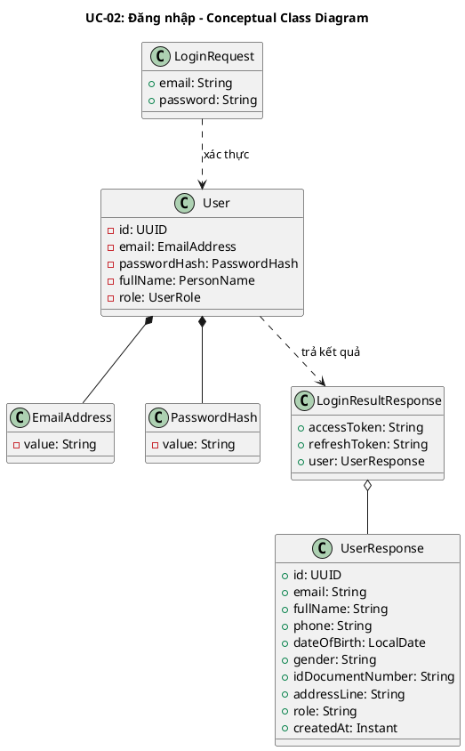
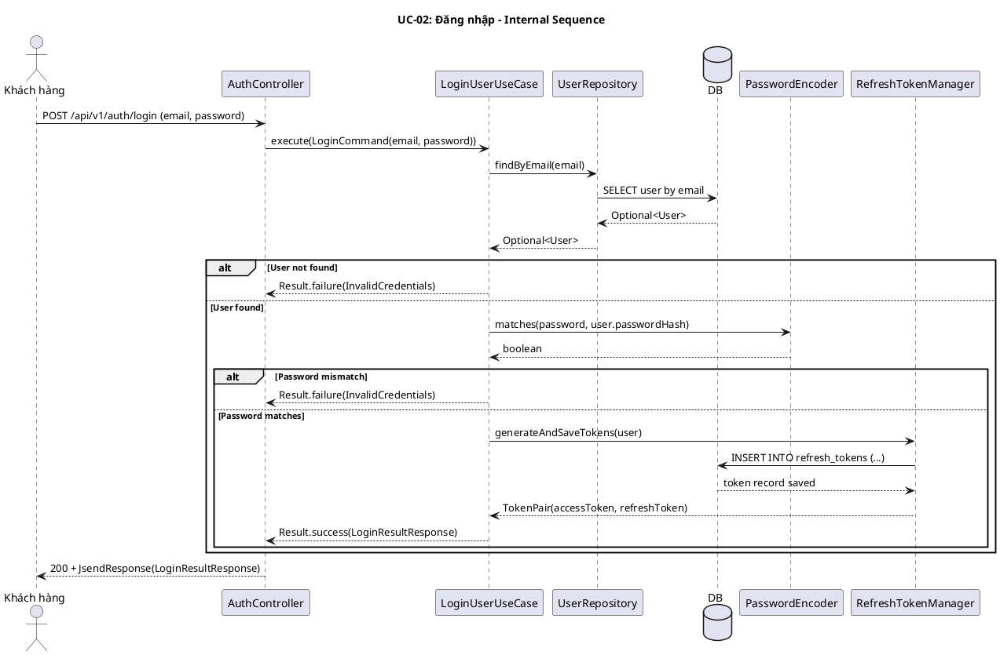
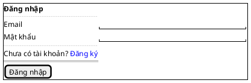

# UC-02: Đăng nhập

# Mô tả use case

| Mục                         | Nội dung                                                                                                                                                                                                                                                                                                                                                                                                                                             |
| --------------------------- | ---------------------------------------------------------------------------------------------------------------------------------------------------------------------------------------------------------------------------------------------------------------------------------------------------------------------------------------------------------------------------------------------------------------------------------------------------- |
| Quan hệ UC                  | **`<<includes>>` (bắt buộc)**: Không   **`<<extends>>` (tùy chọn)**: Không   **Generalization**: Không |
| Mục đích                    | Khách hàng đã có tài khoản cần xác thực để truy cập các chức năng yêu cầu đăng nhập như đặt vé, xem đặt vé và quản lý hồ sơ. PM xác minh thông tin đăng nhập, tạo cặp token truy cập phiên làm việc và trả về hồ sơ người dùng cơ bản. |
| Mô tả                       | Khách hàng đăng nhập bằng email và mật khẩu để nhận cặp token truy cập phiên làm việc và thông tin hồ sơ cơ bản. |
| Actor chính                 | Khách hàng đã có tài khoản |
| Actor liên quan             | Không |
| Tiền điều kiện              | Khách hàng đã có tài khoản đang hoạt động trong hệ thống (UC-01 đã hoàn thành). |
| Luồng chính                 | 1. Khách hàng gửi yêu cầu đăng nhập gồm `email` và `password`.   2. Hệ thống kiểm tra dữ liệu đầu vào hợp lệ.   3. Hệ thống tìm tài khoản theo email.   4. Hệ thống đối chiếu mật khẩu gửi lên với mật khẩu đã băm trong hệ thống.   5. Hệ thống tạo `accessToken` và `refreshToken` cho phiên đăng nhập.   6. Hệ thống lưu refresh token mới.   7. Hệ thống trả về token cùng thông tin người dùng. |
| Hậu điều kiện (thành công)  | Khách hàng nhận được cặp token hợp lệ để sử dụng các API yêu cầu xác thực. Một bản ghi refresh token mới được lưu trong hệ thống. |
| Hậu điều kiện (thất bại)    | Không có token nào được tạo hoặc lưu. Dữ liệu người dùng không thay đổi. |
| Luồng ngoại lệ              | Email không tồn tại hoặc mật khẩu không đúng → Hệ thống trả về lỗi `USER_INVALID_CREDENTIALS`.   Dữ liệu đầu vào không hợp lệ, thiếu trường bắt buộc hoặc email sai định dạng → Hệ thống trả về lỗi `VALIDATION_ERROR`. |

# Lược đồ Use Case

# Lược đồ tuần tự

# Lược đồ hoạt động

# Lược đồ trạng thái

# Lược đồ lớp ý niệm

# Phân rã thành phần PM

## Controller: `AuthController`

- **Nhiệm vụ**: Nhận yêu cầu đăng nhập, kiểm tra định dạng payload và chuyển
  tiếp sang lớp nghiệp vụ để xác thực.
- **Endpoint**: `POST /api/v1/auth/login`
- **Input**: `LoginRequest` — `{ email: String, password: String }`
- **Output thành công**: `200 OK` + `LoginResultResponse` —
  `{ accessToken, refreshToken, user }`
- **Output lỗi**: `400/401` + `JsendResponse` — `{ errorCode, message }`

## UseCase: `LoginUserUseCase`

- **Nhiệm vụ**: Tìm người dùng theo email, đối chiếu mật khẩu và tạo cặp token
  mới khi xác thực thành công.
- **Input**: `LoginCommand` — `{ email: String, password: String }`
- **Output**: `Result<LoginResultResponse, UserError>`
- **Gọi đến**:
    - `UserRepository.findByEmail(email)` — tìm tài khoản theo email
    - `PasswordEncoder.matches(rawPassword, passwordHash)` — xác thực mật khẩu
    - `RefreshTokenManager.generateAndSaveTokens(user)` — tạo và lưu cặp token
      cho phiên đăng nhập
- **Phát sinh sự kiện**: Không

## Repository: `UserRepository`

- **Nhiệm vụ**: Truy xuất domain entity `User` để phục vụ xác thực.
- **Phương thức liên quan đến UC**:
    - `findByEmail(email): Optional<User>` — tìm người dùng theo email đang hoạt
      động
- **Table**: `users`

## Thiết kế cơ sở dữ liệu

### ERD

- **Tham chiếu ERD**: Bảng `users` và `refresh_tokens` trong schema chung của hệ thống
- **Bảng/View liên quan**: `users`, `refresh_tokens`

### Stored Procedure

Không sử dụng Stored Procedure cho UC này.

### Trigger

Không sử dụng Trigger cho UC này.

## Port: `PasswordEncoder`, `RefreshTokenManager`

- **Nhiệm vụ**: Hỗ trợ xác thực mật khẩu và quản lý vòng đời token cho phiên
  đăng nhập.
- **Phương thức liên quan đến UC**:
    - `PasswordEncoder.matches(rawPassword, passwordHash): boolean` — kiểm tra
      mật khẩu hợp lệ
    - `RefreshTokenManager.generateAndSaveTokens(user): TokenPair` — tạo
      accessToken + refreshToken, lưu hash của refreshToken vào DB

## Lược đồ tuần tự nội bộ PM

## Giao diện

### Giao diện mẫu

| Control            | Nhiệm vụ                                          | Inputs                  | Outputs                                    | Gọi API                      |
| ------------------ | ------------------------------------------------- | ----------------------- | ------------------------------------------ | ---------------------------- |
| `LoginForm`        | Thu thập thông tin đăng nhập và validate phía client | `email`, `password`     | `LoginResultResponse` hoặc `Error`         | `POST /api/v1/auth/login`    |
| `[Đăng nhập]` Button | Gửi form đăng nhập đến hệ thống                   | `LoginRequest(email, password)` | `200 + LoginResultResponse` hoặc lỗi | `POST /api/v1/auth/login`    |

### Giao diện ứng dụng

Chưa hiện thực. Sẽ bổ sung ảnh chụp màn hình khi hoàn thành.

# Bảng tham chiếu dò vết

| Use Case | Controller     | Endpoint                  | UseCase          | Repository                     | SP    | Table                     |
| -------- | -------------- | ------------------------- | ---------------- | ------------------------------ | ----- | ------------------------- |
| UC-02    | AuthController | `POST /api/v1/auth/login` | LoginUserUseCase | `UserRepository.findByEmail()` | Không | `users`, `refresh_tokens` |

# Tiêu chí kiểm thử

## Mức phân tích

| Tiêu chí             | Phép thử                                                                   | Kết quả mong đợi                          | Ghi chú                              |
| -------------------- | -------------------------------------------------------------------------- | ----------------------------------------- | ------------------------------------ |
| Toàn diện (coverage) | Đối chiếu Activity Diagram ↔ Sequence Diagram: mọi luồng đều được thể hiện | Không bỏ sót luồng chính lẫn ngoại lệ     | Rà soát chéo giữa mục 3 và mục 4     |
| Nhất quán            | Rà soát tên lớp, trạng thái, API giữa các lược đồ trong cùng UC            | Không mâu thuẫn giữa các mục 2–7          | Đặc biệt kiểm tra tên trong mục 6–7  |
| Truy vết             | Đối chiếu bảng tham chiếu (mục 8) với lược đồ tuần tự nội bộ (mục 7.6)     | Mọi tương tác trong sequence đều có entry | Kiểm tra không thiếu endpoint/method |

## Mức thiết kế

| Tiêu chí      | Phép thử                                                                                | Kết quả mong đợi                                       | Ghi chú                                |
| ------------- | --------------------------------------------------------------------------------------- | ------------------------------------------------------ | -------------------------------------- |
| Chuẩn hóa     | Rà soát thiết kế AuthController, LoginUserUseCase, UserRepository, PasswordEncoder, RefreshTokenManager | Tuân thủ Clean Architecture, quy ước đặt tên và hợp đồng | Walkthrough/inspection                 |
| Testability   | Rà soát khả năng mock PasswordEncoder, RefreshTokenManager, UserRepository trong unit test | Có thể kiểm thử UseCase độc lập không cần DB thật       | Tất cả dependency là port/interface    |
| Modularity    | Rà soát ranh giới trách nhiệm: Controller chỉ validate + route, UseCase chỉ orchestrate, Repository chỉ persistence | Không trùng lặp trách nhiệm, coupling thấp             | Kiểm tra không có logic nghiệp vụ trong Controller |

## Mức hiện thực

| Tiêu chí          | Phép thử                                                                                  | Kết quả mong đợi                                                    | Ghi chú                                    |
| ----------------- | ----------------------------------------------------------------------------------------- | ------------------------------------------------------------------- | ------------------------------------------ |
| Xử lý chính xác   | Test luồng chính (login thành công), luồng lỗi (email không tồn tại, password sai, validation fail) | 200 + LoginResultResponse đúng fields; 401 + USER_INVALID_CREDENTIALS; 400 + VALIDATION_ERROR | Unit test UseCase + integration test endpoint |
| Hiệu năng         | Benchmark endpoint POST /api/v1/auth/login với 100 concurrent requests                     | Response time p95 < 500ms trong điều kiện tải bình thường            | Ghi rõ môi trường test                     |
| Bảo mật           | Kiểm tra password không trả về trong response, timing-safe comparison, identical error message cho email sai và password sai | Không lộ password/hash, không phân biệt được email sai vs password sai từ response | Chống timing attack và user enumeration |

## Danh sách test thỏa mãn mức hiện thực

### Backend

| # | Tên test case | Mô tả | Endpoint / SP | Table liên quan | Kết quả mong đợi | File test |
|---|---------------|--------|---------------|-----------------|-------------------|-----------|
| 1 | `login_returnsOkAndJsendLoginPayload` | Đăng nhập thành công với credentials hợp lệ | `POST /api/v1/auth/login` | `users`, `refresh_tokens` | `200` + `LoginResultResponse` (JSend success) | `backend/src/test/java/.../infrastructure/web/AuthControllerLoginTest.java:72` |
| 2 | `login_detectsInvalidEmailFormat` | Email sai định dạng bị từ chối | `POST /api/v1/auth/login` | `users` | Validation error trên field `email` | `backend/src/test/java/.../infrastructure/web/AuthControllerLoginTest.java:107` |
| 3 | `login_detectsMissingRequiredFields` | Thiếu trường bắt buộc bị từ chối | `POST /api/v1/auth/login` | `users` | Validation errors | `backend/src/test/java/.../infrastructure/web/AuthControllerLoginTest.java:115` |
| 4 | `login_returnsUnauthorizedForInvalidCredentials` | Credentials sai trả 401 | `POST /api/v1/auth/login` | `users` | `401` + `USER_INVALID_CREDENTIALS` | `backend/src/test/java/.../infrastructure/web/AuthControllerLoginTest.java:123` |
| 5 | `execute_returnsLoginResultResponse` | UseCase xác thực thành công và trả token pair | `POST /api/v1/auth/login` | `users`, `refresh_tokens` | `Result.success(LoginResultResponse)` | `backend/src/test/java/.../application/usecase/LoginUserUseCaseTest.java:86` |
| 6 | `execute_returnsInvalidCredentials_whenEmailNotFound` | UseCase trả lỗi khi email không tồn tại | `POST /api/v1/auth/login` | `users` | `Result.failure(InvalidCredentials)` | `backend/src/test/java/.../application/usecase/LoginUserUseCaseTest.java:112` |
| 7 | `execute_returnsInvalidCredentials_whenPasswordWrong` | UseCase trả lỗi khi password sai | `POST /api/v1/auth/login` | `users` | `Result.failure(InvalidCredentials)` | `backend/src/test/java/.../application/usecase/LoginUserUseCaseTest.java:125` |
| 8 | `execute_checksRawPasswordAgainstStoredHash` | UseCase gọi PasswordEncoder.matches đúng params | `POST /api/v1/auth/login` | `users` | `verify(passwordEncoder).matches(raw, hash)` | `backend/src/test/java/.../application/usecase/LoginUserUseCaseTest.java:145` |
| 9 | `execute_generatesAndSavesTokensForFoundUser` | UseCase gọi RefreshTokenManager sau xác thực | `POST /api/v1/auth/login` | `refresh_tokens` | `verify(refreshTokenManager).generateAndSaveTokens(user)` | `backend/src/test/java/.../application/usecase/LoginUserUseCaseTest.java:159` |
| 10 | `allows50ConcurrentLoginsWithSameValidCredentials` | Stress test: 50 concurrent logins thành công | `POST /api/v1/auth/login` | `users`, `refresh_tokens` | Tất cả 50 requests thành công | `backend/src/test/java/.../application/usecase/LoginUserStressTest.java:61` |
| 11 | `login_rejectsSqlInjectionEmail` | SQL injection trong email bị từ chối | `POST /api/v1/auth/login` | `users` | Validation error (email invalid) | `backend/src/test/java/.../infrastructure/web/AuthControllerLoginSecurityTest.java:73` |
| 12 | `login_returnsIdenticalFailuresForUnknownEmailAndWrongPassword` | Response giống nhau cho email sai vs password sai | `POST /api/v1/auth/login` | `users` | Cùng status code và error code | `backend/src/test/java/.../infrastructure/web/AuthControllerLoginSecurityTest.java:112` |
| 13 | `login_doesNotExposePasswordField` | Response không chứa field password | `POST /api/v1/auth/login` | `users` | `data.user.password` không tồn tại | `backend/src/test/java/.../infrastructure/web/AuthControllerLoginSecurityTest.java:141` |

### Frontend

| # | Tên test case | Mô tả | Endpoint / SP | Table liên quan | Kết quả mong đợi | File test |
|---|---------------|--------|---------------|-----------------|-------------------|-----------|
| 1 | `renders email and password fields and the submit button in Vietnamese` | Form đăng nhập hiển thị đầy đủ fields | `POST /api/v1/auth/login` | `users` | Render đúng email, password, button | `frontend/customer/src/components/auth/login-form.test.tsx:78` |
| 2 | `shows validation errors when submitting an empty form` | Validate client-side khi submit form rỗng | `POST /api/v1/auth/login` | `users` | Hiển thị lỗi required cho email và password | `frontend/customer/src/components/auth/login-form.test.tsx:92` |
| 3 | `shows "invalid email" when email format is wrong` | Validate email format phía client | `POST /api/v1/auth/login` | `users` | Hiển thị lỗi email invalid | `frontend/customer/src/components/auth/login-form.test.tsx:109` |
| 4 | `calls loginMutation with correct payload when form is valid` | Gọi API đúng payload khi form hợp lệ | `POST /api/v1/auth/login` | `users`, `refresh_tokens` | Mutation được gọi với email, password | `frontend/customer/src/components/auth/login-form.test.tsx:157` |
| 5 | `loginSchema accepts a valid email + password` | Zod schema accept input hợp lệ | `POST /api/v1/auth/login` | `users` | Parse thành công | `frontend/customer/src/lib/validations/auth.test.ts:5` |
| 6 | `loginSchema rejects an empty email` | Zod schema reject email rỗng | `POST /api/v1/auth/login` | `users` | Validation error key `email.required` | `frontend/customer/src/lib/validations/auth.test.ts:14` |
| 7 | `resolveLoginError returns invalidCredentials for USER_INVALID_CREDENTIALS` | Error handler nhận diện lỗi credentials | `POST /api/v1/auth/login` | `users` | Message invalidCredentials | `frontend/customer/src/lib/auth-errors.test.ts:12` |

## Bảng tiêu chí chất lượng theo chức năng

| Chức năng trong UC          | Tiêu chí mức Ý niệm                                                        | Tiêu chí mức Thiết kế                                                          | Tiêu chí mức Hiện thực                                                              |
| --------------------------- | -------------------------------------------------------------------------- | ------------------------------------------------------------------------------ | ----------------------------------------------------------------------------------- |
| Xác thực đăng nhập          | Đúng nhu cầu: khách hàng xác thực được bằng email/password đã đăng ký       | Luồng xử lý chuẩn hóa qua Controller→UseCase→Repository→Port, dễ test với mock | Unit test UseCase (3 cases: success, wrong email, wrong password), integration test endpoint |
| Tạo cặp token               | Phiên đăng nhập được thiết lập qua accessToken + refreshToken                | RefreshTokenManager port tách biệt, dễ thay đổi thuật toán JWT                  | Verify token pair trả về đúng format, refresh token hash được lưu DB                 |
| Chống user enumeration      | Không cho phép phân biệt email tồn tại hay không từ response                 | UseCase trả cùng error code cho cả 2 trường hợp (email sai, password sai)       | Test response body identical cho unknown email vs wrong password                      |

# Yêu cầu phi chức năng

| Loại yêu cầu  | Nội dung                                                                                          | Nguồn gốc                                          |
| -------------- | ------------------------------------------------------------------------------------------------- | -------------------------------------------------- |
| Business       | Mỗi lần đăng nhập thành công tạo phiên mới; refresh token cũ bị vô hiệu hóa khi rotate           | Quy tắc bảo mật phiên làm việc                      |
| Operation      | Mật khẩu xác thực bằng BCrypt timing-safe comparison; endpoint cần rate limiting chống brute-force; error message không phân biệt email sai vs password sai | Chính sách bảo mật hệ thống                         |
| Development    | Email validate theo RFC 5322; response tuân thủ JSend format; refresh token lưu dạng SHA-256 hash  | Quy ước kỹ thuật nhóm phát triển                    |
