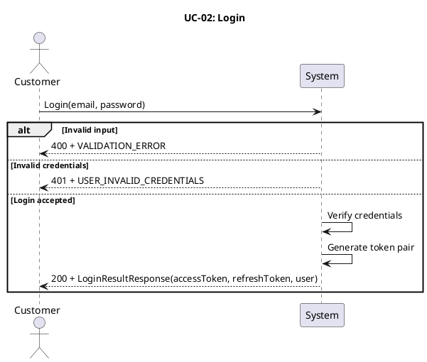
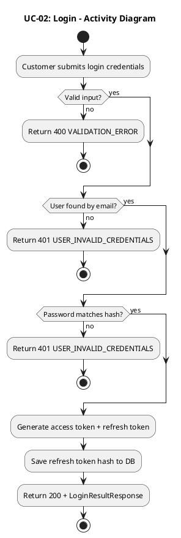
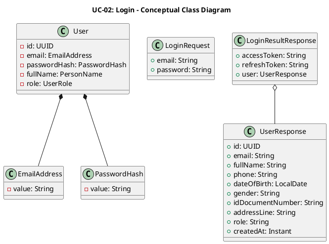
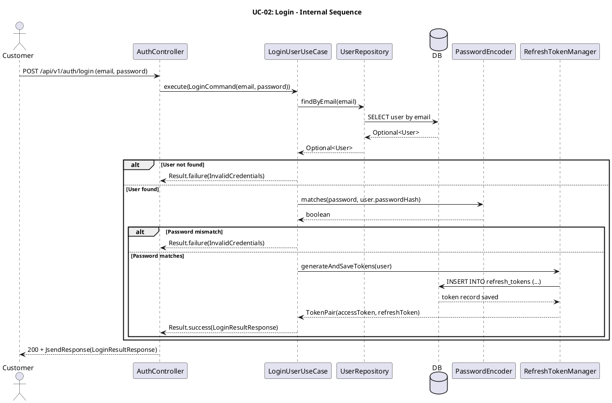

# UC-02: Đăng nhập

## 1. Mô tả use case

| Mục                            | Nội dung                                                                                                                                                                                                                                                                                                                                                                                                               |
| ------------------------------ | ---------------------------------------------------------------------------------------------------------------------------------------------------------------------------------------------------------------------------------------------------------------------------------------------------------------------------------------------------------------------------------------------------------------------- |
| Phụ thuộc                      | UC-01: Đăng ký tài khoản                                                                                                                                                                                                                                                                                                                                                                                               |
| Mục đích                       | Khách hàng đã có tài khoản cần xác thực để truy cập các chức năng yêu cầu đăng nhập như đặt vé, xem đặt vé và quản lý hồ sơ. PM xác minh thông tin đăng nhập, tạo cặp token truy cập phiên làm việc và trả về hồ sơ người dùng cơ bản.                                                                                                                                                                                 |
| Mô tả                          | Khách hàng đăng nhập bằng email và mật khẩu để nhận cặp token truy cập phiên làm việc và thông tin hồ sơ cơ bản.                                                                                                                                                                                                                                                                                                       |
| Actor chính                    | Khách hàng đã có tài khoản                                                                                                                                                                                                                                                                                                                                                                                             |
| Actor liên quan                | Không                                                                                                                                                                                                                                                                                                                                                                                                                  |
| Tiền điều kiện                 | Khách hàng đã có tài khoản đang hoạt động trong hệ thống.                                                                                                                                                                                                                                                                                                                                                              |
| Dãy lệnh thực hiện bình thường | 1. Khách hàng gửi yêu cầu đăng nhập gồm `email` và `password`.   2. Hệ thống kiểm tra dữ liệu đầu vào hợp lệ.   3. Hệ thống tìm tài khoản theo email.   4. Hệ thống đối chiếu mật khẩu gửi lên với mật khẩu đã băm trong hệ thống.   5. Hệ thống tạo `accessToken` và `refreshToken` cho phiên đăng nhập.   6. Hệ thống lưu refresh token mới.   7. Hệ thống trả về token cùng thông tin người dùng. |
| Hậu điều kiện (thành công)     | Khách hàng nhận được cặp token hợp lệ để sử dụng các API yêu cầu xác thực. Một bản ghi refresh token mới được lưu trong hệ thống.                                                                                                                                                                                                                                                                                      |
| Hậu điều kiện (thất bại)       | Không có token nào được tạo hoặc lưu. Dữ liệu người dùng không thay đổi.                                                                                                                                                                                                                                                                                                                                               |
| Xử lý ngoại lệ                 | Email không tồn tại hoặc mật khẩu không đúng → Hệ thống trả về lỗi `USER_INVALID_CREDENTIALS`.   Dữ liệu đầu vào không hợp lệ, thiếu trường bắt buộc hoặc email sai định dạng → Hệ thống trả về lỗi `VALIDATION_ERROR`.                                                                                                                                                                                             |

## 2. Lược đồ tuần tự

## 3. Lược đồ hoạt động

## 5. Lược đồ lớp ý niệm

## 6. Phân rã thành phần PM

### 6.1 Controller: `AuthController`

-  **Nhiệm vụ**: Nhận yêu cầu đăng nhập, kiểm tra định dạng payload và chuyển
  tiếp sang lớp nghiệp vụ để xác thực.
-  **Endpoint**: `POST /api/v1/auth/login`
-  **Input**: `LoginRequest` — `{ email: String, password: String }`
-  **Output thành công**: `200 OK` + `LoginResultResponse` —
  `{ accessToken, refreshToken, user }`
-  **Output lỗi**: `400/401` + `JsendResponse` — `{ errorCode, message }`

### 6.2 UseCase: `LoginUserUseCase`

-  **Nhiệm vụ**: Tìm người dùng theo email, đối chiếu mật khẩu và tạo cặp token
  mới khi xác thực thành công.
-  **Input**: `LoginCommand` — `{ email: String, password: String }`
-  **Output**: `Result<LoginResultResponse, UserError>`
-  **Gọi đến**:
    -  `UserRepository.findByEmail(email)` — tìm tài khoản theo email
    -  `PasswordEncoder.matches(rawPassword, passwordHash)` — xác thực mật khẩu
    -  `RefreshTokenManager.generateAndSaveTokens(user)` — tạo và lưu cặp token
      cho phiên đăng nhập
-  **Phát sinh sự kiện**: Không

### 6.3 Repository: `UserRepository`

-  **Nhiệm vụ**: Truy xuất domain entity `User` để phục vụ xác thực.
-  **Phương thức liên quan đến UC**:
    -  `findByEmail(email): Optional<User>` — tìm người dùng theo email đang hoạt
      động
-  **Table**: `users`

### 6.4 Port: `PasswordEncoder`, `RefreshTokenManager`

-  **Nhiệm vụ**: Hỗ trợ xác thực mật khẩu và quản lý vòng đời token cho phiên
  đăng nhập.
-  **Phương thức liên quan đến UC**:
    -  `PasswordEncoder.matches(rawPassword, passwordHash): boolean` — kiểm tra
      mật khẩu hợp lệ
    -  `RefreshTokenManager.generateAndSaveTokens(user): TokenPair` — trả về
      `{ accessToken, refreshToken }`

### 6.5 Lược đồ tuần tự nội bộ PM

## 7. Bảng tham chiếu dò vết

| Use Case | Controller     | Endpoint                  | UseCase          | Repository                     | Table                     |
| -------- | -------------- | ------------------------- | ---------------- | ------------------------------ | ------------------------- |
| UC-02    | AuthController | `POST /api/v1/auth/login` | LoginUserUseCase | `UserRepository.findByEmail()` | `users`, `refresh_tokens` |

## 8. Tiêu chí kiểm thử

| Tiêu chí             | Phép thử                                                                   | Kết quả mong đợi                          | Ghi chú                              |
| -------------------- | -------------------------------------------------------------------------- | ----------------------------------------- | ------------------------------------ |
| Toàn diện (coverage) | Đối chiếu Activity Diagram ↔ Sequence Diagram: mọi luồng đều được thể hiện | Không bỏ sót luồng chính lẫn ngoại lệ     | Rà soát chéo giữa mục 2 và mục 3     |
| Nhất quán            | Rà soát tên lớp, trạng thái, API giữa các lược đồ trong cùng UC            | Không mâu thuẫn giữa các mục 2–6          | Đặc biệt kiểm tra tên trong mục 5–6  |
| Truy vết             | Đối chiếu bảng tham chiếu (mục 7) với lược đồ tuần tự nội bộ (mục 6.5)     | Mọi tương tác trong sequence đều có entry | Kiểm tra không thiếu endpoint/method |
