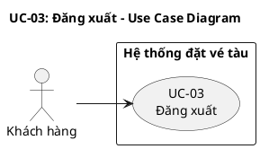
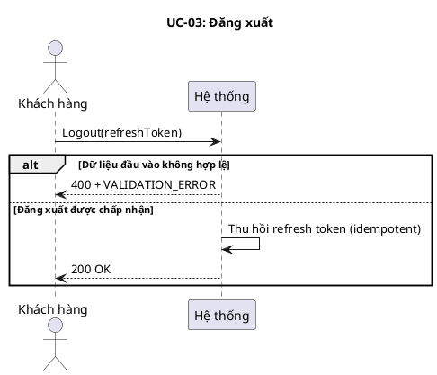
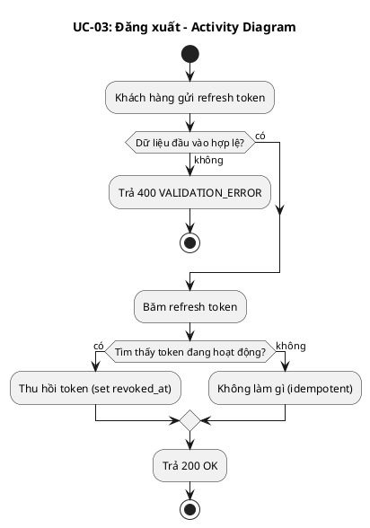
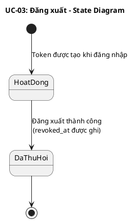
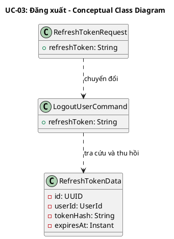
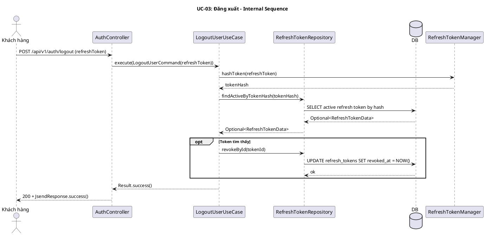
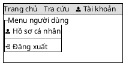

# UC-03: Đăng xuất

# Mô tả use case

| Mục                         | Nội dung                                                                                                                                                                                                                                                                                                                                                                                                                                             |
| --------------------------- | ---------------------------------------------------------------------------------------------------------------------------------------------------------------------------------------------------------------------------------------------------------------------------------------------------------------------------------------------------------------------------------------------------------------------------------------------------- |
| Quan hệ UC                  | **`<<includes>>` (bắt buộc)**: Không   **`<<extends>>` (tùy chọn)**: Không   **Generalization**: Không |
| Mục đích                    | Khách hàng muốn kết thúc phiên làm việc hiện tại để ngăn refresh token tiếp tục được dùng tạo access token mới. PM tiếp nhận refresh token, tra cứu token đang hoạt động tương ứng và thu hồi nó theo cách idempotent. |
| Mô tả                       | Khách hàng kết thúc phiên làm việc hiện tại bằng cách thu hồi refresh token đang sử dụng. |
| Actor chính                 | Khách hàng |
| Actor liên quan             | Không |
| Tiền điều kiện              | Không yêu cầu xác thực. Khách hàng cần có giá trị refresh token để gửi lên (hợp lệ hoặc không). |
| Luồng chính                 | 1. Khách hàng gửi yêu cầu đăng xuất kèm `refreshToken` hiện tại.   2. Hệ thống kiểm tra dữ liệu đầu vào hợp lệ.   3. Hệ thống băm refresh token và tìm bản ghi tương ứng.   4. Nếu token đang hoạt động tồn tại, hệ thống thu hồi refresh token (đánh dấu `revoked_at`).   5. Nếu token không tồn tại hoặc đã bị thu hồi, hệ thống không làm gì thêm.   6. Hệ thống trả về thành công. |
| Hậu điều kiện (thành công)  | Nếu refresh token tồn tại và đang hoạt động, nó sẽ bị thu hồi. Nếu token không tồn tại hoặc đã thu hồi, không có thay đổi nào xảy ra. |
| Hậu điều kiện (thất bại)    | Khi dữ liệu đầu vào không hợp lệ, hệ thống không thực hiện thu hồi token nào. |
| Luồng ngoại lệ              | Refresh token không tồn tại hoặc đã bị thu hồi trước đó → Hệ thống vẫn trả về thành công (idempotent, không để lộ thông tin token).   Dữ liệu đầu vào không hợp lệ, thiếu trường `refreshToken` → Hệ thống trả về lỗi `VALIDATION_ERROR`.   Hợp đồng API tại controller hiện công bố thêm khả năng trả về `401` khi refresh token không hợp lệ hoặc hết hạn. |

# Lược đồ Use Case

# Lược đồ tuần tự

# Lược đồ hoạt động

# Lược đồ trạng thái

# Lược đồ lớp ý niệm

# Phân rã thành phần PM

## Controller: `AuthController`

- **Nhiệm vụ**: Nhận payload đăng xuất, kiểm tra dữ liệu đầu vào và chuyển yêu
  cầu thu hồi token sang lớp nghiệp vụ.
- **Endpoint**: `POST /api/v1/auth/logout`
- **Input**: `RefreshTokenRequest` — `{ refreshToken: String }`
- **Output thành công**: `200 OK` + `JsendResponse.success()`
- **Output lỗi**: `400/401` + `JsendResponse` — `{ errorCode, message }`

## UseCase: `LogoutUserUseCase`

- **Nhiệm vụ**: Băm refresh token nhận được, tìm token đang hoạt động tương ứng
  và thu hồi token nếu tồn tại theo cách idempotent.
- **Input**: `LogoutUserCommand` — `{ refreshToken: String }`
- **Output**: `Result<Void, UserError>`
- **Gọi đến**:
    - `RefreshTokenManager.hashToken(refreshToken)` — tính giá trị băm để tra
      cứu
    - `RefreshTokenRepository.findActiveByTokenHash(tokenHash)` — tìm token đang
      hoạt động
    - `RefreshTokenRepository.revokeById(tokenId)` — thu hồi token khi tìm thấy
- **Phát sinh sự kiện**: Không

## Repository: `RefreshTokenRepository`

- **Nhiệm vụ**: Truy xuất và cập nhật bản ghi refresh token trong hạ tầng lưu
  trữ.
- **Phương thức liên quan đến UC**:
    - `findActiveByTokenHash(tokenHash): Optional<RefreshTokenData>` — tìm token
      đang hoạt động theo hash
    - `revokeById(tokenId): void` — cập nhật `revoked_at` để thu hồi token
- **Table**: `refresh_tokens`

## Thiết kế cơ sở dữ liệu

### ERD

- **Tham chiếu ERD**: Bảng `refresh_tokens` trong schema chung của hệ thống
- **Bảng/View liên quan**: `refresh_tokens`

### Stored Procedure

Không sử dụng Stored Procedure cho UC này.

### Trigger

Không sử dụng Trigger cho UC này.

## Port: `RefreshTokenManager`

- **Nhiệm vụ**: Băm refresh token thô để tra cứu an toàn trong cơ sở dữ liệu.
- **Phương thức liên quan đến UC**:
    - `hashToken(token): String` — trả về chuỗi hash hex-encoded SHA-256

## Lược đồ tuần tự nội bộ PM

## Giao diện

### Giao diện mẫu

| Control                  | Nhiệm vụ                                                    | Inputs                          | Outputs                        | Gọi API                       |
| ------------------------ | ----------------------------------------------------------- | ------------------------------- | ------------------------------ | ----------------------------- |
| `useLogout()` hook       | Lấy refreshToken từ store, gọi API logout, xóa token local, redirect | `refreshToken` (từ token store) | Redirect `/login`              | `POST /api/v1/auth/logout`    |
| `[Đăng xuất]` MenuItem  | Kích hoạt luồng đăng xuất khi người dùng nhấn               | Không (trigger từ click)        | Gọi `useLogout().mutate()`     | Gián tiếp qua `useLogout()`  |

### Giao diện ứng dụng

Chưa hiện thực. Sẽ bổ sung ảnh chụp màn hình khi hoàn thành.

# Bảng tham chiếu dò vết

| Use Case | Controller     | Endpoint                   | UseCase           | Repository                                                       | SP    | Table            |
| -------- | -------------- | -------------------------- | ----------------- | ---------------------------------------------------------------- | ----- | ---------------- |
| UC-03    | AuthController | `POST /api/v1/auth/logout` | LogoutUserUseCase | `RefreshTokenRepository.findActiveByTokenHash()`, `revokeById()` | Không | `refresh_tokens` |

# Tiêu chí kiểm thử

## Mức phân tích

| Tiêu chí             | Phép thử                                                                   | Kết quả mong đợi                          | Ghi chú                              |
| -------------------- | -------------------------------------------------------------------------- | ----------------------------------------- | ------------------------------------ |
| Toàn diện (coverage) | Đối chiếu Activity Diagram ↔ Sequence Diagram: mọi luồng đều được thể hiện | Không bỏ sót luồng chính lẫn ngoại lệ     | Rà soát chéo giữa mục 3 và mục 4     |
| Nhất quán            | Rà soát tên lớp, trạng thái, API giữa các lược đồ trong cùng UC            | Không mâu thuẫn giữa các mục 2–7          | Đặc biệt kiểm tra tên trong mục 6–7  |
| Truy vết             | Đối chiếu bảng tham chiếu (mục 8) với lược đồ tuần tự nội bộ (mục 7.6)     | Mọi tương tác trong sequence đều có entry | Kiểm tra không thiếu endpoint/method |

## Mức thiết kế

| Tiêu chí      | Phép thử                                                                                         | Kết quả mong đợi                                       | Ghi chú                                |
| ------------- | ------------------------------------------------------------------------------------------------ | ------------------------------------------------------ | -------------------------------------- |
| Chuẩn hóa     | Rà soát thiết kế AuthController, LogoutUserUseCase, RefreshTokenRepository, RefreshTokenManager   | Tuân thủ Clean Architecture, quy ước đặt tên và hợp đồng | Walkthrough/inspection                 |
| Testability   | Rà soát khả năng mock RefreshTokenManager, RefreshTokenRepository trong unit test                 | Có thể kiểm thử UseCase độc lập không cần DB thật       | Tất cả dependency là port/interface    |
| Modularity    | Rà soát ranh giới trách nhiệm: Controller chỉ validate + route, UseCase chỉ orchestrate, Repository chỉ persistence | Không trùng lặp trách nhiệm, coupling thấp             | Kiểm tra không có logic nghiệp vụ trong Controller |

## Mức hiện thực

| Tiêu chí          | Phép thử                                                                                  | Kết quả mong đợi                                                    | Ghi chú                                    |
| ----------------- | ----------------------------------------------------------------------------------------- | ------------------------------------------------------------------- | ------------------------------------------ |
| Xử lý chính xác   | Test luồng chính (token active → revoked), luồng idempotent (token không tồn tại/đã revoked), luồng lỗi (validation fail) | 200 OK cho cả success lẫn idempotent; 400 + VALIDATION_ERROR cho input thiếu | Unit test UseCase + integration test endpoint |
| Hiệu năng         | Benchmark endpoint POST /api/v1/auth/logout với 100 concurrent requests                    | Response time p95 < 200ms (logic đơn giản, 1 SELECT + 1 UPDATE)      | Ghi rõ môi trường test                     |
| Bảo mật           | Kiểm tra không để lộ token tồn tại hay không qua response; kiểm tra token hash lookup thay vì raw comparison | Response body identical cho token hợp lệ, không tồn tại, và đã revoked | Chống token enumeration |

## Bảng tiêu chí chất lượng theo chức năng

| Chức năng trong UC          | Tiêu chí mức Ý niệm                                                        | Tiêu chí mức Thiết kế                                                          | Tiêu chí mức Hiện thực                                                              |
| --------------------------- | -------------------------------------------------------------------------- | ------------------------------------------------------------------------------ | ----------------------------------------------------------------------------------- |
| Thu hồi refresh token       | Đúng nhu cầu: khách hàng kết thúc phiên, token không còn dùng được          | Luồng xử lý chuẩn hóa qua Controller→UseCase→Repository→Port, dễ test với mock | Unit test UseCase (3 cases: active token, missing token, already revoked), integration test endpoint |
| Idempotent behavior         | Gọi nhiều lần với cùng token không gây lỗi, không để lộ trạng thái token    | UseCase luôn trả Result.success() bất kể token có tồn tại hay không             | Test gọi logout 2 lần liên tiếp cùng token → cả 2 đều 200 OK                        |
| Chống token enumeration     | Không cho phép phân biệt token hợp lệ vs không hợp lệ từ response           | Response body và status code giống nhau cho mọi trường hợp (trừ validation)     | Test response body identical cho active token, unknown token, revoked token           |

# Yêu cầu phi chức năng

| Loại yêu cầu  | Nội dung                                                                                          | Nguồn gốc                                          |
| -------------- | ------------------------------------------------------------------------------------------------- | -------------------------------------------------- |
| Business       | Đăng xuất phải idempotent — gọi nhiều lần không gây lỗi, không để lộ thông tin token tồn tại       | Quy tắc bảo mật phiên làm việc                      |
| Operation      | Token lookup bằng SHA-256 hash (không lưu raw token); endpoint không yêu cầu authentication header | Chính sách bảo mật hệ thống                         |
| Development    | RefreshToken revoke bằng soft-delete (set `revoked_at`); response tuân thủ JSend format            | Quy ước kỹ thuật nhóm phát triển                    |
