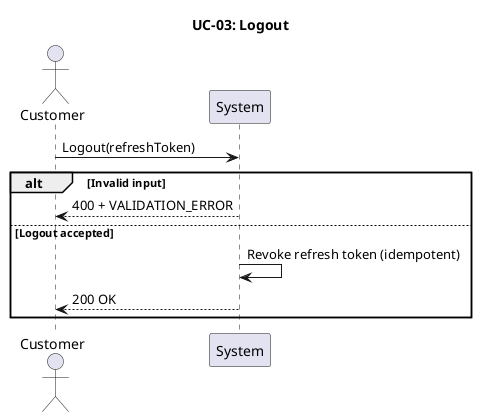
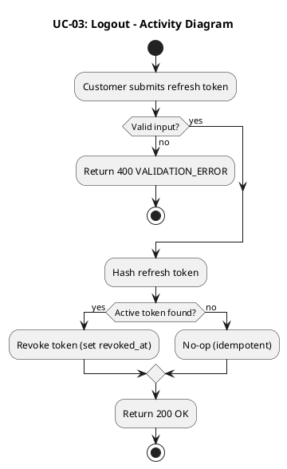
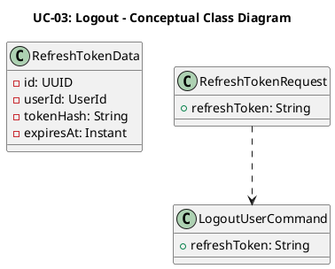
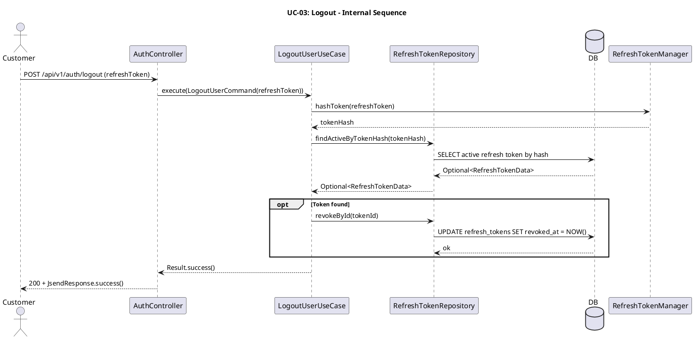
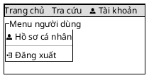

## UC-03: Đăng xuất

### 1. Mô tả use case

| Mục                            | Nội dung                                                                                                                                                                                                                                                                                                                                                                                              |
| ------------------------------ | ----------------------------------------------------------------------------------------------------------------------------------------------------------------------------------------------------------------------------------------------------------------------------------------------------------------------------------------------------------------------------------------------------- |
| Phụ thuộc                      | UC-02: Đăng nhập                                                                                                                                                                                                                                                                                                                                                                                      |
| Mục đích                       | Khách hàng muốn kết thúc phiên làm việc hiện tại để ngăn refresh token tiếp tục được dùng tạo access token mới. PM tiếp nhận refresh token, tra cứu token đang hoạt động tương ứng và thu hồi nó theo cách idempotent.                                                                                                                                                                                |
| Mô tả                          | Khách hàng kết thúc phiên làm việc hiện tại bằng cách thu hồi refresh token đang sử dụng.                                                                                                                                                                                                                                                                                                             |
| Actor chính                    | Khách hàng                                                                                                                                                                                                                                                                                                                                                                                            |
| Actor liên quan                | Không                                                                                                                                                                                                                                                                                                                                                                                                 |
| Tiền điều kiện                 | Không yêu cầu xác thực. Khách hàng cần có giá trị refresh token để gửi lên (hợp lệ hoặc không).                                                                                                                                                                                                                                                                                                       |
| Dãy lệnh thực hiện bình thường | 1. Khách hàng gửi yêu cầu đăng xuất kèm `refreshToken` hiện tại.   2. Hệ thống kiểm tra dữ liệu đầu vào hợp lệ.   3. Hệ thống băm refresh token và tìm bản ghi tương ứng.   4. Nếu token đang hoạt động tồn tại, hệ thống thu hồi refresh token (đánh dấu `revoked_at`).   5. Nếu token không tồn tại hoặc đã bị thu hồi, hệ thống không làm gì thêm.   6. Hệ thống trả về thành công. |
| Hậu điều kiện (thành công)     | Nếu refresh token tồn tại và đang hoạt động, nó sẽ bị thu hồi. Nếu token không tồn tại hoặc đã thu hồi, không có thay đổi nào xảy ra.                                                                                                                                                                                                                                                                 |
| Hậu điều kiện (thất bại)       | Khi dữ liệu đầu vào không hợp lệ, hệ thống không thực hiện thu hồi token nào.                                                                                                                                                                                                                                                                                                                         |
| Xử lý ngoại lệ                 | Refresh token không tồn tại hoặc đã bị thu hồi trước đó → Hệ thống vẫn trả về thành công (idempotent, không để lộ thông tin token).   Dữ liệu đầu vào không hợp lệ, thiếu trường `refreshToken` → Hệ thống trả về lỗi `VALIDATION_ERROR`.   Hợp đồng API tại controller hiện công bố thêm khả năng trả về `401` khi refresh token không hợp lệ hoặc hết hạn.                                    |

### 2. Lược đồ tuần tự

### 3. Lược đồ hoạt động

### 5. Lược đồ lớp ý niệm

### 6. Phân rã thành phần PM

#### 6.1 Controller: `AuthController`

- **Nhiệm vụ**: Nhận payload đăng xuất, kiểm tra dữ liệu đầu vào và chuyển yêu
  cầu thu hồi token sang lớp nghiệp vụ.
- **Endpoint**: `POST /api/v1/auth/logout`
- **Input**: `RefreshTokenRequest` — `{ refreshToken: String }`
- **Output thành công**: `200 OK` + `JsendResponse.success()`
- **Output lỗi**: `400/401` + `JsendResponse` — `{ errorCode, message }`

#### 6.2 UseCase: `LogoutUserUseCase`

- **Nhiệm vụ**: Băm refresh token nhận được, tìm token đang hoạt động tương ứng
  và thu hồi token nếu tồn tại theo cách idempotent.
- **Input**: `LogoutUserCommand` — `{ refreshToken: String }`
- **Output**: `Result<Void, UserError>`
- **Gọi đến**:
    - `RefreshTokenManager.hashToken(refreshToken)` — tính giá trị băm để tra
      cứu
    - `RefreshTokenRepository.findActiveByTokenHash(tokenHash)` — tìm token đang
      hoạt động
    - `RefreshTokenRepository.revokeById(tokenId)` — thu hồi token khi tìm thấy
- **Phát sinh sự kiện**: Không

#### 6.3 Repository: `RefreshTokenRepository`

- **Nhiệm vụ**: Truy xuất và cập nhật bản ghi refresh token trong hạ tầng lưu
  trữ.
- **Phương thức liên quan đến UC**:
    - `findActiveByTokenHash(tokenHash): Optional<RefreshTokenData>` — tìm token
      đang hoạt động theo hash
    - `revokeById(tokenId): void` — cập nhật `revoked_at` để thu hồi token
- **Table**: `refresh_tokens`

#### 6.4 Port: `RefreshTokenManager`

- **Nhiệm vụ**: Băm refresh token thô để tra cứu an toàn trong cơ sở dữ liệu.
- **Phương thức liên quan đến UC**:
    - `hashToken(token): String` — trả về chuỗi hash hex-encoded SHA-256

#### 6.5 Lược đồ tuần tự nội bộ PM

#### 6.6 Giao diện

##### 6.6.1 Giao diện mẫu

##### 6.6.2 Giao diện ứng dụng

Chưa hiện thực. Sẽ bổ sung ảnh chụp màn hình khi hoàn thành.

### 7. Bảng tham chiếu dò vết

| Use Case | Controller     | Endpoint                   | UseCase           | Repository                                                       | Table            |
| -------- | -------------- | -------------------------- | ----------------- | ---------------------------------------------------------------- | ---------------- |
| UC-03    | AuthController | `POST /api/v1/auth/logout` | LogoutUserUseCase | `RefreshTokenRepository.findActiveByTokenHash()`, `revokeById()` | `refresh_tokens` |

### 8. Tiêu chí kiểm thử

| Tiêu chí             | Phép thử                                                                   | Kết quả mong đợi                          | Ghi chú                              |
| -------------------- | -------------------------------------------------------------------------- | ----------------------------------------- | ------------------------------------ |
| Toàn diện (coverage) | Đối chiếu Activity Diagram ↔ Sequence Diagram: mọi luồng đều được thể hiện | Không bỏ sót luồng chính lẫn ngoại lệ     | Rà soát chéo giữa mục 2 và mục 3     |
| Nhất quán            | Rà soát tên lớp, trạng thái, API giữa các lược đồ trong cùng UC            | Không mâu thuẫn giữa các mục 2–6          | Đặc biệt kiểm tra tên trong mục 5–6  |
| Truy vết             | Đối chiếu bảng tham chiếu (mục 7) với lược đồ tuần tự nội bộ (mục 6.5)     | Mọi tương tác trong sequence đều có entry | Kiểm tra không thiếu endpoint/method |
