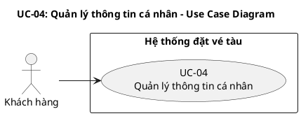
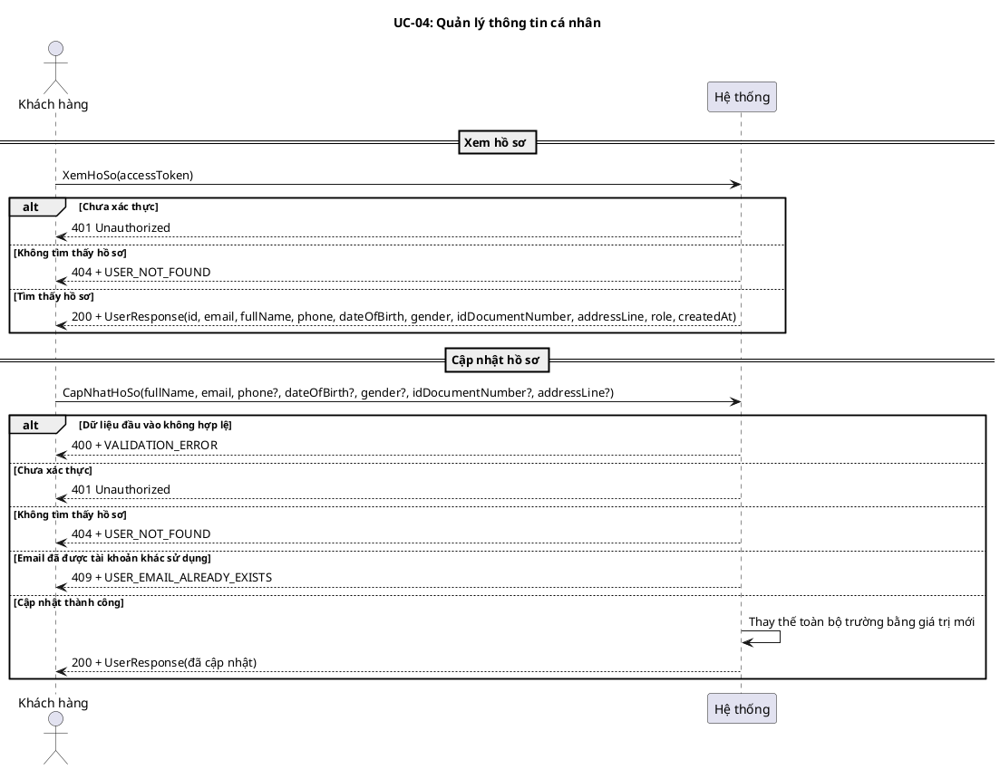
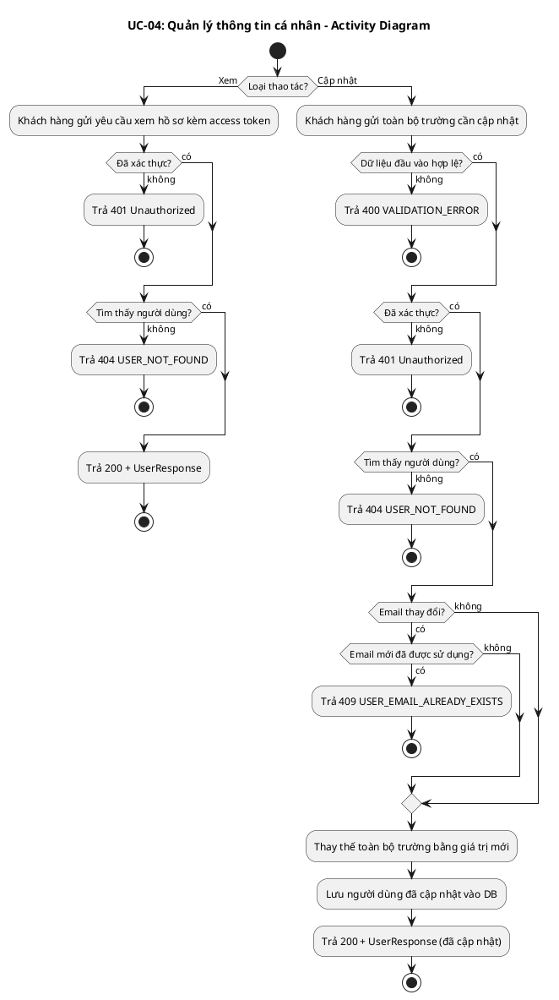
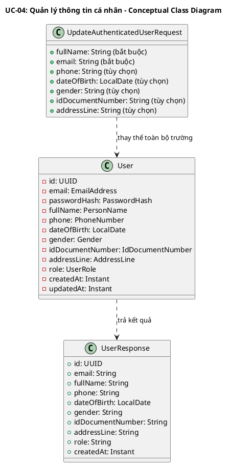
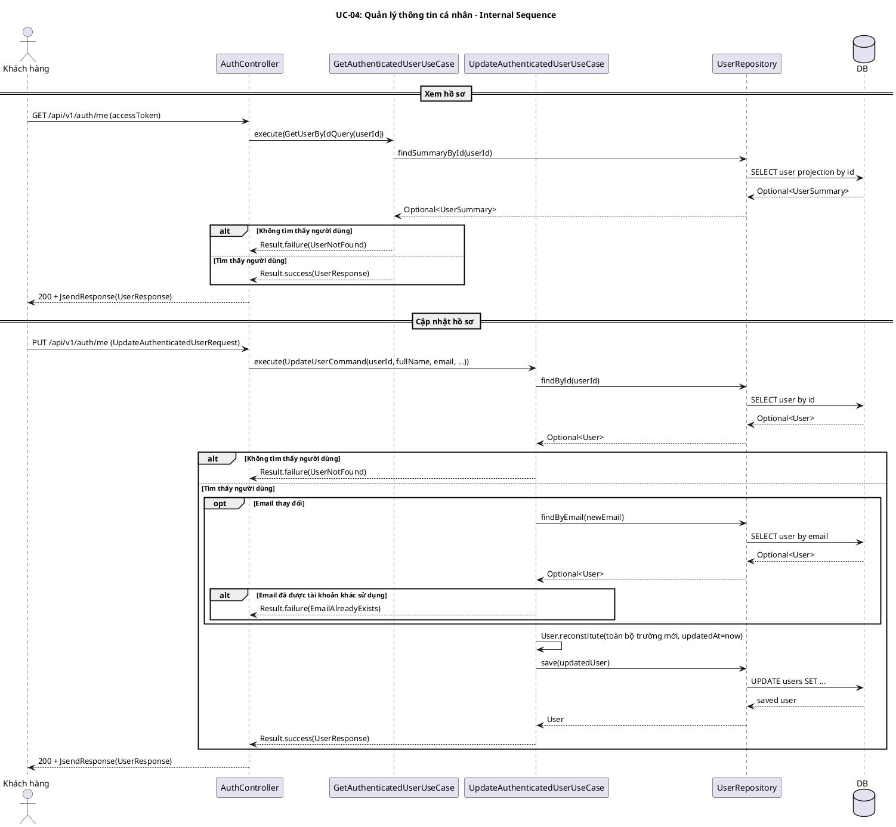
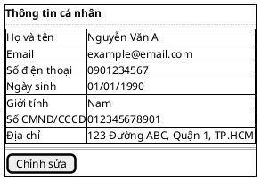
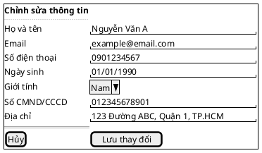

# UC-04: Quản lý thông tin cá nhân

## 1. Mô tả use case

| Mục                         | Nội dung                                                                                                                                                                                                                                                                                                                                                                                                                                                                                                                                                                                                                                                                 |
| --------------------------- | ------------------------------------------------------------------------------------------------------------------------------------------------------------------------------------------------------------------------------------------------------------------------------------------------------------------------------------------------------------------------------------------------------------------------------------------------------------------------------------------------------------------------------------------------------------------------------------------------------------------------------------------------------------------------ |
| Quan hệ UC                  | **`<<includes>>` (bắt buộc)**: Không   **`<<extends>>` (tùy chọn)**: Không   **Generalization**: Không |
| Mục đích                    | Khách hàng đã đăng nhập cần xem và chỉnh sửa hồ sơ cá nhân (họ tên, email, số điện thoại, ngày sinh, giới tính, số giấy tờ tùy thân, địa chỉ) để đảm bảo thông tin luôn chính xác khi sử dụng các chức năng khác như đặt vé. PM cho phép xem hồ sơ hiện tại và thay thế toàn bộ các trường có thể chỉnh sửa bằng giá trị mới. |
| Mô tả                       | Khách hàng xem và cập nhật hồ sơ cá nhân gồm họ tên, email, số điện thoại, ngày sinh, giới tính, số giấy tờ tùy thân và địa chỉ. |
| Actor chính                 | Khách hàng đã đăng nhập |
| Actor liên quan             | Không |
| Tiền điều kiện              | Khách hàng đã đăng nhập và có access token hợp lệ. |
| Luồng chính                 | **Xem hồ sơ:**   1. Khách hàng gửi yêu cầu xem thông tin cá nhân kèm access token.   2. Hệ thống xác thực token và xác định người dùng.   3. Hệ thống trả về thông tin hồ sơ hiện tại.    **Cập nhật hồ sơ (full replacement):**   1. Khách hàng gửi yêu cầu cập nhật kèm toàn bộ các trường có thể chỉnh sửa (fullName, email bắt buộc; phone, dateOfBirth, gender, idDocumentNumber, addressLine tùy chọn).   2. Hệ thống kiểm tra dữ liệu đầu vào hợp lệ.   3. Nếu email thay đổi, hệ thống kiểm tra email mới chưa được tài khoản khác sử dụng.   4. Hệ thống thay thế toàn bộ các trường bằng giá trị mới gửi lên.   5. Hệ thống trả về thông tin hồ sơ sau khi cập nhật. |
| Hậu điều kiện (thành công)  | **Xem:** Hồ sơ hiện tại được trả về thành công.   **Cập nhật:** Hồ sơ cá nhân của khách hàng được thay thế hoàn toàn theo dữ liệu mới trong hệ thống. |
| Hậu điều kiện (thất bại)    | Dữ liệu hồ sơ không thay đổi. Không có bản ghi nào bị cập nhật. |
| Luồng ngoại lệ              | Chưa xác thực (thiếu hoặc sai access token) → Hệ thống trả về lỗi 401.   Tài khoản không tìm thấy → Hệ thống trả về lỗi `USER_NOT_FOUND`.   Email mới đã được tài khoản khác sử dụng → Hệ thống trả về lỗi `USER_EMAIL_ALREADY_EXISTS`.   Dữ liệu đầu vào không hợp lệ → Hệ thống trả về lỗi `VALIDATION_ERROR`. |

## 2. Lược đồ Use Case

## 3. Lược đồ tuần tự

## 4. Lược đồ hoạt động

## 5. Lược đồ lớp ý niệm

## 6. Phân rã thành phần PM

### 6.1 Controller: `AuthController`

- **Nhiệm vụ**: Nhận yêu cầu xem và cập nhật hồ sơ, xác thực access token qua
  `@PreAuthorize("isAuthenticated()")` và ủy thác cho use case tương ứng.
- **Endpoint xem**: `GET /api/v1/auth/me`
    - Input: access token (trong header `Authorization: Bearer ...`)
    - Output thành công: `200 OK` + `UserResponse`
    - Output lỗi: `401` / `404` + `JsendResponse`
- **Endpoint cập nhật**: `PUT /api/v1/auth/me`
    - Input: `UpdateAuthenticatedUserRequest` —
      `{ fullName: String (bắt buộc), email: String (bắt buộc), phone?: String, dateOfBirth?: LocalDate, gender?: String, idDocumentNumber?: String, addressLine?: String }`
    - Output thành công: `200 OK` + `UserResponse` (sau cập nhật)
    - Output lỗi: `400/401/404/409` + `JsendResponse`

### 6.2 UseCase: `GetAuthenticatedUserUseCase` (xem hồ sơ)

- **Nhiệm vụ**: Truy vấn hồ sơ người dùng hiện tại theo ID từ token.
- **Input**: `GetUserByIdQuery` — `{ userId: UUID }`
- **Output**: `Result<UserResponse, UserError>`
- **Gọi đến**:
    - `UserRepository.findSummaryById(userId)` — truy vấn projection hồ sơ
- **Phát sinh sự kiện**: Không

### 6.3 UseCase: `UpdateAuthenticatedUserUseCase` (cập nhật hồ sơ)

- **Nhiệm vụ**: Tìm người dùng, kiểm tra email trùng nếu email thay đổi, thay
  thế toàn bộ các trường có thể chỉnh sửa bằng giá trị mới, lưu và trả về hồ sơ
  mới.
- **Input**: `UpdateUserCommand` —
  `{ userId, fullName, email, phone, dateOfBirth, gender, idDocumentNumber, addressLine }`
- **Output**: `Result<UserResponse, UserError>`
- **Gọi đến**:
    - `UserRepository.findById(userId)` — tìm entity hiện tại
    - `UserRepository.findByEmail(newEmail)` — kiểm tra email trùng (chỉ khi
      email thay đổi)
    - `UserRepository.save(updatedUser)` — lưu entity đã cập nhật
- **Phát sinh sự kiện**: Không

### 6.4 Repository: `UserRepository`

- **Nhiệm vụ**: Truy xuất và lưu trữ domain entity `User`.
- **Phương thức liên quan đến UC**:
    - `findSummaryById(userId): Optional<UserSummary>` — projection cho xem hồ
      sơ
    - `findById(userId): Optional<User>` — tìm entity đầy đủ cho cập nhật
    - `findByEmail(email): Optional<User>` — kiểm tra email trùng
    - `save(user): User` — lưu entity đã cập nhật
- **Table**: `users`

### 6.5 Thiết kế cơ sở dữ liệu

#### 6.5.1 ERD

- **Tham chiếu ERD**: Bảng `users` trong schema chung của hệ thống
- **Bảng/View liên quan**: `users`

#### 6.5.2 Stored Procedure

Không sử dụng Stored Procedure cho UC này.

#### 6.5.3 Trigger

Không sử dụng Trigger cho UC này.

### 6.6 Lược đồ tuần tự nội bộ PM

### 6.7 Giao diện

#### 6.7.1 Giao diện mẫu

| Control                     | Nhiệm vụ                                                              | Inputs                                                                                     | Outputs                        | Gọi API                    |
| --------------------------- | --------------------------------------------------------------------- | ------------------------------------------------------------------------------------------ | ------------------------------ | -------------------------- |
| `ProfileHeader`             | Hiển thị avatar, tên, email, ngày tham gia                             | `UserResponse` (từ query)                                                                  | Render thông tin header        | Không (dùng data từ query) |
| `ProfileForm` (xem)        | Hiển thị form với dữ liệu hồ sơ hiện tại, cho phép chỉnh sửa         | `UserResponse` (từ `getAuthenticatedUser` query)                                           | Form populated với dữ liệu     | `GET /api/v1/auth/me`      |
| `ProfileForm` (cập nhật)   | Gửi toàn bộ trường đã chỉnh sửa lên server                           | `fullName`, `email`, `phone`, `dateOfBirth`, `gender`, `idDocumentNumber`, `addressLine`    | Toast success/error, invalidate query | `PUT /api/v1/auth/me`      |
| `[Lưu thay đổi]` Button   | Kích hoạt submit form cập nhật hồ sơ                                  | Form values (validated bởi Zod schema)                                                     | Gọi `updateAuthenticatedUser` mutation | Gián tiếp qua ProfileForm |

#### 6.7.2 Giao diện ứng dụng

Chưa hiện thực. Sẽ bổ sung ảnh chụp màn hình khi hoàn thành.

## 7. Bảng tham chiếu dò vết

| Use Case | Controller     | Endpoint                | UseCase                        | Repository                                             | SP    | Table   |
| -------- | -------------- | ----------------------- | ------------------------------ | ------------------------------------------------------ | ----- | ------- |
| UC-04    | AuthController | `GET /api/v1/auth/me`   | GetAuthenticatedUserUseCase    | `UserRepository.findSummaryById()`                     | Không | `users` |
| UC-04    | AuthController | `PUT /api/v1/auth/me`   | UpdateAuthenticatedUserUseCase | `UserRepository.findById()`, `findByEmail()`, `save()` | Không | `users` |

## 8. Tiêu chí kiểm thử

### 8.1 Mức phân tích

| Tiêu chí             | Phép thử                                                                   | Kết quả mong đợi                          | Ghi chú                              |
| -------------------- | -------------------------------------------------------------------------- | ----------------------------------------- | ------------------------------------ |
| Toàn diện (coverage) | Đối chiếu Activity Diagram ↔ Sequence Diagram: mọi luồng đều được thể hiện | Không bỏ sót luồng chính lẫn ngoại lệ     | Rà soát chéo giữa mục 3 và mục 4     |
| Nhất quán            | Rà soát tên lớp, trạng thái, API giữa các lược đồ trong cùng UC            | Không mâu thuẫn giữa các mục 2–6          | Đặc biệt kiểm tra tên trong mục 5–6  |
| Truy vết             | Đối chiếu bảng tham chiếu (mục 7) với lược đồ tuần tự nội bộ (mục 6.6)     | Mọi tương tác trong sequence đều có entry | Kiểm tra không thiếu endpoint/method |

### 8.2 Mức thiết kế

| Tiêu chí      | Phép thử                                                                                         | Kết quả mong đợi                                       | Ghi chú                                |
| ------------- | ------------------------------------------------------------------------------------------------ | ------------------------------------------------------ | -------------------------------------- |
| Chuẩn hóa     | Rà soát thiết kế AuthController, GetAuthenticatedUserUseCase, UpdateAuthenticatedUserUseCase, UserRepository | Tuân thủ Clean Architecture, quy ước đặt tên và hợp đồng | Walkthrough/inspection                 |
| Testability   | Rà soát khả năng mock UserRepository trong unit test                                              | Có thể kiểm thử UseCase độc lập không cần DB thật       | Tất cả dependency là port/interface    |
| Modularity    | Rà soát ranh giới trách nhiệm: Controller chỉ validate + route, UseCase chỉ orchestrate, Repository chỉ persistence | Không trùng lặp trách nhiệm, coupling thấp             | Kiểm tra không có logic nghiệp vụ trong Controller |

### 8.3 Mức hiện thực

| Tiêu chí          | Phép thử                                                                                  | Kết quả mong đợi                                                    | Ghi chú                                    |
| ----------------- | ----------------------------------------------------------------------------------------- | ------------------------------------------------------------------- | ------------------------------------------ |
| Xử lý chính xác   | Test xem hồ sơ (user found, not found), cập nhật (success, email conflict, user not found, validation fail) | 200 OK cho success; 400/401/404/409 cho các lỗi tương ứng | Unit test UseCase + integration test endpoint |
| Hiệu năng         | Benchmark endpoint GET/PUT /api/v1/auth/me với 100 concurrent requests                    | Response time p95 < 200ms (logic đơn giản, SELECT + UPDATE)          | Ghi rõ môi trường test                     |
| Bảo mật           | Kiểm tra không truy cập được hồ sơ người khác; kiểm tra access token bắt buộc; kiểm tra email uniqueness constraint | Chỉ xem/sửa được hồ sơ của chính mình; 401 khi thiếu token | Chống IDOR, kiểm tra authorization |

### 8.4 Bảng tiêu chí chất lượng theo chức năng

| Chức năng trong UC          | Tiêu chí mức Ý niệm                                                        | Tiêu chí mức Thiết kế                                                          | Tiêu chí mức Hiện thực                                                              |
| --------------------------- | -------------------------------------------------------------------------- | ------------------------------------------------------------------------------ | ----------------------------------------------------------------------------------- |
| Xem hồ sơ cá nhân          | Đúng nhu cầu: khách hàng xem được thông tin hiện tại của mình               | Luồng xử lý chuẩn hóa qua Controller→UseCase→Repository, dùng projection cho hiệu năng | Unit test GetAuthenticatedUserUseCase (found, not found), integration test GET /me |
| Cập nhật hồ sơ (full replacement) | Khách hàng thay đổi được thông tin, email unique được đảm bảo          | UseCase kiểm tra email conflict trước khi save, dùng User.reconstitute() để tạo entity mới | Unit test UpdateAuthenticatedUserUseCase (success, email conflict, not found), integration test PUT /me |
| Kiểm tra email trùng       | Không cho phép 2 tài khoản dùng cùng email                                  | So sánh email mới vs email hiện tại, chỉ query DB khi email thực sự thay đổi    | Test cập nhật với email giữ nguyên (không query), email mới chưa dùng (success), email đã dùng (409) |

## 9. Yêu cầu phi chức năng

| Loại yêu cầu  | Nội dung                                                                                          | Nguồn gốc                                          |
| -------------- | ------------------------------------------------------------------------------------------------- | -------------------------------------------------- |
| Business       | Hồ sơ cá nhân phải chính xác để phục vụ đặt vé (tên, CMND/CCCD khớp giấy tờ khi lên tàu)         | Quy định vận chuyển hành khách đường sắt             |
| Operation      | Endpoint yêu cầu authentication (Bearer token); email uniqueness enforced ở cả application và DB level | Chính sách bảo mật hệ thống                         |
| Development    | Full replacement semantics (PUT) — frontend gửi toàn bộ trường, backend thay thế hoàn toàn; response tuân thủ JSend format | Quy ước kỹ thuật nhóm phát triển                    |
