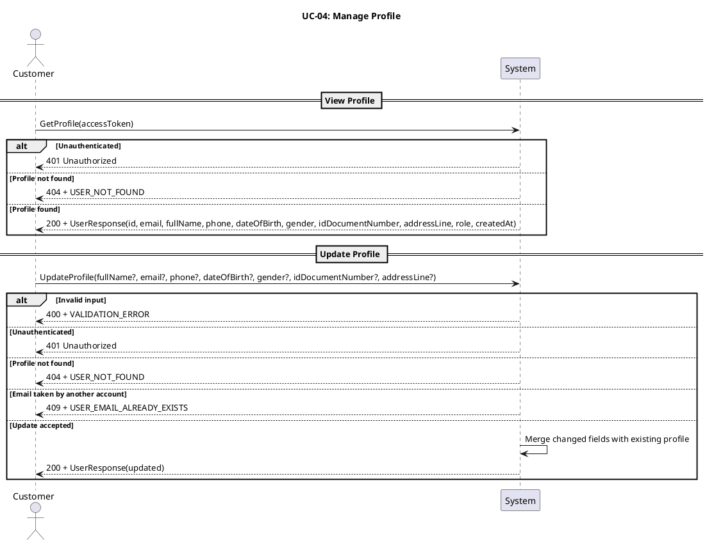
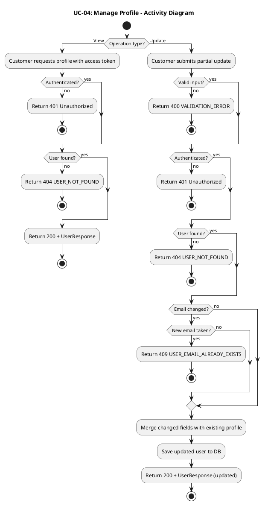
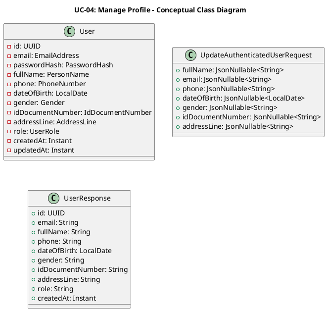
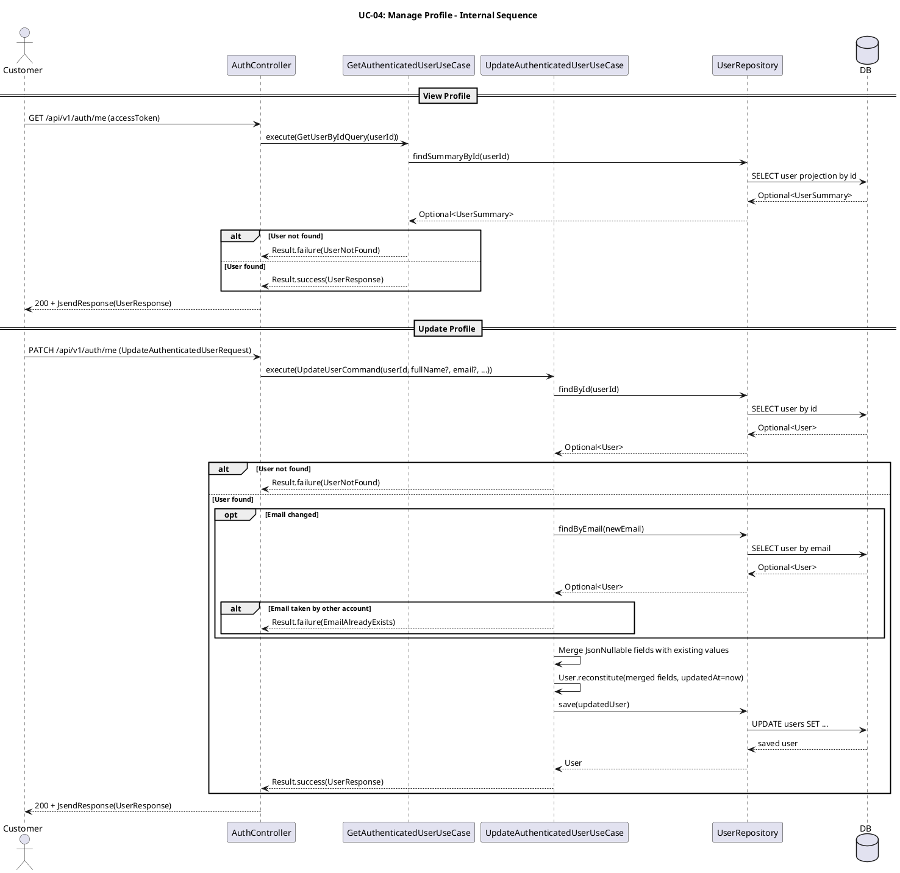

# UC-04: Quản lý thông tin cá nhân

## 1. Mô tả use case

| Mục                            | Nội dung                                                                                                                                                                                                                                                                                                                                                                                                                                                                                                                                                                                                                                                                 |
| ------------------------------ | ------------------------------------------------------------------------------------------------------------------------------------------------------------------------------------------------------------------------------------------------------------------------------------------------------------------------------------------------------------------------------------------------------------------------------------------------------------------------------------------------------------------------------------------------------------------------------------------------------------------------------------------------------------------------ |
| Phụ thuộc                      | UC-02: Đăng nhập                                                                                                                                                                                                                                                                                                                                                                                                                                                                                                                                                                                                                                                         |
| Mục đích                       | Khách hàng đã đăng nhập cần xem và chỉnh sửa hồ sơ cá nhân (họ tên, email, số điện thoại, ngày sinh, giới tính, số giấy tờ tùy thân, địa chỉ) để đảm bảo thông tin luôn chính xác khi sử dụng các chức năng khác như đặt vé. PM cho phép xem hồ sơ hiện tại và cập nhật từng trường riêng lẻ mà không ảnh hưởng đến các trường không được gửi lên.                                                                                                                                                                                                                                                                                                                       |
| Mô tả                          | Khách hàng xem và cập nhật hồ sơ cá nhân gồm họ tên, email, số điện thoại, ngày sinh, giới tính, số giấy tờ tùy thân và địa chỉ.                                                                                                                                                                                                                                                                                                                                                                                                                                                                                                                                         |
| Actor chính                    | Khách hàng đã đăng nhập                                                                                                                                                                                                                                                                                                                                                                                                                                                                                                                                                                                                                                                  |
| Actor liên quan                | Không                                                                                                                                                                                                                                                                                                                                                                                                                                                                                                                                                                                                                                                                    |
| Tiền điều kiện                 | Khách hàng đã đăng nhập và có access token hợp lệ.                                                                                                                                                                                                                                                                                                                                                                                                                                                                                                                                                                                                                       |
| Dãy lệnh thực hiện bình thường | **Xem hồ sơ:**   1. Khách hàng gửi yêu cầu xem thông tin cá nhân kèm access token.   2. Hệ thống xác thực token và xác định người dùng.   3. Hệ thống trả về thông tin hồ sơ hiện tại.    **Cập nhật hồ sơ:**   1. Khách hàng gửi yêu cầu cập nhật kèm các trường muốn thay đổi (chỉ gửi trường cần sửa, sử dụng `JsonNullable` — bỏ qua trường giữ nguyên).   2. Hệ thống kiểm tra dữ liệu đầu vào hợp lệ.   3. Nếu email thay đổi, hệ thống kiểm tra email mới chưa được tài khoản khác sử dụng.   4. Hệ thống cập nhật các trường được gửi lên, giữ nguyên các trường không gửi.   5. Hệ thống trả về thông tin hồ sơ sau khi cập nhật. |
| Hậu điều kiện (thành công)     | **Xem:** Hồ sơ hiện tại được trả về thành công.   **Cập nhật:** Hồ sơ cá nhân của khách hàng được cập nhật theo dữ liệu mới trong hệ thống.                                                                                                                                                                                                                                                                                                                                                                                                                                                                                                                           |
| Hậu điều kiện (thất bại)       | Dữ liệu hồ sơ không thay đổi. Không có bản ghi nào bị cập nhật.                                                                                                                                                                                                                                                                                                                                                                                                                                                                                                                                                                                                          |
| Xử lý ngoại lệ                 | Chưa xác thực (thiếu hoặc sai access token) → Hệ thống trả về lỗi 401.   Tài khoản không tìm thấy → Hệ thống trả về lỗi `USER_NOT_FOUND`.   Email mới đã được tài khoản khác sử dụng → Hệ thống trả về lỗi `USER_EMAIL_ALREADY_EXISTS`.   Dữ liệu đầu vào không hợp lệ → Hệ thống trả về lỗi `VALIDATION_ERROR`.                                                                                                                                                                                                                                                                                                                                                |

## 2. Lược đồ tuần tự

## 3. Lược đồ hoạt động

## 5. Lược đồ lớp ý niệm

## 6. Phân rã thành phần PM

### 6.1 Controller: `AuthController`

-  **Nhiệm vụ**: Nhận yêu cầu xem và cập nhật hồ sơ, xác thực access token qua
  `@PreAuthorize("isAuthenticated()")` và ủy thác cho use case tương ứng.
-  **Endpoint xem**: `GET /api/v1/auth/me`
    -  Input: access token (trong header `Authorization: Bearer ...`)
    -  Output thành công: `200 OK` + `UserResponse`
    -  Output lỗi: `401` / `404` + `JsendResponse`
-  **Endpoint cập nhật**: `PATCH /api/v1/auth/me`
    -  Input: `UpdateAuthenticatedUserRequest` —
      `{ fullName?, email?, phone?, dateOfBirth?, gender?, idDocumentNumber?, addressLine? }`
      (sử dụng `JsonNullable`)
    -  Output thành công: `200 OK` + `UserResponse` (sau cập nhật)
    -  Output lỗi: `400/401/404/409` + `JsendResponse`

### 6.2 UseCase: `GetAuthenticatedUserUseCase` (xem hồ sơ)

-  **Nhiệm vụ**: Truy vấn hồ sơ người dùng hiện tại theo ID từ token.
-  **Input**: `GetUserByIdQuery` — `{ userId: UUID }`
-  **Output**: `Result<UserResponse, UserError>`
-  **Gọi đến**:
    -  `UserRepository.findSummaryById(userId)` — truy vấn projection hồ sơ
-  **Phát sinh sự kiện**: Không

### 6.3 UseCase: `UpdateAuthenticatedUserUseCase` (cập nhật hồ sơ)

-  **Nhiệm vụ**: Tìm người dùng, kiểm tra email trùng nếu email thay đổi, hợp
  nhất các trường `JsonNullable` được gửi lên với giá trị hiện tại, lưu và trả
  về hồ sơ mới.
-  **Input**: `UpdateUserCommand` —
  `{ userId, fullName?, email?, phone?, dateOfBirth?, gender?, idDocumentNumber?, addressLine? }`
-  **Output**: `Result<UserResponse, UserError>`
-  **Gọi đến**:
    -  `UserRepository.findById(userId)` — tìm entity hiện tại
    -  `UserRepository.findByEmail(newEmail)` — kiểm tra email trùng (chỉ khi
      email thay đổi)
    -  `UserRepository.save(updatedUser)` — lưu entity đã cập nhật
-  **Phát sinh sự kiện**: Không

### 6.4 Repository: `UserRepository`

-  **Nhiệm vụ**: Truy xuất và lưu trữ domain entity `User`.
-  **Phương thức liên quan đến UC**:
    -  `findSummaryById(userId): Optional<UserSummary>` — projection cho xem hồ
      sơ
    -  `findById(userId): Optional<User>` — tìm entity đầy đủ cho cập nhật
    -  `findByEmail(email): Optional<User>` — kiểm tra email trùng
    -  `save(user): User` — lưu entity đã cập nhật
-  **Table**: `users`

### 6.5 Lược đồ tuần tự nội bộ PM

## 7. Bảng tham chiếu dò vết

| Use Case | Controller     | Endpoint                | UseCase                        | Repository                                             | Table   |
| -------- | -------------- | ----------------------- | ------------------------------ | ------------------------------------------------------ | ------- |
| UC-04    | AuthController | `GET /api/v1/auth/me`   | GetAuthenticatedUserUseCase    | `UserRepository.findSummaryById()`                     | `users` |
| UC-04    | AuthController | `PATCH /api/v1/auth/me` | UpdateAuthenticatedUserUseCase | `UserRepository.findById()`, `findByEmail()`, `save()` | `users` |

## 8. Tiêu chí kiểm thử

| Tiêu chí             | Phép thử                                                                   | Kết quả mong đợi                          | Ghi chú                              |
| -------------------- | -------------------------------------------------------------------------- | ----------------------------------------- | ------------------------------------ |
| Toàn diện (coverage) | Đối chiếu Activity Diagram ↔ Sequence Diagram: mọi luồng đều được thể hiện | Không bỏ sót luồng chính lẫn ngoại lệ     | Rà soát chéo giữa mục 2 và mục 3     |
| Nhất quán            | Rà soát tên lớp, trạng thái, API giữa các lược đồ trong cùng UC            | Không mâu thuẫn giữa các mục 2–6          | Đặc biệt kiểm tra tên trong mục 5–6  |
| Truy vết             | Đối chiếu bảng tham chiếu (mục 7) với lược đồ tuần tự nội bộ (mục 6.5)     | Mọi tương tác trong sequence đều có entry | Kiểm tra không thiếu endpoint/method |
