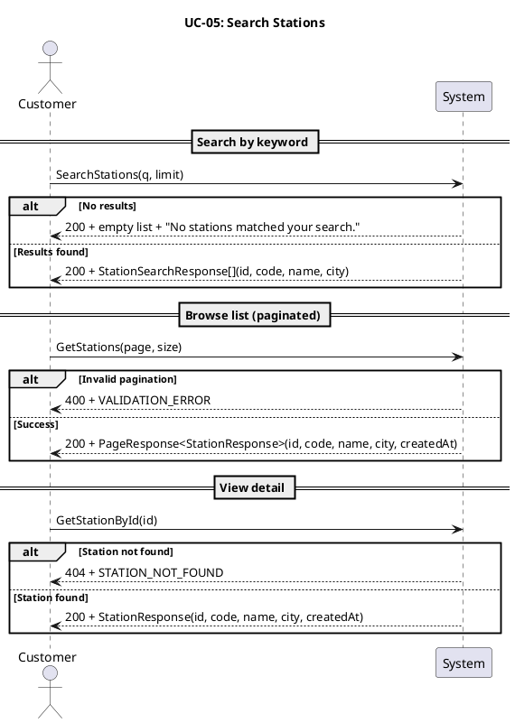
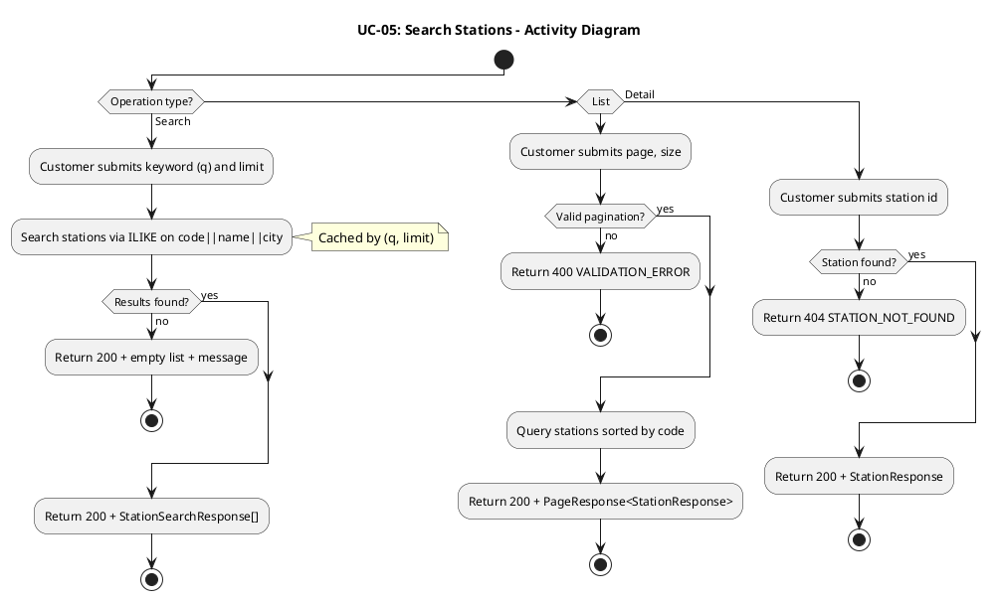
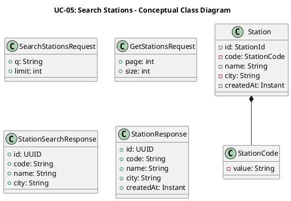
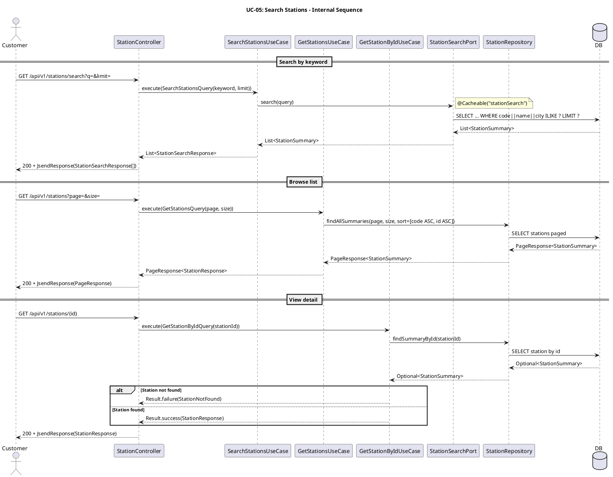
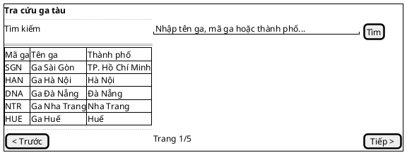

# UC-05: Tra cứu ga tàu

# Mô tả use case

| Mục                            | Nội dung                                                                                                                                                                                                                                                                                                                                                                                                                                                                                                                                                                                                                                                       |
| ------------------------------ | -------------------------------------------------------------------------------------------------------------------------------------------------------------------------------------------------------------------------------------------------------------------------------------------------------------------------------------------------------------------------------------------------------------------------------------------------------------------------------------------------------------------------------------------------------------------------------------------------------------------------------------------------------------- |
| Phụ thuộc                      | UC-02: Đăng nhập                                                                                                                                                                                                                                                                                                                                                                                                                                                                                                                                                                                                                                               |
| Mục đích                       | Khách hàng cần tra cứu thông tin ga tàu để phục vụ các bước tiếp theo như chọn tuyến, xem lịch chuyến hoặc đặt vé. PM cung cấp ba cách tra cứu: tìm kiếm theo từ khóa (auto-complete, có cache), duyệt danh sách phân trang và xem chi tiết một ga cụ thể.                                                                                                                                                                                                                                                                                                                                                                                                     |
| Mô tả                          | Khách hàng tra cứu thông tin ga tàu bằng nhiều cách: tìm kiếm theo từ khóa, duyệt danh sách phân trang, hoặc xem chi tiết một ga cụ thể.                                                                                                                                                                                                                                                                                                                                                                                                                                                                                                                       |
| Actor chính                    | Khách hàng đã đăng nhập                                                                                                                                                                                                                                                                                                                                                                                                                                                                                                                                                                                                                                        |
| Actor liên quan                | Không                                                                                                                                                                                                                                                                                                                                                                                                                                                                                                                                                                                                                                                          |
| Tiền điều kiện                 | Khách hàng đã đăng nhập và có access token hợp lệ.                                                                                                                                                                                                                                                                                                                                                                                                                                                                                                                                                                                                             |
| Dãy lệnh thực hiện bình thường | **Tìm kiếm theo từ khóa:**   1. Khách hàng gửi từ khóa tìm kiếm (tên ga, mã ga, hoặc thành phố) kèm giới hạn số kết quả (`limit`, tối đa 20).   2. Hệ thống tra cứu bằng ILIKE trên tổ hợp mã ga, tên ga, thành phố, ưu tiên kết quả khớp prefix.   3. Hệ thống trả về danh sách ga phù hợp (kết quả được cache).    **Duyệt danh sách:**   1. Khách hàng gửi yêu cầu xem danh sách ga với tham số phân trang (`page`, `size`).   2. Hệ thống trả về danh sách ga phân trang, sắp xếp theo mã ga.    **Xem chi tiết:**   1. Khách hàng gửi yêu cầu xem chi tiết một ga theo `id`.   2. Hệ thống trả về thông tin chi tiết ga. |
| Hậu điều kiện (thành công)     | Không có thay đổi trạng thái. Đây là thao tác chỉ đọc.                                                                                                                                                                                                                                                                                                                                                                                                                                                                                                                                                                                                         |
| Hậu điều kiện (thất bại)       | Không có thay đổi trạng thái. Hệ thống trả về lỗi hoặc danh sách rỗng tùy trường hợp.                                                                                                                                                                                                                                                                                                                                                                                                                                                                                                                                                                          |
| Xử lý ngoại lệ                 | Chưa xác thực (thiếu hoặc sai access token) → Hệ thống trả về lỗi 401.   Tìm kiếm không có kết quả → Hệ thống trả về danh sách rỗng kèm thông báo "No stations matched your search.".   Ga không tồn tại (xem chi tiết) → Hệ thống trả về lỗi `STATION_NOT_FOUND`.   Tham số phân trang không hợp lệ → Hệ thống trả về lỗi `VALIDATION_ERROR`.                                                                                                                                                                                                                                                                                                        |

# Lược đồ tuần tự

# Lược đồ hoạt động

# Lược đồ lớp ý niệm

# Phân rã thành phần PM

## Controller: `StationController`

- **Nhiệm vụ**: Nhận yêu cầu tra cứu ga tàu qua ba endpoint và ủy thác cho use
  case tương ứng.
- **Endpoint tìm kiếm**: `GET /api/v1/stations/search`
    - Input: `SearchStationsRequest` —
      `{ q: String, limit: int (1–20, default 10) }`
    - Output thành công: `200 OK` + `StationSearchResponse[]`
    - Output rỗng: `200 OK` + `[]` + message "No stations matched your search."
- **Endpoint danh sách**: `GET /api/v1/stations`
    - Input: `GetStationsRequest` —
      `{ page: int (≥0), size: int (1–100, default 20) }`
    - Output thành công: `200 OK` + `PageResponse<StationResponse>`
    - Output lỗi: `400` + `JsendResponse`
- **Endpoint chi tiết**: `GET /api/v1/stations/{id}`
    - Input: `id` (UUID path variable)
    - Output thành công: `200 OK` + `StationResponse`
    - Output lỗi: `404` + `JsendResponse`

## UseCase: `SearchStationsUseCase` (tìm kiếm)

- **Nhiệm vụ**: Tra cứu ga tàu theo từ khóa thông qua port tìm kiếm chuyên dụng.
  Kết quả được cache.
- **Input**: `SearchStationsQuery` — `{ keyword: String, limit: int }`
- **Output**: `List<StationSearchResponse>`
- **Gọi đến**:
    - `StationSearchPort.search(query)` — tra cứu ILIKE trên tổ hợp code, name,
      city
- **Cache**:
  `@Cacheable(cacheNames = "stationSearch", key = "'station-search:' + #query.cacheKey()")`
- **Phát sinh sự kiện**: Không

## UseCase: `GetStationsUseCase` (danh sách)

- **Nhiệm vụ**: Trả về danh sách ga phân trang, sắp xếp theo mã ga rồi theo id.
- **Input**: `GetStationsQuery` — `{ page: int, size: int }`
- **Output**: `PageResponse<StationResponse>`
- **Gọi đến**:
    - `StationRepository.findAllSummaries(page, size, sort)` — truy vấn phân
      trang
- **Phát sinh sự kiện**: Không

## UseCase: `GetStationByIdUseCase` (chi tiết)

- **Nhiệm vụ**: Trả về chi tiết một ga theo ID.
- **Input**: `GetStationByIdQuery` — `{ stationId: UUID }`
- **Output**: `Result<StationResponse, StationError>`
- **Gọi đến**:
    - `StationRepository.findSummaryById(stationId)` — truy vấn projection chi
      tiết
- **Phát sinh sự kiện**: Không

## Repository: `StationRepository`

- **Nhiệm vụ**: Truy xuất dữ liệu ga tàu từ cơ sở dữ liệu.
- **Phương thức liên quan đến UC**:
    - `findAllSummaries(page, size, sort): PageResponse<StationSummary>` — phân
      trang danh sách ga
    - `findSummaryById(stationId): Optional<StationSummary>` — chi tiết một ga
- **Table**: `stations`

## Port: `StationSearchPort`

- **Nhiệm vụ**: Định nghĩa hợp đồng tìm kiếm ga tàu ở tầng application. Cài đặt
  nằm trong tầng infrastructure, sử dụng JDBC trực tiếp với ILIKE trên tổ hợp
  `code || name || city`, ưu tiên kết quả khớp prefix.
- **Phương thức liên quan đến UC**:
    - `search(query): List<StationSummary>` — trả về danh sách ga phù hợp từ
      khóa
- **Implementation**: `StationSearchReader` (JDBC `NamedParameterJdbcTemplate`)

## Lược đồ tuần tự nội bộ PM

## Giao diện

### Giao diện mẫu

### Giao diện ứng dụng

Chưa hiện thực. Sẽ bổ sung ảnh chụp màn hình khi hoàn thành.

# Bảng tham chiếu dò vết

| Use Case | Controller        | Endpoint                      | UseCase               | Repository / Port                      | Table      |
| -------- | ----------------- | ----------------------------- | --------------------- | -------------------------------------- | ---------- |
| UC-05    | StationController | `GET /api/v1/stations/search` | SearchStationsUseCase | `StationSearchPort.search()`           | `stations` |
| UC-05    | StationController | `GET /api/v1/stations`        | GetStationsUseCase    | `StationRepository.findAllSummaries()` | `stations` |
| UC-05    | StationController | `GET /api/v1/stations/{id}`   | GetStationByIdUseCase | `StationRepository.findSummaryById()`  | `stations` |

# Tiêu chí kiểm thử

## Mức phân tích

| Tiêu chí             | Phép thử                                                                   | Kết quả mong đợi                          | Ghi chú                              |
| -------------------- | -------------------------------------------------------------------------- | ----------------------------------------- | ------------------------------------ |
| Toàn diện (coverage) | Đối chiếu Activity Diagram ↔ Sequence Diagram: mọi luồng đều được thể hiện | Không bỏ sót luồng chính lẫn ngoại lệ     | Rà soát chéo giữa mục 2 và mục 3     |
| Nhất quán            | Rà soát tên lớp, trạng thái, API giữa các lược đồ trong cùng UC            | Không mâu thuẫn giữa các mục 2–6          | Đặc biệt kiểm tra tên trong mục 5–6  |
| Truy vết             | Đối chiếu bảng tham chiếu (mục 7) với lược đồ tuần tự nội bộ (mục 6.5)     | Mọi tương tác trong sequence đều có entry | Kiểm tra không thiếu endpoint/method |

## Mức thiết kế

| Tiêu chí      | Phép thử                                                                          | Kết quả mong đợi                                       | Ghi chú                                |
| ------------- | --------------------------------------------------------------------------------- | ------------------------------------------------------ | -------------------------------------- |
| Chuẩn hóa     | Rà soát thiết kế StationController, SearchStationsUseCase, GetStationsUseCase, GetStationByIdUseCase, StationRepository, StationSearchPort | Tuân thủ Clean Architecture, quy ước đặt tên và hợp đồng | Walkthrough/inspection                 |
| Testability   | Rà soát khả năng mock StationSearchPort, StationRepository trong unit test         | Có thể kiểm thử UseCase độc lập không cần DB thật       | StationSearchPort và Repository là port |
| Modularity    | Rà soát ranh giới trách nhiệm: Controller chỉ validate + route, UseCase chỉ orchestrate, Repository chỉ persistence, Port chỉ search | Không trùng lặp trách nhiệm, coupling thấp             | Kiểm tra không có logic nghiệp vụ trong Controller |

## Mức hiện thực

| Tiêu chí          | Phép thử                                                                                  | Kết quả mong đợi                                                    | Ghi chú                                    |
| ----------------- | ----------------------------------------------------------------------------------------- | ------------------------------------------------------------------- | ------------------------------------------ |
| Xử lý chính xác   | Test luồng chính (search có kết quả, list phân trang, detail thành công), luồng lỗi (không tìm thấy ga, validation fail, 401 unauthorized) | 200 + đúng response format cho mỗi endpoint; 404 + STATION_NOT_FOUND; 400 + VALIDATION_ERROR; 401 Unauthorized | Kết hợp unit test UseCase + integration test endpoint |
| Hiệu năng         | Benchmark endpoint GET /api/v1/stations/search với 200 concurrent requests                 | Response time p95 < 300ms nhờ cache; cache hit ratio > 80% sau warm-up | Ghi rõ môi trường test                     |
| Cache             | Kiểm tra cache hoạt động đúng: cùng (q, limit) trả kết quả từ cache, không query DB lại   | Lần gọi thứ 2 không phát sinh SQL query; cache invalidation khi dữ liệu thay đổi | Verify qua log hoặc cache metrics          |
| Bảo mật           | Kiểm tra endpoint yêu cầu access token hợp lệ, reject request thiếu/sai token             | 401 Unauthorized khi thiếu token; 401 khi token hết hạn              | Kiểm tra cả token expired và token invalid |

## Danh sách test thỏa mãn mức hiện thực

### Backend

| # | Tên test case | Mô tả | Endpoint / SP | Table liên quan | Kết quả mong đợi | File test |
|---|---------------|--------|---------------|-----------------|-------------------|-----------|
| 1 | `searchReturnsEmptyMessageWhenNoStationMatches` | Tìm kiếm không có kết quả trả message rỗng | `GET /api/v1/stations/search` | `stations` | `200` + `[]` + message "No stations matched your search." | `backend/src/test/java/.../station/infrastructure/web/StationControllerTest.java:27` |
| 2 | `searchReturnsDataWithoutMessageWhenMatchesExist` | Tìm kiếm có kết quả trả data không có message | `GET /api/v1/stations/search` | `stations` | `200` + `StationSearchResponse[]` | `backend/src/test/java/.../station/infrastructure/web/StationControllerTest.java:42` |
| 3 | `list_returns200WithPagedStations` | Danh sách ga phân trang thành công | `GET /api/v1/stations` | `stations` | `200` + `PageResponse<StationResponse>` | `backend/src/test/java/.../station/infrastructure/web/StationControllerListAndGetByIdTest.java:48` |
| 4 | `list_returns200WithEmptyPageWhenNoStations` | Danh sách ga rỗng | `GET /api/v1/stations` | `stations` | `200` + page rỗng | `backend/src/test/java/.../station/infrastructure/web/StationControllerListAndGetByIdTest.java` |
| 5 | `getById_returns200WithStationResponseWhenFound` | Xem chi tiết ga thành công | `GET /api/v1/stations/{id}` | `stations` | `200` + `StationResponse` | `backend/src/test/java/.../station/infrastructure/web/StationControllerListAndGetByIdTest.java` |
| 6 | `getById_returns404WhenStationNotFound` | Xem chi tiết ga không tồn tại | `GET /api/v1/stations/{id}` | `stations` | `404` + `STATION_NOT_FOUND` | `backend/src/test/java/.../station/infrastructure/web/StationControllerListAndGetByIdTest.java` |
| 7 | `execute_returnsStationResponseWhenFound` | UseCase trả StationResponse khi tìm thấy | `GET /api/v1/stations/{id}` | `stations` | `Result.success(StationResponse)` | `backend/src/test/java/.../station/application/usecase/GetStationByIdUseCaseTest.java:42` |
| 8 | `execute_returnsStationNotFoundWhenRepositoryReturnsEmpty` | UseCase trả lỗi khi không tìm thấy | `GET /api/v1/stations/{id}` | `stations` | `Result.failure(StationNotFound)` | `backend/src/test/java/.../station/application/usecase/GetStationByIdUseCaseTest.java` |
| 9 | `execute_returnsPageResponseWithMappedStations` | UseCase GetStations map đúng fields | `GET /api/v1/stations` | `stations` | `PageResponse<StationResponse>` | `backend/src/test/java/.../station/application/usecase/GetStationsUseCaseTest.java:43` |
| 10 | `execute_returnsEmptyPageWhenNoStationsExist` | UseCase GetStations trả trang rỗng | `GET /api/v1/stations` | `stations` | `PageResponse` rỗng | `backend/src/test/java/.../station/application/usecase/GetStationsUseCaseTest.java` |
| 11 | `searchBuildsFuzzyMatchSqlWhenKeywordProvided` | StationSearchReader xây dựng SQL ILIKE đúng | `GET /api/v1/stations/search` | `stations` | SQL chứa ILIKE pattern, params đúng | `backend/src/test/java/.../station/infrastructure/persistence/StationSearchReaderTest.java:26` |
| 12 | `search_passesXssPayloadThroughWithoutSanitization` | Pen-test XSS payload qua search | `GET /api/v1/stations/search` | `stations` | Response chứa payload nguyên bản (không execute) | `backend/src/test/java/.../station/infrastructure/web/StationControllerSecurityTest.java:44` |
| 13 | `search_handlesSqlInjectionPayloadSafely` | Pen-test SQL injection qua search | `GET /api/v1/stations/search` | `stations` | Parameterized query chống injection | `backend/src/test/java/.../station/infrastructure/web/StationControllerSecurityTest.java` |
| 14 | `filter_handles50ConcurrentRequestsWithSameQuery` (search) | Stress test 50 concurrent search requests | `GET /api/v1/stations/search` | `stations` | 50 kết quả nhất quán, cache hoạt động | `backend/src/test/java/.../station/application/usecase/SearchStationsStressTest.java:63` |
| 15 | `getById_handles50ConcurrentRequestsForSameStation` | Stress test 50 concurrent getById requests | `GET /api/v1/stations/{id}` | `stations` | 50 kết quả nhất quán | `backend/src/test/java/.../station/application/usecase/SearchStationsStressTest.java` |

### Frontend

| # | Tên test case | Mô tả | Component / Hook | Kết quả mong đợi | File test |
|---|---------------|--------|------------------|-------------------|-----------|
| 1 | `renders origin, destination, date fields and search button` | Form tìm kiếm hiển thị đúng các trường ga đi, ga đến, ngày | `TripSearchForm` | Render đúng labels và button | `frontend/customer/src/components/search/trip-search-form.test.tsx:34` |
| 2 | `shows validation error when origin is not selected` | Validation lỗi khi chưa chọn ga đi | `TripSearchForm` | Hiển thị "Vui lòng chọn ga đi" | `frontend/customer/src/components/search/trip-search-form.test.tsx:49` |
| 3 | `shows validation error when destination is not selected` | Validation lỗi khi chưa chọn ga đến | `TripSearchForm` | Hiển thị "Vui lòng chọn ga đến" | `frontend/customer/src/components/search/trip-search-form.test.tsx:66` |
| 4 | `has a swap button to exchange origin and destination` | Nút đổi ga tồn tại | `TripSearchForm` | Button "Đổi ga" hiển thị | `frontend/customer/src/components/search/trip-search-form.test.tsx:85` |
| 5 | `validates search form with all required fields` | Integration test validate form tìm kiếm | `tripSearchSchema` | Parse thành công | `frontend/customer/src/__tests__/customer-flows.integration.test.ts:31` |
| 6 | `rejects search when origin and destination are the same` | Từ chối khi ga đi = ga đến | `tripSearchSchema` | Parse thất bại với message "destination.sameAsOrigin" | `frontend/customer/src/__tests__/customer-flows.integration.test.ts:42` |
| 7 | `rejects search when departure date is in the past` | Từ chối ngày khởi hành trong quá khứ | `tripSearchSchema` | Parse thất bại | `frontend/customer/src/__tests__/customer-flows.integration.test.ts:60` |
| 8 | `serializes search params to URLSearchParams and parses back` | Serialize/parse search params đúng | `serializeTripSearchParams` | Round-trip chính xác | `frontend/customer/src/__tests__/customer-flows.integration.test.ts:71` |

## Bảng tiêu chí chất lượng theo chức năng

| Chức năng trong UC              | Tiêu chí mức Ý niệm                                                        | Tiêu chí mức Thiết kế                                                          | Tiêu chí mức Hiện thực                                                              |
| ------------------------------- | -------------------------------------------------------------------------- | ------------------------------------------------------------------------------ | ----------------------------------------------------------------------------------- |
| Tìm kiếm ga theo từ khóa        | Đúng nhu cầu: khách hàng tìm được ga bằng tên/mã/thành phố, kết quả ưu tiên prefix | Luồng xử lý qua Controller→UseCase→Port, có cache layer, ILIKE query tối ưu    | Unit test UseCase (có kết quả, rỗng), integration test endpoint (search + cache hit) |
| Duyệt danh sách ga phân trang   | Khách hàng duyệt được toàn bộ ga theo trang, sắp xếp nhất quán              | UseCase gọi Repository với sort=[code ASC, id ASC], validate page/size          | Test phân trang đúng (page boundary, last page), test validation params không hợp lệ  |
| Xem chi tiết ga                 | Khách hàng xem được đầy đủ thông tin một ga cụ thể                           | UseCase trả Result monad, Controller map lỗi sang HTTP status phù hợp           | Test happy path (200 + StationResponse), test ga không tồn tại (404 + STATION_NOT_FOUND) |
| Xác thực truy cập               | Chỉ khách hàng đã đăng nhập mới tra cứu được                                | Security filter kiểm tra access token trước khi vào Controller                  | Test 401 khi thiếu token, token sai, token hết hạn                                   |
