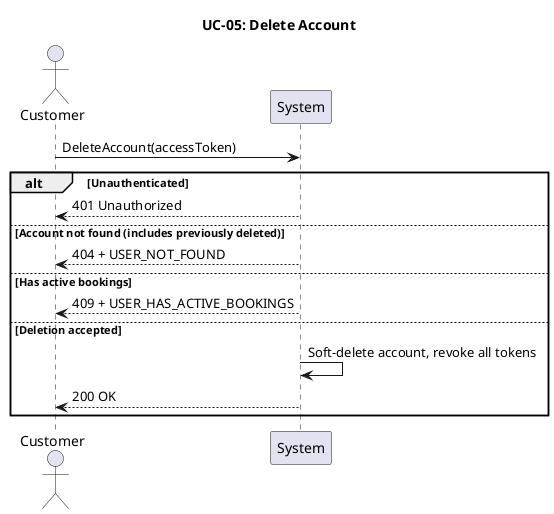
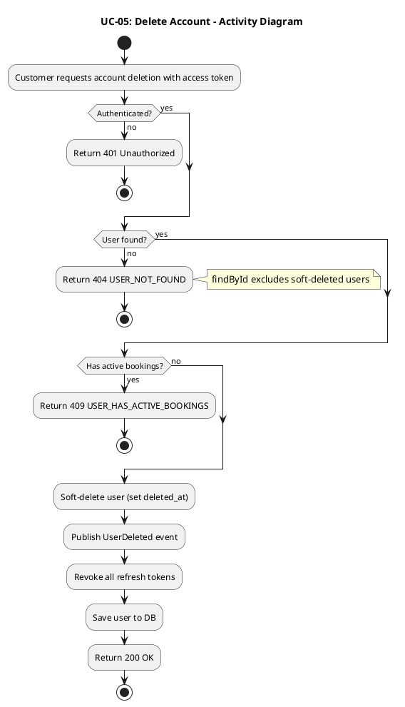
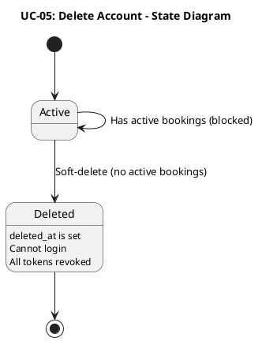
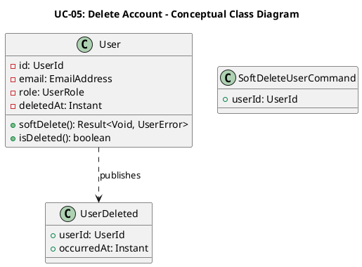
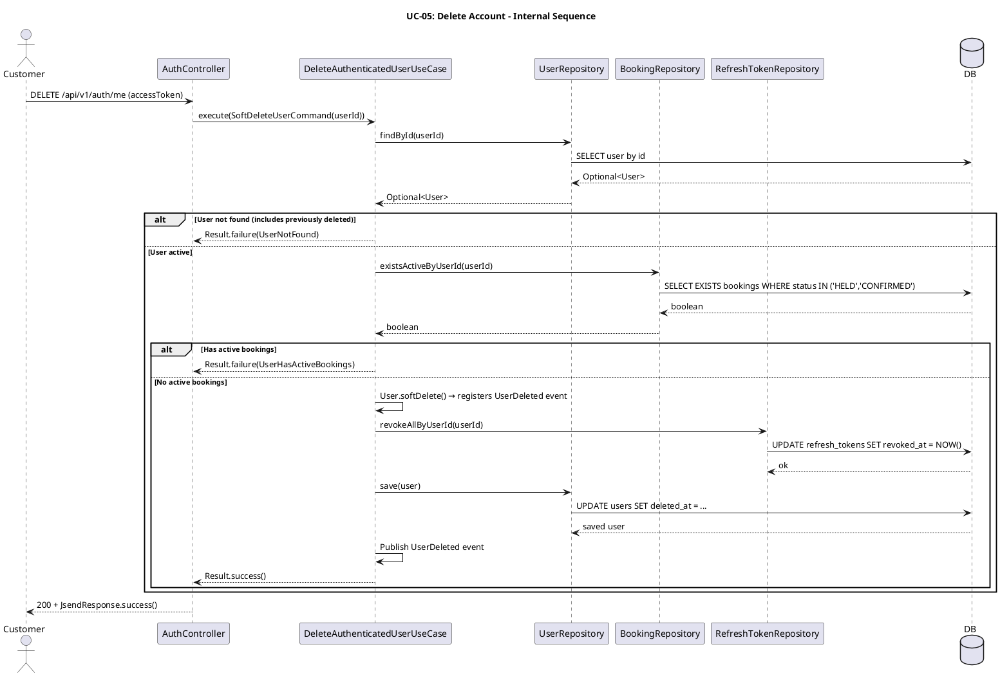

# UC-05: Xóa tài khoản

## 1. Mô tả use case

| Mục                            | Nội dung                                                                                                                                                                                                                                                                                                                                                                                                          |
| ------------------------------ | ----------------------------------------------------------------------------------------------------------------------------------------------------------------------------------------------------------------------------------------------------------------------------------------------------------------------------------------------------------------------------------------------------------------- |
| Phụ thuộc                      | UC-02: Đăng nhập                                                                                                                                                                                                                                                                                                                                                                                                  |
| Mục đích                       | Khách hàng muốn xóa tài khoản cá nhân khỏi hệ thống. PM kiểm tra không còn đặt vé đang hoạt động, thực hiện xóa mềm (đánh dấu `deleted_at`), thu hồi toàn bộ refresh token và phát sự kiện miền `UserDeleted` để các phân hệ khác có thể phản ứng nếu cần.                                                                                                                                                        |
| Mô tả                          | Khách hàng yêu cầu xóa tài khoản cá nhân. Hệ thống thực hiện xóa mềm (soft delete) nếu không còn đặt vé đang hoạt động.                                                                                                                                                                                                                                                                                           |
| Actor chính                    | Khách hàng đã đăng nhập                                                                                                                                                                                                                                                                                                                                                                                           |
| Actor liên quan                | Không                                                                                                                                                                                                                                                                                                                                                                                                             |
| Tiền điều kiện                 | Khách hàng đã đăng nhập và có access token hợp lệ.                                                                                                                                                                                                                                                                                                                                                                |
| Dãy lệnh thực hiện bình thường | 1. Khách hàng gửi yêu cầu xóa tài khoản kèm access token.   2. Hệ thống xác thực token và xác định người dùng.   3. Hệ thống kiểm tra không còn đặt vé đang hoạt động (trạng thái `HELD` hoặc `CONFIRMED`).   4. Hệ thống xóa mềm tài khoản (đánh dấu `deleted_at`), phát sự kiện miền `UserDeleted`.   5. Hệ thống thu hồi toàn bộ refresh token của người dùng.   6. Hệ thống trả về thành công. |
| Hậu điều kiện (thành công)     | Tài khoản bị đánh dấu xóa mềm, không thể đăng nhập hoặc sử dụng hệ thống. Tất cả refresh token bị thu hồi. Sự kiện `UserDeleted` đã được phát.                                                                                                                                                                                                                                                                    |
| Hậu điều kiện (thất bại)       | Tài khoản không bị thay đổi. Không có token nào bị thu hồi. Không có sự kiện nào được phát.                                                                                                                                                                                                                                                                                                                       |
| Xử lý ngoại lệ                 | Chưa xác thực (thiếu hoặc sai access token) → Hệ thống trả về lỗi 401.   Tài khoản không tìm thấy (bao gồm tài khoản đã bị xóa mềm trước đó, vì `findById` chỉ truy vấn tài khoản đang hoạt động) → Hệ thống trả về lỗi `USER_NOT_FOUND`.   Còn đặt vé đang hoạt động (HELD hoặc CONFIRMED) → Hệ thống trả về lỗi `USER_HAS_ACTIVE_BOOKINGS`.                                                               |

## 2. Lược đồ tuần tự

## 3. Lược đồ hoạt động

## 4. Lược đồ trạng thái

## 5. Lược đồ lớp ý niệm

## 6. Phân rã thành phần PM

### 6.1 Controller: `AuthController`

-  **Nhiệm vụ**: Nhận yêu cầu xóa tài khoản, trích xuất `userId` từ token xác
  thực và ủy thác cho use case.
-  **Endpoint**: `DELETE /api/v1/auth/me`
-  **Input**: access token (trong header `Authorization: Bearer ...`)
-  **Output thành công**: `200 OK` + `JsendResponse.success()`
-  **Output lỗi**: `401/404/409` + `JsendResponse` — `{ errorCode, message }`

### 6.2 UseCase: `DeleteAuthenticatedUserUseCase`

-  **Nhiệm vụ**: Tìm người dùng (chỉ tài khoản đang hoạt động), kiểm tra không có
  đặt vé đang hoạt động (cross-BC access), thực hiện xóa mềm, thu hồi token và
  phát sự kiện miền.
-  **Input**: `SoftDeleteUserCommand` — `{ userId: UserId }`
-  **Output**: `Result<Void, UserError>`
-  **Gọi đến**:
    -  `UserRepository.findById(userId)` — tìm tài khoản
    -  `BookingRepository.existsActiveByUserId(userId)` — kiểm tra đặt vé đang
      hoạt động _(cross-bounded context)_
    -  `User.softDelete()` — đánh dấu xóa mềm, phát `UserDeleted` event
    -  `RefreshTokenRepository.revokeAllByUserId(userId)` — thu hồi toàn bộ token
    -  `UserRepository.save(user)` — lưu trạng thái mới
-  **Phát sinh sự kiện**: `UserDeleted(userId, occurredAt)`

### 6.3 Repository: `UserRepository`

-  **Nhiệm vụ**: Truy xuất và lưu trữ domain entity `User`.
-  **Phương thức liên quan đến UC**:
    -  `findById(userId): Optional<User>` — tìm tài khoản đang hoạt động
    -  `save(user): User` — lưu entity sau khi xóa mềm
-  **Table**: `users`

### 6.4 Repository: `BookingRepository`

-  **Nhiệm vụ**: Kiểm tra sự tồn tại của đặt vé đang hoạt động thuộc về người
  dùng.
-  **Phương thức liên quan đến UC**:
    -  `existsActiveByUserId(userId): boolean` — trả về `true` nếu còn booking ở
      trạng thái `HELD` hoặc `CONFIRMED`
-  **Table**: `bookings`

### 6.5 Repository: `RefreshTokenRepository`

-  **Nhiệm vụ**: Thu hồi toàn bộ refresh token của người dùng khi xóa tài khoản.
-  **Phương thức liên quan đến UC**:
    -  `revokeAllByUserId(userId): void` — đánh dấu `revoked_at` cho tất cả token
-  **Table**: `refresh_tokens`

### 6.6 Lược đồ tuần tự nội bộ PM

## 7. Bảng tham chiếu dò vết

| Use Case | Controller     | Endpoint                 | UseCase                        | Repository                                                                                                                              | Table                                 |
| -------- | -------------- | ------------------------ | ------------------------------ | --------------------------------------------------------------------------------------------------------------------------------------- | ------------------------------------- |
| UC-05    | AuthController | `DELETE /api/v1/auth/me` | DeleteAuthenticatedUserUseCase | `UserRepository.findById()`, `save()`   `BookingRepository.existsActiveByUserId()`   `RefreshTokenRepository.revokeAllByUserId()` | `users`, `bookings`, `refresh_tokens` |

## 8. Tiêu chí kiểm thử

| Tiêu chí             | Phép thử                                                                   | Kết quả mong đợi                          | Ghi chú                              |
| -------------------- | -------------------------------------------------------------------------- | ----------------------------------------- | ------------------------------------ |
| Toàn diện (coverage) | Đối chiếu Activity Diagram ↔ Sequence Diagram: mọi luồng đều được thể hiện | Không bỏ sót luồng chính lẫn ngoại lệ     | Rà soát chéo giữa mục 2 và mục 3     |
| Nhất quán            | Rà soát tên lớp, trạng thái, API giữa các lược đồ trong cùng UC            | Không mâu thuẫn giữa các mục 2–6          | Đặc biệt kiểm tra tên trong mục 5–6  |
| Truy vết             | Đối chiếu bảng tham chiếu (mục 7) với lược đồ tuần tự nội bộ (mục 6.5)     | Mọi tương tác trong sequence đều có entry | Kiểm tra không thiếu endpoint/method |
