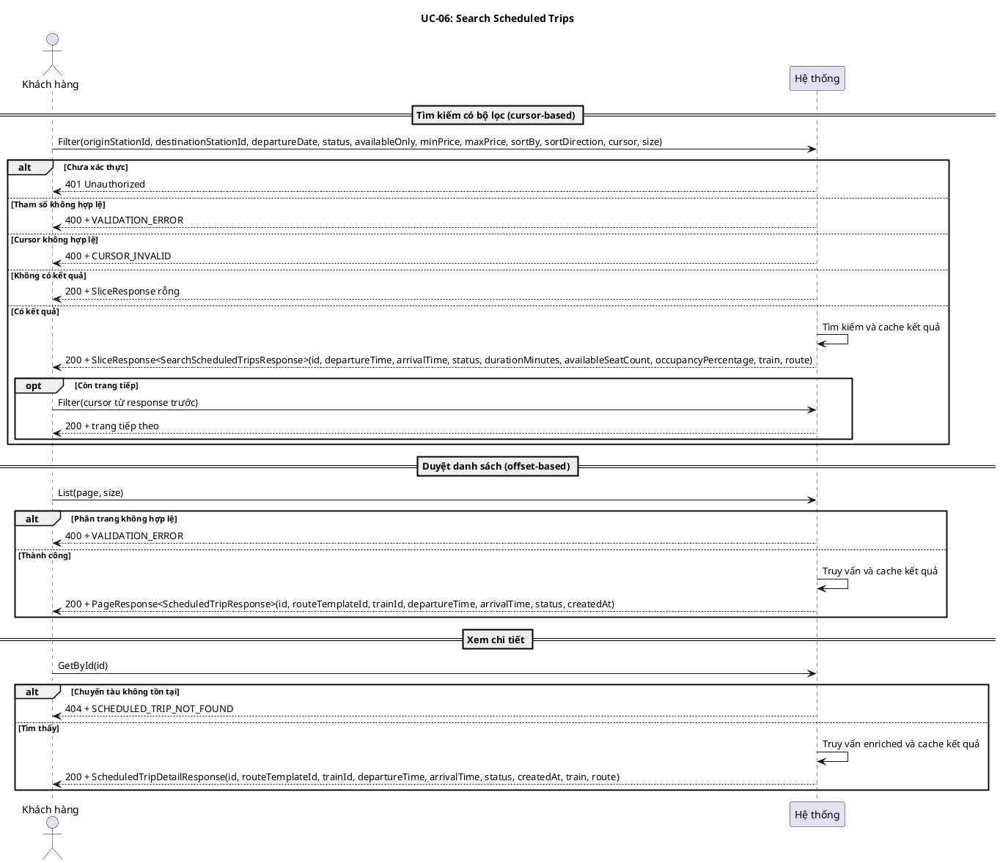
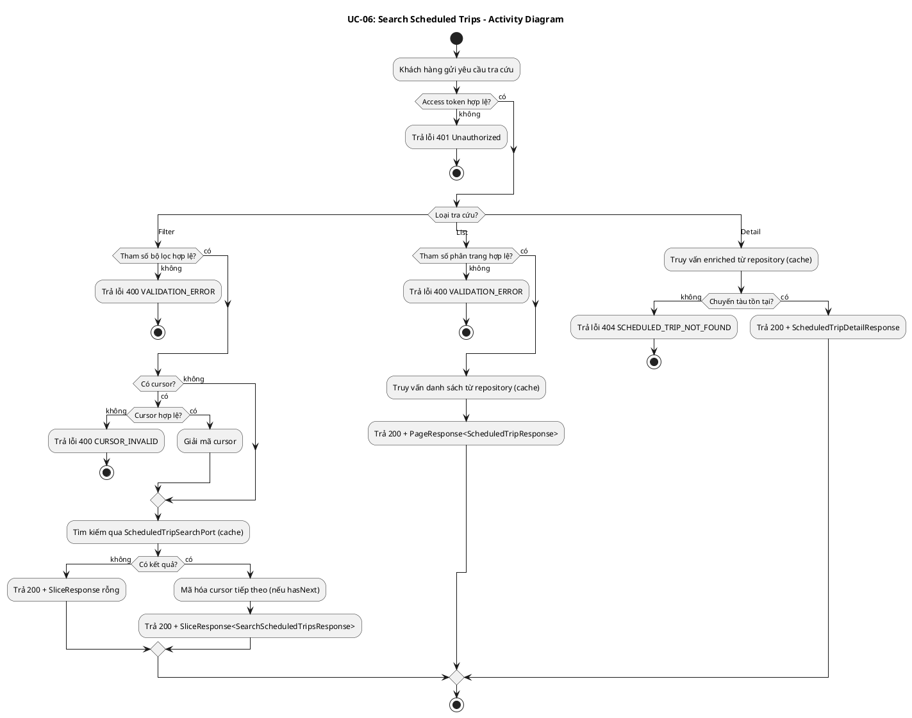
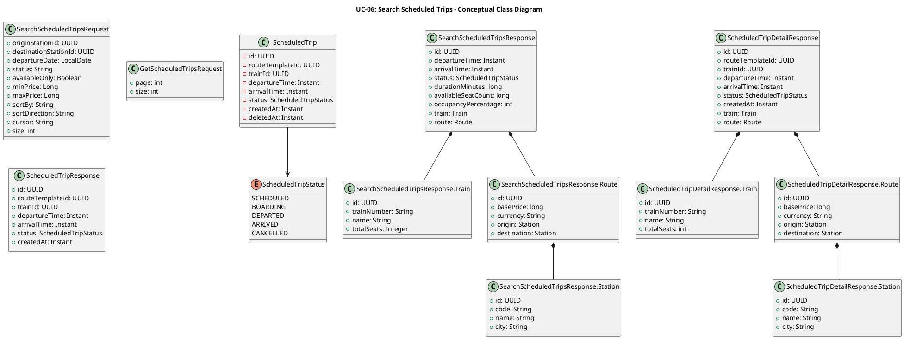
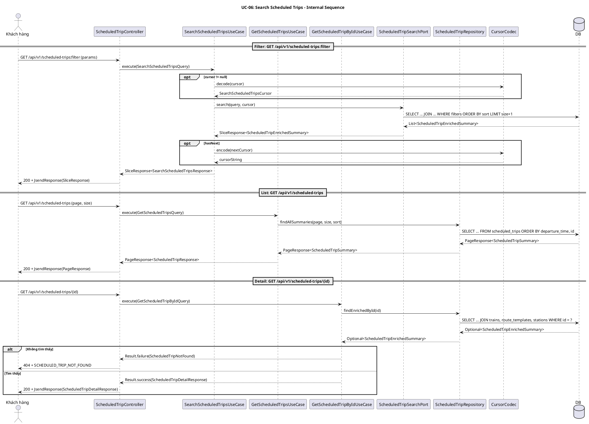
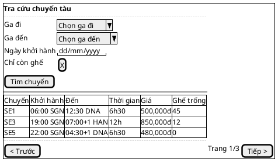

# UC-06: Tra cứu chuyến tàu

# Mô tả use case

| Mục                            | Nội dung                                                                                                                                                                                                                                                                                                                                                                                                                                                                                                                                                                                                                                                                                                                                                                                                                                                                                                                                                                                                                                                                                                                                       |
| ------------------------------ | ---------------------------------------------------------------------------------------------------------------------------------------------------------------------------------------------------------------------------------------------------------------------------------------------------------------------------------------------------------------------------------------------------------------------------------------------------------------------------------------------------------------------------------------------------------------------------------------------------------------------------------------------------------------------------------------------------------------------------------------------------------------------------------------------------------------------------------------------------------------------------------------------------------------------------------------------------------------------------------------------------------------------------------------------------------------------------------------------------------------------------------------------- |
| Phụ thuộc                      | UC-02: Đăng nhập, UC-05: Tra cứu ga tàu                                                                                                                                                                                                                                                                                                                                                                                                                                                                                                                                                                                                                                                                                                                                                                                                                                                                                                                                                                                                                                                                                                        |
| Mục đích                       | Khách hàng đã đăng nhập muốn tìm chuyến tàu phù hợp để đặt vé. PM cung cấp ba cách tra cứu: tìm kiếm có bộ lọc (cursor-based), duyệt danh sách phân trang (offset-based) và xem chi tiết một chuyến tàu cụ thể, giúp khách hàng đánh giá chuyến tàu trước khi chuyển sang đặt vé.                                                                                                                                                                                                                                                                                                                                                                                                                                                                                                                                                                                                                                                                                                                                                                                                                                                              |
| Mô tả                          | Khách hàng tra cứu chuyến tàu theo nhiều bộ lọc, duyệt danh sách phân trang, hoặc xem chi tiết một chuyến tàu cụ thể. Kết quả tìm kiếm bao gồm thông tin tàu, tuyến đường, giá vé và số ghế trống.                                                                                                                                                                                                                                                                                                                                                                                                                                                                                                                                                                                                                                                                                                                                                                                                                                                                                                                                             |
| Actor chính                    | Khách hàng đã đăng nhập                                                                                                                                                                                                                                                                                                                                                                                                                                                                                                                                                                                                                                                                                                                                                                                                                                                                                                                                                                                                                                                                                                                        |
| Actor liên quan                | Không                                                                                                                                                                                                                                                                                                                                                                                                                                                                                                                                                                                                                                                                                                                                                                                                                                                                                                                                                                                                                                                                                                                                          |
| Tiền điều kiện                 | Khách hàng đã đăng nhập và có access token hợp lệ.                                                                                                                                                                                                                                                                                                                                                                                                                                                                                                                                                                                                                                                                                                                                                                                                                                                                                                                                                                                                                                                                                             |
| Dãy lệnh thực hiện bình thường | **Tìm kiếm có bộ lọc (cursor-based):**   1. Khách hàng gửi yêu cầu tìm kiếm chuyến tàu với các bộ lọc tùy chọn: ga đi (`originStationId`), ga đến (`destinationStationId`), ngày khởi hành (`departureDate`), trạng thái (`status`), chỉ chuyến còn ghế (`availableOnly`), khoảng giá (`minPrice`, `maxPrice`).   2. Khách hàng có thể chọn sắp xếp theo: thời gian khởi hành (`DEPARTURE_TIME`), giá (`PRICE`), thời lượng (`DURATION`), hoặc số ghế trống (`AVAILABLE_SEATS`); hướng sắp xếp `ASC` hoặc `DESC`.   3. Hệ thống trả về kết quả phân trang dạng cursor (kết quả được cache).   4. Khách hàng có thể gửi `cursor` để lấy trang tiếp theo.    **Duyệt danh sách (offset-based):**   1. Khách hàng gửi yêu cầu xem danh sách chuyến tàu với tham số phân trang (`page`, `size`).   2. Hệ thống trả về danh sách chuyến tàu phân trang, sắp xếp theo `departureTime` tăng dần (kết quả được cache).    **Xem chi tiết:**   1. Khách hàng gửi yêu cầu xem chi tiết chuyến tàu theo `id`.   2. Hệ thống trả về thông tin chi tiết chuyến tàu bao gồm tàu, tuyến đường và ga (kết quả được cache). |
| Hậu điều kiện (thành công)     | Không có thay đổi trạng thái. Đây là thao tác chỉ đọc.                                                                                                                                                                                                                                                                                                                                                                                                                                                                                                                                                                                                                                                                                                                                                                                                                                                                                                                                                                                                                                                                                         |
| Hậu điều kiện (thất bại)       | Không có thay đổi trạng thái. Dữ liệu trong hệ thống không bị ảnh hưởng.                                                                                                                                                                                                                                                                                                                                                                                                                                                                                                                                                                                                                                                                                                                                                                                                                                                                                                                                                                                                                                                                       |
| Xử lý ngoại lệ                 | Chưa xác thực (thiếu hoặc sai access token) → Hệ thống trả về lỗi 401.   Tìm kiếm không có kết quả → Hệ thống trả về danh sách rỗng.   Chuyến tàu không tồn tại (xem chi tiết) → Hệ thống trả về lỗi `SCHEDULED_TRIP_NOT_FOUND`.   Cursor không hợp lệ (sai định dạng) → Hệ thống trả về lỗi `CURSOR_INVALID`.   Tham số không hợp lệ (phân trang, bộ lọc, giá trị sắp xếp) → Hệ thống trả về lỗi `VALIDATION_ERROR`.                                                                                                                                                                                                                                                                                                                                                                                                                                                                                                                                                                                                                                                                                                              |

# Lược đồ tuần tự

# Lược đồ hoạt động

# Lược đồ lớp ý niệm

# Phân rã thành phần PM

## Controller: `ScheduledTripController`

- **Nhiệm vụ**: Nhận HTTP request từ khách hàng, xác thực đầu vào, ủy thác cho
  UseCase tương ứng.

**Endpoint 1 — Tìm kiếm có bộ lọc:**

- **Endpoint**: `GET /api/v1/scheduled-trips:filter`
- **Input**: `SearchScheduledTripsRequest` —
  `{ originStationId?, destinationStationId?, departureDate?, status?, availableOnly?, minPrice?, maxPrice?, sortBy?, sortDirection?, cursor?, size }`
- **Output thành công**: `200` + `SliceResponse<SearchScheduledTripsResponse>`
- **Output lỗi**: `400` + `JsendResponse` —
  `{ errorCode: VALIDATION_ERROR | CURSOR_INVALID, message }`

**Endpoint 2 — Duyệt danh sách:**

- **Endpoint**: `GET /api/v1/scheduled-trips`
- **Input**: `GetScheduledTripsRequest` — `{ page, size }`
- **Output thành công**: `200` + `PageResponse<ScheduledTripResponse>`
- **Output lỗi**: `400` + `JsendResponse` —
  `{ errorCode: VALIDATION_ERROR, message }`

**Endpoint 3 — Xem chi tiết:**

- **Endpoint**: `GET /api/v1/scheduled-trips/{id}`
- **Input**: `id` (UUID path variable)
- **Output thành công**: `200` + `ScheduledTripDetailResponse`
- **Output lỗi**: `404` + `JsendResponse` —
  `{ errorCode: SCHEDULED_TRIP_NOT_FOUND, message }`

## UseCase

**SearchScheduledTripsUseCase:**

- **Nhiệm vụ**: Tìm kiếm chuyến tàu với bộ lọc, phân trang cursor-based, cache
  kết quả.
- **Input**: `SearchScheduledTripsQuery` —
  `{ originStationId?, destinationStationId?, departureDate?, status?, availableOnly, minPrice?, maxPrice?, sortBy, sortDirection, cursor?, size }`
- **Output**: `SliceResponse<SearchScheduledTripsResponse>`
- **Gọi đến**:
    - `ScheduledTripSearchPort.search(query, cursor)` — tìm kiếm JDBC với bộ lọc
    - `CursorCodec.decode/encode()` — giải mã/mã hóa cursor
- **Cache**: `scheduledTripFilter`, key = `st-filter:{cacheKey}`

**GetScheduledTripsUseCase:**

- **Nhiệm vụ**: Truy vấn danh sách chuyến tàu phân trang offset-based, cache kết
  quả.
- **Input**: `GetScheduledTripsQuery` — `{ page, size }`
- **Output**: `PageResponse<ScheduledTripResponse>`
- **Gọi đến**:
    - `ScheduledTripRepository.findAllSummaries(page, size, sort)` — truy vấn
      danh sách
- **Cache**: `scheduledTripList`, key = `st-list:{page}:{size}`

**GetScheduledTripByIdUseCase:**

- **Nhiệm vụ**: Truy vấn chi tiết chuyến tàu theo ID, cache kết quả.
- **Input**: `GetScheduledTripByIdQuery` — `{ scheduledTripId }`
- **Output**: `Result<ScheduledTripDetailResponse, ScheduledTripError>`
- **Gọi đến**:
    - `ScheduledTripRepository.findEnrichedById(id)` — truy vấn enriched summary
- **Cache**: `scheduledTripById`, key = `st:{scheduledTripId}`, trừ khi failure

## Repository: `ScheduledTripRepository`

- **Nhiệm vụ**: Truy xuất domain entity `ScheduledTrip` và các projection
  summary.
- **Phương thức liên quan đến UC**:
    - `findAllSummaries(page, size, sort): PageResponse<ScheduledTripSummary>` —
      danh sách chuyến tàu phân trang
    - `findEnrichedById(id): Optional<ScheduledTripEnrichedSummary>` — chi tiết
      chuyến tàu kèm thông tin tàu, tuyến đường, ga

## Port: `ScheduledTripSearchPort`

- **Lớp**: Application layer (port interface), implemented bởi
  `ScheduledTripSearchReader` (infrastructure, JDBC).
- **Nhiệm vụ**: Tìm kiếm chuyến tàu với bộ lọc phức tạp, hỗ trợ cursor-based
  pagination và sắp xếp đa trường.
- **Phương thức liên quan đến UC**:
    - `search(query, cursor): SliceResponse<ScheduledTripEnrichedSummary>` — tìm
      kiếm JDBC với các bộ lọc (ga đi/đến, ngày, trạng thái, giá, ghế trống) và
      cursor

## Lược đồ tuần tự nội bộ PM

## Giao diện

### Giao diện mẫu

### Giao diện ứng dụng

Chưa hiện thực. Sẽ bổ sung ảnh chụp màn hình khi hoàn thành.

# Bảng tham chiếu dò vết

| Use Case | Controller              | Endpoint                             | UseCase                     | Repository / Port                          | Table                                              |
| -------- | ----------------------- | ------------------------------------ | --------------------------- | ------------------------------------------ | -------------------------------------------------- |
| UC-06    | ScheduledTripController | `GET /api/v1/scheduled-trips:filter` | SearchScheduledTripsUseCase | ScheduledTripSearchPort.search()           | scheduled_trips, route_templates, trains, stations |
|          | ScheduledTripController | `GET /api/v1/scheduled-trips`        | GetScheduledTripsUseCase    | ScheduledTripRepository.findAllSummaries() | scheduled_trips                                    |
|          | ScheduledTripController | `GET /api/v1/scheduled-trips/{id}`   | GetScheduledTripByIdUseCase | ScheduledTripRepository.findEnrichedById() | scheduled_trips, route_templates, trains, stations |

# Tiêu chí kiểm thử

| Tiêu chí              | Phép thử                                                                   | Kết quả mong đợi                                                  | Ghi chú                                              |
| --------------------- | -------------------------------------------------------------------------- | ----------------------------------------------------------------- | ---------------------------------------------------- |
| Toàn diện (coverage)  | Đối chiếu Activity Diagram ↔ Sequence Diagram: mọi luồng đều được thể hiện | Không bỏ sót luồng chính lẫn ngoại lệ                             | Rà soát chéo giữa mục 2 và mục 3                     |
| Nhất quán             | Rà soát tên lớp, trạng thái, API giữa các lược đồ trong cùng UC            | Không mâu thuẫn giữa các mục 2–6                                  | Đặc biệt kiểm tra tên DTO trong mục 5–6              |
| Truy vết              | Đối chiếu bảng tham chiếu (mục 7) với lược đồ tuần tự nội bộ (mục 6.5)     | Mọi tương tác trong sequence đều có entry                         | Kiểm tra không thiếu endpoint/method                 |
| Filter — happy path   | Gửi request filter với bộ lọc hợp lệ (origin, destination, date)           | 200 + SliceResponse chứa kết quả, nextCursor nếu hasNext          | Kiểm tra cache hit lần gọi thứ 2                     |
| Filter — empty        | Gửi request filter với bộ lọc không khớp chuyến nào                        | 200 + SliceResponse rỗng (content=[], hasNext=false)              | Không lỗi, message = "No scheduled trips matched..." |
| Filter — bad cursor   | Gửi request filter với cursor sai định dạng                                | 400 + CURSOR_INVALID                                              |                                                      |
| Filter — bad params   | Gửi request filter với sortBy không hợp lệ hoặc minPrice < 0               | 400 + VALIDATION_ERROR                                            |                                                      |
| List — happy path     | Gửi request list với page=0, size=20                                       | 200 + PageResponse chứa danh sách, sắp xếp theo departureTime ASC | Kiểm tra cache hit                                   |
| List — bad pagination | Gửi request list với size=0 hoặc size > 100                                | 400 + VALIDATION_ERROR                                            |                                                      |
| Detail — found        | Gửi request detail với id chuyến tàu tồn tại                               | 200 + ScheduledTripDetailResponse kèm train, route, stations      | Kiểm tra cache hit (trừ khi failure)                 |
| Detail — not found    | Gửi request detail với id không tồn tại                                    | 404 + SCHEDULED_TRIP_NOT_FOUND                                    | Kết quả failure không được cache                     |
| Unauthenticated       | Gửi bất kỳ request nào không có access token                               | 401 Unauthorized                                                  | Xử lý bởi Spring Security filter chain               |
