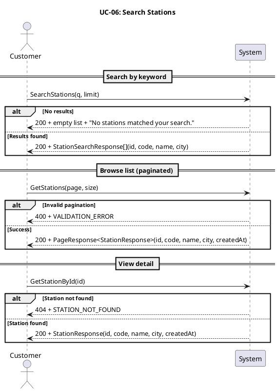
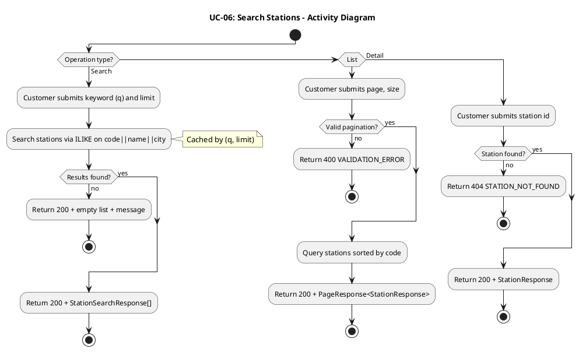
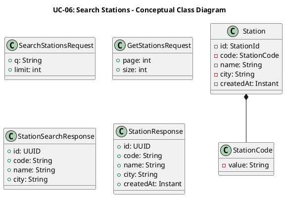
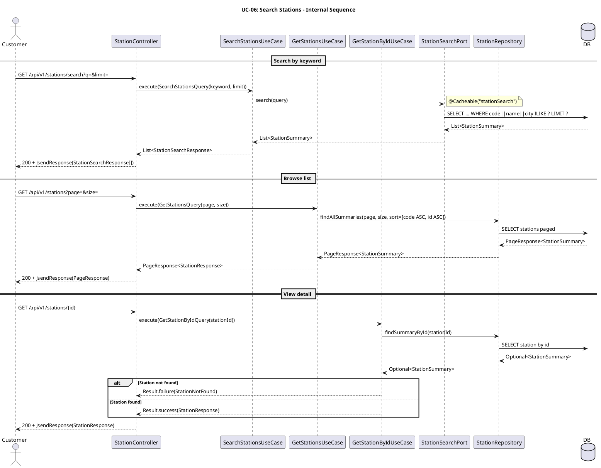
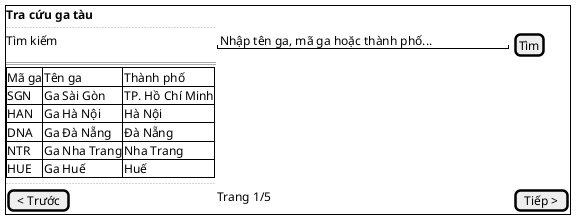

## UC-06: Tra cứu ga tàu

### 1. Mô tả use case

| Mục                            | Nội dung                                                                                                                                                                                                                                                                                                                                                                                                                                                                                                                                                                                                                                                       |
| ------------------------------ | -------------------------------------------------------------------------------------------------------------------------------------------------------------------------------------------------------------------------------------------------------------------------------------------------------------------------------------------------------------------------------------------------------------------------------------------------------------------------------------------------------------------------------------------------------------------------------------------------------------------------------------------------------------- |
| Phụ thuộc                      | UC-02: Đăng nhập                                                                                                                                                                                                                                                                                                                                                                                                                                                                                                                                                                                                                                               |
| Mục đích                       | Khách hàng cần tra cứu thông tin ga tàu để phục vụ các bước tiếp theo như chọn tuyến, xem lịch chuyến hoặc đặt vé. PM cung cấp ba cách tra cứu: tìm kiếm theo từ khóa (auto-complete, có cache), duyệt danh sách phân trang và xem chi tiết một ga cụ thể.                                                                                                                                                                                                                                                                                                                                                                                                     |
| Mô tả                          | Khách hàng tra cứu thông tin ga tàu bằng nhiều cách: tìm kiếm theo từ khóa, duyệt danh sách phân trang, hoặc xem chi tiết một ga cụ thể.                                                                                                                                                                                                                                                                                                                                                                                                                                                                                                                       |
| Actor chính                    | Khách hàng đã đăng nhập                                                                                                                                                                                                                                                                                                                                                                                                                                                                                                                                                                                                                                        |
| Actor liên quan                | Không                                                                                                                                                                                                                                                                                                                                                                                                                                                                                                                                                                                                                                                          |
| Tiền điều kiện                 | Khách hàng đã đăng nhập và có access token hợp lệ.                                                                                                                                                                                                                                                                                                                                                                                                                                                                                                                                                                                                             |
| Dãy lệnh thực hiện bình thường | **Tìm kiếm theo từ khóa:**   1. Khách hàng gửi từ khóa tìm kiếm (tên ga, mã ga, hoặc thành phố) kèm giới hạn số kết quả (`limit`, tối đa 20).   2. Hệ thống tra cứu bằng ILIKE trên tổ hợp mã ga, tên ga, thành phố, ưu tiên kết quả khớp prefix.   3. Hệ thống trả về danh sách ga phù hợp (kết quả được cache).    **Duyệt danh sách:**   1. Khách hàng gửi yêu cầu xem danh sách ga với tham số phân trang (`page`, `size`).   2. Hệ thống trả về danh sách ga phân trang, sắp xếp theo mã ga.    **Xem chi tiết:**   1. Khách hàng gửi yêu cầu xem chi tiết một ga theo `id`.   2. Hệ thống trả về thông tin chi tiết ga. |
| Hậu điều kiện (thành công)     | Không có thay đổi trạng thái. Đây là thao tác chỉ đọc.                                                                                                                                                                                                                                                                                                                                                                                                                                                                                                                                                                                                         |
| Hậu điều kiện (thất bại)       | Không có thay đổi trạng thái. Hệ thống trả về lỗi hoặc danh sách rỗng tùy trường hợp.                                                                                                                                                                                                                                                                                                                                                                                                                                                                                                                                                                          |
| Xử lý ngoại lệ                 | Chưa xác thực (thiếu hoặc sai access token) → Hệ thống trả về lỗi 401.   Tìm kiếm không có kết quả → Hệ thống trả về danh sách rỗng kèm thông báo "No stations matched your search.".   Ga không tồn tại (xem chi tiết) → Hệ thống trả về lỗi `STATION_NOT_FOUND`.   Tham số phân trang không hợp lệ → Hệ thống trả về lỗi `VALIDATION_ERROR`.                                                                                                                                                                                                                                                                                                        |

### 2. Lược đồ tuần tự

### 3. Lược đồ hoạt động

### 5. Lược đồ lớp ý niệm

### 6. Phân rã thành phần PM

#### 6.1 Controller: `StationController`

- **Nhiệm vụ**: Nhận yêu cầu tra cứu ga tàu qua ba endpoint và ủy thác cho use
  case tương ứng.
- **Endpoint tìm kiếm**: `GET /api/v1/stations/search`
    - Input: `SearchStationsRequest` —
      `{ q: String, limit: int (1–20, default 10) }`
    - Output thành công: `200 OK` + `StationSearchResponse[]`
    - Output rỗng: `200 OK` + `[]` + message "No stations matched your search."
- **Endpoint danh sách**: `GET /api/v1/stations`
    - Input: `GetStationsRequest` —
      `{ page: int (≥0), size: int (1–100, default 20) }`
    - Output thành công: `200 OK` + `PageResponse<StationResponse>`
    - Output lỗi: `400` + `JsendResponse`
- **Endpoint chi tiết**: `GET /api/v1/stations/{id}`
    - Input: `id` (UUID path variable)
    - Output thành công: `200 OK` + `StationResponse`
    - Output lỗi: `404` + `JsendResponse`

#### 6.2 UseCase: `SearchStationsUseCase` (tìm kiếm)

- **Nhiệm vụ**: Tra cứu ga tàu theo từ khóa thông qua port tìm kiếm chuyên dụng.
  Kết quả được cache.
- **Input**: `SearchStationsQuery` — `{ keyword: String, limit: int }`
- **Output**: `List<StationSearchResponse>`
- **Gọi đến**:
    - `StationSearchPort.search(query)` — tra cứu ILIKE trên tổ hợp code, name,
      city
- **Cache**:
  `@Cacheable(cacheNames = "stationSearch", key = "'station-search:' + #query.cacheKey()")`
- **Phát sinh sự kiện**: Không

#### 6.3 UseCase: `GetStationsUseCase` (danh sách)

- **Nhiệm vụ**: Trả về danh sách ga phân trang, sắp xếp theo mã ga rồi theo id.
- **Input**: `GetStationsQuery` — `{ page: int, size: int }`
- **Output**: `PageResponse<StationResponse>`
- **Gọi đến**:
    - `StationRepository.findAllSummaries(page, size, sort)` — truy vấn phân
      trang
- **Phát sinh sự kiện**: Không

#### 6.4 UseCase: `GetStationByIdUseCase` (chi tiết)

- **Nhiệm vụ**: Trả về chi tiết một ga theo ID.
- **Input**: `GetStationByIdQuery` — `{ stationId: UUID }`
- **Output**: `Result<StationResponse, StationError>`
- **Gọi đến**:
    - `StationRepository.findSummaryById(stationId)` — truy vấn projection chi
      tiết
- **Phát sinh sự kiện**: Không

#### 6.5 Repository: `StationRepository`

- **Nhiệm vụ**: Truy xuất dữ liệu ga tàu từ cơ sở dữ liệu.
- **Phương thức liên quan đến UC**:
    - `findAllSummaries(page, size, sort): PageResponse<StationSummary>` — phân
      trang danh sách ga
    - `findSummaryById(stationId): Optional<StationSummary>` — chi tiết một ga
- **Table**: `stations`

#### 6.6 Port: `StationSearchPort`

- **Nhiệm vụ**: Định nghĩa hợp đồng tìm kiếm ga tàu ở tầng application. Cài đặt
  nằm trong tầng infrastructure, sử dụng JDBC trực tiếp với ILIKE trên tổ hợp
  `code || name || city`, ưu tiên kết quả khớp prefix.
- **Phương thức liên quan đến UC**:
    - `search(query): List<StationSummary>` — trả về danh sách ga phù hợp từ
      khóa
- **Implementation**: `StationSearchReader` (JDBC `NamedParameterJdbcTemplate`)

#### 6.7 Lược đồ tuần tự nội bộ PM

#### 6.8 Giao diện

##### 6.8.1 Giao diện mẫu

##### 6.8.2 Giao diện ứng dụng

Chưa hiện thực. Sẽ bổ sung ảnh chụp màn hình khi hoàn thành.

### 7. Bảng tham chiếu dò vết

| Use Case | Controller        | Endpoint                      | UseCase               | Repository / Port                      | Table      |
| -------- | ----------------- | ----------------------------- | --------------------- | -------------------------------------- | ---------- |
| UC-06    | StationController | `GET /api/v1/stations/search` | SearchStationsUseCase | `StationSearchPort.search()`           | `stations` |
| UC-06    | StationController | `GET /api/v1/stations`        | GetStationsUseCase    | `StationRepository.findAllSummaries()` | `stations` |
| UC-06    | StationController | `GET /api/v1/stations/{id}`   | GetStationByIdUseCase | `StationRepository.findSummaryById()`  | `stations` |

### 8. Tiêu chí kiểm thử

| Tiêu chí             | Phép thử                                                                   | Kết quả mong đợi                          | Ghi chú                              |
| -------------------- | -------------------------------------------------------------------------- | ----------------------------------------- | ------------------------------------ |
| Toàn diện (coverage) | Đối chiếu Activity Diagram ↔ Sequence Diagram: mọi luồng đều được thể hiện | Không bỏ sót luồng chính lẫn ngoại lệ     | Rà soát chéo giữa mục 2 và mục 3     |
| Nhất quán            | Rà soát tên lớp, trạng thái, API giữa các lược đồ trong cùng UC            | Không mâu thuẫn giữa các mục 2–6          | Đặc biệt kiểm tra tên trong mục 5–6  |
| Truy vết             | Đối chiếu bảng tham chiếu (mục 7) với lược đồ tuần tự nội bộ (mục 6.5)     | Mọi tương tác trong sequence đều có entry | Kiểm tra không thiếu endpoint/method |
