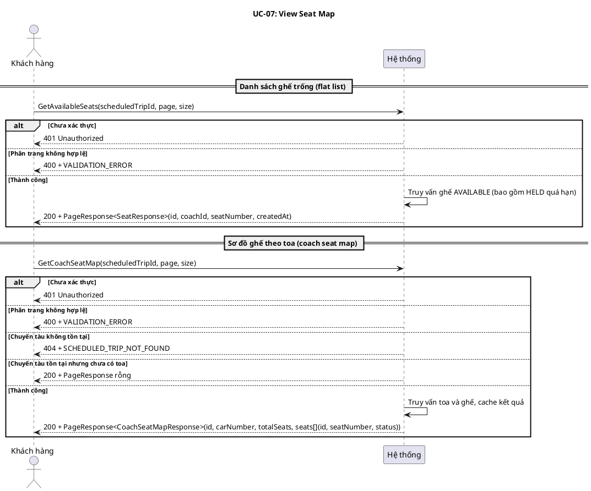
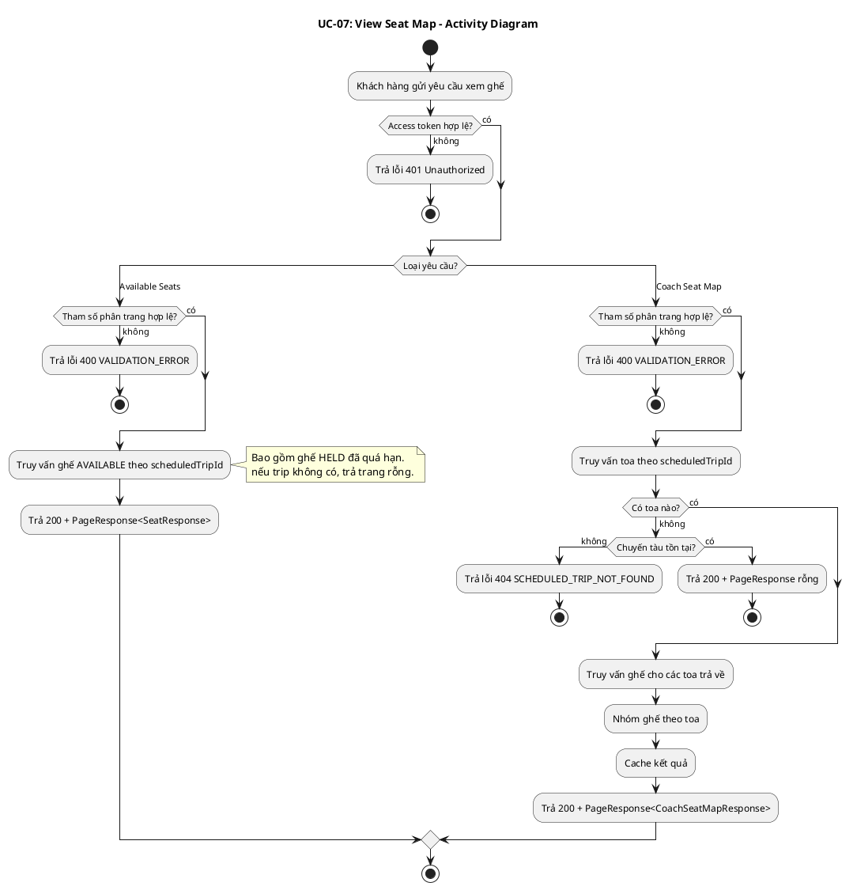
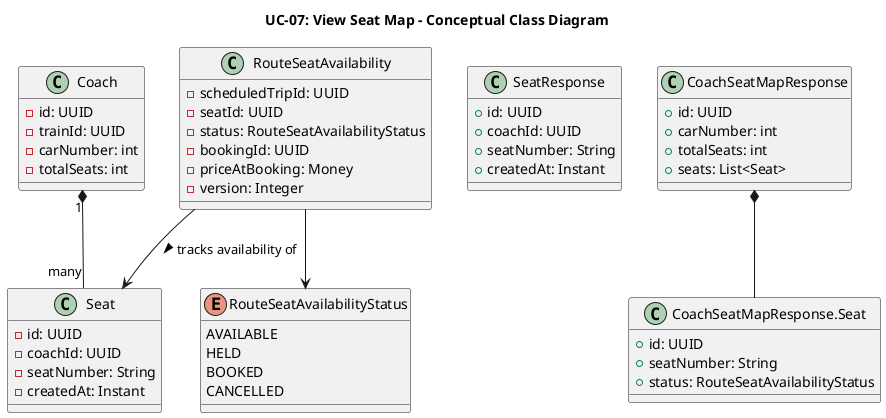
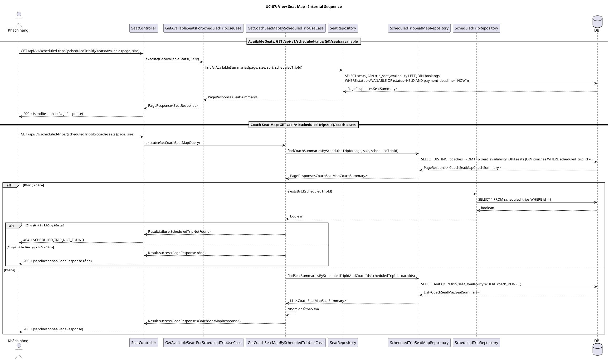
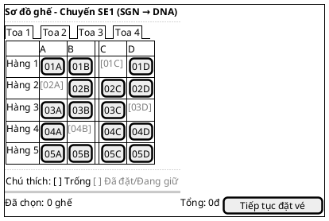

# UC-07: Xem sơ đồ ghế chuyến tàu

# Mô tả use case

| Mục                            | Nội dung                                                                                                                                                                                                                                                                                                                                                                                                                                                                                                                                                                                                                                                                                                                                                                                                                                                |
| ------------------------------ | ------------------------------------------------------------------------------------------------------------------------------------------------------------------------------------------------------------------------------------------------------------------------------------------------------------------------------------------------------------------------------------------------------------------------------------------------------------------------------------------------------------------------------------------------------------------------------------------------------------------------------------------------------------------------------------------------------------------------------------------------------------------------------------------------------------------------------------------------------- |
| Phụ thuộc                      | UC-02: Đăng nhập, UC-06: Tra cứu chuyến tàu                                                                                                                                                                                                                                                                                                                                                                                                                                                                                                                                                                                                                                                                                                                                                                                                             |
| Mục đích                       | Khách hàng đã chọn chuyến tàu từ UC-06 và muốn xem tình trạng ghế trước khi đặt vé. PM cung cấp hai góc nhìn: danh sách ghế trống đơn giản (flat list) để chọn nhanh, và sơ đồ ghế theo toa chi tiết (coach seat map) để biết vị trí và trạng thái từng ghế trong toa.                                                                                                                                                                                                                                                                                                                                                                                                                                                                                                                                                                                  |
| Mô tả                          | Khách hàng xem sơ đồ ghế của một chuyến tàu cụ thể để biết trạng thái từng ghế (trống, đang giữ, đã đặt) trước khi đặt vé. Hỗ trợ hai góc nhìn: danh sách ghế trống đơn giản và sơ đồ ghế theo toa chi tiết.                                                                                                                                                                                                                                                                                                                                                                                                                                                                                                                                                                                                                                            |
| Actor chính                    | Khách hàng đã đăng nhập                                                                                                                                                                                                                                                                                                                                                                                                                                                                                                                                                                                                                                                                                                                                                                                                                                 |
| Actor liên quan                | Không                                                                                                                                                                                                                                                                                                                                                                                                                                                                                                                                                                                                                                                                                                                                                                                                                                                   |
| Tiền điều kiện                 | Khách hàng đã đăng nhập và có access token hợp lệ. Khách hàng đã biết mã chuyến tàu (`scheduledTripId`) từ UC-06.                                                                                                                                                                                                                                                                                                                                                                                                                                                                                                                                                                                                                                                                                                                                       |
| Dãy lệnh thực hiện bình thường | **Xem danh sách ghế trống:**   1. Khách hàng gửi yêu cầu xem ghế trống của chuyến tàu với `scheduledTripId` và tham số phân trang (`page`, `size`).   2. Hệ thống trả về danh sách ghế có trạng thái `AVAILABLE` (bao gồm cả ghế `HELD` đã quá hạn thanh toán), sắp xếp theo số ghế.  **Xem sơ đồ ghế theo toa:**   1. Khách hàng gửi yêu cầu xem sơ đồ ghế theo toa của chuyến tàu với `scheduledTripId` và tham số phân trang (`page`, `size`).   2. Hệ thống trả về danh sách toa phân trang, mỗi toa kèm danh sách ghế với trạng thái hiện tại (`AVAILABLE`, `HELD`, `BOOKED`) (kết quả được cache).   **Lưu ý:** Endpoint này kiểm tra chuyến tàu tồn tại; nếu không tìm thấy, trả lỗi 404. |
| Hậu điều kiện (thành công)     | Không có thay đổi trạng thái. Đây là thao tác chỉ đọc.                                                                                                                                                                                                                                                                                                                                                                                                                                                                                                                                                                                                                                                                                                                                                                                                  |
| Hậu điều kiện (thất bại)       | Không có thay đổi trạng thái. Dữ liệu trong hệ thống không bị ảnh hưởng.                                                                                                                                                                                                                                                                                                                                                                                                                                                                                                                                                                                                                                                                                                                                                                                |
| Xử lý ngoại lệ                 | Chưa xác thực (thiếu hoặc sai access token) → Hệ thống trả về lỗi 401.   Chuyến tàu không tồn tại (sơ đồ ghế theo toa) → Hệ thống trả về lỗi `SCHEDULED_TRIP_NOT_FOUND`.   Chuyến tàu không tồn tại (danh sách ghế trống) → Hệ thống trả về trang rỗng (không kiểm tra tồn tại).   Chuyến tàu tồn tại nhưng chưa có toa → Hệ thống trả về trang rỗng.   Tham số phân trang không hợp lệ → Hệ thống trả về lỗi `VALIDATION_ERROR`.                                                                                                                                                                                                                                                                                                                                                                                                           |

# Lược đồ tuần tự

# Lược đồ hoạt động

# Lược đồ lớp ý niệm

# Phân rã thành phần PM

## Controller: `SeatController`

- **Nhiệm vụ**: Nhận HTTP request từ khách hàng, xác thực đầu vào, ủy thác cho
  UseCase tương ứng.

**Endpoint 1 — Danh sách ghế trống:**

- **Endpoint**: `GET /api/v1/scheduled-trips/{scheduledTripId}/seats/available`
- **Input**: `scheduledTripId` (UUID path variable) + `GetAvailableSeatsRequest`
  — `{ page, size }`
- **Output thành công**: `200` + `PageResponse<SeatResponse>`
- **Output lỗi**: `400` + `JsendResponse` —
  `{ errorCode: VALIDATION_ERROR, message }`
- **Ghi chú metadata**: Controller annotation hiện còn khai báo `404` cho
  endpoint này, nhưng runtime code hiện chỉ trả `200` hoặc lỗi validation.

**Endpoint 2 — Sơ đồ ghế theo toa:**

- **Endpoint**: `GET /api/v1/scheduled-trips/{scheduledTripId}/coach-seats`
- **Input**: `scheduledTripId` (UUID path variable) + `GetCoachSeatMapRequest` —
  `{ page, size }`
- **Output thành công**: `200` + `PageResponse<CoachSeatMapResponse>`
- **Output lỗi**: `404` + `JsendResponse` —
  `{ errorCode: SCHEDULED_TRIP_NOT_FOUND, message }` hoặc `400` +
  `VALIDATION_ERROR`
- **Ghi chú metadata**: Runtime trả `PageResponse<CoachSeatMapResponse>`, nhưng
  `@SuccessPayload` hiện dùng mặc định object metadata thay vì page metadata.

## UseCase

**GetAvailableSeatsForScheduledTripUseCase:**

- **Nhiệm vụ**: Truy vấn danh sách ghế trống cho chuyến tàu, sắp xếp theo số
  ghế.
- **Input**: `GetAvailableSeatsQuery` — `{ page, size, scheduledTripId }`
- **Output**: `PageResponse<SeatResponse>`
- **Gọi đến**:
    - `SeatRepository.findAllAvailableSummaries(page, size, sort, scheduledTripId)`
      — truy vấn ghế AVAILABLE (bao gồm HELD quá hạn)

**GetCoachSeatMapByScheduledTripUseCase:**

- **Nhiệm vụ**: Truy vấn sơ đồ ghế theo toa cho chuyến tàu, cache kết quả.
- **Input**: `GetCoachSeatMapQuery` — `{ page, size, scheduledTripId }`
- **Output**: `Result<PageResponse<CoachSeatMapResponse>, ScheduledTripError>`
- **Gọi đến**:
    - `ScheduledTripSeatMapRepository.findCoachSummariesByScheduledTripId(page, size, scheduledTripId)`
      — lấy danh sách toa phân trang
    - `ScheduledTripSeatMapRepository.findSeatSummariesByScheduledTripIdAndCoachIds(scheduledTripId, coachIds)`
      — lấy ghế cho các toa
    - `ScheduledTripRepository.existsById(scheduledTripId)` — kiểm tra tồn tại
      (chỉ khi không có toa)
- **Cache**: `coachSeatMap`, key = `st-coach:{scheduledTripId}:{page}:{size}`,
  trừ khi failure hoặc content rỗng

## Repository

**SeatRepository:**

- **Nhiệm vụ**: Truy xuất domain entity `Seat` và các projection summary.
- **Phương thức liên quan đến UC**:
    - `findAllAvailableSummaries(page, size, sort, scheduledTripId): PageResponse<SeatSummary>`
      — danh sách ghế trống (AVAILABLE + HELD quá hạn)

**ScheduledTripSeatMapRepository:**

- **Nhiệm vụ**: Truy xuất sơ đồ ghế theo toa cho chuyến tàu.
- **Phương thức liên quan đến UC**:
    - `findCoachSummariesByScheduledTripId(page, size, scheduledTripId): PageResponse<CoachSeatMapCoachSummary>`
      — danh sách toa phân trang
    - `findSeatSummariesByScheduledTripIdAndCoachIds(scheduledTripId, coachIds): List<CoachSeatMapSeatSummary>`
      — ghế cho các toa kèm trạng thái

## Lược đồ tuần tự nội bộ PM

## Giao diện

### Giao diện mẫu

### Giao diện ứng dụng

Chưa hiện thực. Sẽ bổ sung ảnh chụp màn hình khi hoàn thành.

# Bảng tham chiếu dò vết

| Use Case | Controller     | Endpoint                                                        | UseCase                                  | Repository / Port                                                                                                                                           | Table                                                   |
| -------- | -------------- | --------------------------------------------------------------- | ---------------------------------------- | ----------------------------------------------------------------------------------------------------------------------------------------------------------- | ------------------------------------------------------- |
| UC-07    | SeatController | `GET /api/v1/scheduled-trips/{scheduledTripId}/seats/available` | GetAvailableSeatsForScheduledTripUseCase | SeatRepository.findAllAvailableSummaries()                                                                                                                  | seats, trip_seat_availability, bookings                 |
|          | SeatController | `GET /api/v1/scheduled-trips/{scheduledTripId}/coach-seats`     | GetCoachSeatMapByScheduledTripUseCase    | ScheduledTripSeatMapRepository.findCoachSummariesByScheduledTripId(), findSeatSummariesByScheduledTripIdAndCoachIds(); ScheduledTripRepository.existsById() | coaches, seats, trip_seat_availability, scheduled_trips |

# Tiêu chí kiểm thử

## Mức phân tích

| Tiêu chí             | Phép thử                                                                   | Kết quả mong đợi                          | Ghi chú                              |
| -------------------- | -------------------------------------------------------------------------- | ----------------------------------------- | ------------------------------------ |
| Toàn diện (coverage) | Đối chiếu Activity Diagram ↔ Sequence Diagram: mọi luồng đều được thể hiện | Không bỏ sót luồng chính lẫn ngoại lệ     | Rà soát chéo giữa mục 2 và mục 3     |
| Nhất quán            | Rà soát tên lớp, trạng thái, API giữa các lược đồ trong cùng UC            | Không mâu thuẫn giữa các mục 2–6          | Đặc biệt kiểm tra tên DTO trong mục 5–6 |
| Truy vết             | Đối chiếu bảng tham chiếu (mục 7) với lược đồ tuần tự nội bộ (mục 6.4)     | Mọi tương tác trong sequence đều có entry | Kiểm tra không thiếu endpoint/method |

## Mức thiết kế

| Tiêu chí      | Phép thử                                                                          | Kết quả mong đợi                                       | Ghi chú                                |
| ------------- | --------------------------------------------------------------------------------- | ------------------------------------------------------ | -------------------------------------- |
| Chuẩn hóa     | Rà soát thiết kế SeatController, GetAvailableSeatsForScheduledTripUseCase, GetCoachSeatMapByScheduledTripUseCase, SeatRepository, ScheduledTripSeatMapRepository | Tuân thủ Clean Architecture, quy ước đặt tên và hợp đồng | Walkthrough/inspection                 |
| Testability   | Rà soát khả năng mock SeatRepository, ScheduledTripSeatMapRepository, ScheduledTripRepository trong unit test | Có thể kiểm thử UseCase độc lập không cần DB thật       | Repository là port, dễ mock            |
| Modularity    | Rà soát ranh giới trách nhiệm: Controller chỉ validate + route, UseCase chỉ orchestrate + cache, Repository chỉ persistence | Không trùng lặp trách nhiệm, coupling thấp             | Kiểm tra không có logic nghiệp vụ trong Controller |
| Cache design  | Rà soát chiến lược cache của GetCoachSeatMapByScheduledTripUseCase: key format, invalidation, điều kiện không cache | Cache key nhất quán, không cache kết quả rỗng hoặc failure | Kiểm tra key = `st-coach:{scheduledTripId}:{page}:{size}` |

## Mức hiện thực

| Tiêu chí          | Phép thử                                                                                  | Kết quả mong đợi                                                    | Ghi chú                                    |
| ----------------- | ----------------------------------------------------------------------------------------- | ------------------------------------------------------------------- | ------------------------------------------ |
| Xử lý chính xác   | Test luồng chính (available seats, coach seat map thành công), luồng lỗi (401, 404, 400, trang rỗng) | 200 + đúng response format; 401 Unauthorized; 404 + SCHEDULED_TRIP_NOT_FOUND; 400 + VALIDATION_ERROR | Kết hợp unit test UseCase + integration test endpoint |
| Phân trang         | Test với các giá trị page/size khác nhau, bao gồm page vượt quá dữ liệu                   | Trả đúng số phần tử, metadata phân trang chính xác, trang cuối trả content rỗng | Kiểm tra cả edge case page=0, size=0       |
| Hiệu năng         | Benchmark endpoint GET available seats và coach seat map với 100 concurrent requests        | Response time p95 < 500ms trong điều kiện tải bình thường            | Ghi rõ môi trường test, đo cả cache hit/miss |
| Bảo mật           | Kiểm tra endpoint yêu cầu access token hợp lệ, không lộ thông tin nhạy cảm trong response | 401 khi thiếu/sai token, response chỉ chứa thông tin ghế công khai   | Kiểm tra không lộ bookingId hoặc thông tin khách hàng khác |
| HELD quá hạn      | Test ghế có status HELD nhưng payment_deadline đã qua được tính là AVAILABLE                | Ghế HELD quá hạn xuất hiện trong danh sách available seats           | Verify logic so sánh thời gian chính xác   |

## Danh sách test thỏa mãn mức hiện thực

### Backend

| # | Tên test case | Mô tả | Endpoint / SP | Table liên quan | Kết quả mong đợi | File test |
|---|---------------|--------|---------------|-----------------|-------------------|-----------|
| 1 | `getAvailableSeats_returns200WithPagedAvailableSeats` | Danh sách ghế trống thành công | `GET /api/v1/scheduled-trips/{id}/seats/available` | `seats, trip_seat_availability, bookings` | `200` + `PageResponse<SeatResponse>` | `backend/src/test/java/.../train/infrastructure/web/SeatControllerAvailableAndCoachSeatMapTest.java:58` |
| 2 | `getAvailableSeats_returns200WithEmptyPage` | Danh sách ghế trống rỗng | `GET /api/v1/scheduled-trips/{id}/seats/available` | `seats, trip_seat_availability` | `200` + page rỗng | `backend/src/test/java/.../train/infrastructure/web/SeatControllerAvailableAndCoachSeatMapTest.java:78` |
| 3 | `getAvailableSeats_usesDefaultPaginationWhenNoParamsProvided` | Phân trang mặc định cho available seats | `GET /api/v1/scheduled-trips/{id}/seats/available` | `seats, trip_seat_availability` | Gọi UseCase với page=0, size=20 | `backend/src/test/java/.../train/infrastructure/web/SeatControllerAvailableAndCoachSeatMapTest.java:93` |
| 4 | `getCoachSeatMap_returns200WithPagedCoachSeatMap` | Sơ đồ ghế theo toa thành công | `GET /api/v1/scheduled-trips/{id}/coach-seats` | `coaches, seats, trip_seat_availability, scheduled_trips` | `200` + `PageResponse<CoachSeatMapResponse>` | `backend/src/test/java/.../train/infrastructure/web/SeatControllerAvailableAndCoachSeatMapTest.java:112` |
| 5 | `getCoachSeatMap_returns404WhenScheduledTripNotFound` | Sơ đồ ghế — chuyến tàu không tồn tại | `GET /api/v1/scheduled-trips/{id}/coach-seats` | `scheduled_trips` | `404` + `SCHEDULED_TRIP_NOT_FOUND` | `backend/src/test/java/.../train/infrastructure/web/SeatControllerAvailableAndCoachSeatMapTest.java` |
| 6 | `getCoachSeatMap_returns200WithEmptyPageWhenTripExistsAndHasNoCoaches` | Sơ đồ ghế — chuyến tàu tồn tại nhưng chưa có toa | `GET /api/v1/scheduled-trips/{id}/coach-seats` | `scheduled_trips, coaches` | `200` + page rỗng | `backend/src/test/java/.../train/infrastructure/web/SeatControllerAvailableAndCoachSeatMapTest.java:148` |
| 7 | `execute_mapsSeatSummaryFieldsToResponse` | UseCase GetAvailableSeats map đúng fields | `GET /api/v1/scheduled-trips/{id}/seats/available` | `seats, trip_seat_availability` | `SeatResponse` fields chính xác | `backend/src/test/java/.../train/application/usecase/GetAvailableSeatsForScheduledTripUseCaseTest.java:42` |
| 8 | `execute_mapsMultipleSeatsCorrectly` | UseCase GetAvailableSeats map nhiều ghế | `GET /api/v1/scheduled-trips/{id}/seats/available` | `seats, trip_seat_availability` | Danh sách nhiều `SeatResponse` | `backend/src/test/java/.../train/application/usecase/GetAvailableSeatsForScheduledTripUseCaseTest.java:62` |
| 9 | `execute_delegatesWithSeatNumberAndIdAscendingSort` | UseCase truyền sort đúng (seatNumber ASC, id ASC) | `GET /api/v1/scheduled-trips/{id}/seats/available` | `seats` | Sort = [seatNumber ASC, id ASC] | `backend/src/test/java/.../train/application/usecase/GetAvailableSeatsForScheduledTripUseCaseTest.java:140` |
| 10 | `execute_propagatesRepositoryFailures` (available seats) | UseCase propagate lỗi repository | `GET /api/v1/scheduled-trips/{id}/seats/available` | `seats` | Throw RuntimeException | `backend/src/test/java/.../train/application/usecase/GetAvailableSeatsForScheduledTripUseCaseTest.java:160` |
| 11 | `execute_returnsCoachSeatMapWhenCoachesAreFound` | UseCase GetCoachSeatMap trả kết quả khi có toa | `GET /api/v1/scheduled-trips/{id}/coach-seats` | `coaches, seats, trip_seat_availability` | `Result.success(PageResponse<CoachSeatMapResponse>)` | `backend/src/test/java/.../train/application/usecase/GetCoachSeatMapByScheduledTripUseCaseTest.java:50` |
| 12 | `execute_returnsScheduledTripNotFoundWhenEmptyCoachesAndTripDoesNotExist` | UseCase trả 404 khi trip không tồn tại | `GET /api/v1/scheduled-trips/{id}/coach-seats` | `scheduled_trips` | `Result.failure(ScheduledTripNotFound)` | `backend/src/test/java/.../train/application/usecase/GetCoachSeatMapByScheduledTripUseCaseTest.java:150` |
| 13 | `execute_propagatesRepositoryFailures` (coach seat map) | UseCase propagate lỗi repository | `GET /api/v1/scheduled-trips/{id}/coach-seats` | `coaches` | Throw RuntimeException | `backend/src/test/java/.../train/application/usecase/GetCoachSeatMapByScheduledTripUseCaseTest.java:225` |
| 14 | `getAvailableSeats_returnsJsendSuccessWrapperWithPageData` | Response contract JSend wrapper | `GET /api/v1/scheduled-trips/{id}/seats/available` | `seats` | JSend format đúng (status, data, metadata) | `backend/src/test/java/.../train/infrastructure/web/SeatControllerAvailableAndCoachSeatMapTest.java:167` |
| 15 | `seatController_isNotAnnotatedWithPreAuthorize` | Kiểm tra annotation bảo mật | Tất cả seat endpoints | — | Controller không có PreAuthorize class-level | `backend/src/test/java/.../train/infrastructure/web/SeatControllerSecurityTest.java:129` |
| 16 | `getAvailableSeats_handles50ConcurrentRequests` | Stress test 50 concurrent available seats requests | `GET /api/v1/scheduled-trips/{id}/seats/available` | `seats, trip_seat_availability` | 50 kết quả nhất quán | `backend/src/test/java/.../train/application/usecase/SeatMapStressTest.java:62` |
| 17 | `getCoachSeatMap_handles50ConcurrentRequestsWithCache` | Stress test 50 concurrent coach seat map requests | `GET /api/v1/scheduled-trips/{id}/coach-seats` | `coaches, seats, trip_seat_availability, scheduled_trips` | 50 kết quả nhất quán, cache hoạt động | `backend/src/test/java/.../train/application/usecase/SeatMapStressTest.java:98` |

### Frontend

| # | Tên test case | Mô tả | Component / Hook | Kết quả mong đợi | File test |
|---|---------------|--------|------------------|-------------------|-----------|
| 1 | `parseSseFrame — parses seat-initial event correctly` | Parse SSE frame seat-initial | `parseSseFrame` | Object với event, data đúng | `frontend/customer/src/lib/hooks/use-seat-sse.test.ts:19` |
| 2 | `extractSseFrames` | Tách nhiều SSE frames từ buffer | `extractSseFrames` | Mảng frames đúng | `frontend/customer/src/lib/hooks/use-seat-sse.test.ts` |
| 3 | `mergeSeatsWithUpdates` | Merge seat updates vào danh sách ghế | `mergeSeatsWithUpdates` | Danh sách ghế cập nhật đúng trạng thái | `frontend/customer/src/lib/hooks/use-seat-sse.test.ts` |
| 4 | `reconcileSelectedSeats` | Reconcile selected seats khi có update | `reconcileSelectedSeats` | Bỏ ghế đã bị BOOKED/HELD khỏi selection | `frontend/customer/src/lib/hooks/use-seat-sse.test.ts` |
| 5 | `calculateBackoffDelay` | Tính backoff delay cho reconnect | `calculateBackoffDelay` | Delay tăng theo exponential | `frontend/customer/src/lib/hooks/use-seat-sse.test.ts` |
| 6 | `useSeatSSE hook` | Hook SSE kết nối và nhận seat updates | `useSeatSSE` | Hook quản lý connection, parse events, update state | `frontend/customer/src/lib/hooks/use-seat-sse.test.ts` |
| 7 | `enforces maximum 5 seats per booking` | Giới hạn tối đa 5 ghế mỗi booking | `canAddMoreSeats` | false khi >= 5 ghế | `frontend/customer/src/__tests__/customer-flows.integration.test.ts:91` |
| 8 | `builds booking URL with trip and seat context` | Tạo URL booking từ trip + seats | `buildBookingUrl` | URL chứa tripId và seatIds | `frontend/customer/src/__tests__/customer-flows.integration.test.ts:107` |
| 9 | `parses booking context from URL search params` | Parse booking context từ URL | `parseBookingContext` | Object với tripId và seatIds | `frontend/customer/src/__tests__/customer-flows.integration.test.ts:119` |
| 10 | `complete search to booking params flow` | E2E flow: search → chọn chuyến → chọn ghế → booking | Integration | Toàn bộ flow hoạt động đúng | `frontend/customer/src/__tests__/customer-flows.integration.test.ts:241` |

## Bảng tiêu chí chất lượng theo chức năng

| Chức năng trong UC              | Tiêu chí mức Ý niệm                                                  | Tiêu chí mức Thiết kế                                                          | Tiêu chí mức Hiện thực                                                              |
| ------------------------------- | -------------------------------------------------------------------- | ------------------------------------------------------------------------------ | ----------------------------------------------------------------------------------- |
| Xem danh sách ghế trống         | Đúng nhu cầu: khách hàng thấy được ghế khả dụng để chọn nhanh        | Luồng xử lý chuẩn hóa qua Controller→UseCase→Repository, phân trang đúng chuẩn | Unit test UseCase (happy + empty), integration test endpoint (200, 400, 401)         |
| Xem sơ đồ ghế theo toa          | Đúng nhu cầu: khách hàng thấy vị trí và trạng thái từng ghế trong toa | UseCase kiểm tra tồn tại trip khi không có toa, cache kết quả hợp lệ            | Unit test UseCase (happy + 404 + empty), integration test endpoint (200, 400, 401, 404) |
| Phân biệt trạng thái ghế        | Hiển thị đúng 3 trạng thái: AVAILABLE, HELD, BOOKED cho mỗi ghế       | RouteSeatAvailability mapping chính xác, HELD quá hạn được xử lý đúng           | Test trạng thái ghế phản ánh đúng dữ liệu DB, verify HELD quá hạn → AVAILABLE       |
| Cache sơ đồ ghế                 | Giảm tải DB cho dữ liệu ít thay đổi trong thời gian ngắn              | Cache key format rõ ràng, không cache failure/empty, invalidation khi cần        | Test cache hit trả kết quả nhanh hơn, verify không cache kết quả rỗng                |
