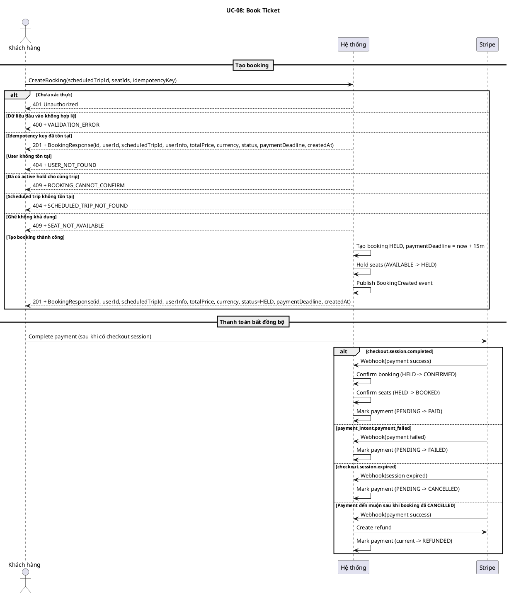
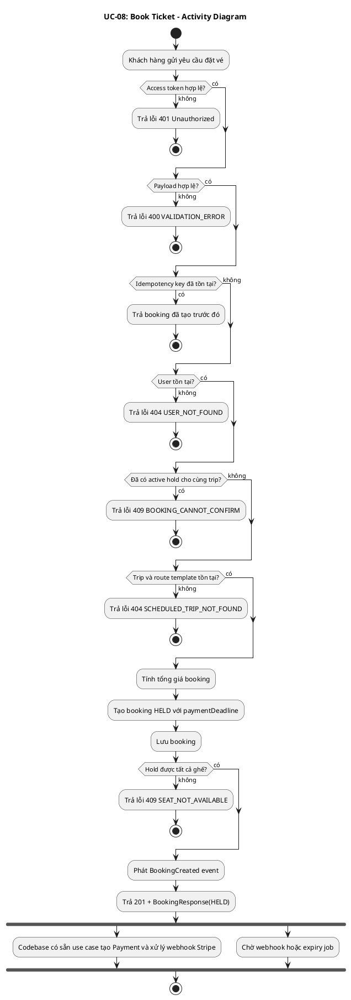
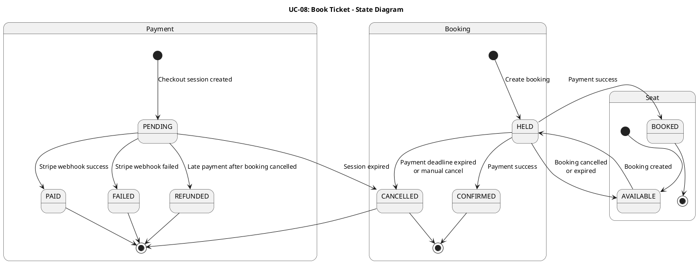
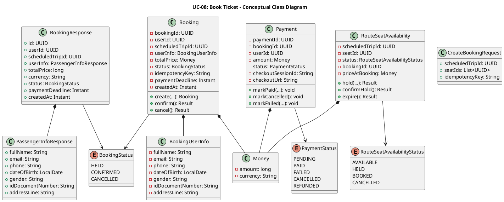
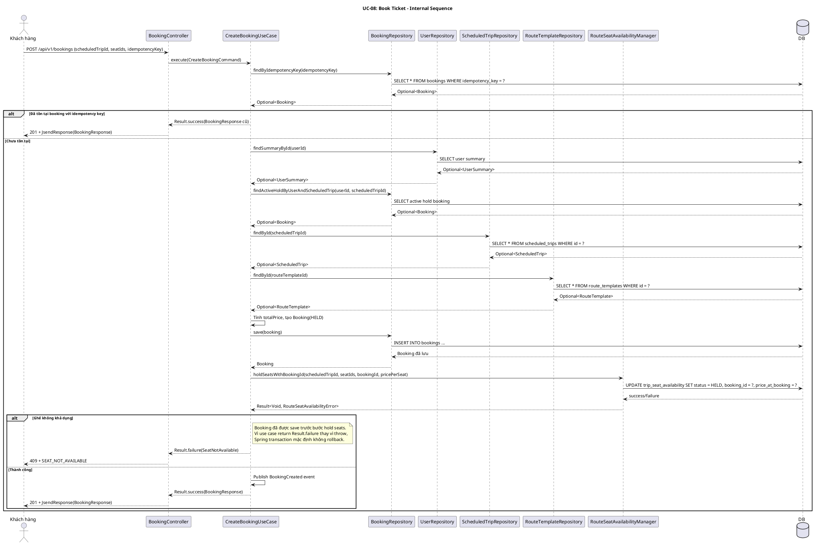
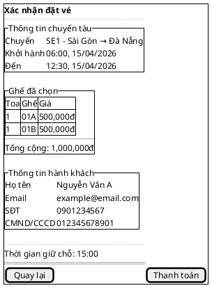

# UC-08: Đặt vé tàu

# Mô tả use case

| Mục                            | Nội dung                                                                                                                                                                                                                                                                                                                                                                                                                                                                                                                                                                                                                                                                                                                                                                                                                                                                                                                                                                                                                                                                                                                                                                                                                                                                                                                                                                                    |
| ------------------------------ | ------------------------------------------------------------------------------------------------------------------------------------------------------------------------------------------------------------------------------------------------------------------------------------------------------------------------------------------------------------------------------------------------------------------------------------------------------------------------------------------------------------------------------------------------------------------------------------------------------------------------------------------------------------------------------------------------------------------------------------------------------------------------------------------------------------------------------------------------------------------------------------------------------------------------------------------------------------------------------------------------------------------------------------------------------------------------------------------------------------------------------------------------------------------------------------------------------------------------------------------------------------------------------------------------------------------------------------------------------------------------------------------- |
| Phụ thuộc                      | UC-02: Đăng nhập, UC-06: Tra cứu chuyến tàu, UC-07: Xem sơ đồ ghế chuyến tàu                                                                                                                                                                                                                                                                                                                                                                                                                                                                                                                                                                                                                                                                                                                                                                                                                                                                                                                                                                                                                                                                                                                                                                                                                                                                                                                |
| Mục đích                       | Khách hàng đã đăng nhập muốn giữ chỗ các ghế đã chọn để thanh toán vé tàu. PM tạo booking ở trạng thái `HELD`, khóa các ghế tương ứng trong một khoảng thời gian thanh toán, và cung cấp các thành phần payment/webhook để hỗ trợ chuyển booking sang `CONFIRMED` khi thanh toán thành công.                                                                                                                                                                                                                                                                                                                                                                                                                                                                                                                                                                                                                                                                                                                                                                                                                                                                                                                                                                                                                                                                                                |
| Mô tả                          | Khách hàng chọn chuyến tàu và ghế ngồi để đặt vé. Hệ thống tạo đặt vé ở trạng thái giữ chỗ (`HELD`) trong 15 phút. Sau khi booking được tạo, hệ thống phát sinh sự kiện `BookingCreated`. Khi thanh toán thành công qua webhook cho một payment hợp lệ, booking chuyển sang trạng thái xác nhận (`CONFIRMED`).                                                                                                                                                                                                                                                                                                                                                                                                                                                                                                                                                                                                                                                                                                                                                                                                                                                                                                  |
| Actor chính                    | Khách hàng đã đăng nhập                                                                                                                                                                                                                                                                                                                                                                                                                                                                                                                                                                                                                                                                                                                                                                                                                                                                                                                                                                                                                                                                                                                                                                                                                                                                                                                                                                     |
| Actor liên quan                | Stripe                                                                                                                                                                                                                                                                                                                                                                                                                                                                                                                                                                                                                                                                                                                                                                                                                                                                                                                                                                                                                                                                                                                                                                                                                                                                                                                                                                                      |
| Tiền điều kiện                 | Khách hàng đã đăng nhập và có access token hợp lệ. Khách hàng đã chọn chuyến tàu và danh sách ghế muốn đặt.                                                                                                                                                                                                                                                                                                                                                                                                                                                                                                                                                                                                                                                                                                                                                                                                                                                                                                                                                                                                                                                                                                                                                                                                                                                                                 |
| Dãy lệnh thực hiện bình thường | 1. Khách hàng gửi yêu cầu đặt vé gồm `scheduledTripId`, danh sách `seatIds`, và `idempotencyKey`.   2. Hệ thống kiểm tra dữ liệu đầu vào hợp lệ.   3. Hệ thống kiểm tra `idempotencyKey`; nếu booking đã được tạo trước đó thì trả về booking cũ.   4. Hệ thống kiểm tra người dùng tồn tại.   5. Hệ thống kiểm tra khách hàng chưa có booking đang giữ chỗ cho cùng chuyến tàu.   6. Hệ thống kiểm tra chuyến tàu tồn tại, lấy `routeTemplate`, tính tổng giá vé theo số ghế.   7. Hệ thống tạo booking ở trạng thái `HELD` với hạn thanh toán 15 phút và lưu vào cơ sở dữ liệu.   8. Hệ thống giữ chỗ các ghế được chọn qua `RouteSeatAvailabilityManager` (trạng thái ghế `AVAILABLE -> HELD`) và lưu kèm `bookingId`, `priceAtBooking`.   9. Nếu giữ chỗ thành công, hệ thống phát sinh sự kiện miền `BookingCreated` và trả về thông tin booking vừa tạo (trạng thái `HELD`).   10. Codebase hiện có các thành phần payment để tạo `Payment`, xử lý webhook Stripe, expiry, và refund.   11. Nếu checkout session được tạo và khách hàng thanh toán thành công, webhook Stripe sẽ xác nhận booking (`HELD -> CONFIRMED`), xác nhận ghế (`HELD -> BOOKED`), và đánh dấu payment `PAID`. |
| Hậu điều kiện (thành công)     | Ở luồng đồng bộ: một booking mới được tạo ở trạng thái `HELD`, có `paymentDeadline`, và các ghế được chọn chuyển sang `HELD`. Ở luồng bất đồng bộ sau thanh toán thành công: booking chuyển sang `CONFIRMED`, ghế chuyển sang `BOOKED`, payment chuyển sang `PAID`.                                                                                                                                                                                                                                                                                                                                                                                                                                                                                                                                                                                                                                                                                                                                                                                                                                                                                                                                                                                                                                                                                                                         |
| Hậu điều kiện (thất bại)       | Nếu thất bại trước khi lưu booking, booking mới không được tạo. Nếu thất bại xảy ra sau khi booking đã được lưu nhưng giữ chỗ ghế thất bại, code hiện tại có thể để lại một booking ở trạng thái `HELD` đã được persist trước khi trả lỗi `SEAT_NOT_AVAILABLE`. Nếu payment thất bại hoặc session hết hạn, payment được cập nhật sang `FAILED` hoặc `CANCELLED`, booking vẫn ở `HELD` cho đến khi luồng expiry hủy booking. Nếu webhook thanh toán đến muộn sau khi booking đã `CANCELLED`, hệ thống tạo refund ngay lập tức và đánh dấu payment `REFUNDED`.                                                                                                                                                                                                                                                                                                                                                                                                                                                                                                                                                                                                                                                                                                                                                                                                                                |
| Xử lý ngoại lệ                 | Chưa xác thực -> Hệ thống trả về lỗi 401.   Dữ liệu đầu vào không hợp lệ (thiếu trường, danh sách ghế rỗng) -> Hệ thống trả về lỗi `VALIDATION_ERROR`.   Người dùng không tồn tại -> Hệ thống trả về lỗi `USER_NOT_FOUND`.   Chuyến tàu không tồn tại hoặc không tìm thấy route template để tính giá -> Hệ thống trả về lỗi `SCHEDULED_TRIP_NOT_FOUND`.   Một hoặc nhiều ghế không còn trống -> Hệ thống trả về lỗi `SEAT_NOT_AVAILABLE`.   Đã có active hold cho cùng chuyến tàu -> Hệ thống trả về lỗi `BOOKING_CANNOT_CONFIRM`.   Gửi lại cùng `idempotencyKey` -> Hệ thống trả về booking đã tạo trước đó.   Stripe webhook bị lặp lại -> Hệ thống bỏ qua event đã xử lý.   Thanh toán thất bại -> payment chuyển sang `FAILED`, booking vẫn `HELD` cho đến khi hết hạn.   Checkout session hết hạn -> payment chuyển sang `CANCELLED`; booking sẽ được hủy bởi luồng expiry.   Thanh toán đến muộn sau khi booking đã `CANCELLED` -> Hệ thống refund ngay và đánh dấu payment `REFUNDED`.                                                                                                                                                                                                                                                                                                                                                                |

# Lược đồ tuần tự

# Lược đồ hoạt động

# Lược đồ trạng thái

# Lược đồ lớp ý niệm

# Phân rã thành phần PM

## Controller: `BookingController`

- **Nhiệm vụ**: Nhận HTTP request tạo booking từ khách hàng, validate payload,
  lấy `userId` từ `Authentication`, và ủy thác cho `CreateBookingUseCase`.
- **Endpoint**: `POST /api/v1/bookings`
- **Input**: `CreateBookingRequest` -
  `{ scheduledTripId: UUID, seatIds: UUID[], idempotencyKey: String }`
- **Output thành công**: `201` + `BookingResponse` -
  `{ id, userId, scheduledTripId, userInfo, totalPrice, currency, status, paymentDeadline, createdAt }`
- **Output lỗi**: `400 | 404 | 409` + `JsendResponse` - `{ errorCode, message }`

## UseCase: `CreateBookingUseCase`

- **Nhiệm vụ**: Orchestrate luồng tạo booking đồng bộ cho UC này.
- **Input**: `CreateBookingCommand` -
  `{ userId, scheduledTripId, seatIds, idempotencyKey }`
- **Output**: `Result<BookingResponse, BookingError>`
- **Gọi đến**:
    - `BookingRepository.findByIdempotencyKey()` - trả booking cũ nếu yêu cầu
      được gửi lại
    - `UserRepository.findSummaryById()` - lấy thông tin hành khách để gán vào
      booking
    - `BookingRepository.findActiveHoldByUserAndScheduledTrip()` - chặn tạo
      nhiều active hold cho cùng trip
    - `ScheduledTripRepository.findById()` - xác nhận scheduled trip tồn tại
    - `RouteTemplateRepository.findById()` - lấy giá cơ sở của tuyến
    - `BookingRepository.save()` - lưu booking mới ở trạng thái `HELD`
    - `RouteSeatAvailabilityManager.holdSeatsWithBookingId()` - giữ chỗ tất cả
      ghế và gán `bookingId`, `priceAtBooking`
- **Phát sinh sự kiện**: `BookingCreated`

## Repository: `BookingRepository`

- **Nhiệm vụ**: Truy xuất/lưu trữ aggregate `Booking` và các projection liên
  quan.
- **Phương thức liên quan đến UC**:
    - `findByIdempotencyKey(key): Optional<Booking>` - hỗ trợ idempotency cho
      yêu cầu tạo booking
    - `findActiveHoldByUserAndScheduledTrip(userId, scheduledTripId): Optional<Booking>` -
      kiểm tra active hold trùng lặp
    - `save(booking): Booking` - lưu booking mới ở trạng thái `HELD`

## Port: `RouteSeatAvailabilityManager`

- **Lớp**: Application layer cross-module port, implemented bởi
  `RouteSeatAvailabilityManagerAdapter` trong infrastructure của module `train`.
- **Nhiệm vụ**: Giữ chỗ ghế cho booking theo cơ chế all-or-nothing, tránh
  deadlock bằng cách sort `seatIds`, và cập nhật `trip_seat_availability`.
- **Phương thức liên quan đến UC**:
    - `holdSeatsWithBookingId(scheduledTripId, seatIds, bookingId, price): Result<Void, RouteSeatAvailabilityError>` -
      chuyển tất cả ghế `AVAILABLE -> HELD` và lưu giá tại thời điểm đặt

## Lược đồ tuần tự nội bộ PM

## Giao diện

### Giao diện mẫu

### Giao diện ứng dụng

Chưa hiện thực. Sẽ bổ sung ảnh chụp màn hình khi hoàn thành.

# Bảng tham chiếu dò vết

| Use Case | Controller              | Endpoint                       | UseCase                                                                                               | Repository / Port                                                                     | Table                                      |
| -------- | ----------------------- | ------------------------------ | ----------------------------------------------------------------------------------------------------- | ------------------------------------------------------------------------------------- | ------------------------------------------ |
| UC-08    | BookingController       | `POST /api/v1/bookings`        | CreateBookingUseCase                                                                                  | BookingRepository.findByIdempotencyKey()                                              | bookings                                   |
|          | BookingController       | `POST /api/v1/bookings`        | CreateBookingUseCase                                                                                  | UserRepository.findSummaryById()                                                      | users                                      |
|          | BookingController       | `POST /api/v1/bookings`        | CreateBookingUseCase                                                                                  | BookingRepository.findActiveHoldByUserAndScheduledTrip()                              | bookings                                   |
|          | BookingController       | `POST /api/v1/bookings`        | CreateBookingUseCase                                                                                  | ScheduledTripRepository.findById()                                                    | scheduled_trips                            |
|          | BookingController       | `POST /api/v1/bookings`        | CreateBookingUseCase                                                                                  | RouteTemplateRepository.findById()                                                    | route_templates                            |
|          | BookingController       | `POST /api/v1/bookings`        | CreateBookingUseCase                                                                                  | BookingRepository.save()                                                              | bookings                                   |
|          | BookingController       | `POST /api/v1/bookings`        | CreateBookingUseCase                                                                                  | RouteSeatAvailabilityManager.holdSeatsWithBookingId()                                 | trip_seat_availability                     |
|          | StripeWebhookController | `POST /api/v1/webhooks/stripe` | HandlePaymentSuccessUseCase / HandlePaymentFailedByPaymentIntentUseCase / CancelPendingPaymentUseCase | PaymentRepository, BookingRepository, RouteSeatAvailabilityManager, StripeGatewayPort | payments, bookings, trip_seat_availability |

# Tiêu chí kiểm thử

## Mức phân tích

| Tiêu chí             | Phép thử                                                                   | Kết quả mong đợi                          | Ghi chú                              |
| -------------------- | -------------------------------------------------------------------------- | ----------------------------------------- | ------------------------------------ |
| Toàn diện (coverage) | Đối chiếu Activity Diagram ↔ Sequence Diagram: mọi luồng đều được thể hiện | Không bỏ sót luồng chính lẫn ngoại lệ     | Rà soát chéo giữa mục 2 và mục 3     |
| Nhất quán            | Rà soát tên lớp, trạng thái, API giữa các lược đồ trong cùng UC            | Không mâu thuẫn giữa các mục 2–6          | Đặc biệt kiểm tra BookingStatus, PaymentStatus, SeatStatus |
| Truy vết             | Đối chiếu bảng tham chiếu (mục 7) với lược đồ tuần tự nội bộ (mục 6.5)     | Mọi tương tác trong sequence đều có entry | Kiểm tra không thiếu repository/port |

## Mức thiết kế

| Tiêu chí      | Phép thử                                                                                                                          | Kết quả mong đợi                                       | Ghi chú                                |
| ------------- | --------------------------------------------------------------------------------------------------------------------------------- | ------------------------------------------------------ | -------------------------------------- |
| Chuẩn hóa     | Rà soát thiết kế BookingController, CreateBookingUseCase, BookingRepository, RouteSeatAvailabilityManager                          | Tuân thủ Clean Architecture, quy ước đặt tên và hợp đồng | Walkthrough/inspection                 |
| Testability   | Rà soát khả năng mock RouteSeatAvailabilityManager, BookingRepository, UserRepository, ScheduledTripRepository trong unit test     | Có thể kiểm thử UseCase độc lập không cần DB thật       | Tất cả repository và port là interface  |
| Modularity    | Rà soát ranh giới trách nhiệm: Controller chỉ validate + route, UseCase chỉ orchestrate, Repository chỉ persistence, Port chỉ cross-module | Không trùng lặp trách nhiệm, coupling thấp             | Kiểm tra không có logic nghiệp vụ trong Controller |

## Mức hiện thực

| Tiêu chí          | Phép thử                                                                                                                                                                                                  | Kết quả mong đợi                                                                                                                                                                                                 | Ghi chú                                                                  |
| ----------------- | --------------------------------------------------------------------------------------------------------------------------------------------------------------------------------------------------------- | ---------------------------------------------------------------------------------------------------------------------------------------------------------------------------------------------------------------- | ------------------------------------------------------------------------ |
| Xử lý chính xác   | Test luồng chính (tạo booking HELD thành công), luồng lỗi (email trùng hold, ghế không khả dụng, trip không tồn tại, user không tồn tại, validation fail), luồng idempotency (trả booking cũ)             | 201 + BookingResponse đúng fields với status=HELD; 409 + SEAT_NOT_AVAILABLE; 409 + BOOKING_CANNOT_CONFIRM; 404 + SCHEDULED_TRIP_NOT_FOUND; 404 + USER_NOT_FOUND; 400 + VALIDATION_ERROR; 201 + booking cũ khi trùng key | Kết hợp unit test UseCase + integration test endpoint                     |
| Hiệu năng         | Benchmark endpoint POST /api/v1/bookings với 100 concurrent requests cho các ghế khác nhau                                                                                                                 | Response time p95 < 500ms trong điều kiện tải bình thường                                                                                                                                                         | Ghi rõ môi trường test                                                   |
| Bảo mật           | Kiểm tra yêu cầu xác thực (401 khi không có token), kiểm tra userId lấy từ token (không cho phép đặt vé cho user khác), kiểm tra input validation chống injection                                         | Reject request không có token hợp lệ, không cho phép impersonation, reject input không hợp lệ                                                                                                                    | Kiểm tra cả race condition khi nhiều user hold cùng ghế đồng thời        |
| Đồng thời         | Test concurrent booking cùng ghế từ nhiều user, test concurrent booking cùng idempotencyKey                                                                                                                | Chỉ 1 booking thành công hold ghế, các request còn lại nhận SEAT_NOT_AVAILABLE; idempotency trả cùng kết quả                                                                                                     | Sử dụng pessimistic lock hoặc DB constraint để đảm bảo                   |
| Webhook           | Test webhook Stripe: checkout.session.completed, payment_intent.payment_failed, checkout.session.expired, late payment sau khi booking đã CANCELLED                                                        | HELD→CONFIRMED + HELD→BOOKED + PENDING→PAID; PENDING→FAILED; PENDING→CANCELLED; refund ngay + REFUNDED                                                                                                           | Kiểm tra idempotency của webhook (event lặp lại không gây side effect)   |

## Danh sách test thỏa mãn mức hiện thực

<!-- Bảng liệt kê các test case cụ thể để kiểm chứng tiêu chí mức hiện thực.
     Mỗi test phải truy vết được về: endpoint/SP, bảng dữ liệu, file test. -->

### Backend

| # | Tên test case | Mô tả | Endpoint / SP | Table liên quan | Kết quả mong đợi | File test |
|---|---------------|--------|---------------|-----------------|-------------------|-----------|
| 1 | `execute_returnsExistingBookingWhenIdempotencyKeyAlreadyExists` | Trả booking cũ khi idempotencyKey đã tồn tại | `POST /api/v1/bookings` | `bookings` | `Result.success` + BookingResponse cũ, không gọi save | `backend/src/test/java/.../booking/application/usecase/CreateBookingUseCaseTest.java:184` |
| 2 | `execute_returnsUserNotFoundWhenUserDoesNotExist` | User không tồn tại trong hệ thống | `POST /api/v1/bookings` | `users` | `Result.failure(UserNotFound)` | `backend/src/test/java/.../booking/application/usecase/CreateBookingUseCaseTest.java:233` |
| 3 | `execute_returnsActiveHoldExistsWhenUserAlreadyHasActiveHoldForSameTrip` | Đã có active hold cho cùng trip | `POST /api/v1/bookings` | `bookings` | `Result.failure(ActiveHoldExists)` | `backend/src/test/java/.../booking/application/usecase/CreateBookingUseCaseTest.java:248` |
| 4 | `execute_returnsScheduledTripNotFoundWhenRouteTemplateDoesNotExist` | Route template không tồn tại | `POST /api/v1/bookings` | `scheduled_trips`, `route_templates` | `Result.failure(ScheduledTripNotFound)` | `backend/src/test/java/.../booking/application/usecase/CreateBookingUseCaseTest.java:301` |
| 5 | `execute_returnsSeatNotAvailableWhenSeatHoldFails` | Ghế không khả dụng khi hold | `POST /api/v1/bookings` | `trip_seat_availability` | `Result.failure(SeatNotAvailable)` | `backend/src/test/java/.../booking/application/usecase/CreateBookingUseCaseTest.java:330` |
| 6 | `execute_publishesBookingCreatedEventOnSuccess` | Publish BookingCreated event khi tạo thành công | `POST /api/v1/bookings` | `bookings`, `trip_seat_availability` | `eventPublisher.publishEvent(BookingCreated)` | `backend/src/test/java/.../booking/application/usecase/CreateBookingUseCaseTest.java:349` |
| 7 | `execute_publishesSeatStatusChangedEventAfterSuccessfulHold` | Publish SSE event sau khi hold ghế thành công | `POST /api/v1/bookings` | `trip_seat_availability` | `eventPublisher.publishEvent(SeatStatusChangedEvent)` | `backend/src/test/java/.../booking/application/usecase/CreateBookingUseCaseTest.java:359` |
| 8 | `holdSeatsWithBookingId_receivesPricePerSeatFromRouteTemplate` | Giá truyền vào holdSeats đúng bằng basePrice từ routeTemplate | `POST /api/v1/bookings` | `route_templates`, `trip_seat_availability` | `pricePerSeat == Money.vnd(500_000)` | `backend/src/test/java/.../booking/application/usecase/CreateBookingUseCaseTest.java:376` |
| 9 | `response_totalPriceEqualsPricePerSeatTimesSeatCount` | Tổng giá = giá/ghế × số ghế | `POST /api/v1/bookings` | `bookings` | `totalPrice == 1_000_000` | `backend/src/test/java/.../booking/application/usecase/CreateBookingUseCaseTest.java:396` |
| 10 | `response_statusIsHeld` | Trạng thái booking trả về là HELD | `POST /api/v1/bookings` | `bookings` | `status == HELD` | `backend/src/test/java/.../booking/application/usecase/CreateBookingUseCaseTest.java:407` |
| 11 | `response_includesPassengersMatchingCommandInput` | Response chứa thông tin hành khách đúng | `POST /api/v1/bookings` | `bookings` | `passengers.size == 2`, đúng tên và CMND | `backend/src/test/java/.../booking/application/usecase/CreateBookingUseCaseTest.java:420` |
| 12 | `rejectsPassengerSeatMismatch` | Từ chối khi số hành khách ≠ số ghế | `POST /api/v1/bookings` | — | `Result.failure(ValidationError)` | `backend/src/test/java/.../booking/application/usecase/CreateBookingUseCaseTest.java:451` |
| 13 | `createReturnsCreatedWithBookingResponseOnSuccess` | Controller trả 201 khi UseCase thành công | `POST /api/v1/bookings` | `bookings` | `201 Created` + BookingResponse | `backend/src/test/java/.../booking/infrastructure/web/BookingControllerTest.java:66` |
| 14 | `createReturnsNotFoundWhenUseCaseReturnsUserNotFound` | Controller trả 404 khi UserNotFound | `POST /api/v1/bookings` | — | `404` + `USER_NOT_FOUND` | `backend/src/test/java/.../booking/infrastructure/web/BookingControllerTest.java:97` |
| 15 | `createReturnsNotFoundWhenUseCaseReturnsScheduledTripNotFound` | Controller trả 404 khi ScheduledTripNotFound | `POST /api/v1/bookings` | — | `404` + `SCHEDULED_TRIP_NOT_FOUND` | `backend/src/test/java/.../booking/infrastructure/web/BookingControllerTest.java:103` |
| 16 | `createReturnsConflictWhenUseCaseReturnsSeatNotAvailable` | Controller trả 409 khi SeatNotAvailable | `POST /api/v1/bookings` | — | `409` + `SEAT_NOT_AVAILABLE` | `backend/src/test/java/.../booking/infrastructure/web/BookingControllerTest.java:111` |
| 17 | `createReturnsConflictWhenUseCaseReturnsActiveHoldExists` | Controller trả 409 khi ActiveHoldExists | `POST /api/v1/bookings` | — | `409` + `BOOKING_CANNOT_CONFIRM` | `backend/src/test/java/.../booking/infrastructure/web/BookingControllerTest.java:119` |
| 18 | `execute_allowsOnlyOneBookingForSameSeatUnderConcurrentLoad` | Stress test: chỉ 1 booking thành công khi 50 request đồng thời cùng ghế | `POST /api/v1/bookings` | `bookings`, `trip_seat_availability` | 1 success, 49 failure (SeatNotAvailable hoặc ActiveHoldExists) | `backend/src/test/java/.../booking/application/usecase/CreateBookingStressTest.java:56` |
| 19 | `execute_returnsSameBookingForSameIdempotencyKeyUnderConcurrentLoad` | Stress test: idempotency dưới tải đồng thời | `POST /api/v1/bookings` | `bookings` | Tất cả trả cùng BookingResponse | `backend/src/test/java/.../booking/application/usecase/CreateBookingStressTest.java:84` |
| 20 | `HandlePaymentSuccessUseCaseTest` | Webhook success: HELD→CONFIRMED, HELD→BOOKED, PENDING→PAID | `POST /api/v1/webhooks/stripe` | `payments`, `bookings`, `trip_seat_availability` | Booking CONFIRMED, seats BOOKED, payment PAID | `backend/src/test/java/.../payment/application/usecase/HandlePaymentSuccessUseCaseTest.java` |
| 21 | `HandlePaymentFailedByPaymentIntentUseCaseTest` | Webhook failed: PENDING→FAILED | `POST /api/v1/webhooks/stripe` | `payments` | Payment FAILED | `backend/src/test/java/.../payment/application/usecase/HandlePaymentFailedByPaymentIntentUseCaseTest.java` |
| 22 | `CancelPendingPaymentUseCaseTest` | Webhook expired: PENDING→CANCELLED | `POST /api/v1/webhooks/stripe` | `payments` | Payment CANCELLED | `backend/src/test/java/.../payment/application/usecase/CancelPendingPaymentUseCaseTest.java` |
| 23 | `RefundPaymentUseCaseTest` | Late payment refund: tạo refund khi booking đã CANCELLED | `POST /api/v1/webhooks/stripe` | `payments` | Payment REFUNDED, refund created | `backend/src/test/java/.../payment/application/usecase/RefundPaymentUseCaseTest.java` |

### Frontend

| # | Tên test case | Mô tả | Component / Flow | Kết quả mong đợi | File test |
|---|---------------|--------|------------------|-------------------|-----------|
| 1 | `enforces maximum 5 seats per booking` | Kiểm tra giới hạn tối đa 5 ghế/booking | Seat selection logic | `canAddMoreSeats(5) == false` | `frontend/customer/src/__tests__/customer-flows.integration.test.ts:91` |
| 2 | `calculates total price correctly for multiple seats` | Tính tổng giá đúng | Price calculation | `calculateTotalPrice(3, 500000) == 1500000` | `frontend/customer/src/__tests__/customer-flows.integration.test.ts:99` |
| 3 | `builds booking URL with trip and seat context` | Tạo URL booking đúng format | URL builder | URL chứa tripId và seatIds | `frontend/customer/src/__tests__/customer-flows.integration.test.ts:107` |
| 4 | `parses booking context from URL search params` | Parse booking context từ URL | URL parser | Trả đúng tripId và seatIds | `frontend/customer/src/__tests__/customer-flows.integration.test.ts:119` |
| 5 | `generates unique idempotency keys` | Tạo idempotency key duy nhất | Booking creation | Keys khác nhau, bắt đầu bằng "booking-" | `frontend/customer/src/__tests__/customer-flows.integration.test.ts:143` |
| 6 | `formats prices in VND currency` | Format giá tiền VND | Price display | Chứa "500" và ký hiệu VND | `frontend/customer/src/__tests__/customer-flows.integration.test.ts:156` |
| 7 | `complete search to booking params flow` | E2E flow: search → seat selection → booking URL → parse → price → idempotency | Full booking journey | Tất cả bước thành công | `frontend/customer/src/__tests__/customer-flows.integration.test.ts:241` |
| 8 | `renders seat pricing with quantity` | Hiển thị giá ghế và số lượng | `PriceBreakdown` component | Hiển thị "× 2" và "Tổng cộng" | `frontend/customer/src/components/booking/price-breakdown.test.tsx:7` |
| 9 | `shows service fee when provided` | Hiển thị phí dịch vụ | `PriceBreakdown` component | Hiển thị service fee | `frontend/customer/src/components/booking/price-breakdown.test.tsx:20` |
| 10 | `renders pending state with countdown` | Hiển thị trạng thái PENDING với đếm ngược | `PaymentStatus` component | Countdown timer hiển thị | `frontend/customer/src/components/booking/payment-status.test.tsx:26` |

## Bảng tiêu chí chất lượng theo chức năng

| Chức năng trong UC                  | Tiêu chí mức Ý niệm                                                                                  | Tiêu chí mức Thiết kế                                                                                                    | Tiêu chí mức Hiện thực                                                                                                          |
| ----------------------------------- | ---------------------------------------------------------------------------------------------------- | ------------------------------------------------------------------------------------------------------------------------ | ------------------------------------------------------------------------------------------------------------------------------- |
| Tạo booking (HELD)                  | Đúng nhu cầu: khách hàng giữ chỗ ghế đã chọn trong 15 phút để thanh toán                             | Luồng xử lý chuẩn hóa qua Controller→UseCase→Repository→Port, dễ test với mock                                           | Unit test UseCase (7+ cases: happy path, idempotency, user not found, active hold, trip not found, seat unavailable, validation) |
| Idempotency                         | Gửi lại cùng yêu cầu không tạo booking trùng lặp                                                    | UseCase kiểm tra idempotencyKey qua Repository trước khi tạo mới                                                         | Test gửi lại cùng key, verify trả cùng BookingResponse và không tạo record mới                                                  |
| Giữ chỗ ghế (AVAILABLE → HELD)      | Ghế đã chọn không thể bị đặt bởi người khác trong thời gian giữ chỗ                                  | RouteSeatAvailabilityManager xử lý all-or-nothing, sort seatIds tránh deadlock                                            | Test concurrent hold cùng ghế, verify chỉ 1 thành công; test partial failure rollback                                            |
| Thanh toán qua Stripe webhook       | Booking chuyển CONFIRMED khi thanh toán thành công, ghế chuyển BOOKED                                 | Webhook handler tách biệt theo event type, xử lý idempotent                                                               | Integration test với mock Stripe webhook payload, verify state transitions đúng                                                  |
| Xử lý thanh toán thất bại/hết hạn  | Payment FAILED/CANCELLED không ảnh hưởng booking cho đến khi expiry job chạy                          | Tách biệt webhook handler cho failed/expired, expiry job riêng biệt                                                       | Test payment failed → booking vẫn HELD; test expiry job → booking CANCELLED + ghế AVAILABLE                                      |
| Late payment refund                 | Thanh toán đến sau khi booking đã CANCELLED được hoàn tiền tự động                                    | Webhook handler kiểm tra booking status trước khi confirm, trigger refund nếu đã CANCELLED                                | Test webhook success khi booking đã CANCELLED, verify refund được tạo và payment = REFUNDED                                      |
