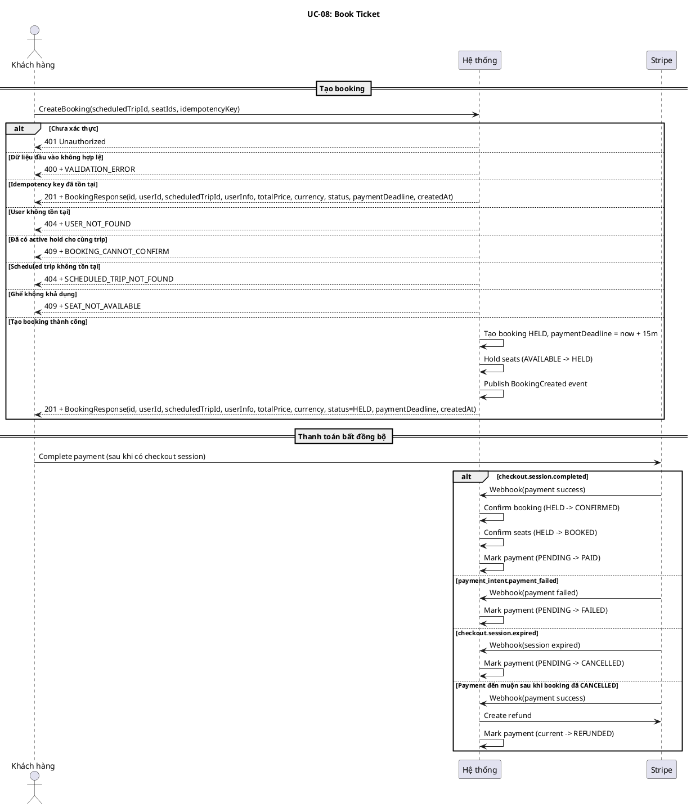
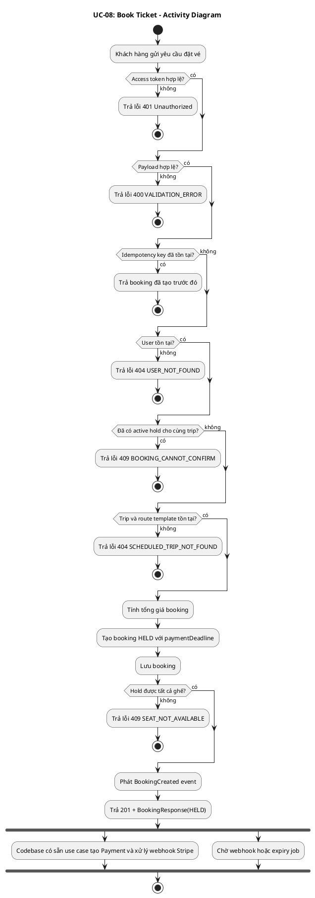
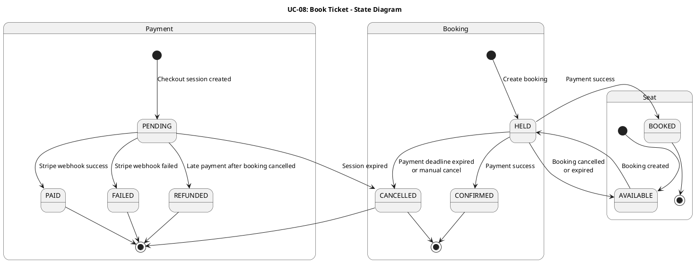
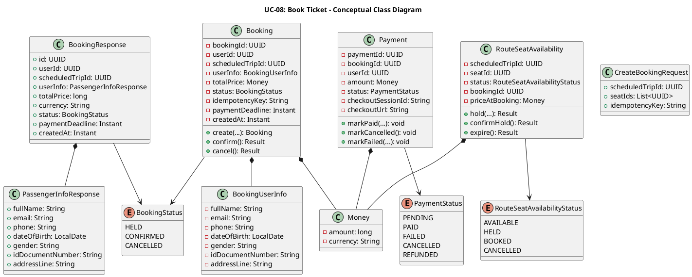
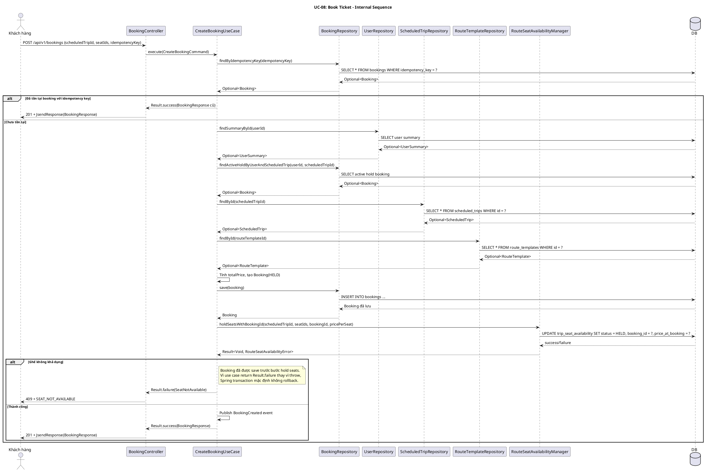
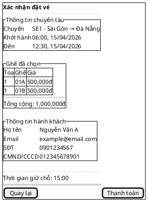

# UC-08: Đặt vé tàu

## 1. Mô tả use case

| Mục                            | Nội dung                                                                                                                                                                                                                                                                                                                                                                                                                                                                                                                                                                                                                                                                                                                                                                                                                                                                                                                                                                                                                                                                                                                                                                                                                                                                                                                                                                                    |
| ------------------------------ | ------------------------------------------------------------------------------------------------------------------------------------------------------------------------------------------------------------------------------------------------------------------------------------------------------------------------------------------------------------------------------------------------------------------------------------------------------------------------------------------------------------------------------------------------------------------------------------------------------------------------------------------------------------------------------------------------------------------------------------------------------------------------------------------------------------------------------------------------------------------------------------------------------------------------------------------------------------------------------------------------------------------------------------------------------------------------------------------------------------------------------------------------------------------------------------------------------------------------------------------------------------------------------------------------------------------------------------------------------------------------------------------- |
| Phụ thuộc                      | UC-02: Đăng nhập, UC-06: Tra cứu chuyến tàu, UC-07: Xem sơ đồ ghế chuyến tàu                                                                                                                                                                                                                                                                                                                                                                                                                                                                                                                                                                                                                                                                                                                                                                                                                                                                                                                                                                                                                                                                                                                                                                                                                                                                                                                |
| Mục đích                       | Khách hàng đã đăng nhập muốn giữ chỗ các ghế đã chọn để thanh toán vé tàu. PM tạo booking ở trạng thái `HELD`, khóa các ghế tương ứng trong một khoảng thời gian thanh toán, và cung cấp các thành phần payment/webhook để hỗ trợ chuyển booking sang `CONFIRMED` khi thanh toán thành công.                                                                                                                                                                                                                                                                                                                                                                                                                                                                                                                                                                                                                                                                                                                                                                                                                                                                                                                                                                                                                                                                                                |
| Mô tả                          | Khách hàng chọn chuyến tàu và ghế ngồi để đặt vé. Hệ thống tạo đặt vé ở trạng thái giữ chỗ (`HELD`) trong 15 phút. Sau khi booking được tạo, hệ thống phát sinh sự kiện `BookingCreated`. Khi thanh toán thành công qua webhook cho một payment hợp lệ, booking chuyển sang trạng thái xác nhận (`CONFIRMED`).                                                                                                                                                                                                                                                                                                                                                                                                                                                                                                                                                                                                                                                                                                                                                                                                                                                                                                  |
| Actor chính                    | Khách hàng đã đăng nhập                                                                                                                                                                                                                                                                                                                                                                                                                                                                                                                                                                                                                                                                                                                                                                                                                                                                                                                                                                                                                                                                                                                                                                                                                                                                                                                                                                     |
| Actor liên quan                | Stripe                                                                                                                                                                                                                                                                                                                                                                                                                                                                                                                                                                                                                                                                                                                                                                                                                                                                                                                                                                                                                                                                                                                                                                                                                                                                                                                                                                                      |
| Tiền điều kiện                 | Khách hàng đã đăng nhập và có access token hợp lệ. Khách hàng đã chọn chuyến tàu và danh sách ghế muốn đặt.                                                                                                                                                                                                                                                                                                                                                                                                                                                                                                                                                                                                                                                                                                                                                                                                                                                                                                                                                                                                                                                                                                                                                                                                                                                                                 |
| Dãy lệnh thực hiện bình thường | 1. Khách hàng gửi yêu cầu đặt vé gồm `scheduledTripId`, danh sách `seatIds`, và `idempotencyKey`.   2. Hệ thống kiểm tra dữ liệu đầu vào hợp lệ.   3. Hệ thống kiểm tra `idempotencyKey`; nếu booking đã được tạo trước đó thì trả về booking cũ.   4. Hệ thống kiểm tra người dùng tồn tại.   5. Hệ thống kiểm tra khách hàng chưa có booking đang giữ chỗ cho cùng chuyến tàu.   6. Hệ thống kiểm tra chuyến tàu tồn tại, lấy `routeTemplate`, tính tổng giá vé theo số ghế.   7. Hệ thống tạo booking ở trạng thái `HELD` với hạn thanh toán 15 phút và lưu vào cơ sở dữ liệu.   8. Hệ thống giữ chỗ các ghế được chọn qua `RouteSeatAvailabilityManager` (trạng thái ghế `AVAILABLE -> HELD`) và lưu kèm `bookingId`, `priceAtBooking`.   9. Nếu giữ chỗ thành công, hệ thống phát sinh sự kiện miền `BookingCreated` và trả về thông tin booking vừa tạo (trạng thái `HELD`).   10. Codebase hiện có các thành phần payment để tạo `Payment`, xử lý webhook Stripe, expiry, và refund.   11. Nếu checkout session được tạo và khách hàng thanh toán thành công, webhook Stripe sẽ xác nhận booking (`HELD -> CONFIRMED`), xác nhận ghế (`HELD -> BOOKED`), và đánh dấu payment `PAID`. |
| Hậu điều kiện (thành công)     | Ở luồng đồng bộ: một booking mới được tạo ở trạng thái `HELD`, có `paymentDeadline`, và các ghế được chọn chuyển sang `HELD`. Ở luồng bất đồng bộ sau thanh toán thành công: booking chuyển sang `CONFIRMED`, ghế chuyển sang `BOOKED`, payment chuyển sang `PAID`.                                                                                                                                                                                                                                                                                                                                                                                                                                                                                                                                                                                                                                                                                                                                                                                                                                                                                                                                                                                                                                                                                                                         |
| Hậu điều kiện (thất bại)       | Nếu thất bại trước khi lưu booking, booking mới không được tạo. Nếu thất bại xảy ra sau khi booking đã được lưu nhưng giữ chỗ ghế thất bại, code hiện tại có thể để lại một booking ở trạng thái `HELD` đã được persist trước khi trả lỗi `SEAT_NOT_AVAILABLE`. Nếu payment thất bại hoặc session hết hạn, payment được cập nhật sang `FAILED` hoặc `CANCELLED`, booking vẫn ở `HELD` cho đến khi luồng expiry hủy booking. Nếu webhook thanh toán đến muộn sau khi booking đã `CANCELLED`, hệ thống tạo refund ngay lập tức và đánh dấu payment `REFUNDED`.                                                                                                                                                                                                                                                                                                                                                                                                                                                                                                                                                                                                                                                                                                                                                                                                                                |
| Xử lý ngoại lệ                 | Chưa xác thực -> Hệ thống trả về lỗi 401.   Dữ liệu đầu vào không hợp lệ (thiếu trường, danh sách ghế rỗng) -> Hệ thống trả về lỗi `VALIDATION_ERROR`.   Người dùng không tồn tại -> Hệ thống trả về lỗi `USER_NOT_FOUND`.   Chuyến tàu không tồn tại hoặc không tìm thấy route template để tính giá -> Hệ thống trả về lỗi `SCHEDULED_TRIP_NOT_FOUND`.   Một hoặc nhiều ghế không còn trống -> Hệ thống trả về lỗi `SEAT_NOT_AVAILABLE`.   Đã có active hold cho cùng chuyến tàu -> Hệ thống trả về lỗi `BOOKING_CANNOT_CONFIRM`.   Gửi lại cùng `idempotencyKey` -> Hệ thống trả về booking đã tạo trước đó.   Stripe webhook bị lặp lại -> Hệ thống bỏ qua event đã xử lý.   Thanh toán thất bại -> payment chuyển sang `FAILED`, booking vẫn `HELD` cho đến khi hết hạn.   Checkout session hết hạn -> payment chuyển sang `CANCELLED`; booking sẽ được hủy bởi luồng expiry.   Thanh toán đến muộn sau khi booking đã `CANCELLED` -> Hệ thống refund ngay và đánh dấu payment `REFUNDED`.                                                                                                                                                                                                                                                                                                                                                                |

## 2. Lược đồ tuần tự

## 3. Lược đồ hoạt động

## 4. Lược đồ trạng thái

## 5. Lược đồ lớp ý niệm

## 6. Phân rã thành phần PM

### 6.1 Controller: `BookingController`

- **Nhiệm vụ**: Nhận HTTP request tạo booking từ khách hàng, validate payload,
  lấy `userId` từ `Authentication`, và ủy thác cho `CreateBookingUseCase`.
- **Endpoint**: `POST /api/v1/bookings`
- **Input**: `CreateBookingRequest` -
  `{ scheduledTripId: UUID, seatIds: UUID[], idempotencyKey: String }`
- **Output thành công**: `201` + `BookingResponse` -
  `{ id, userId, scheduledTripId, userInfo, totalPrice, currency, status, paymentDeadline, createdAt }`
- **Output lỗi**: `400 | 404 | 409` + `JsendResponse` - `{ errorCode, message }`

### 6.2 UseCase: `CreateBookingUseCase`

- **Nhiệm vụ**: Orchestrate luồng tạo booking đồng bộ cho UC này.
- **Input**: `CreateBookingCommand` -
  `{ userId, scheduledTripId, seatIds, idempotencyKey }`
- **Output**: `Result<BookingResponse, BookingError>`
- **Gọi đến**:
    - `BookingRepository.findByIdempotencyKey()` - trả booking cũ nếu yêu cầu
      được gửi lại
    - `UserRepository.findSummaryById()` - lấy thông tin hành khách để gán vào
      booking
    - `BookingRepository.findActiveHoldByUserAndScheduledTrip()` - chặn tạo
      nhiều active hold cho cùng trip
    - `ScheduledTripRepository.findById()` - xác nhận scheduled trip tồn tại
    - `RouteTemplateRepository.findById()` - lấy giá cơ sở của tuyến
    - `BookingRepository.save()` - lưu booking mới ở trạng thái `HELD`
    - `RouteSeatAvailabilityManager.holdSeatsWithBookingId()` - giữ chỗ tất cả
      ghế và gán `bookingId`, `priceAtBooking`
- **Phát sinh sự kiện**: `BookingCreated`

### 6.3 Repository: `BookingRepository`

- **Nhiệm vụ**: Truy xuất/lưu trữ aggregate `Booking` và các projection liên
  quan.
- **Phương thức liên quan đến UC**:
    - `findByIdempotencyKey(key): Optional<Booking>` - hỗ trợ idempotency cho
      yêu cầu tạo booking
    - `findActiveHoldByUserAndScheduledTrip(userId, scheduledTripId): Optional<Booking>` -
      kiểm tra active hold trùng lặp
    - `save(booking): Booking` - lưu booking mới ở trạng thái `HELD`

### 6.4 Port: `RouteSeatAvailabilityManager`

- **Lớp**: Application layer cross-module port, implemented bởi
  `RouteSeatAvailabilityManagerAdapter` trong infrastructure của module `train`.
- **Nhiệm vụ**: Giữ chỗ ghế cho booking theo cơ chế all-or-nothing, tránh
  deadlock bằng cách sort `seatIds`, và cập nhật `trip_seat_availability`.
- **Phương thức liên quan đến UC**:
    - `holdSeatsWithBookingId(scheduledTripId, seatIds, bookingId, price): Result<Void, RouteSeatAvailabilityError>` -
      chuyển tất cả ghế `AVAILABLE -> HELD` và lưu giá tại thời điểm đặt

### 6.5 Lược đồ tuần tự nội bộ PM

### 6.6 Giao diện

#### 6.6.1 Giao diện mẫu

#### 6.6.2 Giao diện ứng dụng

Chưa hiện thực. Sẽ bổ sung ảnh chụp màn hình khi hoàn thành.

## 7. Bảng tham chiếu dò vết

| Use Case | Controller              | Endpoint                       | UseCase                                                                                               | Repository / Port                                                                     | Table                                      |
| -------- | ----------------------- | ------------------------------ | ----------------------------------------------------------------------------------------------------- | ------------------------------------------------------------------------------------- | ------------------------------------------ |
| UC-08    | BookingController       | `POST /api/v1/bookings`        | CreateBookingUseCase                                                                                  | BookingRepository.findByIdempotencyKey()                                              | bookings                                   |
|          | BookingController       | `POST /api/v1/bookings`        | CreateBookingUseCase                                                                                  | UserRepository.findSummaryById()                                                      | users                                      |
|          | BookingController       | `POST /api/v1/bookings`        | CreateBookingUseCase                                                                                  | BookingRepository.findActiveHoldByUserAndScheduledTrip()                              | bookings                                   |
|          | BookingController       | `POST /api/v1/bookings`        | CreateBookingUseCase                                                                                  | ScheduledTripRepository.findById()                                                    | scheduled_trips                            |
|          | BookingController       | `POST /api/v1/bookings`        | CreateBookingUseCase                                                                                  | RouteTemplateRepository.findById()                                                    | route_templates                            |
|          | BookingController       | `POST /api/v1/bookings`        | CreateBookingUseCase                                                                                  | BookingRepository.save()                                                              | bookings                                   |
|          | BookingController       | `POST /api/v1/bookings`        | CreateBookingUseCase                                                                                  | RouteSeatAvailabilityManager.holdSeatsWithBookingId()                                 | trip_seat_availability                     |
|          | StripeWebhookController | `POST /api/v1/webhooks/stripe` | HandlePaymentSuccessUseCase / HandlePaymentFailedByPaymentIntentUseCase / CancelPendingPaymentUseCase | PaymentRepository, BookingRepository, RouteSeatAvailabilityManager, StripeGatewayPort | payments, bookings, trip_seat_availability |

## 8. Tiêu chí kiểm thử

| Tiêu chí                    | Phép thử                                                                              | Kết quả mong đợi                                                            | Ghi chú                                                                           |
| --------------------------- | ------------------------------------------------------------------------------------- | --------------------------------------------------------------------------- | --------------------------------------------------------------------------------- |
| Toàn diện (coverage)        | Đối chiếu Activity Diagram ↔ Sequence Diagram: mọi luồng đều được thể hiện            | Không bỏ sót luồng chính lẫn ngoại lệ                                       | Rà soát chéo giữa mục 2 và mục 3                                                  |
| Nhất quán                   | Rà soát tên lớp, trạng thái, API giữa các lược đồ trong cùng UC                       | Không mâu thuẫn giữa các mục 2-6                                            | Đặc biệt kiểm tra BookingStatus, PaymentStatus, SeatStatus                        |
| Truy vết                    | Đối chiếu bảng tham chiếu (mục 7) với lược đồ tuần tự nội bộ (mục 6.5)                | Mọi tương tác trong sequence đều có entry                                   | Kiểm tra không thiếu repository/port                                              |
