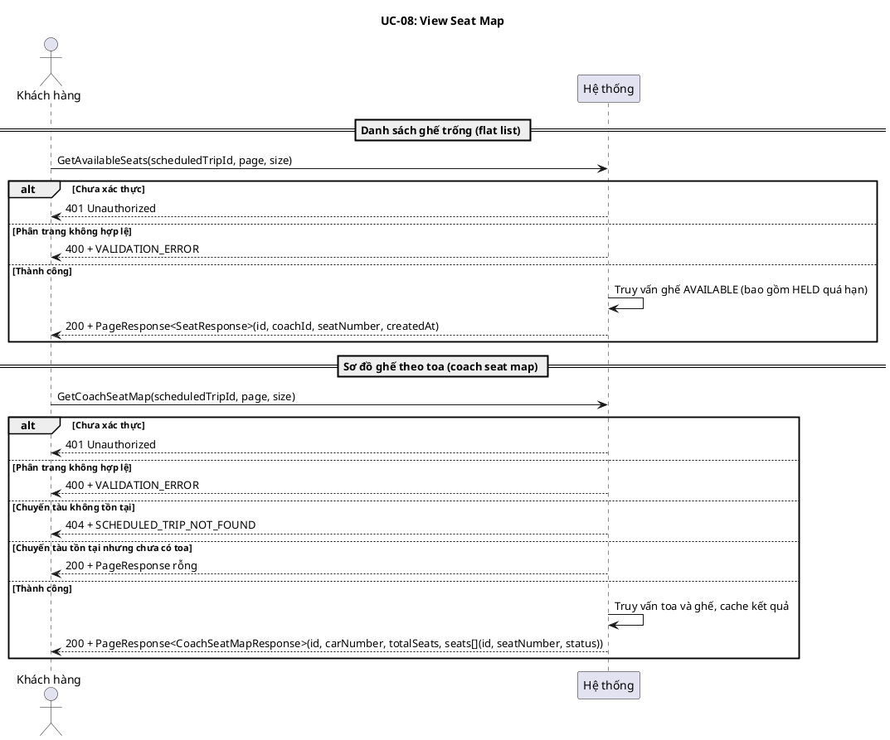
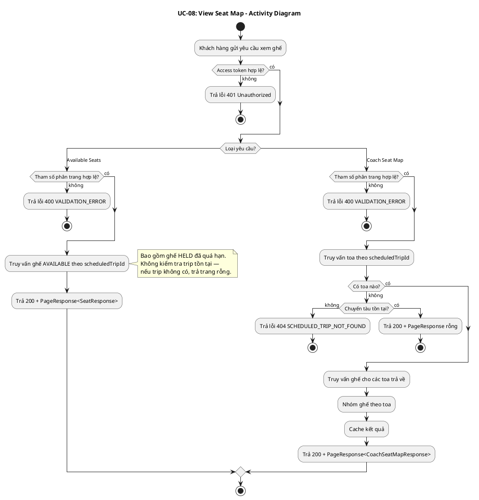
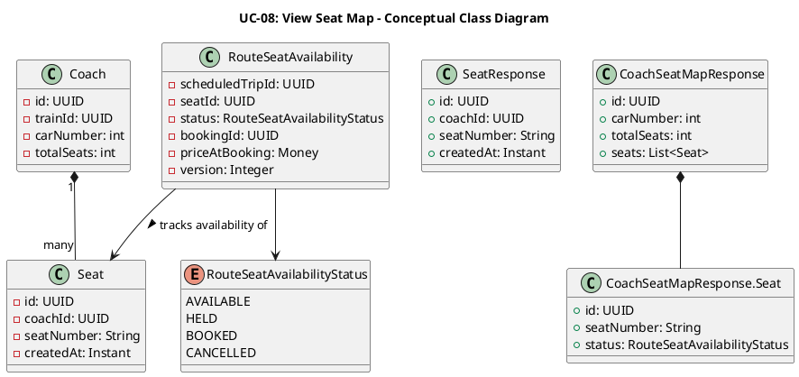
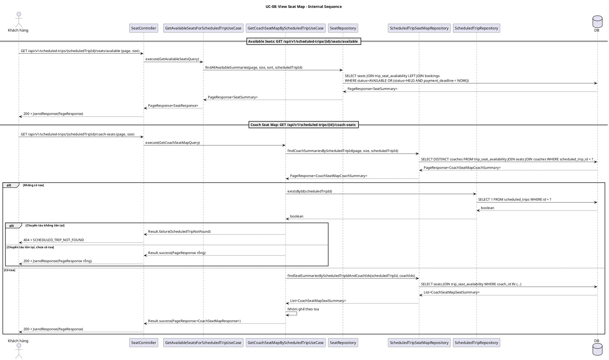

# UC-08: Xem sơ đồ ghế chuyến tàu

## 1. Mô tả use case

| Mục                            | Nội dung                                                                                                                                                                                                                                                                                                                                                                                                                                                                                                                                                                                                                                                                                                                                                                                                                                                |
| ------------------------------ | ------------------------------------------------------------------------------------------------------------------------------------------------------------------------------------------------------------------------------------------------------------------------------------------------------------------------------------------------------------------------------------------------------------------------------------------------------------------------------------------------------------------------------------------------------------------------------------------------------------------------------------------------------------------------------------------------------------------------------------------------------------------------------------------------------------------------------------------------------- |
| Phụ thuộc                      | UC-02: Đăng nhập, UC-07: Tra cứu chuyến tàu                                                                                                                                                                                                                                                                                                                                                                                                                                                                                                                                                                                                                                                                                                                                                                                                             |
| Mục đích                       | Khách hàng đã chọn chuyến tàu từ UC-07 và muốn xem tình trạng ghế trước khi đặt vé. PM cung cấp hai góc nhìn: danh sách ghế trống đơn giản (flat list) để chọn nhanh, và sơ đồ ghế theo toa chi tiết (coach seat map) để biết vị trí và trạng thái từng ghế trong toa.                                                                                                                                                                                                                                                                                                                                                                                                                                                                                                                                                                                  |
| Mô tả                          | Khách hàng xem sơ đồ ghế của một chuyến tàu cụ thể để biết trạng thái từng ghế (trống, đang giữ, đã đặt) trước khi đặt vé. Hỗ trợ hai góc nhìn: danh sách ghế trống đơn giản và sơ đồ ghế theo toa chi tiết.                                                                                                                                                                                                                                                                                                                                                                                                                                                                                                                                                                                                                                            |
| Actor chính                    | Khách hàng đã đăng nhập                                                                                                                                                                                                                                                                                                                                                                                                                                                                                                                                                                                                                                                                                                                                                                                                                                 |
| Actor liên quan                | Không                                                                                                                                                                                                                                                                                                                                                                                                                                                                                                                                                                                                                                                                                                                                                                                                                                                   |
| Tiền điều kiện                 | Khách hàng đã đăng nhập và có access token hợp lệ. Khách hàng đã biết mã chuyến tàu (`scheduledTripId`) từ UC-07.                                                                                                                                                                                                                                                                                                                                                                                                                                                                                                                                                                                                                                                                                                                                       |
| Dãy lệnh thực hiện bình thường | **Xem danh sách ghế trống:**   1. Khách hàng gửi yêu cầu xem ghế trống của chuyến tàu với `scheduledTripId` và tham số phân trang (`page`, `size`).   2. Hệ thống trả về danh sách ghế có trạng thái `AVAILABLE` (bao gồm cả ghế `HELD` đã quá hạn thanh toán), sắp xếp theo số ghế.   **Lưu ý:** Endpoint này không kiểm tra chuyến tàu tồn tại; nếu `scheduledTripId` không hợp lệ, hệ thống trả về trang rỗng.    **Xem sơ đồ ghế theo toa:**   1. Khách hàng gửi yêu cầu xem sơ đồ ghế theo toa của chuyến tàu với `scheduledTripId` và tham số phân trang (`page`, `size`).   2. Hệ thống trả về danh sách toa phân trang, mỗi toa kèm danh sách ghế với trạng thái hiện tại (`AVAILABLE`, `HELD`, `BOOKED`) (kết quả được cache).   **Lưu ý:** Endpoint này kiểm tra chuyến tàu tồn tại; nếu không tìm thấy, trả lỗi 404. |
| Hậu điều kiện (thành công)     | Không có thay đổi trạng thái. Đây là thao tác chỉ đọc.                                                                                                                                                                                                                                                                                                                                                                                                                                                                                                                                                                                                                                                                                                                                                                                                  |
| Hậu điều kiện (thất bại)       | Không có thay đổi trạng thái. Dữ liệu trong hệ thống không bị ảnh hưởng.                                                                                                                                                                                                                                                                                                                                                                                                                                                                                                                                                                                                                                                                                                                                                                                |
| Xử lý ngoại lệ                 | Chưa xác thực (thiếu hoặc sai access token) → Hệ thống trả về lỗi 401.   Chuyến tàu không tồn tại (sơ đồ ghế theo toa) → Hệ thống trả về lỗi `SCHEDULED_TRIP_NOT_FOUND`.   Chuyến tàu không tồn tại (danh sách ghế trống) → Hệ thống trả về trang rỗng (không kiểm tra tồn tại).   Chuyến tàu tồn tại nhưng chưa có toa → Hệ thống trả về trang rỗng.   Tham số phân trang không hợp lệ → Hệ thống trả về lỗi `VALIDATION_ERROR`.                                                                                                                                                                                                                                                                                                                                                                                                           |

## 2. Lược đồ tuần tự

## 3. Lược đồ hoạt động

## 5. Lược đồ lớp ý niệm

## 6. Phân rã thành phần PM

### 6.1 Controller: `SeatController`

-  **Nhiệm vụ**: Nhận HTTP request từ khách hàng, xác thực đầu vào, ủy thác cho
  UseCase tương ứng.

**Endpoint 1 — Danh sách ghế trống:**

-  **Endpoint**: `GET /api/v1/scheduled-trips/{scheduledTripId}/seats/available`
-  **Input**: `scheduledTripId` (UUID path variable) + `GetAvailableSeatsRequest`
  — `{ page, size }`
-  **Output thành công**: `200` + `PageResponse<SeatResponse>`
-  **Output lỗi**: `400` + `JsendResponse` —
  `{ errorCode: VALIDATION_ERROR, message }`
-  **Ghi chú metadata**: Controller annotation hiện còn khai báo `404` cho
  endpoint này, nhưng runtime code hiện chỉ trả `200` hoặc lỗi validation.

**Endpoint 2 — Sơ đồ ghế theo toa:**

-  **Endpoint**: `GET /api/v1/scheduled-trips/{scheduledTripId}/coach-seats`
-  **Input**: `scheduledTripId` (UUID path variable) + `GetCoachSeatMapRequest` —
  `{ page, size }`
-  **Output thành công**: `200` + `PageResponse<CoachSeatMapResponse>`
-  **Output lỗi**: `404` + `JsendResponse` —
  `{ errorCode: SCHEDULED_TRIP_NOT_FOUND, message }` hoặc `400` +
  `VALIDATION_ERROR`
-  **Ghi chú metadata**: Runtime trả `PageResponse<CoachSeatMapResponse>`, nhưng
  `@SuccessPayload` hiện dùng mặc định object metadata thay vì page metadata.

### 6.2 UseCase

**GetAvailableSeatsForScheduledTripUseCase:**

-  **Nhiệm vụ**: Truy vấn danh sách ghế trống cho chuyến tàu, sắp xếp theo số
  ghế.
-  **Input**: `GetAvailableSeatsQuery` — `{ page, size, scheduledTripId }`
-  **Output**: `PageResponse<SeatResponse>`
-  **Gọi đến**:
    -  `SeatRepository.findAllAvailableSummaries(page, size, sort, scheduledTripId)`
      — truy vấn ghế AVAILABLE (bao gồm HELD quá hạn)
-  **Lưu ý**: Không kiểm tra chuyến tàu tồn tại. Nếu scheduledTripId không hợp
  lệ, trả trang rỗng. Không cache.

**GetCoachSeatMapByScheduledTripUseCase:**

-  **Nhiệm vụ**: Truy vấn sơ đồ ghế theo toa cho chuyến tàu, cache kết quả.
-  **Input**: `GetCoachSeatMapQuery` — `{ page, size, scheduledTripId }`
-  **Output**: `Result<PageResponse<CoachSeatMapResponse>, ScheduledTripError>`
-  **Gọi đến**:
    -  `ScheduledTripSeatMapRepository.findCoachSummariesByScheduledTripId(page, size, scheduledTripId)`
      — lấy danh sách toa phân trang
    -  `ScheduledTripSeatMapRepository.findSeatSummariesByScheduledTripIdAndCoachIds(scheduledTripId, coachIds)`
      — lấy ghế cho các toa
    -  `ScheduledTripRepository.existsById(scheduledTripId)` — kiểm tra tồn tại
      (chỉ khi không có toa)
-  **Cache**: `coachSeatMap`, key = `st-coach:{scheduledTripId}:{page}:{size}`,
  trừ khi failure hoặc content rỗng

### 6.3 Repository

**SeatRepository:**

-  **Nhiệm vụ**: Truy xuất domain entity `Seat` và các projection summary.
-  **Phương thức liên quan đến UC**:
    -  `findAllAvailableSummaries(page, size, sort, scheduledTripId): PageResponse<SeatSummary>`
      — danh sách ghế trống (AVAILABLE + HELD quá hạn)

**ScheduledTripSeatMapRepository:**

-  **Nhiệm vụ**: Truy xuất sơ đồ ghế theo toa cho chuyến tàu.
-  **Phương thức liên quan đến UC**:
    -  `findCoachSummariesByScheduledTripId(page, size, scheduledTripId): PageResponse<CoachSeatMapCoachSummary>`
      — danh sách toa phân trang
    -  `findSeatSummariesByScheduledTripIdAndCoachIds(scheduledTripId, coachIds): List<CoachSeatMapSeatSummary>`
      — ghế cho các toa kèm trạng thái

### 6.4 Lược đồ tuần tự nội bộ PM

## 7. Bảng tham chiếu dò vết

| Use Case | Controller     | Endpoint                                                        | UseCase                                  | Repository / Port                                                                                                                                           | Table                                                   |
| -------- | -------------- | --------------------------------------------------------------- | ---------------------------------------- | ----------------------------------------------------------------------------------------------------------------------------------------------------------- | ------------------------------------------------------- |
| UC-08    | SeatController | `GET /api/v1/scheduled-trips/{scheduledTripId}/seats/available` | GetAvailableSeatsForScheduledTripUseCase | SeatRepository.findAllAvailableSummaries()                                                                                                                  | seats, trip_seat_availability, bookings                 |
|          | SeatController | `GET /api/v1/scheduled-trips/{scheduledTripId}/coach-seats`     | GetCoachSeatMapByScheduledTripUseCase    | ScheduledTripSeatMapRepository.findCoachSummariesByScheduledTripId(), findSeatSummariesByScheduledTripIdAndCoachIds(); ScheduledTripRepository.existsById() | coaches, seats, trip_seat_availability, scheduled_trips |

## 8. Tiêu chí kiểm thử

| Tiêu chí                              | Phép thử                                                                   | Kết quả mong đợi                                                                 | Ghi chú                                 |
| ------------------------------------- | -------------------------------------------------------------------------- | -------------------------------------------------------------------------------- | --------------------------------------- |
| Toàn diện (coverage)                  | Đối chiếu Activity Diagram ↔ Sequence Diagram: mọi luồng đều được thể hiện | Không bỏ sót luồng chính lẫn ngoại lệ                                            | Rà soát chéo giữa mục 2 và mục 3        |
| Nhất quán                             | Rà soát tên lớp, trạng thái, API giữa các lược đồ trong cùng UC            | Không mâu thuẫn giữa các mục 2–6                                                 | Đặc biệt kiểm tra tên DTO trong mục 5–6 |
| Truy vết                              | Đối chiếu bảng tham chiếu (mục 7) với lược đồ tuần tự nội bộ (mục 6.4)     | Mọi tương tác trong sequence đều có entry                                        | Kiểm tra không thiếu endpoint/method    |
| Available — happy path                | Gửi request với scheduledTripId hợp lệ, page=0, size=20                    | 200 + PageResponse<SeatResponse> chứa ghế AVAILABLE, sắp xếp theo seatNumber ASC |                                         |
| Available — trip không tồn tại        | Gửi request với scheduledTripId không tồn tại                              | 200 + PageResponse rỗng (content=[], total=0)                                    | Không trả 404 — behavior by design      |
| Available — bad pagination            | Gửi request với size=0 hoặc size > 100                                     | 400 + VALIDATION_ERROR                                                           |                                         |
| Coach map — happy path                | Gửi request với scheduledTripId hợp lệ có toa và ghế                       | 200 + PageResponse<CoachSeatMapResponse> chứa toa kèm ghế với trạng thái         | Kiểm tra cache hit lần gọi thứ 2        |
| Coach map — trip không tồn tại        | Gửi request với scheduledTripId không tồn tại                              | 404 + SCHEDULED_TRIP_NOT_FOUND                                                   |                                         |
| Coach map — trip có nhưng chưa có toa | Gửi request với scheduledTripId tồn tại nhưng chưa gán toa                 | 200 + PageResponse rỗng                                                          | Kết quả rỗng không được cache           |
| Coach map — bad pagination            | Gửi request với size < 1 hoặc size > 100                                   | 400 + VALIDATION_ERROR                                                           |                                         |
| Unauthenticated                       | Gửi bất kỳ request nào không có access token                               | 401 Unauthorized                                                                 | Xử lý bởi Spring Security filter chain  |
