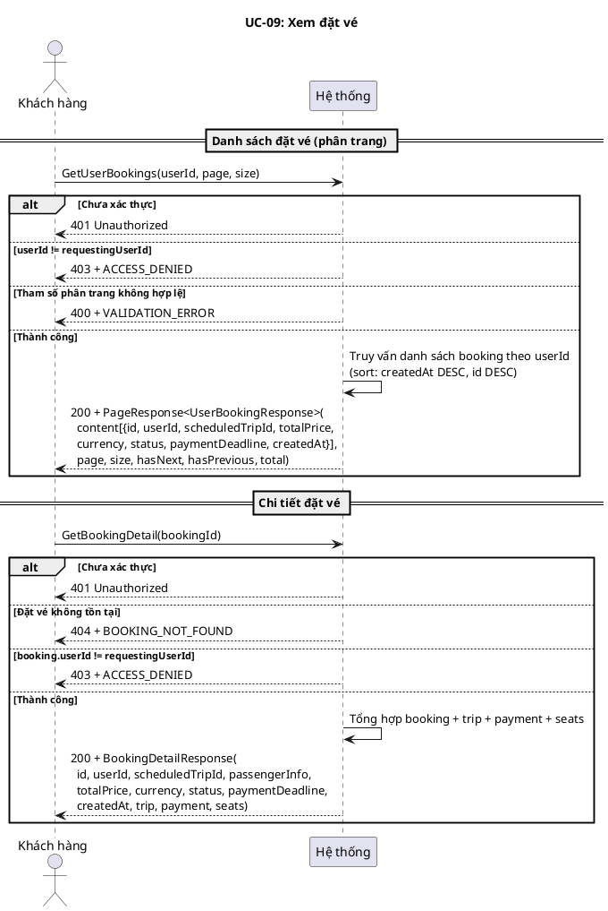
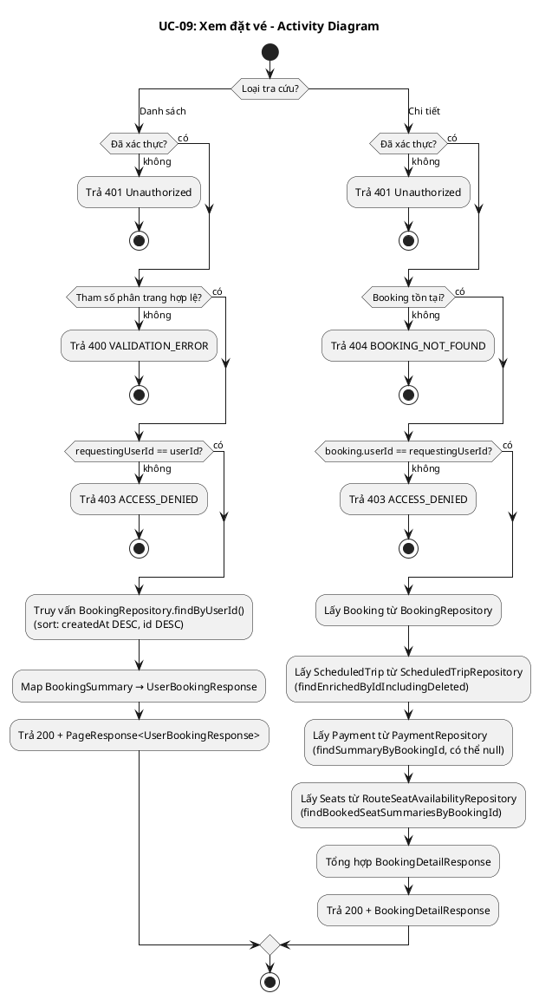
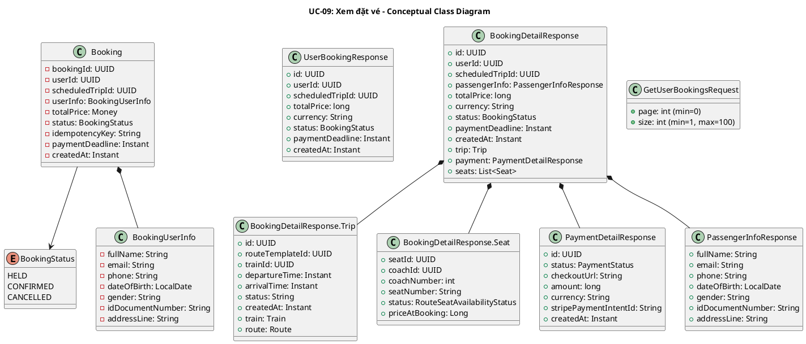
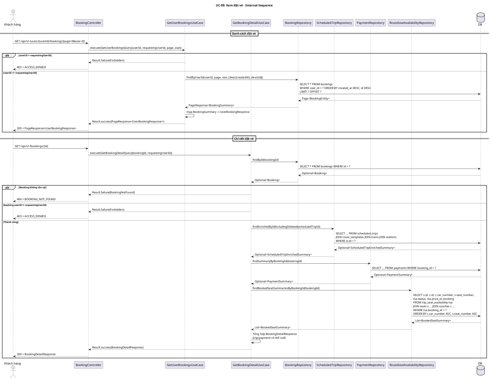
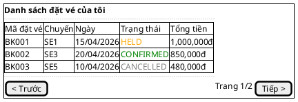
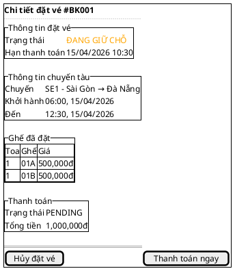

# UC-09: Xem đặt vé

# Mô tả use case

| Mục                            | Nội dung                                                                                                                                                                                                                                                                                                                                                                                                                                                                                                                                                                                                                                                                                                                                           |
| ------------------------------ | -------------------------------------------------------------------------------------------------------------------------------------------------------------------------------------------------------------------------------------------------------------------------------------------------------------------------------------------------------------------------------------------------------------------------------------------------------------------------------------------------------------------------------------------------------------------------------------------------------------------------------------------------------------------------------------------------------------------------------------------------- |
| Phụ thuộc                      | UC-02: Đăng nhập, UC-08: Đặt vé tàu                                                                                                                                                                                                                                                                                                                                                                                                                                                                                                                                                                                                                                                                                                                |
| Mục đích                       | Khách hàng cần theo dõi trạng thái đặt vé của mình (đang giữ, đã thanh toán, đã hủy) để biết cần thanh toán hay không, và xem lại thông tin chi tiết chuyến tàu, ghế, thanh toán liên quan đến mỗi đặt vé.                                                                                                                                                                                                                                                                                                                                                                                                                                                                                                                                         |
| Mô tả                          | Khách hàng xem danh sách đặt vé của mình (phân trang) hoặc xem chi tiết một đặt vé cụ thể bao gồm thông tin hành khách, chuyến tàu, ghế và thanh toán.                                                                                                                                                                                                                                                                                                                                                                                                                                                                                                                                                                                             |
| Actor chính                    | Khách hàng (Customer)                                                                                                                                                                                                                                                                                                                                                                                                                                                                                                                                                                                                                                                                                                                              |
| Actor liên quan                | Không                                                                                                                                                                                                                                                                                                                                                                                                                                                                                                                                                                                                                                                                                                                                              |
| Tiền điều kiện                 | Khách hàng đã đăng nhập và có access token hợp lệ.                                                                                                                                                                                                                                                                                                                                                                                                                                                                                                                                                                                                                                                                                                 |
| Dãy lệnh thực hiện bình thường | **Xem danh sách đặt vé:**   1. Khách hàng gửi yêu cầu xem danh sách đặt vé với `userId`, tham số phân trang (`page`, `size`).   2. Hệ thống xác thực quyền truy cập: `requestingUserId == userId` (chỉ xem đặt vé của chính mình).   3. Hệ thống truy vấn danh sách đặt vé phân trang, sắp xếp theo `createdAt DESC, id DESC`.   4. Hệ thống trả về `PageResponse<UserBookingResponse>`.    **Xem chi tiết đặt vé:**   1. Khách hàng gửi yêu cầu xem chi tiết một đặt vé theo `bookingId`.   2. Hệ thống xác thực quyền truy cập: `booking.userId == requestingUserId`.   3. Hệ thống tổng hợp thông tin từ booking, scheduled trip (bao gồm đã xóa), payment, và ghế.   4. Hệ thống trả về `BookingDetailResponse`. |
| Hậu điều kiện (thành công)     | Không có thay đổi trạng thái. Đây là thao tác chỉ đọc.                                                                                                                                                                                                                                                                                                                                                                                                                                                                                                                                                                                                                                                                                             |
| Hậu điều kiện (thất bại)       | Không có thay đổi trạng thái. Đây là thao tác chỉ đọc.                                                                                                                                                                                                                                                                                                                                                                                                                                                                                                                                                                                                                                                                                             |
| Xử lý ngoại lệ                 | Chưa xác thực → 401 Unauthorized.   Xem đặt vé của người khác (list) → 403 + `ACCESS_DENIED`.   Đặt vé không tồn tại (detail) → 404 + `BOOKING_NOT_FOUND`.   Xem đặt vé của người khác (detail) → 403 + `ACCESS_DENIED`.   Tham số phân trang không hợp lệ → 400 + `VALIDATION_ERROR`.                                                                                                                                                                                                                                                                                                                                                                                                                                                 |

# Lược đồ tuần tự

# Lược đồ hoạt động

# Lược đồ trạng thái

<!-- UC-09 là thao tác chỉ đọc, không có thay đổi trạng thái. Mục này bỏ qua. -->

_Không áp dụng — UC-09 là thao tác chỉ đọc._

# Lược đồ lớp ý niệm

# Phân rã thành phần PM

## Controller: `BookingController`

**Endpoint 1 — Danh sách đặt vé:**

- **Nhiệm vụ**: Nhận HTTP request xem danh sách đặt vé, lấy `requestingUserId`
  từ `Authentication`, ủy thác cho `GetUserBookingsUseCase`.
- **Endpoint**: `GET /api/v1/users/{userId}/bookings`
- **Input**: Path `userId: UUID` + Query `page: int` (default 0), `size: int`
  (default 20, max 100)
- **Output thành công**: `200` + `PageResponse<UserBookingResponse>` —
  `{ content[{id, userId, scheduledTripId, totalPrice, currency, status, paymentDeadline, createdAt}], page, size, hasNext, hasPrevious, total }`
- **Output lỗi**: `400` + `VALIDATION_ERROR` | `403` + `ACCESS_DENIED`
- **Metadata**:
  `@SuccessPayload(value = UserBookingResponse.class, kind = SuccessResponseKind.PAGE)`

**Endpoint 2 — Chi tiết đặt vé:**

- **Nhiệm vụ**: Nhận HTTP request xem chi tiết đặt vé, lấy `requestingUserId` từ
  `Authentication`, ủy thác cho `GetBookingDetailUseCase`.
- **Endpoint**: `GET /api/v1/bookings/{id}`
- **Input**: Path `id: UUID`
- **Output thành công**: `200` + `BookingDetailResponse` —
  `{ id, userId, scheduledTripId, passengerInfo, totalPrice, currency, status, paymentDeadline, createdAt, trip, payment, seats }`
- **Output lỗi**: `403` + `ACCESS_DENIED` | `404` + `BOOKING_NOT_FOUND`
- **Metadata**: `@SuccessPayload(BookingDetailResponse.class)`

## UseCase

**GetUserBookingsUseCase:**

- **Nhiệm vụ**: Trả danh sách đặt vé phân trang cho khách hàng, kiểm tra quyền
  sở hữu.
- **Input**: `GetUserBookingsQuery` — `{ userId, requestingUserId, page, size }`
- **Output**: `Result<PageResponse<UserBookingResponse>, BookingError>`
- **Logic**:
    1. So sánh `userId == requestingUserId` → nếu khác, trả
       `BookingError.Forbidden`
    2. Gọi
       `BookingRepository.findByUserId(userId, page, size, [desc(createdAt), desc(id)])`
    3. Map `BookingSummary` → `UserBookingResponse`
    4. Trả `PageResponse`

**GetBookingDetailUseCase:**

- **Nhiệm vụ**: Trả chi tiết đặt vé bao gồm thông tin chuyến tàu, thanh toán và
  ghế, kiểm tra quyền sở hữu.
- **Input**: `GetBookingDetailQuery` — `{ bookingId, requestingUserId }`
- **Output**: `Result<BookingDetailResponse, BookingError>`
- **Gọi đến**:
    - `BookingRepository.findById(bookingId)` — lấy booking entity
    - `ScheduledTripRepository.findEnrichedByIdIncludingDeleted(scheduledTripId)`
      — lấy thông tin chuyến tàu (bao gồm đã xóa mềm, có thể null)
    - `PaymentRepository.findSummaryByBookingId(bookingId)` — lấy thông tin
      thanh toán (có thể null nếu chưa tạo checkout session)
    - `RouteSeatAvailabilityRepository.findBookedSeatSummariesByBookingId(bookingId)`
      — lấy danh sách ghế đã đặt (JOIN seats + coaches, loại trừ soft-deleted)
<!-- - **Lưu ý**: `trip` và `payment` có thể `null` trong response — trip null nếu
  scheduled trip bị xóa hoàn toàn, payment null nếu chưa tạo checkout session. -->

## Repository

**BookingRepository:**

- **Nhiệm vụ**: Truy xuất domain entity `Booking` và projection
  `BookingSummary`.
- **Phương thức liên quan đến UC**:
    - `findById(BookingId): Optional<Booking>` — lấy booking entity đầy đủ
    - `findByUserId(UserId, page, size, sort): PageResponse<BookingSummary>` —
      danh sách đặt vé phân trang
- **Table**: `bookings`

**ScheduledTripRepository:**

- **Nhiệm vụ**: Truy xuất thông tin enriched của chuyến tàu.
- **Phương thức liên quan đến UC**:
    - `findEnrichedByIdIncludingDeleted(ScheduledTripId): Optional<ScheduledTripEnrichedSummary>`
      — lấy chuyến tàu kèm thông tin train, route, stations (bao gồm
      soft-deleted trips)
- **Table**: `scheduled_trips` JOIN `route_templates`, `trains`, `stations`

**PaymentRepository:**

- **Nhiệm vụ**: Truy xuất projection thanh toán.
- **Phương thức liên quan đến UC**:
    - `findSummaryByBookingId(BookingId): Optional<PaymentSummary>` — lấy thông
      tin thanh toán theo booking
- **Table**: `payments`

**RouteSeatAvailabilityRepository:**

- **Nhiệm vụ**: Truy xuất thông tin ghế đã đặt cho booking.
- **Phương thức liên quan đến UC**:
    - `findBookedSeatSummariesByBookingId(BookingId): List<BookedSeatSummary>` —
      lấy danh sách ghế kèm coach info, loại trừ seats/coaches đã soft-delete
- **Table**: `trip_seat_availability` JOIN `seats`, `coaches`

## Port

Không có actor hỗ trợ bên ngoài.

## Lược đồ tuần tự nội bộ PM

## Giao diện

### Giao diện mẫu

### Giao diện ứng dụng

Chưa hiện thực. Sẽ bổ sung ảnh chụp màn hình khi hoàn thành.

# Bảng tham chiếu dò vết

| Use Case | Controller        | Endpoint                              | UseCase                 | Repository                                                           | Table                                              |
| -------- | ----------------- | ------------------------------------- | ----------------------- | -------------------------------------------------------------------- | -------------------------------------------------- |
| UC-09    | BookingController | `GET /api/v1/users/{userId}/bookings` | GetUserBookingsUseCase  | BookingRepository.findByUserId()                                     | bookings                                           |
| UC-09    | BookingController | `GET /api/v1/bookings/{id}`           | GetBookingDetailUseCase | BookingRepository.findById()                                         | bookings                                           |
|          |                   |                                       |                         | ScheduledTripRepository.findEnrichedByIdIncludingDeleted()           | scheduled_trips, route_templates, trains, stations |
|          |                   |                                       |                         | PaymentRepository.findSummaryByBookingId()                           | payments                                           |
|          |                   |                                       |                         | RouteSeatAvailabilityRepository.findBookedSeatSummariesByBookingId() | trip_seat_availability, seats, coaches             |

# Tiêu chí kiểm thử

## Mức phân tích

| Tiêu chí             | Phép thử                                                                   | Kết quả mong đợi                          | Ghi chú                              |
| -------------------- | -------------------------------------------------------------------------- | ----------------------------------------- | ------------------------------------ |
| Toàn diện (coverage) | Đối chiếu Activity Diagram ↔ Sequence Diagram: mọi luồng đều được thể hiện | Không bỏ sót luồng chính lẫn ngoại lệ     | Rà soát chéo giữa mục 2 và mục 3     |
| Nhất quán            | Rà soát tên lớp, trạng thái, API giữa các lược đồ trong cùng UC            | Không mâu thuẫn giữa các mục 2–6          | Đặc biệt kiểm tra tên trong mục 5–6  |
| Truy vết             | Đối chiếu bảng tham chiếu (mục 7) với lược đồ tuần tự nội bộ (mục 6.5)     | Mọi tương tác trong sequence đều có entry | Kiểm tra không thiếu endpoint/method |

## Mức thiết kế

| Tiêu chí      | Phép thử                                                                          | Kết quả mong đợi                                       | Ghi chú                                |
| ------------- | --------------------------------------------------------------------------------- | ------------------------------------------------------ | -------------------------------------- |
| Chuẩn hóa     | Rà soát thiết kế BookingController, GetUserBookingsUseCase, GetBookingDetailUseCase, BookingRepository, ScheduledTripRepository, PaymentRepository, RouteSeatAvailabilityRepository | Tuân thủ Clean Architecture, quy ước đặt tên và hợp đồng | Walkthrough/inspection                 |
| Testability   | Rà soát khả năng mock BookingRepository, ScheduledTripRepository, PaymentRepository, RouteSeatAvailabilityRepository trong unit test | Có thể kiểm thử UseCase độc lập không cần DB thật       | Tất cả Repository là port              |
| Modularity    | Rà soát ranh giới trách nhiệm: Controller chỉ validate + route + extract auth, UseCase chỉ orchestrate + kiểm tra quyền, Repository chỉ persistence | Không trùng lặp trách nhiệm, coupling thấp             | Kiểm tra không có logic nghiệp vụ trong Controller |

## Mức hiện thực

| Tiêu chí          | Phép thử                                                                                  | Kết quả mong đợi                                                    | Ghi chú                                    |
| ----------------- | ----------------------------------------------------------------------------------------- | ------------------------------------------------------------------- | ------------------------------------------ |
| Xử lý chính xác   | Test luồng chính (list thành công, detail thành công), luồng lỗi (403 ACCESS_DENIED, 404 BOOKING_NOT_FOUND, 400 VALIDATION_ERROR) | 200 + đúng response structure cho cả 2 endpoint; 403/404/400 đúng error code | Kết hợp unit test UseCase + integration test endpoint |
| Phân trang         | Test phân trang với nhiều page, size khác nhau; verify sort order createdAt DESC, id DESC   | Kết quả đúng thứ tự, hasNext/hasPrevious/total chính xác             | Test edge case: page vượt quá, size=0, size>100 |
| Quyền truy cập    | Test xem đặt vé của người khác (cả list và detail)                                         | 403 + ACCESS_DENIED cho mọi trường hợp vi phạm quyền                | Verify không leak thông tin booking của user khác |
| Tổng hợp dữ liệu  | Test detail response khi trip/payment null (trip bị xóa, chưa tạo checkout session)        | Response trả về với trip=null và/hoặc payment=null, không lỗi 500    | Verify seats luôn trả về list (có thể rỗng) |
| Hiệu năng         | Benchmark endpoint GET /api/v1/users/{userId}/bookings với 100 concurrent requests          | Response time p95 < 500ms trong điều kiện tải bình thường            | Ghi rõ môi trường test                     |

## Danh sách test thỏa mãn mức hiện thực

<!-- Bảng liệt kê các test case cụ thể để kiểm chứng tiêu chí mức hiện thực.
     Mỗi test phải truy vết được về: endpoint/SP, bảng dữ liệu, file test. -->

### Backend

| # | Tên test case | Mô tả | Endpoint / SP | Table liên quan | Kết quả mong đợi | File test |
|---|---------------|--------|---------------|-----------------|-------------------|-----------|
| 1 | `returnsForbiddenWhenAuthenticatedUserDoesNotMatchPathUser` | Xem danh sách đặt vé của người khác | `GET /api/v1/users/{userId}/bookings` | `bookings` | `Result.failure(Forbidden)` | `backend/src/test/java/.../booking/application/usecase/GetUserBookingsUseCaseTest.java:35` |
| 2 | `returnsPagedBookingsNewestFirstUsingDefaultSort` | Xem danh sách thành công, sort createdAt DESC, id DESC | `GET /api/v1/users/{userId}/bookings` | `bookings` | `200` + `PageResponse<UserBookingResponse>` đúng thứ tự | `backend/src/test/java/.../booking/application/usecase/GetUserBookingsUseCaseTest.java:46` |
| 3 | `returnsEmptyPageWhenUserHasNoBookings` | Xem danh sách khi không có booking | `GET /api/v1/users/{userId}/bookings` | `bookings` | `200` + empty page, total=0 | `backend/src/test/java/.../booking/application/usecase/GetUserBookingsUseCaseTest.java:92` |
| 4 | `preservesPaginationMetadataAndContentOrderForLaterPages` | Phân trang page > 0, hasNext/hasPrevious chính xác | `GET /api/v1/users/{userId}/bookings` | `bookings` | `200` + page=1, hasNext=true, hasPrevious=true | `backend/src/test/java/.../booking/application/usecase/GetUserBookingsUseCaseTest.java:113` |
| 5 | `executeReturnsNotFoundWhenBookingMissing` | Xem chi tiết booking không tồn tại | `GET /api/v1/bookings/{id}` | `bookings` | `Result.failure(BookingNotFound)` | `backend/src/test/java/.../booking/application/usecase/GetBookingDetailUseCaseTest.java:77` |
| 6 | `executeReturnsForbiddenWhenRequesterDoesNotOwnBooking` | Xem chi tiết booking của người khác | `GET /api/v1/bookings/{id}` | `bookings` | `Result.failure(Forbidden)` | `backend/src/test/java/.../booking/application/usecase/GetBookingDetailUseCaseTest.java:89` |
| 7 | `executeReturnsEnrichedBookingDetail` | Xem chi tiết thành công với trip, payment, seats đầy đủ | `GET /api/v1/bookings/{id}` | `bookings`, `scheduled_trips`, `payments`, `trip_seat_availability` | `200` + `BookingDetailResponse` đầy đủ fields | `backend/src/test/java/.../booking/application/usecase/GetBookingDetailUseCaseTest.java:102` |
| 8 | `executeAllowsNullPaymentAndTrip` | Chi tiết khi trip bị xóa, chưa có payment | `GET /api/v1/bookings/{id}` | `bookings` | `200` + trip=null, payment=null, seats=[] | `backend/src/test/java/.../booking/application/usecase/GetBookingDetailUseCaseTest.java:141` |
| 9 | `executeSupportsLowercaseStatusesAndMultipleSeats` | Chi tiết với status lowercase, nhiều ghế | `GET /api/v1/bookings/{id}` | `bookings`, `trip_seat_availability`, `seats`, `coaches` | `200` + seats sorted, status parsed đúng | `backend/src/test/java/.../booking/application/usecase/GetBookingDetailUseCaseTest.java:164` |
| 10 | `listByUserReturnsPagedBookingHistory` | Controller trả 200 + paged response | `GET /api/v1/users/{userId}/bookings` | `bookings` | `200` + JsendResponse success | `backend/src/test/java/.../booking/infrastructure/web/BookingControllerTest.java:202` |
| 11 | `getByIdReturnsBookingDetail` | Controller trả 200 + detail response | `GET /api/v1/bookings/{id}` | `bookings` | `200` + JsendResponse success, trip/payment/seats not null | `backend/src/test/java/.../booking/infrastructure/web/BookingControllerTest.java:306` |
| 12 | `getByIdReturnsForbiddenWhenUseCaseRejectsAccess` | Controller trả 403 khi bị từ chối quyền | `GET /api/v1/bookings/{id}` | `bookings` | `403` + ACCESS_DENIED | `backend/src/test/java/.../booking/infrastructure/web/BookingControllerTest.java:393` |
| 13 | `getByIdReturnsNotFoundWhenBookingMissing` | Controller trả 404 khi booking không tồn tại | `GET /api/v1/bookings/{id}` | `bookings` | `404` + BOOKING_NOT_FOUND | `backend/src/test/java/.../booking/infrastructure/web/BookingControllerTest.java:411` |
| 14 | `listByUser_requiresAuthentication` | Annotation @PreAuthorize trên listByUser | `GET /api/v1/users/{userId}/bookings` | — | Annotation present | `backend/src/test/java/.../booking/infrastructure/web/BookingControllerSecurityTest.java:180` |
| 15 | `getById_requiresAuthentication` | Annotation @PreAuthorize trên getById | `GET /api/v1/bookings/{id}` | — | Annotation present | `backend/src/test/java/.../booking/infrastructure/web/BookingControllerSecurityTest.java:193` |
| 16 | `listByUser_nullAuthenticationThrowsNullPointerException` | Pen-test: null auth trên listByUser | `GET /api/v1/users/{userId}/bookings` | — | NullPointerException | `backend/src/test/java/.../booking/infrastructure/web/BookingControllerSecurityTest.java:109` |
| 17 | `getById_nullAuthenticationThrowsNullPointerException` | Pen-test: null auth trên getById | `GET /api/v1/bookings/{id}` | — | NullPointerException | `backend/src/test/java/.../booking/infrastructure/web/BookingControllerSecurityTest.java:119` |
| 18 | `listByUser_malformedUuidInAuthNameThrowsIllegalArgumentException` | Pen-test: UUID không hợp lệ trong auth | `GET /api/v1/users/{userId}/bookings` | — | IllegalArgumentException | `backend/src/test/java/.../booking/infrastructure/web/BookingControllerSecurityTest.java:138` |
| 19 | `getUserBookings_handles50ConcurrentRequestsWithConsistentResults` | Stress test 50 concurrent requests danh sách | `GET /api/v1/users/{userId}/bookings` | `bookings` | 50 results consistent, all success | `backend/src/test/java/.../booking/application/usecase/ViewBookingStressTest.java:61` |
| 20 | `getBookingDetail_handles50ConcurrentRequestsWithConsistentResults` | Stress test 50 concurrent requests chi tiết | `GET /api/v1/bookings/{id}` | `bookings`, `payments`, `trip_seat_availability` | 50 results consistent, all success | `backend/src/test/java/.../booking/application/usecase/ViewBookingStressTest.java:83` |

### Frontend

| # | Tên test case | Mô tả | Component / Hook | Kết quả mong đợi | File test |
|---|---------------|--------|------------------|-------------------|-----------|
| 1 | `renders booking cards with price information` | Hiển thị giá vé trong danh sách | `BookingsList` | Hiển thị 500.000 và 750.000 | `frontend/customer/src/components/account/bookings-list.test.tsx:85` |
| 2 | `displays booking status badges with localized text` | Hiển thị trạng thái đặt vé bằng tiếng Việt | `BookingsList` | "Chờ thanh toán", "Đã xác nhận" | `frontend/customer/src/components/account/bookings-list.test.tsx:99` |
| 3 | `shows view details links for bookings` | Hiển thị link xem chi tiết cho mỗi booking | `BookingsList` | 2 links "Xem chi tiết" | `frontend/customer/src/components/account/bookings-list.test.tsx:112` |
| 4 | `shows cancel button only for HELD bookings` | Chỉ hiển thị nút hủy cho booking HELD | `BookingsList` | 1 nút hủy (chỉ booking HELD) | `frontend/customer/src/components/account/bookings-list.test.tsx:125` |
| 5 | `opens cancel confirmation dialog when cancel is clicked` | Mở dialog xác nhận hủy khi click | `BookingsList` | Dialog "Xác nhận hủy vé" xuất hiện | `frontend/customer/src/components/account/bookings-list.test.tsx:141` |

## Bảng tiêu chí chất lượng theo chức năng

| Chức năng trong UC              | Tiêu chí mức Ý niệm                                                              | Tiêu chí mức Thiết kế                                                                      | Tiêu chí mức Hiện thực                                                                          |
| ------------------------------- | -------------------------------------------------------------------------------- | ------------------------------------------------------------------------------------------ | ----------------------------------------------------------------------------------------------- |
| Xem danh sách đặt vé (phân trang) | Đúng nhu cầu: khách hàng xem được danh sách đặt vé của mình, phân trang, sắp xếp mới nhất trước | Luồng xử lý chuẩn hóa qua Controller→UseCase→Repository, dễ test với mock                  | Unit test UseCase (2 cases: success + forbidden), integration test endpoint (happy + error paths) |
| Xem chi tiết đặt vé             | Đúng nhu cầu: khách hàng xem được đầy đủ thông tin booking, trip, payment, seats  | UseCase tổng hợp từ 4 Repository, xử lý nullable trip/payment gracefully                   | Unit test UseCase (4 cases: success, not found, forbidden, null trip/payment), integration test  |
| Kiểm tra quyền sở hữu          | Chỉ chủ sở hữu mới xem được đặt vé của mình                                      | UseCase kiểm tra requestingUserId == userId/booking.userId trước khi truy vấn dữ liệu       | Test cross-user access bị chặn, verify không leak data qua error message                         |
| Tổng hợp dữ liệu liên quan     | Thông tin chuyến tàu, thanh toán, ghế được hiển thị đầy đủ trong chi tiết          | Sử dụng enriched query (JOIN) và nullable handling cho trip/payment                         | Verify response fields đầy đủ, seats sorted by coach_number ASC + seat_number ASC               |
