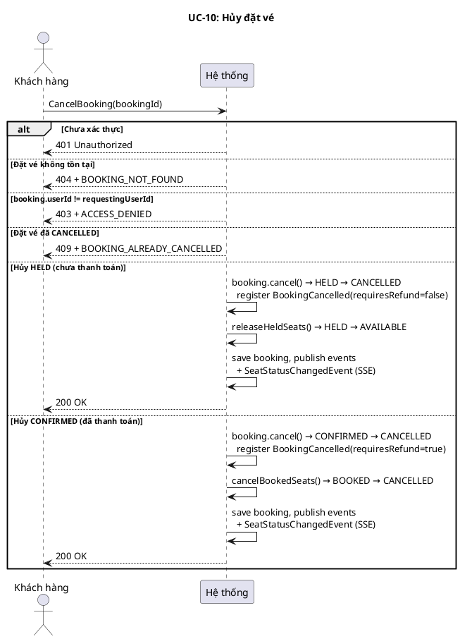
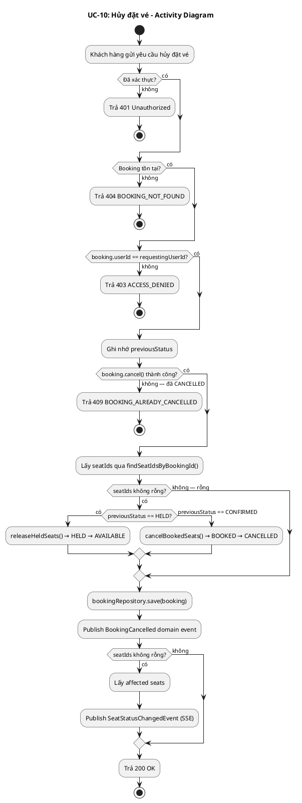
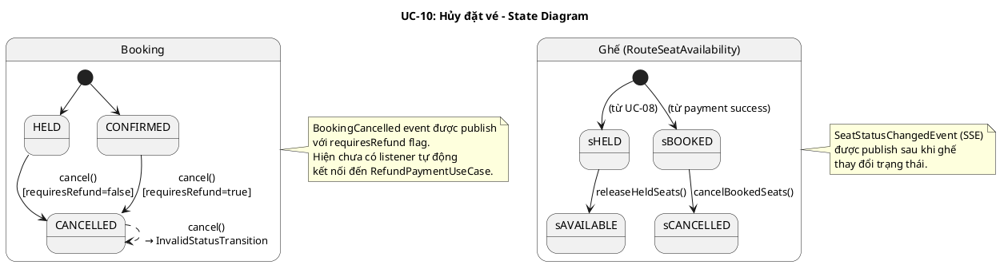
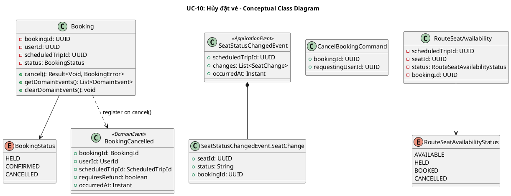
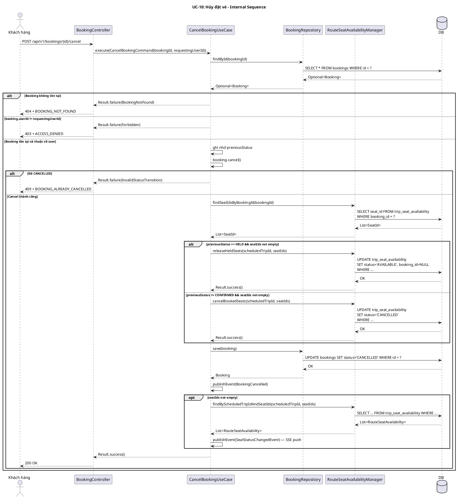
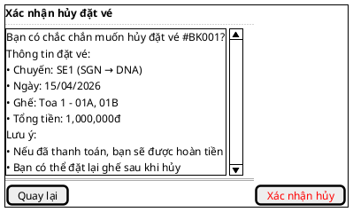

# UC-10: Hủy đặt vé

# Mô tả use case

| Mục                            | Nội dung                                                                                                                                                                                                                                                                                                                                                                                                                                                                                                                                                                                                                                                                                                                                                                                                                                                                                                                              |
| ------------------------------ | ------------------------------------------------------------------------------------------------------------------------------------------------------------------------------------------------------------------------------------------------------------------------------------------------------------------------------------------------------------------------------------------------------------------------------------------------------------------------------------------------------------------------------------------------------------------------------------------------------------------------------------------------------------------------------------------------------------------------------------------------------------------------------------------------------------------------------------------------------------------------------------------------------------------------------------- |
| Phụ thuộc                      | UC-02: Đăng nhập, UC-08: Đặt vé tàu, UC-09: Xem đặt vé                                                                                                                                                                                                                                                                                                                                                                                                                                                                                                                                                                                                                                                                                                                                                                                                                                                                                |
| Mục đích                       | Khách hàng cần hủy đặt vé khi thay đổi kế hoạch. Hệ thống giải phóng ghế đã giữ/đặt để người khác có thể sử dụng, và phát sinh sự kiện `BookingCancelled` mang cờ `requiresRefund` để hỗ trợ luồng hoàn tiền (nếu đã thanh toán).                                                                                                                                                                                                                                                                                                                                                                                                                                                                                                                                                                                                                                                                                                     |
| Mô tả                          | Khách hàng hủy một đặt vé đang ở trạng thái `HELD` (chưa thanh toán) hoặc `CONFIRMED` (đã thanh toán). Hệ thống giải phóng ghế và phát sinh sự kiện `BookingCancelled`.                                                                                                                                                                                                                                                                                                                                                                                                                                                                                                                                                                                                                                                                                                                                                               |
| Actor chính                    | Khách hàng (Customer)                                                                                                                                                                                                                                                                                                                                                                                                                                                                                                                                                                                                                                                                                                                                                                                                                                                                                                                 |
| Actor liên quan                | Không (Ghi chú: sự kiện `BookingCancelled(requiresRefund=true)` được publish nhưng hiện chưa có listener tự động nối đến `RefundPaymentUseCase`. Luồng hoàn tiền qua Stripe chưa được wiring.)                                                                                                                                                                                                                                                                                                                                                                                                                                                                                                                                                                                                                                                                                                                                        |
| Tiền điều kiện                 | Khách hàng đã đăng nhập và có access token hợp lệ. Đặt vé đang ở trạng thái `HELD` hoặc `CONFIRMED`.                                                                                                                                                                                                                                                                                                                                                                                                                                                                                                                                                                                                                                                                                                                                                                                                                                  |
| Dãy lệnh thực hiện bình thường | **Hủy đặt vé HELD (chưa thanh toán):**   1. Khách hàng gửi yêu cầu hủy đặt vé theo `bookingId`.   2. Hệ thống xác thực quyền: `booking.userId == requestingUserId`.   3. Hệ thống gọi `booking.cancel()` → chuyển `HELD → CANCELLED`, register `BookingCancelled(requiresRefund=false)`.   4. Hệ thống lấy danh sách seatIds qua `RouteSeatAvailabilityManager.findSeatIdsByBookingId()`.   5. Hệ thống gọi `releaseHeldSeats(scheduledTripId, seatIds)` → ghế `HELD → AVAILABLE`.   6. Hệ thống lưu booking, publish domain events + `SeatStatusChangedEvent` (SSE).   7. Hệ thống trả về 200 OK.    **Hủy đặt vé CONFIRMED (đã thanh toán):**   1–2. Như trên.   3. `booking.cancel()` → `CONFIRMED → CANCELLED`, register `BookingCancelled(requiresRefund=true)`.   4. Lấy seatIds.   5. Gọi `cancelBookedSeats(scheduledTripId, seatIds)` → ghế `BOOKED → CANCELLED`.   6–7. Như trên. |
| Hậu điều kiện (thành công)     | Đặt vé ở trạng thái `CANCELLED`. Ghế được giải phóng (`HELD → AVAILABLE`) hoặc hủy (`BOOKED → CANCELLED`). Sự kiện `BookingCancelled` được publish. `SeatStatusChangedEvent` được publish (SSE push).                                                                                                                                                                                                                                                                                                                                                                                                                                                                                                                                                                                                                                                                                                                                 |
| Hậu điều kiện (thất bại)       | Không có thay đổi trạng thái. Transaction rollback nếu có lỗi.                                                                                                                                                                                                                                                                                                                                                                                                                                                                                                                                                                                                                                                                                                                                                                                                                                                                        |
| Xử lý ngoại lệ                 | Chưa xác thực → 401 Unauthorized.   Đặt vé không tồn tại → 404 + `BOOKING_NOT_FOUND`.   Hủy đặt vé của người khác → 403 + `ACCESS_DENIED`.   Đặt vé đã ở trạng thái `CANCELLED` → 409 + `BOOKING_ALREADY_CANCELLED` (do `InvalidStatusTransition`).                                                                                                                                                                                                                                                                                                                                                                                                                                                                                                                                                                                                                                                                          |

# Lược đồ tuần tự

# Lược đồ hoạt động

# Lược đồ trạng thái

# Lược đồ lớp ý niệm

# Phân rã thành phần PM

## Controller: `BookingController`

- **Nhiệm vụ**: Nhận HTTP request hủy đặt vé, lấy `requestingUserId` từ
  `Authentication`, ủy thác cho `CancelBookingUseCase`.
- **Endpoint**: `POST /api/v1/bookings/{id}/cancel`
- **Input**: Path `id: UUID`
- **Output thành công**: `200` + `JsendResponse.success()` (body trống, không có
  data payload)
- **Output lỗi**: `403` + `ACCESS_DENIED` | `404` + `BOOKING_NOT_FOUND` |
  `409` + `BOOKING_ALREADY_CANCELLED`
- **Metadata**: `@SuccessPayload` (không có value — response body trống)
- **Error mapping**:
    - `BookingError.BookingNotFound` → `404` + `BOOKING_NOT_FOUND`
    - `BookingError.Forbidden` → `403` + `ACCESS_DENIED`
    - `BookingError.InvalidStatusTransition` → `409` +
      `BOOKING_ALREADY_CANCELLED`

## UseCase: `CancelBookingUseCase`

- **Nhiệm vụ**: Orchestrate luồng hủy đặt vé đồng bộ, bao gồm giải phóng ghế và
  phát sinh sự kiện.
- **Input**: `CancelBookingCommand` — `{ bookingId, requestingUserId }`
- **Output**: `Result<Void, BookingError>`
- **Annotation**: `@Transactional`
- **Gọi đến**:
    - `BookingRepository.findById(bookingId)` — lấy booking entity
    - `Booking.cancel()` — chuyển trạng thái và register `BookingCancelled`
      event
    - `RouteSeatAvailabilityManager.findSeatIdsByBookingId(bookingId)` — lấy
      danh sách ghế liên quan
    - `RouteSeatAvailabilityManager.releaseHeldSeats(scheduledTripId, seatIds)`
      — giải phóng ghế HELD → AVAILABLE (nếu previousStatus == HELD)
    - `RouteSeatAvailabilityManager.cancelBookedSeats(scheduledTripId, seatIds)`
      — hủy ghế BOOKED → CANCELLED (nếu previousStatus == CONFIRMED)
    - `BookingRepository.save(booking)` — lưu booking đã hủy
    - `ApplicationEventPublisher.publishEvent(DomainEvent)` — publish
      `BookingCancelled`
    - `RouteSeatAvailabilityManager.findByScheduledTripIdAndSeatIds(...)` — lấy
      trạng thái ghế sau cập nhật
    - `ApplicationEventPublisher.publishEvent(SeatStatusChangedEvent)` — SSE
      push
- **Phát sinh sự kiện**:
    - `BookingCancelled(bookingId, userId, scheduledTripId, requiresRefund, occurredAt)`
      — `requiresRefund=false` nếu HELD, `true` nếu CONFIRMED
    - `SeatStatusChangedEvent(scheduledTripId, changes, occurredAt)` — SSE push
      cho real-time seat map update

## Repository

**BookingRepository:**

- **Nhiệm vụ**: Truy xuất và lưu trữ domain entity `Booking`.
- **Phương thức liên quan đến UC**:
    - `findById(BookingId): Optional<Booking>` — lấy booking entity
    - `save(Booking): Booking` — lưu booking đã hủy
- **Table**: `bookings`

## Port: `RouteSeatAvailabilityManager`

- **Nhiệm vụ**: Cross-module port cho phép booking module thao tác trạng thái
  ghế trên scheduled trip.
- **Phương thức liên quan đến UC**:
    - `findSeatIdsByBookingId(UUID): List<SeatId>` — tìm ghế liên quan đến
      booking
    - `releaseHeldSeats(ScheduledTripId, List<SeatId>): Result<Void, Error>` —
      giải phóng ghế `HELD → AVAILABLE`
    - `cancelBookedSeats(ScheduledTripId, List<SeatId>): Result<Void, Error>` —
      hủy ghế `BOOKED → CANCELLED`
    - `findByScheduledTripIdAndSeatIds(ScheduledTripId, List<SeatId>): List<RouteSeatAvailability>`
      — lấy trạng thái ghế sau cập nhật (cho SSE event)
- **Implementation**: `RouteSeatAvailabilityManagerAdapter` (train BC)

## Lược đồ tuần tự nội bộ PM

## Giao diện

### Giao diện mẫu

### Giao diện ứng dụng

Chưa hiện thực. Sẽ bổ sung ảnh chụp màn hình khi hoàn thành.

# Bảng tham chiếu dò vết

| Use Case | Controller        | Endpoint                            | UseCase              | Repository / Port                                              | Table                  |
| -------- | ----------------- | ----------------------------------- | -------------------- | -------------------------------------------------------------- | ---------------------- |
| UC-10    | BookingController | `POST /api/v1/bookings/{id}/cancel` | CancelBookingUseCase | BookingRepository.findById()                                   | bookings               |
|          |                   |                                     |                      | BookingRepository.save()                                       | bookings               |
|          |                   |                                     |                      | RouteSeatAvailabilityManager.findSeatIdsByBookingId()          | trip_seat_availability |
|          |                   |                                     |                      | RouteSeatAvailabilityManager.releaseHeldSeats()                | trip_seat_availability |
|          |                   |                                     |                      | RouteSeatAvailabilityManager.cancelBookedSeats()               | trip_seat_availability |
|          |                   |                                     |                      | RouteSeatAvailabilityManager.findByScheduledTripIdAndSeatIds() | trip_seat_availability |

# Tiêu chí kiểm thử

## Mức phân tích

| Tiêu chí             | Phép thử                                                                   | Kết quả mong đợi                          | Ghi chú                              |
| -------------------- | -------------------------------------------------------------------------- | ----------------------------------------- | ------------------------------------ |
| Toàn diện (coverage) | Đối chiếu Activity Diagram ↔ Sequence Diagram: mọi luồng đều được thể hiện | Không bỏ sót luồng chính lẫn ngoại lệ     | Rà soát chéo giữa mục 2 và mục 3     |
| Nhất quán            | Rà soát tên lớp, trạng thái, API giữa các lược đồ trong cùng UC            | Không mâu thuẫn giữa các mục 2–6          | Đặc biệt kiểm tra tên trong mục 5–6  |
| Truy vết             | Đối chiếu bảng tham chiếu (mục 7) với lược đồ tuần tự nội bộ (mục 6.5)     | Mọi tương tác trong sequence đều có entry | Kiểm tra không thiếu endpoint/method |

## Mức thiết kế

| Tiêu chí      | Phép thử                                                                          | Kết quả mong đợi                                       | Ghi chú                                |
| ------------- | --------------------------------------------------------------------------------- | ------------------------------------------------------ | -------------------------------------- |
| Chuẩn hóa     | Rà soát thiết kế BookingController, CancelBookingUseCase, BookingRepository, RouteSeatAvailabilityManager | Tuân thủ Clean Architecture, quy ước đặt tên và hợp đồng | Walkthrough/inspection                 |
| Testability   | Rà soát khả năng mock BookingRepository, RouteSeatAvailabilityManager trong unit test | Có thể kiểm thử UseCase độc lập không cần DB thật       | Repository và Port đều là interface    |
| Modularity    | Rà soát ranh giới trách nhiệm: Controller chỉ validate + route, UseCase chỉ orchestrate, Repository chỉ persistence, Port chỉ cross-module | Không trùng lặp trách nhiệm, coupling thấp             | Kiểm tra không có logic nghiệp vụ trong Controller |

## Mức hiện thực

| Tiêu chí          | Phép thử                                                                                  | Kết quả mong đợi                                                    | Ghi chú                                    |
| ----------------- | ----------------------------------------------------------------------------------------- | ------------------------------------------------------------------- | ------------------------------------------ |
| Xử lý chính xác   | Test luồng chính (hủy HELD thành công, hủy CONFIRMED thành công), luồng lỗi (booking không tồn tại, không có quyền, đã cancelled) | 200 OK; 404 + BOOKING_NOT_FOUND; 403 + ACCESS_DENIED; 409 + BOOKING_ALREADY_CANCELLED | Kết hợp unit test UseCase + integration test endpoint |
| Hiệu năng         | Benchmark endpoint POST /api/v1/bookings/{id}/cancel với 100 concurrent requests           | Response time p95 < 500ms trong điều kiện tải bình thường            | Ghi rõ môi trường test                     |
| Bảo mật           | Kiểm tra chỉ owner mới hủy được booking, xác thực token hợp lệ, không lộ thông tin booking của user khác | 401 nếu chưa xác thực, 403 nếu không phải owner, không leak data    | Kiểm tra cả race condition khi hủy đồng thời |
| Tính nhất quán dữ liệu | Kiểm tra trạng thái ghế và booking đồng bộ sau khi hủy, rollback khi có lỗi giữa chừng | Booking=CANCELLED ↔ Ghế=AVAILABLE/CANCELLED tương ứng; rollback toàn bộ nếu lỗi | Verify trong transaction boundary          |

## Danh sách test thỏa mãn mức hiện thực

<!-- Bảng liệt kê các test case cụ thể để kiểm chứng tiêu chí mức hiện thực.
     Mỗi test phải truy vết được về: endpoint/SP, bảng dữ liệu, file test. -->

### Backend

| # | Tên test case | Mô tả | Endpoint / SP | Table liên quan | Kết quả mong đợi | File test |
|---|---------------|--------|---------------|-----------------|-------------------|-----------|
| 1 | `execute_heldbooking_cancelsAndReleasesHeldSeats` | Hủy booking HELD thành công, giải phóng ghế qua releaseHeldSeats | `POST /api/v1/bookings/{id}/cancel` | `bookings`, `trip_seat_availability` | `Result.success`, gọi `releaseHeldSeats`, không gọi `cancelBookedSeats` | `backend/src/test/java/.../booking/application/usecase/CancelBookingUseCaseTest.java:87` |
| 2 | `execute_confirmedBooking_cancelsAndCancelsBookedSeats` | Hủy booking CONFIRMED thành công, hủy ghế qua cancelBookedSeats | `POST /api/v1/bookings/{id}/cancel` | `bookings`, `trip_seat_availability` | `Result.success`, gọi `cancelBookedSeats`, không gọi `releaseHeldSeats` | `backend/src/test/java/.../booking/application/usecase/CancelBookingUseCaseTest.java:111` |
| 3 | `execute_returnsBookingNotFound_whenBookingMissing` | Booking không tồn tại | `POST /api/v1/bookings/{id}/cancel` | `bookings` | `Result.failure(BookingNotFound)` | `backend/src/test/java/.../booking/application/usecase/CancelBookingUseCaseTest.java:135` |
| 4 | `execute_returnsForbidden_whenUserIdMismatch` | Hủy booking của người khác | `POST /api/v1/bookings/{id}/cancel` | `bookings` | `Result.failure(Forbidden)` | `backend/src/test/java/.../booking/application/usecase/CancelBookingUseCaseTest.java:148` |
| 5 | `execute_returnsInvalidStatusTransition_whenAlreadyCancelled` | Booking đã ở trạng thái CANCELLED | `POST /api/v1/bookings/{id}/cancel` | `bookings` | `Result.failure(InvalidStatusTransition)` | `backend/src/test/java/.../booking/application/usecase/CancelBookingUseCaseTest.java:162` |
| 6 | `execute_publishesBookingCancelledEventOnSuccess` | Publish BookingCancelled event khi hủy thành công | `POST /api/v1/bookings/{id}/cancel` | `bookings` | `eventPublisher.publishEvent(BookingCancelled)` | `backend/src/test/java/.../booking/application/usecase/CancelBookingUseCaseTest.java:181` |
| 7 | `execute_publishesSeatStatusChangedEventWhenSeatsExist` | Publish SeatStatusChangedEvent (SSE) khi có ghế liên quan | `POST /api/v1/bookings/{id}/cancel` | `trip_seat_availability` | `eventPublisher.publishEvent(SeatStatusChangedEvent)` | `backend/src/test/java/.../booking/application/usecase/CancelBookingUseCaseTest.java:197` |
| 8 | `execute_skipsSeatReleaseWhenNoSeatsFound` | Bỏ qua giải phóng ghế khi không tìm thấy ghế cho booking | `POST /api/v1/bookings/{id}/cancel` | `trip_seat_availability` | `Result.success`, không gọi releaseHeldSeats/cancelBookedSeats | `backend/src/test/java/.../booking/application/usecase/CancelBookingUseCaseTest.java:222` |
| 9 | `cancelReturnsOkOnSuccess` | Controller trả 200 OK khi UseCase thành công | `POST /api/v1/bookings/{id}/cancel` | — | `200 OK` + `JsendResponse(success)` | `backend/src/test/java/.../booking/infrastructure/web/BookingControllerTest.java:128` |
| 10 | `cancelReturnsNotFoundWhenBookingMissing` | Controller trả 404 khi BookingNotFound | `POST /api/v1/bookings/{id}/cancel` | — | `404` + `BOOKING_NOT_FOUND` | `backend/src/test/java/.../booking/infrastructure/web/BookingControllerTest.java:144` |
| 11 | `execute_allowsOnlyOneCancellationForSameBookingUnderConcurrentLoad` | Stress test: chỉ 1 hủy thành công khi 50 request đồng thời cùng booking | `POST /api/v1/bookings/{id}/cancel` | `bookings`, `trip_seat_availability` | 1 success, 49 failure; booking=CANCELLED, seat=AVAILABLE | `backend/src/test/java/.../booking/application/usecase/CancelBookingStressTest.java:56` |

### Frontend

| # | Tên test case | Mô tả | Component / Flow | Kết quả mong đợi | File test |
|---|---------------|--------|------------------|-------------------|-----------|
| 1 | `determines if booking can be cancelled based on status` | Kiểm tra logic cho phép hủy theo trạng thái | `canCancelBooking` utility | `HELD → true`, `CONFIRMED → false`, `CANCELLED → false` | `frontend/customer/src/__tests__/customer-flows.integration.test.ts:172` |
| 2 | `shows cancel button only for HELD bookings` | Chỉ hiển thị nút hủy cho booking HELD | `BookingsList` component | Chỉ 1 nút hủy (cho booking HELD) | `frontend/customer/src/components/account/bookings-list.test.tsx:125` |
| 3 | `opens cancel confirmation dialog when cancel is clicked` | Mở dialog xác nhận khi nhấn nút hủy | `BookingsList` component | Dialog "Xác nhận hủy vé" hiển thị | `frontend/customer/src/components/account/bookings-list.test.tsx:141` |
| 4 | `renders booking cards with price information` | Hiển thị danh sách booking với giá | `BookingsList` component | Hiển thị 500.000 và 750.000 | `frontend/customer/src/components/account/bookings-list.test.tsx:85` |
| 5 | `displays booking status badges with localized text` | Hiển thị badge trạng thái đã dịch | `BookingsList` component | "Chờ thanh toán", "Đã xác nhận" | `frontend/customer/src/components/account/bookings-list.test.tsx:99` |

## Bảng tiêu chí chất lượng theo chức năng

| Chức năng trong UC              | Tiêu chí mức Ý niệm                                                           | Tiêu chí mức Thiết kế                                                                    | Tiêu chí mức Hiện thực                                                                        |
| ------------------------------- | ----------------------------------------------------------------------------- | ---------------------------------------------------------------------------------------- | --------------------------------------------------------------------------------------------- |
| Hủy đặt vé HELD                 | Đúng nhu cầu: khách hàng hủy được booking chưa thanh toán, ghế được giải phóng | Luồng xử lý chuẩn hóa qua Controller→UseCase→Repository→Port, dễ test với mock            | Unit test UseCase (HELD cancel success + error paths), integration test endpoint               |
| Hủy đặt vé CONFIRMED            | Đúng nhu cầu: khách hàng hủy được booking đã thanh toán, phát sinh requiresRefund=true | UseCase phân biệt previousStatus để gọi đúng method trên Port                             | Test cancel CONFIRMED → ghế BOOKED→CANCELLED, verify BookingCancelled(requiresRefund=true)    |
| Kiểm tra quyền sở hữu          | Chỉ owner mới được hủy booking của mình                                        | UseCase kiểm tra booking.userId == requestingUserId trước khi thực hiện cancel             | Test hủy booking của người khác → 403 ACCESS_DENIED                                           |
| Giải phóng ghế                  | Ghế được trả về trạng thái phù hợp sau khi hủy                                | Port tách biệt releaseHeldSeats vs cancelBookedSeats theo previousStatus                   | Verify ghế HELD→AVAILABLE hoặc BOOKED→CANCELLED tương ứng, SSE event được publish             |
| Phát sinh sự kiện BookingCancelled | Sự kiện mang đủ thông tin cho downstream (hoàn tiền nếu cần)                  | Domain event register trong aggregate, publish sau save thành công                         | Verify event chứa đúng bookingId, userId, scheduledTripId, requiresRefund, occurredAt         |
