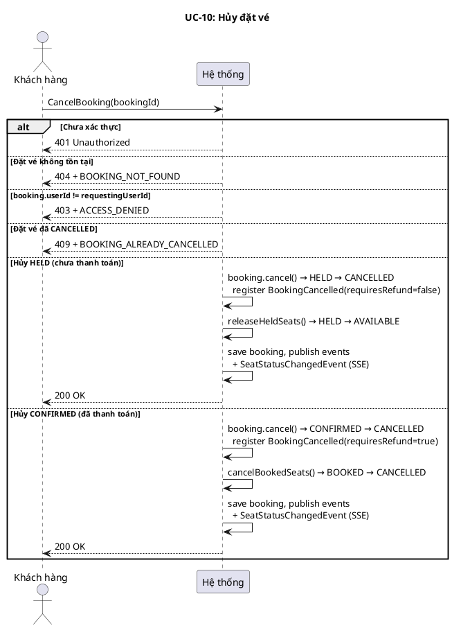
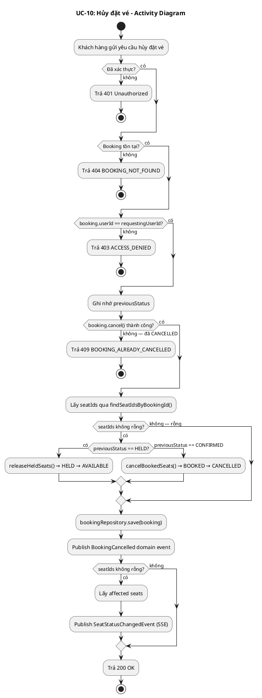
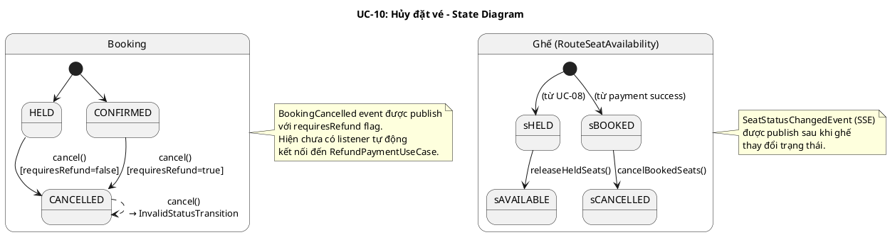
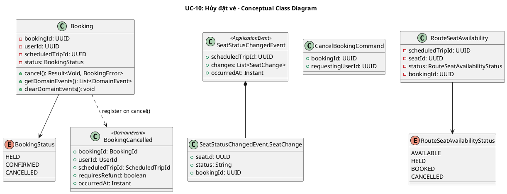
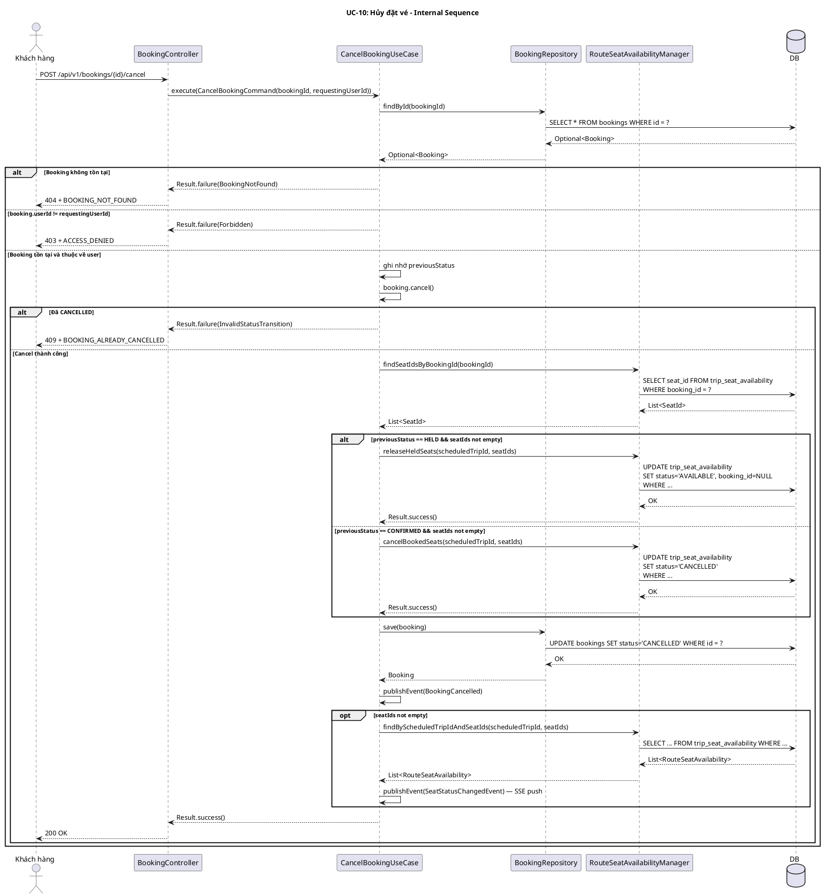
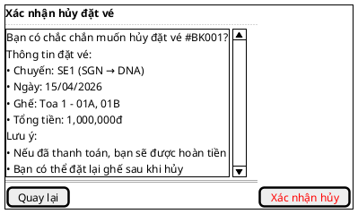

# UC-10: Hủy đặt vé

# Mô tả use case

| Mục                            | Nội dung                                                                                                                                                                                                                                                                                                                                                                                                                                                                                                                                                                                                                                                                                                                                                                                                                                                                                                                              |
| ------------------------------ | ------------------------------------------------------------------------------------------------------------------------------------------------------------------------------------------------------------------------------------------------------------------------------------------------------------------------------------------------------------------------------------------------------------------------------------------------------------------------------------------------------------------------------------------------------------------------------------------------------------------------------------------------------------------------------------------------------------------------------------------------------------------------------------------------------------------------------------------------------------------------------------------------------------------------------------- |
| Phụ thuộc                      | UC-02: Đăng nhập, UC-08: Đặt vé tàu, UC-09: Xem đặt vé                                                                                                                                                                                                                                                                                                                                                                                                                                                                                                                                                                                                                                                                                                                                                                                                                                                                                |
| Mục đích                       | Khách hàng cần hủy đặt vé khi thay đổi kế hoạch. Hệ thống giải phóng ghế đã giữ/đặt để người khác có thể sử dụng, và phát sinh sự kiện `BookingCancelled` mang cờ `requiresRefund` để hỗ trợ luồng hoàn tiền (nếu đã thanh toán).                                                                                                                                                                                                                                                                                                                                                                                                                                                                                                                                                                                                                                                                                                     |
| Mô tả                          | Khách hàng hủy một đặt vé đang ở trạng thái `HELD` (chưa thanh toán) hoặc `CONFIRMED` (đã thanh toán). Hệ thống giải phóng ghế và phát sinh sự kiện `BookingCancelled`.                                                                                                                                                                                                                                                                                                                                                                                                                                                                                                                                                                                                                                                                                                                                                               |
| Actor chính                    | Khách hàng (Customer)                                                                                                                                                                                                                                                                                                                                                                                                                                                                                                                                                                                                                                                                                                                                                                                                                                                                                                                 |
| Actor liên quan                | Không (Ghi chú: sự kiện `BookingCancelled(requiresRefund=true)` được publish nhưng hiện chưa có listener tự động nối đến `RefundPaymentUseCase`. Luồng hoàn tiền qua Stripe chưa được wiring.)                                                                                                                                                                                                                                                                                                                                                                                                                                                                                                                                                                                                                                                                                                                                        |
| Tiền điều kiện                 | Khách hàng đã đăng nhập và có access token hợp lệ. Đặt vé đang ở trạng thái `HELD` hoặc `CONFIRMED`.                                                                                                                                                                                                                                                                                                                                                                                                                                                                                                                                                                                                                                                                                                                                                                                                                                  |
| Dãy lệnh thực hiện bình thường | **Hủy đặt vé HELD (chưa thanh toán):**   1. Khách hàng gửi yêu cầu hủy đặt vé theo `bookingId`.   2. Hệ thống xác thực quyền: `booking.userId == requestingUserId`.   3. Hệ thống gọi `booking.cancel()` → chuyển `HELD → CANCELLED`, register `BookingCancelled(requiresRefund=false)`.   4. Hệ thống lấy danh sách seatIds qua `RouteSeatAvailabilityManager.findSeatIdsByBookingId()`.   5. Hệ thống gọi `releaseHeldSeats(scheduledTripId, seatIds)` → ghế `HELD → AVAILABLE`.   6. Hệ thống lưu booking, publish domain events + `SeatStatusChangedEvent` (SSE).   7. Hệ thống trả về 200 OK.    **Hủy đặt vé CONFIRMED (đã thanh toán):**   1–2. Như trên.   3. `booking.cancel()` → `CONFIRMED → CANCELLED`, register `BookingCancelled(requiresRefund=true)`.   4. Lấy seatIds.   5. Gọi `cancelBookedSeats(scheduledTripId, seatIds)` → ghế `BOOKED → CANCELLED`.   6–7. Như trên. |
| Hậu điều kiện (thành công)     | Đặt vé ở trạng thái `CANCELLED`. Ghế được giải phóng (`HELD → AVAILABLE`) hoặc hủy (`BOOKED → CANCELLED`). Sự kiện `BookingCancelled` được publish. `SeatStatusChangedEvent` được publish (SSE push).                                                                                                                                                                                                                                                                                                                                                                                                                                                                                                                                                                                                                                                                                                                                 |
| Hậu điều kiện (thất bại)       | Không có thay đổi trạng thái. Transaction rollback nếu có lỗi.                                                                                                                                                                                                                                                                                                                                                                                                                                                                                                                                                                                                                                                                                                                                                                                                                                                                        |
| Xử lý ngoại lệ                 | Chưa xác thực → 401 Unauthorized.   Đặt vé không tồn tại → 404 + `BOOKING_NOT_FOUND`.   Hủy đặt vé của người khác → 403 + `ACCESS_DENIED`.   Đặt vé đã ở trạng thái `CANCELLED` → 409 + `BOOKING_ALREADY_CANCELLED` (do `InvalidStatusTransition`).                                                                                                                                                                                                                                                                                                                                                                                                                                                                                                                                                                                                                                                                          |

# Lược đồ tuần tự

# Lược đồ hoạt động

# Lược đồ trạng thái

# Lược đồ lớp ý niệm

# Phân rã thành phần PM

## Controller: `BookingController`

- **Nhiệm vụ**: Nhận HTTP request hủy đặt vé, lấy `requestingUserId` từ
  `Authentication`, ủy thác cho `CancelBookingUseCase`.
- **Endpoint**: `POST /api/v1/bookings/{id}/cancel`
- **Input**: Path `id: UUID`
- **Output thành công**: `200` + `JsendResponse.success()` (body trống, không có
  data payload)
- **Output lỗi**: `403` + `ACCESS_DENIED` | `404` + `BOOKING_NOT_FOUND` |
  `409` + `BOOKING_ALREADY_CANCELLED`
- **Metadata**: `@SuccessPayload` (không có value — response body trống)
- **Error mapping**:
    - `BookingError.BookingNotFound` → `404` + `BOOKING_NOT_FOUND`
    - `BookingError.Forbidden` → `403` + `ACCESS_DENIED`
    - `BookingError.InvalidStatusTransition` → `409` +
      `BOOKING_ALREADY_CANCELLED`

## UseCase: `CancelBookingUseCase`

- **Nhiệm vụ**: Orchestrate luồng hủy đặt vé đồng bộ, bao gồm giải phóng ghế và
  phát sinh sự kiện.
- **Input**: `CancelBookingCommand` — `{ bookingId, requestingUserId }`
- **Output**: `Result<Void, BookingError>`
- **Annotation**: `@Transactional`
- **Gọi đến**:
    - `BookingRepository.findById(bookingId)` — lấy booking entity
    - `Booking.cancel()` — chuyển trạng thái và register `BookingCancelled`
      event
    - `RouteSeatAvailabilityManager.findSeatIdsByBookingId(bookingId)` — lấy
      danh sách ghế liên quan
    - `RouteSeatAvailabilityManager.releaseHeldSeats(scheduledTripId, seatIds)`
      — giải phóng ghế HELD → AVAILABLE (nếu previousStatus == HELD)
    - `RouteSeatAvailabilityManager.cancelBookedSeats(scheduledTripId, seatIds)`
      — hủy ghế BOOKED → CANCELLED (nếu previousStatus == CONFIRMED)
    - `BookingRepository.save(booking)` — lưu booking đã hủy
    - `ApplicationEventPublisher.publishEvent(DomainEvent)` — publish
      `BookingCancelled`
    - `RouteSeatAvailabilityManager.findByScheduledTripIdAndSeatIds(...)` — lấy
      trạng thái ghế sau cập nhật
    - `ApplicationEventPublisher.publishEvent(SeatStatusChangedEvent)` — SSE
      push
- **Phát sinh sự kiện**:
    - `BookingCancelled(bookingId, userId, scheduledTripId, requiresRefund, occurredAt)`
      — `requiresRefund=false` nếu HELD, `true` nếu CONFIRMED
    - `SeatStatusChangedEvent(scheduledTripId, changes, occurredAt)` — SSE push
      cho real-time seat map update

## Repository

**BookingRepository:**

- **Nhiệm vụ**: Truy xuất và lưu trữ domain entity `Booking`.
- **Phương thức liên quan đến UC**:
    - `findById(BookingId): Optional<Booking>` — lấy booking entity
    - `save(Booking): Booking` — lưu booking đã hủy
- **Table**: `bookings`

## Port: `RouteSeatAvailabilityManager`

- **Nhiệm vụ**: Cross-module port cho phép booking module thao tác trạng thái
  ghế trên scheduled trip.
- **Phương thức liên quan đến UC**:
    - `findSeatIdsByBookingId(UUID): List<SeatId>` — tìm ghế liên quan đến
      booking
    - `releaseHeldSeats(ScheduledTripId, List<SeatId>): Result<Void, Error>` —
      giải phóng ghế `HELD → AVAILABLE`
    - `cancelBookedSeats(ScheduledTripId, List<SeatId>): Result<Void, Error>` —
      hủy ghế `BOOKED → CANCELLED`
    - `findByScheduledTripIdAndSeatIds(ScheduledTripId, List<SeatId>): List<RouteSeatAvailability>`
      — lấy trạng thái ghế sau cập nhật (cho SSE event)
- **Implementation**: `RouteSeatAvailabilityManagerAdapter` (train BC)

## Lược đồ tuần tự nội bộ PM

## Giao diện

### Giao diện mẫu

### Giao diện ứng dụng

Chưa hiện thực. Sẽ bổ sung ảnh chụp màn hình khi hoàn thành.

# Bảng tham chiếu dò vết

| Use Case | Controller        | Endpoint                            | UseCase              | Repository / Port                                              | Table                  |
| -------- | ----------------- | ----------------------------------- | -------------------- | -------------------------------------------------------------- | ---------------------- |
| UC-10    | BookingController | `POST /api/v1/bookings/{id}/cancel` | CancelBookingUseCase | BookingRepository.findById()                                   | bookings               |
|          |                   |                                     |                      | BookingRepository.save()                                       | bookings               |
|          |                   |                                     |                      | RouteSeatAvailabilityManager.findSeatIdsByBookingId()          | trip_seat_availability |
|          |                   |                                     |                      | RouteSeatAvailabilityManager.releaseHeldSeats()                | trip_seat_availability |
|          |                   |                                     |                      | RouteSeatAvailabilityManager.cancelBookedSeats()               | trip_seat_availability |
|          |                   |                                     |                      | RouteSeatAvailabilityManager.findByScheduledTripIdAndSeatIds() | trip_seat_availability |

# Tiêu chí kiểm thử

| Tiêu chí                      | Phép thử                                                                   | Kết quả mong đợi                                                                                       | Ghi chú                                                   |
| ----------------------------- | -------------------------------------------------------------------------- | ------------------------------------------------------------------------------------------------------ | --------------------------------------------------------- |
| Toàn diện (coverage)          | Đối chiếu Activity Diagram ↔ Sequence Diagram: mọi luồng đều được thể hiện | Không bỏ sót luồng chính lẫn ngoại lệ                                                                  | Rà soát chéo giữa mục 2 và mục 3                          |
| Nhất quán                     | Rà soát tên lớp, trạng thái, API giữa các lược đồ trong cùng UC            | Không mâu thuẫn giữa các mục 2–6                                                                       | Đặc biệt kiểm tra tên trong mục 5–6                       |
| Truy vết                      | Đối chiếu bảng tham chiếu (mục 7) với lược đồ tuần tự nội bộ (mục 6.5)     | Mọi tương tác trong sequence đều có entry                                                              | Kiểm tra không thiếu endpoint/method                      |
