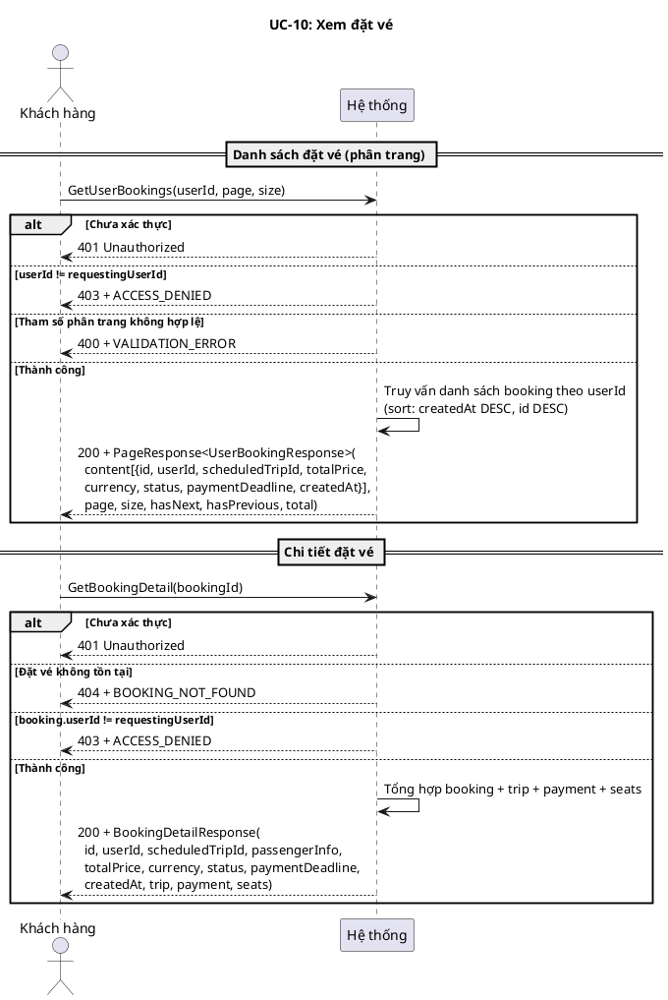
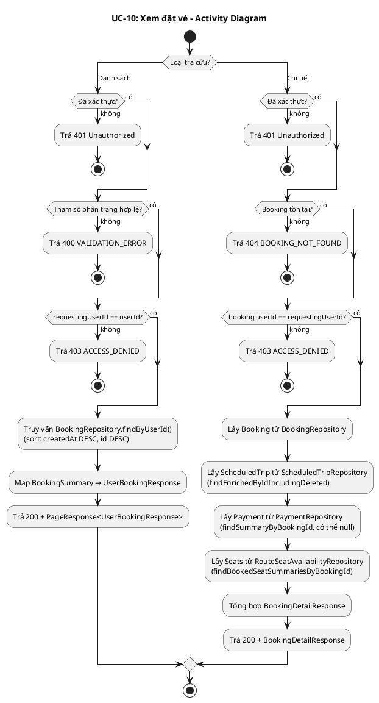
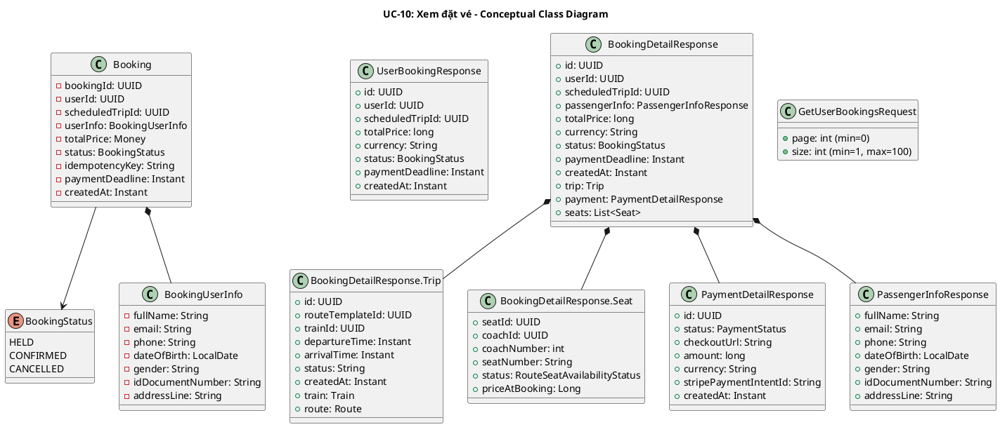
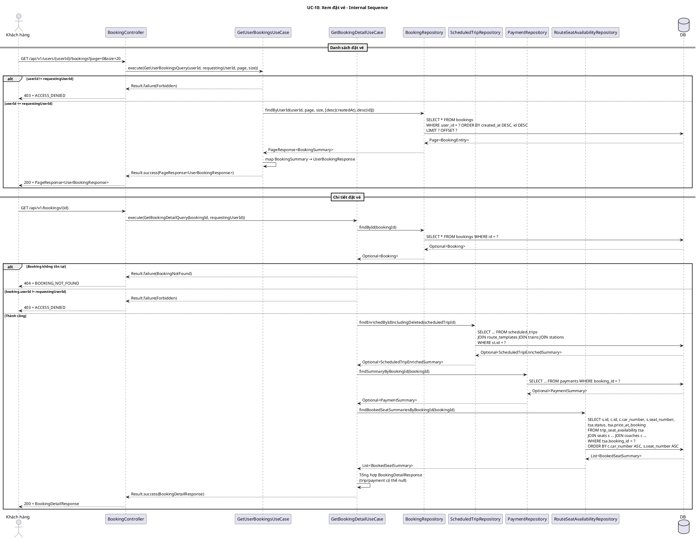
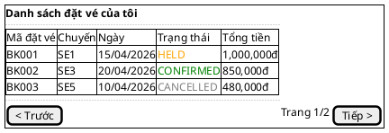
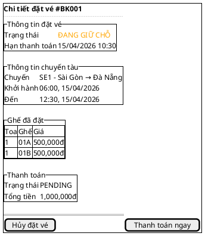

## UC-10: Xem đặt vé

### 1. Mô tả use case

| Mục                            | Nội dung                                                                                                                                                                                                                                                                                                                                                                                                                                                                                                                                                                                                                                                                                                                                           |
| ------------------------------ | -------------------------------------------------------------------------------------------------------------------------------------------------------------------------------------------------------------------------------------------------------------------------------------------------------------------------------------------------------------------------------------------------------------------------------------------------------------------------------------------------------------------------------------------------------------------------------------------------------------------------------------------------------------------------------------------------------------------------------------------------- |
| Phụ thuộc                      | UC-02: Đăng nhập, UC-09: Đặt vé tàu                                                                                                                                                                                                                                                                                                                                                                                                                                                                                                                                                                                                                                                                                                                |
| Mục đích                       | Khách hàng cần theo dõi trạng thái đặt vé của mình (đang giữ, đã thanh toán, đã hủy) để biết cần thanh toán hay không, và xem lại thông tin chi tiết chuyến tàu, ghế, thanh toán liên quan đến mỗi đặt vé.                                                                                                                                                                                                                                                                                                                                                                                                                                                                                                                                         |
| Mô tả                          | Khách hàng xem danh sách đặt vé của mình (phân trang) hoặc xem chi tiết một đặt vé cụ thể bao gồm thông tin hành khách, chuyến tàu, ghế và thanh toán.                                                                                                                                                                                                                                                                                                                                                                                                                                                                                                                                                                                             |
| Actor chính                    | Khách hàng (Customer)                                                                                                                                                                                                                                                                                                                                                                                                                                                                                                                                                                                                                                                                                                                              |
| Actor liên quan                | Không                                                                                                                                                                                                                                                                                                                                                                                                                                                                                                                                                                                                                                                                                                                                              |
| Tiền điều kiện                 | Khách hàng đã đăng nhập và có access token hợp lệ.                                                                                                                                                                                                                                                                                                                                                                                                                                                                                                                                                                                                                                                                                                 |
| Dãy lệnh thực hiện bình thường | **Xem danh sách đặt vé:**   1. Khách hàng gửi yêu cầu xem danh sách đặt vé với `userId`, tham số phân trang (`page`, `size`).   2. Hệ thống xác thực quyền truy cập: `requestingUserId == userId` (chỉ xem đặt vé của chính mình).   3. Hệ thống truy vấn danh sách đặt vé phân trang, sắp xếp theo `createdAt DESC, id DESC`.   4. Hệ thống trả về `PageResponse<UserBookingResponse>`.    **Xem chi tiết đặt vé:**   1. Khách hàng gửi yêu cầu xem chi tiết một đặt vé theo `bookingId`.   2. Hệ thống xác thực quyền truy cập: `booking.userId == requestingUserId`.   3. Hệ thống tổng hợp thông tin từ booking, scheduled trip (bao gồm đã xóa), payment, và ghế.   4. Hệ thống trả về `BookingDetailResponse`. |
| Hậu điều kiện (thành công)     | Không có thay đổi trạng thái. Đây là thao tác chỉ đọc.                                                                                                                                                                                                                                                                                                                                                                                                                                                                                                                                                                                                                                                                                             |
| Hậu điều kiện (thất bại)       | Không có thay đổi trạng thái. Đây là thao tác chỉ đọc.                                                                                                                                                                                                                                                                                                                                                                                                                                                                                                                                                                                                                                                                                             |
| Xử lý ngoại lệ                 | Chưa xác thực → 401 Unauthorized.   Xem đặt vé của người khác (list) → 403 + `ACCESS_DENIED`.   Đặt vé không tồn tại (detail) → 404 + `BOOKING_NOT_FOUND`.   Xem đặt vé của người khác (detail) → 403 + `ACCESS_DENIED`.   Tham số phân trang không hợp lệ → 400 + `VALIDATION_ERROR`.                                                                                                                                                                                                                                                                                                                                                                                                                                                 |

### 2. Lược đồ tuần tự

### 3. Lược đồ hoạt động

### 4. Lược đồ trạng thái

<!-- UC-10 là thao tác chỉ đọc, không có thay đổi trạng thái. Mục này bỏ qua. -->

_Không áp dụng — UC-10 là thao tác chỉ đọc._

### 5. Lược đồ lớp ý niệm

### 6. Phân rã thành phần PM

#### 6.1 Controller: `BookingController`

**Endpoint 1 — Danh sách đặt vé:**

- **Nhiệm vụ**: Nhận HTTP request xem danh sách đặt vé, lấy `requestingUserId`
  từ `Authentication`, ủy thác cho `GetUserBookingsUseCase`.
- **Endpoint**: `GET /api/v1/users/{userId}/bookings`
- **Input**: Path `userId: UUID` + Query `page: int` (default 0), `size: int`
  (default 20, max 100)
- **Output thành công**: `200` + `PageResponse<UserBookingResponse>` —
  `{ content[{id, userId, scheduledTripId, totalPrice, currency, status, paymentDeadline, createdAt}], page, size, hasNext, hasPrevious, total }`
- **Output lỗi**: `400` + `VALIDATION_ERROR` | `403` + `ACCESS_DENIED`
- **Metadata**:
  `@SuccessPayload(value = UserBookingResponse.class, kind = SuccessResponseKind.PAGE)`

**Endpoint 2 — Chi tiết đặt vé:**

- **Nhiệm vụ**: Nhận HTTP request xem chi tiết đặt vé, lấy `requestingUserId` từ
  `Authentication`, ủy thác cho `GetBookingDetailUseCase`.
- **Endpoint**: `GET /api/v1/bookings/{id}`
- **Input**: Path `id: UUID`
- **Output thành công**: `200` + `BookingDetailResponse` —
  `{ id, userId, scheduledTripId, passengerInfo, totalPrice, currency, status, paymentDeadline, createdAt, trip, payment, seats }`
- **Output lỗi**: `403` + `ACCESS_DENIED` | `404` + `BOOKING_NOT_FOUND`
- **Metadata**: `@SuccessPayload(BookingDetailResponse.class)`

#### 6.2 UseCase

**GetUserBookingsUseCase:**

- **Nhiệm vụ**: Trả danh sách đặt vé phân trang cho khách hàng, kiểm tra quyền
  sở hữu.
- **Input**: `GetUserBookingsQuery` — `{ userId, requestingUserId, page, size }`
- **Output**: `Result<PageResponse<UserBookingResponse>, BookingError>`
- **Logic**:
    1. So sánh `userId == requestingUserId` → nếu khác, trả
       `BookingError.Forbidden`
    2. Gọi
       `BookingRepository.findByUserId(userId, page, size, [desc(createdAt), desc(id)])`
    3. Map `BookingSummary` → `UserBookingResponse`
    4. Trả `PageResponse`

**GetBookingDetailUseCase:**

- **Nhiệm vụ**: Trả chi tiết đặt vé bao gồm thông tin chuyến tàu, thanh toán và
  ghế, kiểm tra quyền sở hữu.
- **Input**: `GetBookingDetailQuery` — `{ bookingId, requestingUserId }`
- **Output**: `Result<BookingDetailResponse, BookingError>`
- **Gọi đến**:
    - `BookingRepository.findById(bookingId)` — lấy booking entity
    - `ScheduledTripRepository.findEnrichedByIdIncludingDeleted(scheduledTripId)`
      — lấy thông tin chuyến tàu (bao gồm đã xóa mềm, có thể null)
    - `PaymentRepository.findSummaryByBookingId(bookingId)` — lấy thông tin
      thanh toán (có thể null nếu chưa tạo checkout session)
    - `RouteSeatAvailabilityRepository.findBookedSeatSummariesByBookingId(bookingId)`
      — lấy danh sách ghế đã đặt (JOIN seats + coaches, loại trừ soft-deleted)
<!-- - **Lưu ý**: `trip` và `payment` có thể `null` trong response — trip null nếu
  scheduled trip bị xóa hoàn toàn, payment null nếu chưa tạo checkout session. -->

#### 6.3 Repository

**BookingRepository:**

- **Nhiệm vụ**: Truy xuất domain entity `Booking` và projection
  `BookingSummary`.
- **Phương thức liên quan đến UC**:
    - `findById(BookingId): Optional<Booking>` — lấy booking entity đầy đủ
    - `findByUserId(UserId, page, size, sort): PageResponse<BookingSummary>` —
      danh sách đặt vé phân trang
- **Table**: `bookings`

**ScheduledTripRepository:**

- **Nhiệm vụ**: Truy xuất thông tin enriched của chuyến tàu.
- **Phương thức liên quan đến UC**:
    - `findEnrichedByIdIncludingDeleted(ScheduledTripId): Optional<ScheduledTripEnrichedSummary>`
      — lấy chuyến tàu kèm thông tin train, route, stations (bao gồm
      soft-deleted trips)
- **Table**: `scheduled_trips` JOIN `route_templates`, `trains`, `stations`

**PaymentRepository:**

- **Nhiệm vụ**: Truy xuất projection thanh toán.
- **Phương thức liên quan đến UC**:
    - `findSummaryByBookingId(BookingId): Optional<PaymentSummary>` — lấy thông
      tin thanh toán theo booking
- **Table**: `payments`

**RouteSeatAvailabilityRepository:**

- **Nhiệm vụ**: Truy xuất thông tin ghế đã đặt cho booking.
- **Phương thức liên quan đến UC**:
    - `findBookedSeatSummariesByBookingId(BookingId): List<BookedSeatSummary>` —
      lấy danh sách ghế kèm coach info, loại trừ seats/coaches đã soft-delete
- **Table**: `trip_seat_availability` JOIN `seats`, `coaches`

#### 6.4 Port

Không có actor hỗ trợ bên ngoài.

#### 6.5 Lược đồ tuần tự nội bộ PM

#### 6.6 Giao diện

##### 6.6.1 Giao diện mẫu

##### 6.6.2 Giao diện ứng dụng

Chưa hiện thực. Sẽ bổ sung ảnh chụp màn hình khi hoàn thành.

### 7. Bảng tham chiếu dò vết

| Use Case | Controller        | Endpoint                              | UseCase                 | Repository                                                           | Table                                              |
| -------- | ----------------- | ------------------------------------- | ----------------------- | -------------------------------------------------------------------- | -------------------------------------------------- |
| UC-10    | BookingController | `GET /api/v1/users/{userId}/bookings` | GetUserBookingsUseCase  | BookingRepository.findByUserId()                                     | bookings                                           |
| UC-10    | BookingController | `GET /api/v1/bookings/{id}`           | GetBookingDetailUseCase | BookingRepository.findById()                                         | bookings                                           |
|          |                   |                                       |                         | ScheduledTripRepository.findEnrichedByIdIncludingDeleted()           | scheduled_trips, route_templates, trains, stations |
|          |                   |                                       |                         | PaymentRepository.findSummaryByBookingId()                           | payments                                           |
|          |                   |                                       |                         | RouteSeatAvailabilityRepository.findBookedSeatSummariesByBookingId() | trip_seat_availability, seats, coaches             |

### 8. Tiêu chí kiểm thử

| Tiêu chí              | Phép thử                                                                   | Kết quả mong đợi                                                 | Ghi chú                                                       |
| --------------------- | -------------------------------------------------------------------------- | ---------------------------------------------------------------- | ------------------------------------------------------------- |
| Toàn diện (coverage)  | Đối chiếu Activity Diagram ↔ Sequence Diagram: mọi luồng đều được thể hiện | Không bỏ sót luồng chính lẫn ngoại lệ                            | Rà soát chéo giữa mục 2 và mục 3                              |
| Nhất quán             | Rà soát tên lớp, trạng thái, API giữa các lược đồ trong cùng UC            | Không mâu thuẫn giữa các mục 2–6                                 | Đặc biệt kiểm tra tên trong mục 5–6                           |
| Truy vết              | Đối chiếu bảng tham chiếu (mục 7) với lược đồ tuần tự nội bộ (mục 6.5)     | Mọi tương tác trong sequence đều có entry                        | Kiểm tra không thiếu endpoint/method                          |
