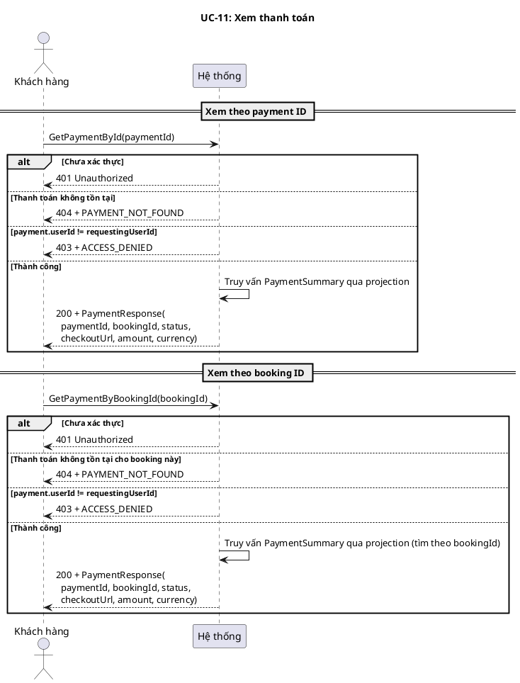
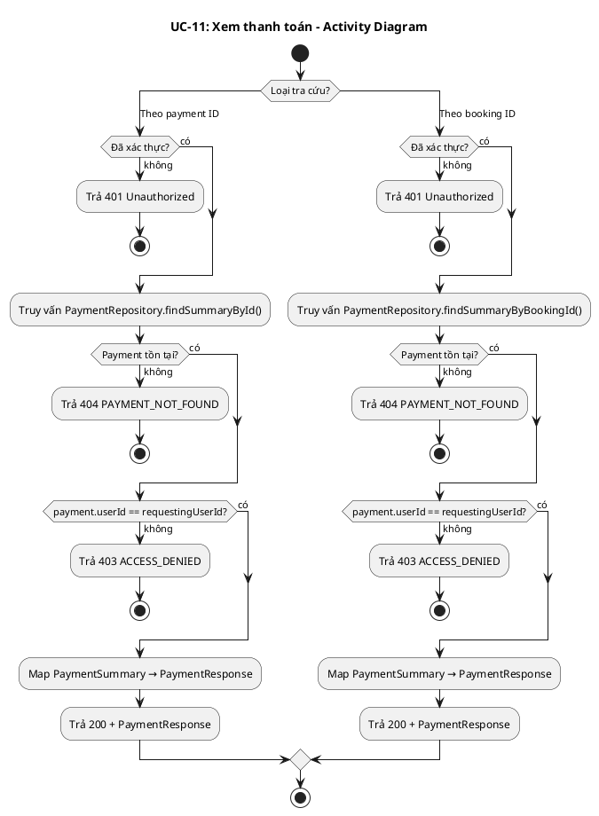
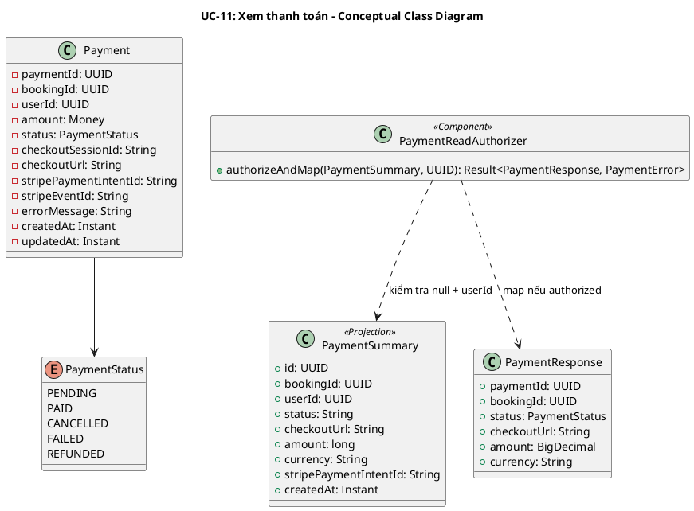
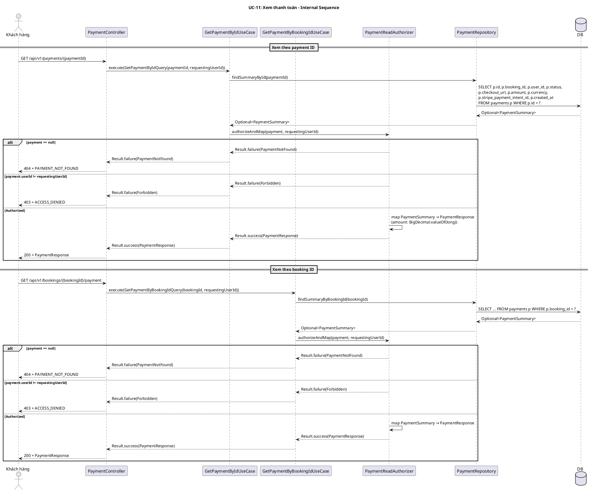
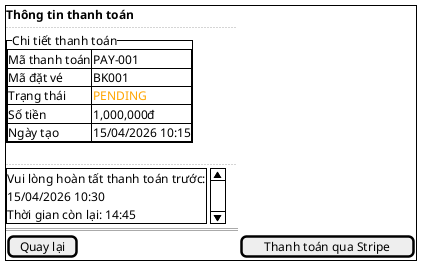

# UC-11: Xem thanh toán

# Mô tả use case

| Mục                            | Nội dung                                                                                                                                                                                                                                                                                                                                                                                                                                                                                                                                                                                        |
| ------------------------------ | ----------------------------------------------------------------------------------------------------------------------------------------------------------------------------------------------------------------------------------------------------------------------------------------------------------------------------------------------------------------------------------------------------------------------------------------------------------------------------------------------------------------------------------------------------------------------------------------------- |
| Phụ thuộc                      | UC-02: Đăng nhập, UC-08: Đặt vé tàu                                                                                                                                                                                                                                                                                                                                                                                                                                                                                                                                                             |
| Mục đích                       | Khách hàng cần kiểm tra trạng thái thanh toán (đang chờ, đã thanh toán, đã hủy, thất bại, đã hoàn tiền) và lấy URL checkout để tiếp tục thanh toán nếu cần.                                                                                                                                                                                                                                                                                                                                                                                                                                     |
| Mô tả                          | Khách hàng xem thông tin thanh toán theo ID thanh toán hoặc theo ID đặt vé. Cả hai endpoint đều trả cùng DTO `PaymentResponse`.                                                                                                                                                                                                                                                                                                                                                                                                                                                                 |
| Actor chính                    | Khách hàng (Customer)                                                                                                                                                                                                                                                                                                                                                                                                                                                                                                                                                                           |
| Actor liên quan                | Không                                                                                                                                                                                                                                                                                                                                                                                                                                                                                                                                                                                           |
| Tiền điều kiện                 | Khách hàng đã đăng nhập và có access token hợp lệ. Đã có phiên thanh toán (payment record) được tạo cho đặt vé.                                                                                                                                                                                                                                                                                                                                                                                                                                                                                 |
| Dãy lệnh thực hiện bình thường | **Xem thanh toán theo payment ID:**   1. Khách hàng gửi yêu cầu xem thanh toán theo `paymentId`.   2. Hệ thống truy vấn `PaymentSummary` qua projection.   3. Hệ thống xác thực quyền: `payment.userId == requestingUserId`.   4. Hệ thống trả về `PaymentResponse`.    **Xem thanh toán theo booking ID:**   1. Khách hàng gửi yêu cầu xem thanh toán theo `bookingId`.   2. Hệ thống truy vấn `PaymentSummary` qua projection (tìm theo bookingId).   3. Hệ thống xác thực quyền: `payment.userId == requestingUserId`.   4. Hệ thống trả về `PaymentResponse`. |
| Hậu điều kiện (thành công)     | Không có thay đổi trạng thái. Đây là thao tác chỉ đọc.                                                                                                                                                                                                                                                                                                                                                                                                                                                                                                                                          |
| Hậu điều kiện (thất bại)       | Không có thay đổi trạng thái. Đây là thao tác chỉ đọc.                                                                                                                                                                                                                                                                                                                                                                                                                                                                                                                                          |
| Xử lý ngoại lệ                 | Chưa xác thực → 401 Unauthorized.   Thanh toán không tồn tại → 404 + `PAYMENT_NOT_FOUND`.   Xem thanh toán của người khác → 403 + `ACCESS_DENIED`.                                                                                                                                                                                                                                                                                                                                                                                                                                        |

# Lược đồ tuần tự

# Lược đồ hoạt động

# Lược đồ trạng thái

<!-- UC-11 là thao tác chỉ đọc, không có thay đổi trạng thái. Mục này bỏ qua. -->

_Không áp dụng — UC-11 là thao tác chỉ đọc._

# Lược đồ lớp ý niệm

# Phân rã thành phần PM

## Controller: `PaymentController`

**Endpoint 1 — Xem thanh toán theo payment ID:**

- **Nhiệm vụ**: Nhận HTTP request xem thanh toán, lấy `requestingUserId` từ
  `Authentication`, ủy thác cho `GetPaymentByIdUseCase`.
- **Endpoint**: `GET /api/v1/payments/{paymentId}`
- **Input**: Path `paymentId: UUID`
- **Output thành công**: `200` + `PaymentResponse` —
  `{ paymentId, bookingId, status, checkoutUrl, amount, currency }`
- **Output lỗi**: `403` + `ACCESS_DENIED` | `404` + `PAYMENT_NOT_FOUND`
- **Metadata**: `@SuccessPayload(PaymentResponse.class)`

**Endpoint 2 — Xem thanh toán theo booking ID:**

- **Nhiệm vụ**: Nhận HTTP request xem thanh toán theo booking, lấy
  `requestingUserId` từ `Authentication`, ủy thác cho
  `GetPaymentByBookingIdUseCase`.
- **Endpoint**: `GET /api/v1/bookings/{bookingId}/payment`
- **Input**: Path `bookingId: UUID`
- **Output thành công**: `200` + `PaymentResponse` —
  `{ paymentId, bookingId, status, checkoutUrl, amount, currency }`
- **Output lỗi**: `403` + `ACCESS_DENIED` | `404` + `PAYMENT_NOT_FOUND`
- **Metadata**: `@SuccessPayload(PaymentResponse.class)`

## UseCase

**GetPaymentByIdUseCase:**

- **Nhiệm vụ**: Trả thông tin thanh toán theo payment ID, ủy thác kiểm tra quyền
  và mapping cho `PaymentReadAuthorizer`.
- **Input**: `GetPaymentByIdQuery` — `{ paymentId, requestingUserId }`
- **Output**: `Result<PaymentResponse, PaymentError>`
- **Annotation**: `@Transactional(readOnly = true)`
- **Gọi đến**:
    - `PaymentRepository.findSummaryById(paymentId)` — truy vấn projection
    - `PaymentReadAuthorizer.authorizeAndMap(payment, requestingUserId)` — null
      check
        - ownership check + mapping

**GetPaymentByBookingIdUseCase:**

- **Nhiệm vụ**: Trả thông tin thanh toán theo booking ID, ủy thác kiểm tra quyền
  và mapping cho `PaymentReadAuthorizer`.
- **Input**: `GetPaymentByBookingIdQuery` — `{ bookingId, requestingUserId }`
- **Output**: `Result<PaymentResponse, PaymentError>`
- **Annotation**: `@Transactional(readOnly = true)`
- **Gọi đến**:
    - `PaymentRepository.findSummaryByBookingId(bookingId)` — truy vấn
      projection
    - `PaymentReadAuthorizer.authorizeAndMap(payment, requestingUserId)` — null
      check
        - ownership check + mapping

## Helper: `PaymentReadAuthorizer`

- **Nhiệm vụ**: Tách logic kiểm tra quyền và mapping ra khỏi UseCase, tái sử
  dụng cho cả hai endpoint.
- **Input**: `PaymentSummary` (nullable), `UUID requestingUserId`
- **Output**: `Result<PaymentResponse, PaymentError>`
- **Logic**:
    1. `payment == null` → `PaymentError.PaymentNotFound`
    2. `payment.userId() != requestingUserId` → `PaymentError.Forbidden`
    3. Map `PaymentSummary` → `PaymentResponse`:
        - `amount`: `BigDecimal.valueOf(payment.amount())` — chuyển từ `long`
          sang `BigDecimal` (cùng đơn vị minor units, chỉ đổi kiểu số)
        - `status`: `PaymentStatus.valueOf(payment.status())` — parse String →
          enum

## Repository: `PaymentRepository`

- **Nhiệm vụ**: Truy xuất projection `PaymentSummary` từ DB.
- **Phương thức liên quan đến UC**:
    - `findSummaryById(PaymentId): Optional<PaymentSummary>` — tìm theo payment
      ID
    - `findSummaryByBookingId(BookingId): Optional<PaymentSummary>` — tìm theo
      booking ID
- **Table**: `payments`

## Lược đồ tuần tự nội bộ PM

## Giao diện

### Giao diện mẫu

### Giao diện ứng dụng

Chưa hiện thực. Sẽ bổ sung ảnh chụp màn hình khi hoàn thành.

# Bảng tham chiếu dò vết

| Use Case | Controller        | Endpoint                                   | UseCase                      | Repository / Helper                        | Table    |
| -------- | ----------------- | ------------------------------------------ | ---------------------------- | ------------------------------------------ | -------- |
| UC-11    | PaymentController | `GET /api/v1/payments/{paymentId}`         | GetPaymentByIdUseCase        | PaymentRepository.findSummaryById()        | payments |
|          |                   |                                            |                              | PaymentReadAuthorizer.authorizeAndMap()    |          |
| UC-11    | PaymentController | `GET /api/v1/bookings/{bookingId}/payment` | GetPaymentByBookingIdUseCase | PaymentRepository.findSummaryByBookingId() | payments |
|          |                   |                                            |                              | PaymentReadAuthorizer.authorizeAndMap()    |          |

# Tiêu chí kiểm thử

## Mức phân tích

| Tiêu chí             | Phép thử                                                                   | Kết quả mong đợi                          | Ghi chú                              |
| -------------------- | -------------------------------------------------------------------------- | ----------------------------------------- | ------------------------------------ |
| Toàn diện (coverage) | Đối chiếu Activity Diagram ↔ Sequence Diagram: mọi luồng đều được thể hiện | Không bỏ sót luồng chính lẫn ngoại lệ     | Rà soát chéo giữa mục 2 và mục 3     |
| Nhất quán            | Rà soát tên lớp, trạng thái, API giữa các lược đồ trong cùng UC            | Không mâu thuẫn giữa các mục 2–6          | Đặc biệt kiểm tra tên trong mục 5–6  |
| Truy vết             | Đối chiếu bảng tham chiếu (mục 7) với lược đồ tuần tự nội bộ (mục 6.5)     | Mọi tương tác trong sequence đều có entry | Kiểm tra không thiếu endpoint/method |

## Mức thiết kế

| Tiêu chí      | Phép thử                                                                                                              | Kết quả mong đợi                                                            | Ghi chú                                                        |
| ------------- | --------------------------------------------------------------------------------------------------------------------- | --------------------------------------------------------------------------- | -------------------------------------------------------------- |
| Chuẩn hóa     | Rà soát thiết kế PaymentController, GetPaymentByIdUseCase, GetPaymentByBookingIdUseCase, PaymentReadAuthorizer, PaymentRepository | Tuân thủ Clean Architecture, quy ước đặt tên và hợp đồng                    | Walkthrough/inspection                                         |
| Testability   | Rà soát khả năng mock PaymentRepository, PaymentReadAuthorizer trong unit test                                         | Có thể kiểm thử UseCase độc lập không cần DB thật                           | PaymentRepository và PaymentReadAuthorizer là dependency có thể mock |
| Modularity    | Rà soát ranh giới trách nhiệm: Controller chỉ route, UseCase chỉ orchestrate, Authorizer chỉ kiểm tra quyền + mapping, Repository chỉ persistence | Không trùng lặp trách nhiệm, coupling thấp                                  | Kiểm tra không có logic nghiệp vụ trong Controller             |

## Mức hiện thực

| Tiêu chí          | Phép thử                                                                                                                                                  | Kết quả mong đợi                                                                                     | Ghi chú                                                    |
| ----------------- | --------------------------------------------------------------------------------------------------------------------------------------------------------- | ---------------------------------------------------------------------------------------------------- | ---------------------------------------------------------- |
| Xử lý chính xác   | Test luồng chính (xem thành công), luồng lỗi (payment không tồn tại, xem của người khác)                                                                  | 200 + PaymentResponse đúng fields; 404 + PAYMENT_NOT_FOUND; 403 + ACCESS_DENIED                      | Kết hợp unit test UseCase + integration test endpoint       |
| Hiệu năng         | Benchmark endpoint GET /api/v1/payments/{paymentId} với 200 concurrent requests                                                                            | Response time p95 < 200ms trong điều kiện tải bình thường (thao tác chỉ đọc)                          | Ghi rõ môi trường test                                     |
| Bảo mật           | Kiểm tra ownership check (userId), xác thực token hợp lệ, không lộ thông tin thanh toán của người khác                                                    | 401 khi thiếu token, 403 khi xem payment của user khác, không trả dữ liệu nhạy cảm ngoài phạm vi DTO | Kiểm tra cả trường hợp token hết hạn                       |

## Danh sách test thỏa mãn mức hiện thực

<!-- Bảng liệt kê các test case cụ thể để kiểm chứng tiêu chí mức hiện thực.
     Mỗi test phải truy vết được về: endpoint/SP, bảng dữ liệu, file test. -->

### Backend

| # | Tên test case | Mô tả | Endpoint / SP | Table liên quan | Kết quả mong đợi | File test |
|---|---------------|--------|---------------|-----------------|-------------------|-----------|
| 1 | `execute_returnsPaymentDetailResponse` | Xem thanh toán theo ID thành công, trả booking + trip + seats | `GET /api/v1/payments/{paymentId}` | `payments`, `bookings`, `scheduled_trips`, `trip_seat_availability` | `Result.success(PaymentDetailResponse)` | `backend/src/test/java/.../payment/application/usecase/GetPaymentByIdUseCaseTest.java:104` |
| 2 | `execute_returnsResponseWithNullBookingForTicket_whenBookingNotFound` | Xem thanh toán khi booking không tồn tại | `GET /api/v1/payments/{paymentId}` | `payments` | `200` + booking=null | `backend/src/test/java/.../payment/application/usecase/GetPaymentByIdUseCaseTest.java:127` |
| 3 | `execute_returnsPaymentNotFound_whenPaymentMissing` | Payment không tồn tại | `GET /api/v1/payments/{paymentId}` | `payments` | `Result.failure(PaymentNotFound)` | `backend/src/test/java/.../payment/application/usecase/GetPaymentByIdUseCaseTest.java:150` |
| 4 | `execute_returnsForbidden_whenUserIdMismatch` | Xem payment của người khác | `GET /api/v1/payments/{paymentId}` | `payments` | `Result.failure(Forbidden)` | `backend/src/test/java/.../payment/application/usecase/GetPaymentByIdUseCaseTest.java:164` |
| 5 | `execute_delegatesToPaymentReadAuthorizer` | Ủy thác kiểm tra quyền cho PaymentReadAuthorizer | `GET /api/v1/bookings/{bookingId}/payment` | `payments` | Verify authorizeAndMap called | `backend/src/test/java/.../payment/application/usecase/GetPaymentByBookingIdUseCaseTest.java:67` |
| 6 | `execute_passesNullSummaryWhenPaymentNotFound` | Payment không tồn tại theo bookingId | `GET /api/v1/bookings/{bookingId}/payment` | `payments` | authorizeAndMap(null, userId) → PaymentNotFound | `backend/src/test/java/.../payment/application/usecase/GetPaymentByBookingIdUseCaseTest.java:88` |
| 7 | `execute_returnsSuccessPaymentResponse_whenAuthorized` | Xem thanh toán theo bookingId thành công | `GET /api/v1/bookings/{bookingId}/payment` | `payments` | `Result.success(PaymentResponse)` đúng fields | `backend/src/test/java/.../payment/application/usecase/GetPaymentByBookingIdUseCaseTest.java:101` |
| 8 | `getPaymentById_returns200_onSuccess` | Controller trả 200 cho getPaymentById | `GET /api/v1/payments/{paymentId}` | `payments` | `200` + JsendResponse success | `backend/src/test/java/.../payment/infrastructure/web/PaymentControllerTest.java:60` |
| 9 | `getPaymentByBookingId_returns200_onSuccess` | Controller trả 200 cho getPaymentByBookingId | `GET /api/v1/bookings/{bookingId}/payment` | `payments` | `200` + JsendResponse success | `backend/src/test/java/.../payment/infrastructure/web/PaymentControllerTest.java:113` |
| 10 | `getPaymentById_requiresAuthentication` | Annotation @PreAuthorize trên getPaymentById | `GET /api/v1/payments/{paymentId}` | — | Annotation present | `backend/src/test/java/.../payment/infrastructure/web/PaymentControllerSecurityTest.java:45` |
| 11 | `getPaymentByBookingId_requiresAuthentication` | Annotation @PreAuthorize trên getPaymentByBookingId | `GET /api/v1/bookings/{bookingId}/payment` | — | Annotation present | `backend/src/test/java/.../payment/infrastructure/web/PaymentControllerSecurityTest.java:58` |
| 12 | `getPaymentById_nullAuthenticationThrowsNullPointerException` | Pen-test: null auth trên getPaymentById | `GET /api/v1/payments/{paymentId}` | — | NullPointerException | `backend/src/test/java/.../payment/infrastructure/web/PaymentControllerSecurityTest.java:98` |
| 13 | `getPaymentByBookingId_malformedUUID` | Pen-test: UUID không hợp lệ trong auth | `GET /api/v1/bookings/{bookingId}/payment` | — | IllegalArgumentException | `backend/src/test/java/.../payment/infrastructure/web/PaymentControllerSecurityTest.java:130` |
| 14 | `getPaymentById_handles50ConcurrentRequestsWithConsistentResults` | Stress test 50 concurrent requests theo paymentId | `GET /api/v1/payments/{paymentId}` | `payments`, `bookings` | 50 results consistent, all success | `backend/src/test/java/.../payment/application/usecase/ViewPaymentStressTest.java:60` |
| 15 | `getPaymentByBookingId_handles50ConcurrentRequestsWithConsistentResults` | Stress test 50 concurrent requests theo bookingId | `GET /api/v1/bookings/{bookingId}/payment` | `payments` | 50 results consistent, all success | `backend/src/test/java/.../payment/application/usecase/ViewPaymentStressTest.java:86` |

### Frontend

| # | Tên test case | Mô tả | Component / Hook | Kết quả mong đợi | File test |
|---|---------------|--------|------------------|-------------------|-----------|
| 1 | `renders payment detail for PAID status` | Hiển thị chi tiết thanh toán PAID | `PaymentDetailPage` | Hiển thị "Chi tiết thanh toán", mã thanh toán | `frontend/customer/src/components/payment/payment-detail.test.tsx:151` |
| 2 | `displays payment status badge` | Hiển thị badge trạng thái thanh toán | `PaymentDetailPage` | Badge "Đã thanh toán" | `frontend/customer/src/components/payment/payment-detail.test.tsx:170` |
| 3 | `displays trip information` | Hiển thị thông tin chuyến đi | `PaymentDetailPage` | Tên tàu, tuyến đường | `frontend/customer/src/components/payment/payment-detail.test.tsx:186` |
| 4 | `displays passenger information` | Hiển thị thông tin hành khách | `PaymentDetailPage` | Tên, email hành khách | `frontend/customer/src/components/payment/payment-detail.test.tsx:203` |
| 5 | `displays seat information` | Hiển thị thông tin ghế | `PaymentDetailPage` | "Toa 1 - Ghế A1", "Toa 1 - Ghế A2" | `frontend/customer/src/components/payment/payment-detail.test.tsx:220` |
| 6 | `shows not found message when payment is null` | Hiển thị thông báo không tìm thấy | `PaymentDetailPage` | "Không tìm thấy thanh toán" | `frontend/customer/src/components/payment/payment-detail.test.tsx:354` |
| 7 | `renders PAID status with success styling` | Badge PAID có variant success | `PaymentStatusBadge` | data-variant="success" | `frontend/customer/src/components/payment/payment-status-badge.test.tsx:24` |
| 8 | `renders PENDING status with secondary styling` | Badge PENDING có variant secondary | `PaymentStatusBadge` | data-variant="secondary" | `frontend/customer/src/components/payment/payment-status-badge.test.tsx:37` |
| 9 | `renders FAILED status with destructive styling` | Badge FAILED có variant destructive | `PaymentStatusBadge` | data-variant="destructive" | `frontend/customer/src/components/payment/payment-status-badge.test.tsx:49` |
| 10 | `renders REFUNDED status with outline styling` | Badge REFUNDED có variant outline | `PaymentStatusBadge` | data-variant="outline" | `frontend/customer/src/components/payment/payment-status-badge.test.tsx:63` |
| 11 | `renders payment cards with route information` | Hiển thị danh sách thanh toán với tuyến đường | `PaymentsList` | Route info hiển thị đúng | `frontend/customer/src/components/account/payments-list.test.tsx:81` |
| 12 | `renders payment amounts` | Hiển thị số tiền thanh toán | `PaymentsList` | 500.000, 750.000 | `frontend/customer/src/components/account/payments-list.test.tsx:97` |
| 13 | `displays payment status badges` | Hiển thị badge trạng thái trong danh sách | `PaymentsList` | PAID, PENDING badges | `frontend/customer/src/components/account/payments-list.test.tsx:124` |
| 14 | `navigates to payment detail on view details click` | Link xem chi tiết đúng href | `PaymentsList` | href="/payment/payment-1" | `frontend/customer/src/components/account/payments-list.test.tsx:139` |

## Bảng tiêu chí chất lượng theo chức năng

| Chức năng trong UC                | Tiêu chí mức Ý niệm                                                                  | Tiêu chí mức Thiết kế                                                                                  | Tiêu chí mức Hiện thực                                                                                  |
| --------------------------------- | ------------------------------------------------------------------------------------- | ------------------------------------------------------------------------------------------------------- | -------------------------------------------------------------------------------------------------------- |
| Xem thanh toán theo payment ID    | Đúng nhu cầu: khách hàng xem được trạng thái và URL checkout của thanh toán theo ID   | Luồng xử lý chuẩn hóa qua Controller→UseCase→Authorizer→Repository, dễ test với mock                   | Unit test UseCase (3 cases: success, not found, forbidden), integration test endpoint (happy + error paths) |
| Xem thanh toán theo booking ID    | Đúng nhu cầu: khách hàng xem được thanh toán liên kết với đặt vé của mình             | Tái sử dụng PaymentReadAuthorizer cho cả hai endpoint, giảm trùng lặp logic                             | Unit test UseCase (3 cases: success, not found, forbidden), integration test endpoint (happy + error paths) |
| Kiểm tra quyền sở hữu            | Chỉ chủ sở hữu thanh toán mới xem được thông tin                                      | PaymentReadAuthorizer tách biệt, kiểm tra payment.userId == requestingUserId trước khi mapping           | Test xem payment của user khác → 403, test xem payment của chính mình → 200                               |
