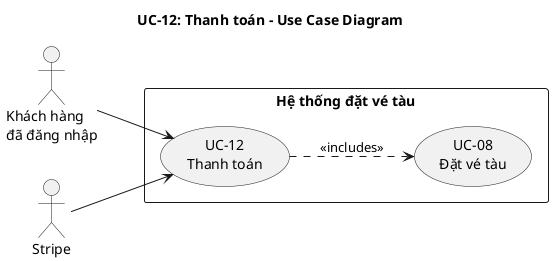
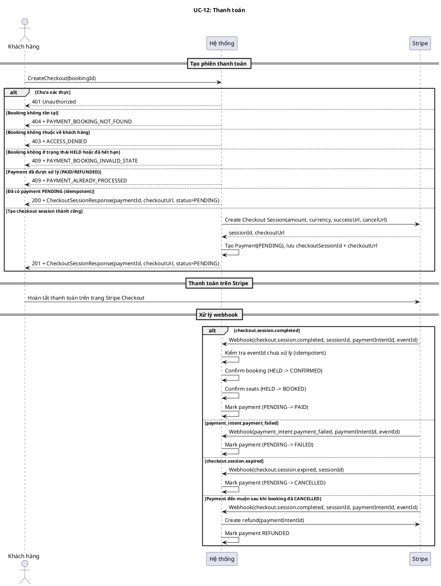
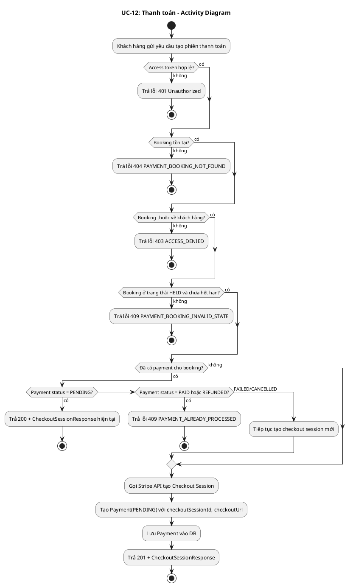
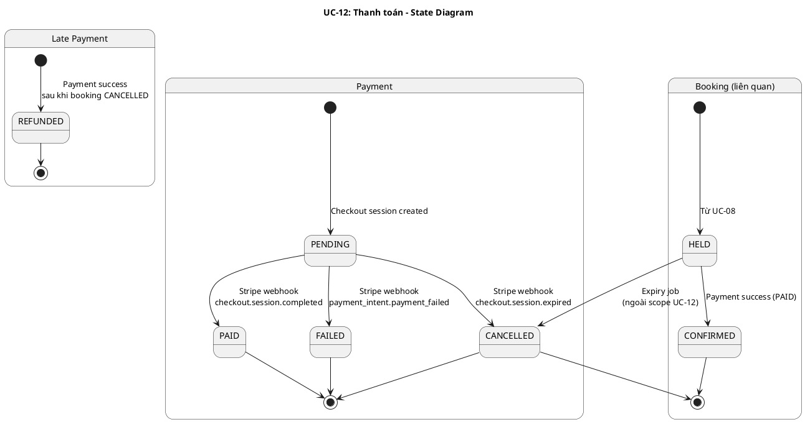
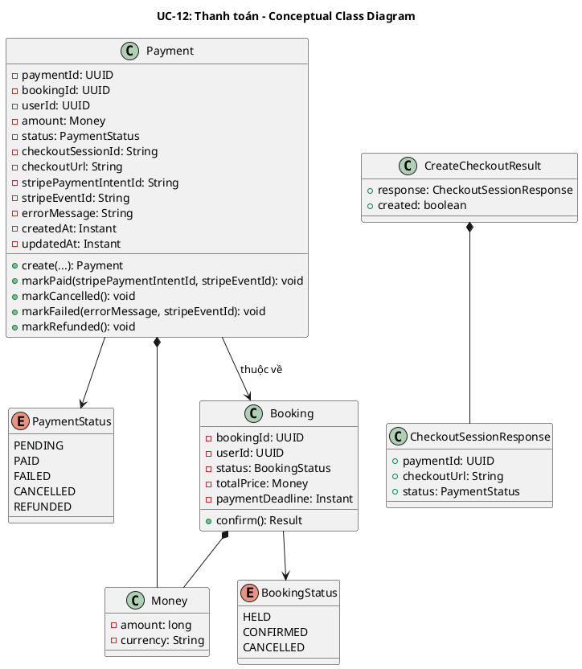
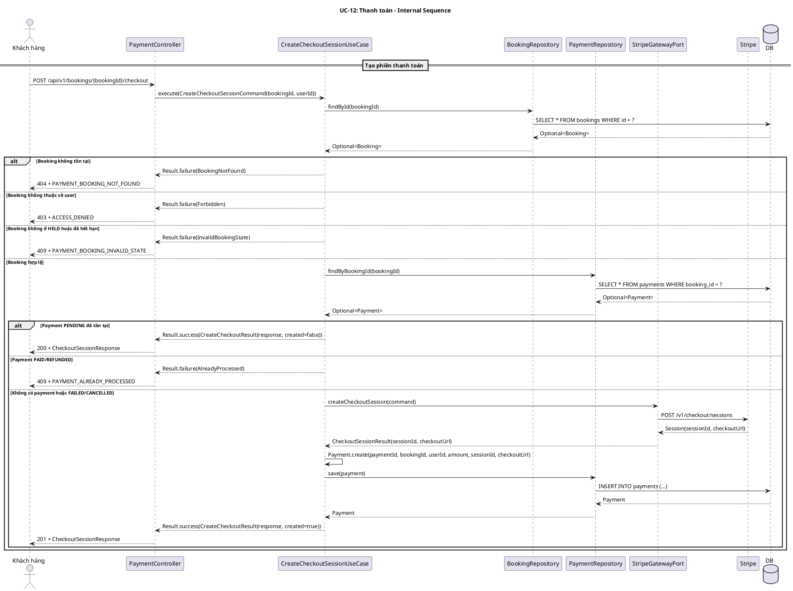
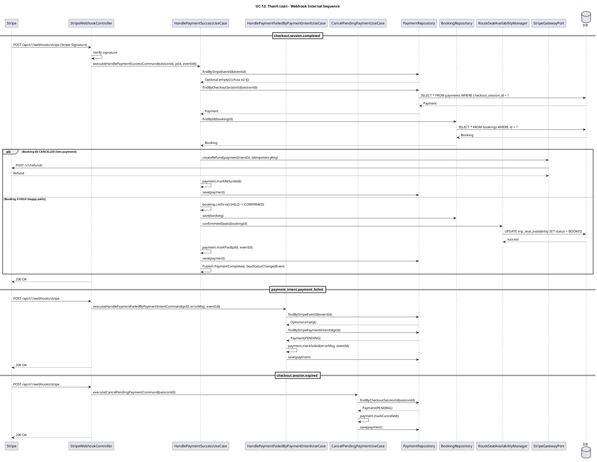
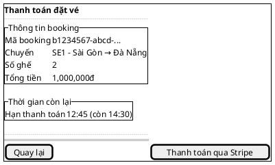

# UC-12: Thanh toán

# Mô tả use case

| Mục                            | Nội dung                                                                                                                                                                                                                                                                                                                                                                                                                                                                                                                                                                                                                                                                                                                                                                                                                                                                                                                                                                                         |
| ------------------------------ | ------------------------------------------------------------------------------------------------------------------------------------------------------------------------------------------------------------------------------------------------------------------------------------------------------------------------------------------------------------------------------------------------------------------------------------------------------------------------------------------------------------------------------------------------------------------------------------------------------------------------------------------------------------------------------------------------------------------------------------------------------------------------------------------------------------------------------------------------------------------------------------------------------------------------------------------------------------------------------------------------ |
| Phụ thuộc                      | UC-02: Đăng nhập, UC-08: Đặt vé tàu                                                                                                                                                                                                                                                                                                                                                                                                                                                                                                                                                                                                                                                                                                                                                                                                                                                                                                                                                             |
| Mục đích                       | Khách hàng đã đặt vé (booking ở trạng thái `HELD`) cần thanh toán để xác nhận vé. PM tạo phiên thanh toán Stripe Checkout Session, chuyển hướng khách hàng đến trang thanh toán Stripe, và xử lý kết quả thanh toán qua webhook để chuyển booking sang `CONFIRMED`, ghế sang `BOOKED`, và payment sang `PAID`.                                                                                                                                                                                                                                                                                                                                                                                                                                                                                                                                                                                                                                                                                  |
| Mô tả                          | Khách hàng yêu cầu tạo phiên thanh toán cho booking đang giữ chỗ. Hệ thống tạo Stripe Checkout Session và trả về URL thanh toán. Khách hàng hoàn tất thanh toán trên Stripe. Stripe gửi webhook xác nhận kết quả. Hệ thống cập nhật trạng thái booking, ghế và payment tương ứng.                                                                                                                                                                                                                                                                                                                                                                                                                                                                                                                                                                                                                                                                                                               |
| Actor chính                    | Khách hàng đã đăng nhập                                                                                                                                                                                                                                                                                                                                                                                                                                                                                                                                                                                                                                                                                                                                                                                                                                                                                                                                                                          |
| Actor liên quan                | Stripe                                                                                                                                                                                                                                                                                                                                                                                                                                                                                                                                                                                                                                                                                                                                                                                                                                                                                                                                                                                           |
| Tiền điều kiện                 | Khách hàng đã đăng nhập và có access token hợp lệ. Khách hàng có booking ở trạng thái `HELD` chưa hết hạn thanh toán (`paymentDeadline` chưa qua).                                                                                                                                                                                                                                                                                                                                                                                                                                                                                                                                                                                                                                                                                                                                                                                                                                              |
| Dãy lệnh thực hiện bình thường | 1. Khách hàng gửi yêu cầu tạo phiên thanh toán cho `bookingId`.   2. Hệ thống kiểm tra booking tồn tại và thuộc về khách hàng.   3. Hệ thống kiểm tra booking ở trạng thái `HELD` và chưa hết hạn thanh toán.   4. Hệ thống kiểm tra nếu đã có payment PENDING cho booking thì trả về checkout session hiện tại (idempotent).   5. Hệ thống gọi Stripe API tạo Checkout Session với thông tin booking (amount, currency, successUrl, cancelUrl).   6. Hệ thống tạo Payment mới ở trạng thái `PENDING` với `checkoutSessionId` và `checkoutUrl`, lưu vào cơ sở dữ liệu.   7. Hệ thống trả về `CheckoutSessionResponse` gồm `paymentId`, `checkoutUrl`, `status`.   8. Khách hàng được chuyển hướng đến Stripe để hoàn tất thanh toán.   9. Stripe gửi webhook `checkout.session.completed` khi thanh toán thành công.   10. Hệ thống xác nhận booking (`HELD → CONFIRMED`), xác nhận ghế (`HELD → BOOKED`), đánh dấu payment (`PENDING → PAID`). |
| Hậu điều kiện (thành công)     | Ở luồng đồng bộ: một Payment mới được tạo ở trạng thái `PENDING` với `checkoutUrl` để khách hàng thanh toán. Ở luồng bất đồng bộ sau thanh toán thành công: booking chuyển sang `CONFIRMED`, ghế chuyển sang `BOOKED`, payment chuyển sang `PAID`.                                                                                                                                                                                                                                                                                                                                                                                                                                                                                                                                                                                                                                                                                                                                              |
| Hậu điều kiện (thất bại)       | Nếu tạo checkout session thất bại, không có payment nào được tạo. Nếu thanh toán thất bại, payment chuyển sang `FAILED`, booking vẫn ở `HELD` cho đến khi luồng expiry hủy. Nếu checkout session hết hạn, payment chuyển sang `CANCELLED`. Nếu thanh toán đến muộn sau khi booking đã `CANCELLED`, hệ thống tạo refund ngay và đánh dấu payment `REFUNDED`.                                                                                                                                                                                                                                                                                                                                                                                                                                                                                                                                                                                                                                     |
| Xử lý ngoại lệ                 | Chưa xác thực → Hệ thống trả về lỗi 401.   Booking không tồn tại → Hệ thống trả về lỗi `PAYMENT_BOOKING_NOT_FOUND`.   Booking không thuộc về khách hàng → Hệ thống trả về lỗi `ACCESS_DENIED`.   Booking không ở trạng thái `HELD` → Hệ thống trả về lỗi `PAYMENT_BOOKING_INVALID_STATE`.   Payment deadline đã hết hạn → Hệ thống trả về lỗi `PAYMENT_BOOKING_INVALID_STATE`.   Payment đã được xử lý (PAID/REFUNDED) → Hệ thống trả về lỗi `PAYMENT_ALREADY_PROCESSED`.   Đã có payment PENDING → Hệ thống trả về checkout session hiện tại (idempotent, 200).   Payment trước đó FAILED/CANCELLED → Hệ thống tạo checkout session mới.   Stripe webhook bị lặp lại → Hệ thống bỏ qua event đã xử lý (idempotent qua `stripeEventId`).   Thanh toán thất bại → payment chuyển sang `FAILED`.   Checkout session hết hạn → payment chuyển sang `CANCELLED`.   Thanh toán đến muộn sau khi booking đã `CANCELLED` → Hệ thống refund ngay và đánh dấu payment `REFUNDED`. |

# Lược đồ Use Case

# Lược đồ tuần tự

# Lược đồ hoạt động

# Lược đồ trạng thái

# Lược đồ lớp ý niệm

# Phân rã thành phần PM

## Controller: `PaymentController`

- **Nhiệm vụ**: Nhận HTTP request tạo checkout session từ khách hàng, lấy
  `userId` từ `Authentication`, và ủy thác cho `CreateCheckoutSessionUseCase`.
- **Endpoint**: `POST /api/v1/bookings/{bookingId}/checkout`
- **Input**: `bookingId` (path variable) + `userId` (từ JWT token)
- **Output thành công**: `201 Created` + `CheckoutSessionResponse` —
  `{ paymentId, checkoutUrl, status }` (mới tạo) hoặc `200 OK` (idempotent)
- **Output lỗi**: `403 | 404 | 409` + `JsendResponse` — `{ errorCode, message }`

## Controller: `StripeWebhookController`

- **Nhiệm vụ**: Nhận webhook từ Stripe, xác thực chữ ký, phân loại event type
  và ủy thác cho use case tương ứng.
- **Endpoint**: `POST /api/v1/webhooks/stripe`
- **Input**: Stripe event payload + `Stripe-Signature` header
- **Output**: `200 OK` (xử lý thành công) hoặc `400` (chữ ký không hợp lệ)

## UseCase: `CreateCheckoutSessionUseCase`

- **Nhiệm vụ**: Kiểm tra booking hợp lệ, kiểm tra payment hiện tại, tạo Stripe
  Checkout Session và lưu Payment mới.
- **Input**: `CreateCheckoutSessionCommand` —
  `{ bookingId: BookingId, userId: UserId }`
- **Output**: `Result<CreateCheckoutResult, PaymentError>`
- **Gọi đến**:
    - `BookingRepository.findById(bookingId)` — kiểm tra booking tồn tại và
      thuộc về user
    - `PaymentRepository.findByBookingId(bookingId)` — kiểm tra payment hiện tại
      (idempotency, already processed)
    - `StripeGatewayPort.createCheckoutSession(command)` — tạo Stripe Checkout
      Session
    - `PaymentRepository.save(payment)` — lưu Payment mới ở trạng thái `PENDING`

## UseCase: `HandlePaymentSuccessUseCase`

- **Nhiệm vụ**: Xử lý webhook `checkout.session.completed`, xác nhận booking và
  ghế, đánh dấu payment PAID. Nếu booking đã CANCELLED thì refund ngay.
- **Input**: `HandlePaymentSuccessCommand` —
  `{ checkoutSessionId, stripePaymentIntentId, stripeEventId }`
- **Output**: `void` (side effect: cập nhật trạng thái)
- **Gọi đến**:
    - `PaymentRepository.findByStripeEventId(eventId)` — kiểm tra idempotency
    - `PaymentRepository.findByCheckoutSessionId(sessionId)` — tìm payment
    - `BookingRepository.findById(bookingId)` — lấy booking để confirm
    - `BookingRepository.save(booking)` — lưu booking đã CONFIRMED
    - `RouteSeatAvailabilityManager.confirmHeldSeats(bookingId)` — chuyển ghế
      HELD → BOOKED
    - `PaymentRepository.save(payment)` — lưu payment đã PAID
    - `StripeGatewayPort.createRefund(paymentIntentId, idempotencyKey)` — refund
      nếu booking đã CANCELLED
- **Phát sinh sự kiện**: `PaymentCompleted`, `SeatStatusChangedEvent`,
  `BookingConfirmed` (từ booking aggregate)

## UseCase: `HandlePaymentFailedByPaymentIntentUseCase`

- **Nhiệm vụ**: Xử lý webhook `payment_intent.payment_failed`, đánh dấu payment
  FAILED.
- **Input**: `HandlePaymentFailedByPaymentIntentCommand` —
  `{ stripePaymentIntentId, errorMessage, stripeEventId }`
- **Output**: `void`
- **Gọi đến**:
    - `PaymentRepository.findByStripeEventId(eventId)` — kiểm tra idempotency
    - `PaymentRepository.findByStripePaymentIntentId(piId)` — tìm payment
    - `PaymentRepository.save(payment)` — lưu payment đã FAILED

## UseCase: `CancelPendingPaymentUseCase`

- **Nhiệm vụ**: Xử lý webhook `checkout.session.expired`, đánh dấu payment
  CANCELLED.
- **Input**: `CancelPendingPaymentCommand` — `{ checkoutSessionId }`
- **Output**: `void`
- **Gọi đến**:
    - `PaymentRepository.findByCheckoutSessionId(sessionId)` — tìm payment
      PENDING
    - `PaymentRepository.save(payment)` — lưu payment đã CANCELLED

## Repository: `PaymentRepository`

- **Nhiệm vụ**: Truy xuất/lưu trữ aggregate `Payment`.
- **Phương thức liên quan đến UC**:
    - `findByBookingId(bookingId): Optional<Payment>` — kiểm tra payment hiện
      tại cho booking
    - `findByCheckoutSessionId(sessionId): Optional<Payment>` — tìm payment theo
      Stripe session
    - `findByStripePaymentIntentId(piId): Optional<Payment>` — tìm payment theo
      payment intent
    - `findByStripeEventId(eventId): Optional<Payment>` — kiểm tra idempotency
      webhook
    - `save(payment): Payment` — lưu payment mới hoặc cập nhật trạng thái
- **Table**: `payments`

## Port: `StripeGatewayPort`

- **Nhiệm vụ**: Giao tiếp với Stripe API để tạo Checkout Session và thực hiện
  refund.
- **Phương thức liên quan đến UC**:
    - `createCheckoutSession(command): CheckoutSessionResult` — tạo Stripe
      Checkout Session, trả về `sessionId` và `checkoutUrl`
    - `createRefund(paymentIntentId, idempotencyKey): void` — tạo refund cho
      payment đã thanh toán muộn

## Thiết kế cơ sở dữ liệu

### ERD

- **Tham chiếu ERD**: Bảng `payments` trong schema chung của hệ thống
- **Bảng/View liên quan**: `payments`, `bookings`, `trip_seat_availability`

### Stored Procedure

Không sử dụng Stored Procedure cho UC này.

### Trigger

Không sử dụng Trigger cho UC này.

## Lược đồ tuần tự nội bộ PM

## Giao diện

### Giao diện mẫu

| Control                      | Nhiệm vụ                                              | Inputs                  | Outputs                                    | Gọi API                                    |
| ---------------------------- | ----------------------------------------------------- | ----------------------- | ------------------------------------------ | ------------------------------------------ |
| `PaymentSummaryPanel`        | Hiển thị thông tin booking và countdown hạn thanh toán | `bookingId`             | Thông tin booking, thời gian còn lại       | `GET /api/v1/bookings/{bookingId}`         |
| `[Thanh toán qua Stripe]`   | Tạo checkout session và redirect đến Stripe           | `bookingId`             | `CheckoutSessionResponse` hoặc `Error`     | `POST /api/v1/bookings/{bookingId}/checkout` |

### Giao diện ứng dụng

Chưa hiện thực. Sẽ bổ sung ảnh chụp màn hình khi hoàn thành.

# Bảng tham chiếu dò vết

| Use Case | Controller              | Endpoint                                 | UseCase                                    | Repository / Port                                                                     | Table                                      |
| -------- | ----------------------- | ---------------------------------------- | ------------------------------------------ | ------------------------------------------------------------------------------------- | ------------------------------------------ |
| UC-12    | PaymentController       | `POST /api/v1/bookings/{bookingId}/checkout` | CreateCheckoutSessionUseCase               | BookingRepository.findById()                                                          | bookings                                   |
|          | PaymentController       | `POST /api/v1/bookings/{bookingId}/checkout` | CreateCheckoutSessionUseCase               | PaymentRepository.findByBookingId()                                                   | payments                                   |
|          | PaymentController       | `POST /api/v1/bookings/{bookingId}/checkout` | CreateCheckoutSessionUseCase               | StripeGatewayPort.createCheckoutSession()                                             | (Stripe API)                               |
|          | PaymentController       | `POST /api/v1/bookings/{bookingId}/checkout` | CreateCheckoutSessionUseCase               | PaymentRepository.save()                                                              | payments                                   |
|          | StripeWebhookController | `POST /api/v1/webhooks/stripe`           | HandlePaymentSuccessUseCase                | PaymentRepository.findByStripeEventId(), findByCheckoutSessionId()                    | payments                                   |
|          | StripeWebhookController | `POST /api/v1/webhooks/stripe`           | HandlePaymentSuccessUseCase                | BookingRepository.findById(), save()                                                  | bookings                                   |
|          | StripeWebhookController | `POST /api/v1/webhooks/stripe`           | HandlePaymentSuccessUseCase                | RouteSeatAvailabilityManager.confirmHeldSeats()                                       | trip_seat_availability                     |
|          | StripeWebhookController | `POST /api/v1/webhooks/stripe`           | HandlePaymentSuccessUseCase                | StripeGatewayPort.createRefund()                                                      | (Stripe API)                               |
|          | StripeWebhookController | `POST /api/v1/webhooks/stripe`           | HandlePaymentFailedByPaymentIntentUseCase  | PaymentRepository.findByStripeEventId(), findByStripePaymentIntentId(), save()         | payments                                   |
|          | StripeWebhookController | `POST /api/v1/webhooks/stripe`           | CancelPendingPaymentUseCase                | PaymentRepository.findByCheckoutSessionId(), save()                                   | payments                                   |

# Tiêu chí kiểm thử

## Mức phân tích

| Tiêu chí             | Phép thử                                                                   | Kết quả mong đợi                          | Ghi chú                              |
| -------------------- | -------------------------------------------------------------------------- | ----------------------------------------- | ------------------------------------ |
| Toàn diện (coverage) | Đối chiếu Activity Diagram ↔ Sequence Diagram: mọi luồng đều được thể hiện | Không bỏ sót luồng chính lẫn ngoại lệ     | Rà soát chéo giữa mục 2 và mục 3     |
| Nhất quán            | Rà soát tên lớp, trạng thái, API giữa các lược đồ trong cùng UC            | Không mâu thuẫn giữa các mục 2–7          | Đặc biệt kiểm tra PaymentStatus, BookingStatus |
| Truy vết             | Đối chiếu bảng tham chiếu (mục 8) với lược đồ tuần tự nội bộ (mục 7.7)     | Mọi tương tác trong sequence đều có entry | Kiểm tra không thiếu repository/port |

## Mức thiết kế

| Tiêu chí      | Phép thử                                                                                                                                                                  | Kết quả mong đợi                                       | Ghi chú                                |
| ------------- | ------------------------------------------------------------------------------------------------------------------------------------------------------------------------- | ------------------------------------------------------ | -------------------------------------- |
| Chuẩn hóa     | Rà soát thiết kế PaymentController, StripeWebhookController, CreateCheckoutSessionUseCase, HandlePaymentSuccessUseCase, PaymentRepository, StripeGatewayPort               | Tuân thủ Clean Architecture, quy ước đặt tên và hợp đồng | Walkthrough/inspection                 |
| Testability   | Rà soát khả năng mock StripeGatewayPort, PaymentRepository, BookingRepository, RouteSeatAvailabilityManager trong unit test                                                | Có thể kiểm thử UseCase độc lập không cần Stripe thật   | Tất cả repository và port là interface  |
| Modularity    | Rà soát ranh giới trách nhiệm: Controller chỉ validate + route, UseCase chỉ orchestrate, Repository chỉ persistence, Port chỉ external integration                       | Không trùng lặp trách nhiệm, coupling thấp             | Kiểm tra không có logic nghiệp vụ trong Controller |

## Mức hiện thực

| Tiêu chí          | Phép thử                                                                                                                                                                                                  | Kết quả mong đợi                                                                                                                                                                                                 | Ghi chú                                                                  |
| ----------------- | --------------------------------------------------------------------------------------------------------------------------------------------------------------------------------------------------------- | ---------------------------------------------------------------------------------------------------------------------------------------------------------------------------------------------------------------- | ------------------------------------------------------------------------ |
| Xử lý chính xác   | Test luồng chính (tạo checkout session mới), luồng idempotent (trả session cũ), luồng lỗi (booking not found, forbidden, invalid state, already processed)                                                | 201 + CheckoutSessionResponse; 200 + session cũ; 404; 403; 409                                                                                                                                                   | Kết hợp unit test UseCase + integration test endpoint                     |
| Hiệu năng         | Benchmark endpoint POST /api/v1/bookings/{bookingId}/checkout với 50 concurrent requests cho cùng booking                                                                                                  | Response time p95 < 500ms, idempotency đảm bảo chỉ 1 Stripe session được tạo                                                                                                                                     | Ghi rõ môi trường test                                                   |
| Bảo mật           | Kiểm tra yêu cầu xác thực (401 khi không có token), kiểm tra userId lấy từ token (không cho phép tạo checkout cho booking của user khác), kiểm tra Stripe webhook signature                               | Reject request không có token hợp lệ, reject webhook với signature không hợp lệ                                                                                                                                  | Kiểm tra cả replay attack trên webhook                                   |
| Webhook           | Test webhook Stripe: checkout.session.completed (happy + late payment), payment_intent.payment_failed, checkout.session.expired                                                                            | HELD→CONFIRMED + HELD→BOOKED + PENDING→PAID; PENDING→FAILED; PENDING→CANCELLED; refund + REFUNDED                                                                                                                | Kiểm tra idempotency của webhook (event lặp lại không gây side effect)   |
| Đồng thời         | Test concurrent createCheckout cho cùng booking, test concurrent webhook events                                                                                                                            | Chỉ 1 payment PENDING được tạo (idempotent); webhook xử lý đúng thứ tự                                                                                                                                          | Sử dụng DB constraint + findByBookingId để đảm bảo                       |

## Danh sách test thỏa mãn mức hiện thực

### Backend

| # | Tên test case | Mô tả | Endpoint / SP | Table liên quan | Kết quả mong đợi | File test |
|---|---------------|--------|---------------|-----------------|-------------------|-----------|
| 1 | `happyPath_createsCheckoutSession` | Tạo checkout session mới cho booking HELD hợp lệ | `POST /api/v1/bookings/{bookingId}/checkout` | `payments`, `bookings` | `201` + `CheckoutSessionResponse(created=true)` | `backend/.../CreateCheckoutSessionUseCaseTest.java:178` |
| 2 | `idempotent_existingPendingPayment` | Trả session hiện tại khi đã có payment PENDING | `POST /api/v1/bookings/{bookingId}/checkout` | `payments`, `bookings` | `200` + `CheckoutSessionResponse(created=false)` | `backend/.../CreateCheckoutSessionUseCaseTest.java:294` |
| 3 | `forbidden_differentUser` | Booking không thuộc về user → từ chối | `POST /api/v1/bookings/{bookingId}/checkout` | `bookings` | `403` + `ACCESS_DENIED` | `backend/.../CreateCheckoutSessionUseCaseTest.java:213` |
| 4 | `invalidState_expiredDeadline` | Payment deadline đã hết hạn | `POST /api/v1/bookings/{bookingId}/checkout` | `bookings` | `409` + `PAYMENT_BOOKING_INVALID_STATE` | `backend/.../CreateCheckoutSessionUseCaseTest.java:253` |
| 5 | `alreadyProcessed_paidPayment` | Payment đã PAID → không cho tạo mới | `POST /api/v1/bookings/{bookingId}/checkout` | `payments` | `409` + `PAYMENT_ALREADY_PROCESSED` | `backend/.../CreateCheckoutSessionUseCaseTest.java:312` |
| 6 | `execute_confirmsBookingAndSeatsAndMarksPaymentPaid` | Webhook success: confirm booking + seats + mark PAID | `POST /api/v1/webhooks/stripe` | `payments`, `bookings`, `trip_seat_availability` | HELD→CONFIRMED, HELD→BOOKED, PENDING→PAID | `backend/.../HandlePaymentSuccessUseCaseTest.java:123` |
| 7 | `execute_isIdempotent_whenStripeEventIdAlreadyProcessed` | Webhook idempotent: event đã xử lý → no-op | `POST /api/v1/webhooks/stripe` | `payments` | Không xử lý lại | `backend/.../HandlePaymentSuccessUseCaseTest.java:149` |
| 8 | `execute_latePayment_triggersRefundAndMarksRefunded` | Late payment: booking CANCELLED → refund ngay | `POST /api/v1/webhooks/stripe` | `payments`, `bookings` | Gọi createRefund, REFUNDED | `backend/.../HandlePaymentSuccessUseCaseTest.java:167` |
| 9 | `execute_findsPendingPaymentAndMarksFailed` | Webhook payment_failed → mark FAILED | `POST /api/v1/webhooks/stripe` | `payments` | PENDING→FAILED | `backend/.../HandlePaymentFailedByPaymentIntentUseCaseTest.java:66` |
| 10 | `execute_marksPendingPaymentAsCancelled` | Webhook session expired → mark CANCELLED | `POST /api/v1/webhooks/stripe` | `payments` | PENDING→CANCELLED | `backend/.../CancelPendingPaymentUseCaseTest.java:64` |
| 11 | `createCheckout_requiresAuthentication` | Endpoint có @PreAuthorize | `POST /api/v1/bookings/{bookingId}/checkout` | — | Annotation present | `backend/.../PaymentControllerSecurityTest.java:84` |
| 12 | `getPaymentById_malformedUuidInAuthName` | Pen-test: malformed UUID trong auth → reject | `GET /api/v1/payments/{id}` | — | IllegalArgumentException | `backend/.../PaymentControllerSecurityTest.java:109` |
| 13 | `getPaymentById_handles50ConcurrentRequests` | Stress: 50 concurrent requests nhất quán | `GET /api/v1/payments/{id}` | `payments`, `bookings` | 50 success, consistent data | `backend/.../ViewPaymentStressTest.java:60` |

### Frontend

| # | Tên test case | Mô tả | Component | Kết quả mong đợi | File test |
|---|---------------|--------|-----------|-------------------|-----------|
| 1 | `renders pending state with countdown` | Countdown + link thanh toán ngay | `PaymentStatus` | "Chờ thanh toán" + link redirect | `frontend/.../booking/payment-status.test.tsx:26` |
| 2 | `transitions to expired state` | Countdown = 0 → chuyển trạng thái hết hạn | `PaymentStatus` | "Hết hạn thanh toán" | `frontend/.../booking/payment-status.test.tsx:62` |
| 3 | `renders failed state with retry button` | Thất bại + nút thử lại hoạt động | `PaymentStatus` | "Thanh toán thất bại" + retry | `frontend/.../booking/payment-status.test.tsx:133` |
| 4 | `renders PAID/PENDING/FAILED/REFUNDED badges` | Badge đúng variant theo status | `PaymentStatusBadge` | Đúng text + styling | `frontend/.../payment/payment-status-badge.test.tsx:24` |
| 5 | `renders payment detail for PAID status` | Chi tiết thanh toán đầy đủ | `PaymentDetail` | Mã, chuyến, ghế, hành khách | `frontend/.../payment/payment-detail.test.tsx:151` |
| 6 | `shows/hides print ticket by status` | Nút in vé chỉ hiện khi PAID | `PaymentDetail` | PAID → có, PENDING/FAILED → ẩn | `frontend/.../payment/payment-detail.test.tsx:237` |
| 7 | `renders payment cards with route info` | Danh sách payment hiển thị tuyến + số tiền | `PaymentsList` | Ga đi → ga đến, formatted amount | `frontend/.../account/payments-list.test.tsx:81` |

## Bảng tiêu chí chất lượng theo chức năng

| Chức năng trong UC                  | Tiêu chí mức Ý niệm                                                                                  | Tiêu chí mức Thiết kế                                                                                                    | Tiêu chí mức Hiện thực                                                                                                          |
| ----------------------------------- | ---------------------------------------------------------------------------------------------------- | ------------------------------------------------------------------------------------------------------------------------ | ------------------------------------------------------------------------------------------------------------------------------- |
| Tạo checkout session                | Đúng nhu cầu: khách hàng nhận được URL thanh toán Stripe cho booking đang giữ chỗ                    | Luồng xử lý chuẩn hóa qua Controller→UseCase→Port, dễ test với mock StripeGatewayPort                                    | Unit test UseCase (6+ cases: happy, idempotent, not found, forbidden, invalid state, already processed)                          |
| Idempotency (checkout)              | Gọi lại cùng endpoint không tạo payment trùng lặp                                                   | UseCase kiểm tra payment PENDING hiện tại trước khi tạo mới                                                              | Test gọi lại, verify trả cùng CheckoutSessionResponse và không tạo Stripe session mới                                           |
| Xử lý thanh toán thành công         | Booking chuyển CONFIRMED, ghế chuyển BOOKED, payment chuyển PAID                                     | HandlePaymentSuccessUseCase orchestrate đúng thứ tự: confirm booking → confirm seats → mark paid                          | Integration test với mock webhook payload, verify state transitions đúng                                                         |
| Xử lý thanh toán thất bại           | Payment FAILED, booking vẫn HELD cho đến khi expiry                                                  | HandlePaymentFailedByPaymentIntentUseCase chỉ cập nhật payment, không ảnh hưởng booking                                  | Test payment failed → booking vẫn HELD; verify errorMessage được lưu                                                            |
| Xử lý session hết hạn               | Payment CANCELLED                                                                                    | CancelPendingPaymentUseCase chỉ cập nhật payment PENDING → CANCELLED                                                     | Test session expired → payment CANCELLED; test idempotent (gọi lại không lỗi)                                                    |
| Late payment refund                 | Thanh toán đến sau khi booking đã CANCELLED được hoàn tiền tự động                                   | HandlePaymentSuccessUseCase kiểm tra booking status, trigger refund qua StripeGatewayPort nếu đã CANCELLED                | Test webhook success khi booking đã CANCELLED, verify refund được tạo và payment = REFUNDED                                      |
| Webhook idempotency                 | Stripe event lặp lại không gây side effect                                                           | Kiểm tra stripeEventId đã xử lý trước khi thực hiện logic                                                                | Test gửi cùng eventId 2 lần, verify chỉ xử lý 1 lần                                                                            |

# Yêu cầu phi chức năng

| Loại yêu cầu  | Nội dung                                                                                                                                                                  | Nguồn gốc                                          |
| -------------- | ------------------------------------------------------------------------------------------------------------------------------------------------------------------------- | -------------------------------------------------- |
| Business       | Mỗi booking chỉ có tối đa một payment PENDING tại một thời điểm; thanh toán muộn sau khi booking hết hạn phải được refund tự động                                         | Quy tắc nghiệp vụ hệ thống đặt vé                  |
| Operation      | Webhook Stripe phải được xác thực bằng chữ ký (`Stripe-Signature`); endpoint webhook không yêu cầu JWT nhưng yêu cầu signature verification; payment data phải được mã hóa trong transit (HTTPS) | Chính sách bảo mật hệ thống + PCI DSS compliance   |
| Development    | Sử dụng Stripe Checkout Sessions (không tự xây dựng form thanh toán); response tuân thủ JSend format; webhook handler phải idempotent qua `stripeEventId`; timeout cho Stripe API call < 30s | Quy ước kỹ thuật nhóm phát triển + Stripe best practices |
