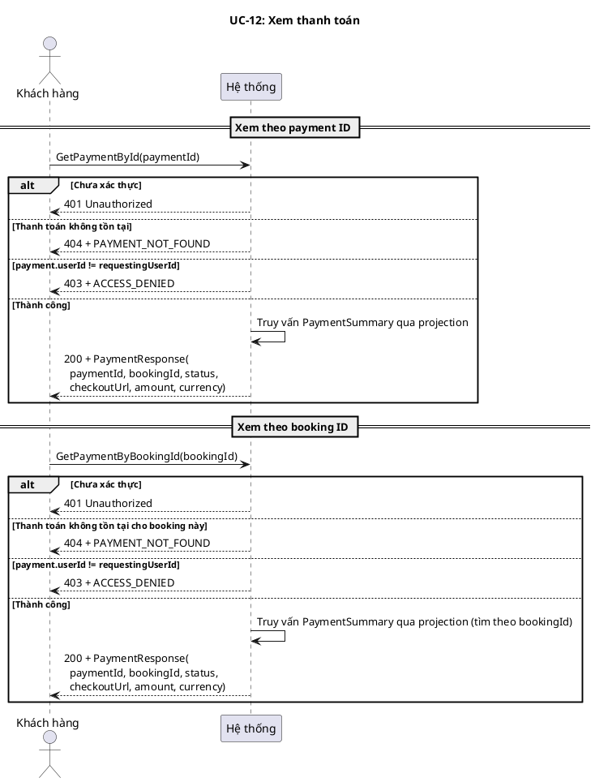
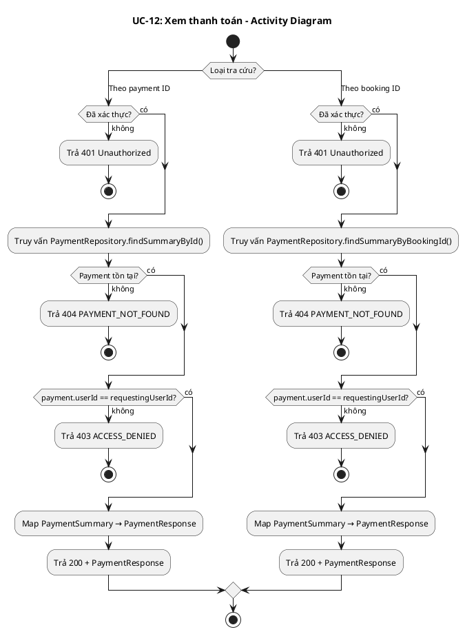
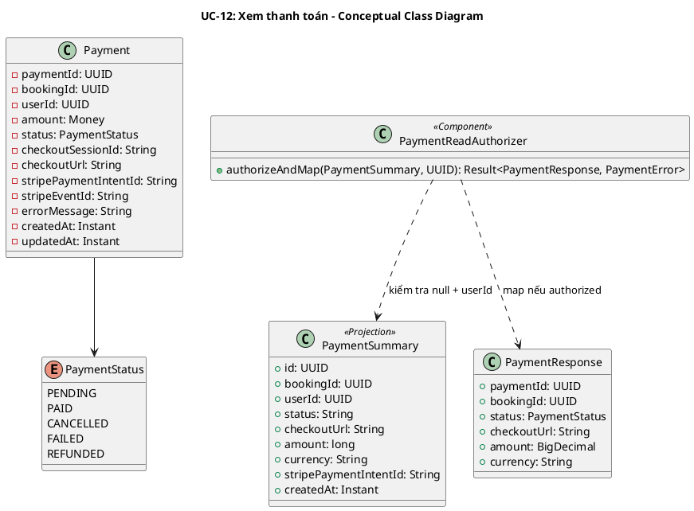
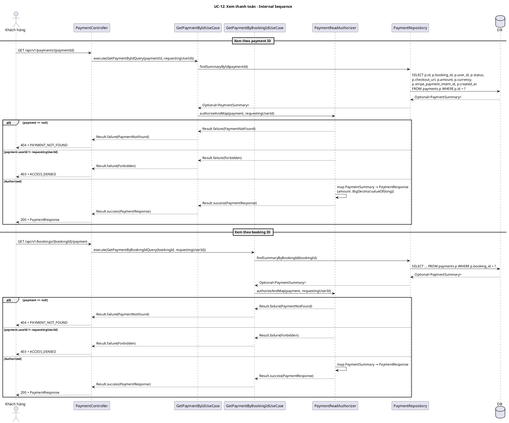

# UC-12: Xem thanh toán

## 1. Mô tả use case

| Mục                            | Nội dung                                                                                                                                                                                                                                                                                                                                                                                                                                                                                                                                                                                        |
| ------------------------------ | ----------------------------------------------------------------------------------------------------------------------------------------------------------------------------------------------------------------------------------------------------------------------------------------------------------------------------------------------------------------------------------------------------------------------------------------------------------------------------------------------------------------------------------------------------------------------------------------------- |
| Phụ thuộc                      | UC-02: Đăng nhập, UC-09: Đặt vé tàu                                                                                                                                                                                                                                                                                                                                                                                                                                                                                                                                                             |
| Mục đích                       | Khách hàng cần kiểm tra trạng thái thanh toán (đang chờ, đã thanh toán, đã hủy, thất bại, đã hoàn tiền) và lấy URL checkout để tiếp tục thanh toán nếu cần.                                                                                                                                                                                                                                                                                                                                                                                                                                     |
| Mô tả                          | Khách hàng xem thông tin thanh toán theo ID thanh toán hoặc theo ID đặt vé. Cả hai endpoint đều trả cùng DTO `PaymentResponse`.                                                                                                                                                                                                                                                                                                                                                                                                                                                                 |
| Actor chính                    | Khách hàng (Customer)                                                                                                                                                                                                                                                                                                                                                                                                                                                                                                                                                                           |
| Actor liên quan                | Không                                                                                                                                                                                                                                                                                                                                                                                                                                                                                                                                                                                           |
| Tiền điều kiện                 | Khách hàng đã đăng nhập và có access token hợp lệ. Đã có phiên thanh toán (payment record) được tạo cho đặt vé.                                                                                                                                                                                                                                                                                                                                                                                                                                                                                 |
| Dãy lệnh thực hiện bình thường | **Xem thanh toán theo payment ID:**   1. Khách hàng gửi yêu cầu xem thanh toán theo `paymentId`.   2. Hệ thống truy vấn `PaymentSummary` qua projection.   3. Hệ thống xác thực quyền: `payment.userId == requestingUserId`.   4. Hệ thống trả về `PaymentResponse`.    **Xem thanh toán theo booking ID:**   1. Khách hàng gửi yêu cầu xem thanh toán theo `bookingId`.   2. Hệ thống truy vấn `PaymentSummary` qua projection (tìm theo bookingId).   3. Hệ thống xác thực quyền: `payment.userId == requestingUserId`.   4. Hệ thống trả về `PaymentResponse`. |
| Hậu điều kiện (thành công)     | Không có thay đổi trạng thái. Đây là thao tác chỉ đọc.                                                                                                                                                                                                                                                                                                                                                                                                                                                                                                                                          |
| Hậu điều kiện (thất bại)       | Không có thay đổi trạng thái. Đây là thao tác chỉ đọc.                                                                                                                                                                                                                                                                                                                                                                                                                                                                                                                                          |
| Xử lý ngoại lệ                 | Chưa xác thực → 401 Unauthorized.   Thanh toán không tồn tại → 404 + `PAYMENT_NOT_FOUND`.   Xem thanh toán của người khác → 403 + `ACCESS_DENIED`.                                                                                                                                                                                                                                                                                                                                                                                                                                        |

## 2. Lược đồ tuần tự

## 3. Lược đồ hoạt động

## 4. Lược đồ trạng thái

<!-- UC-12 là thao tác chỉ đọc, không có thay đổi trạng thái. Mục này bỏ qua. -->

_Không áp dụng — UC-12 là thao tác chỉ đọc._

## 5. Lược đồ lớp ý niệm

## 6. Phân rã thành phần PM

### 6.1 Controller: `PaymentController`

**Endpoint 1 — Xem thanh toán theo payment ID:**

-  **Nhiệm vụ**: Nhận HTTP request xem thanh toán, lấy `requestingUserId` từ
  `Authentication`, ủy thác cho `GetPaymentByIdUseCase`.
-  **Endpoint**: `GET /api/v1/payments/{paymentId}`
-  **Input**: Path `paymentId: UUID`
-  **Output thành công**: `200` + `PaymentResponse` —
  `{ paymentId, bookingId, status, checkoutUrl, amount, currency }`
-  **Output lỗi**: `403` + `ACCESS_DENIED` | `404` + `PAYMENT_NOT_FOUND`
-  **Metadata**: `@SuccessPayload(PaymentResponse.class)`

**Endpoint 2 — Xem thanh toán theo booking ID:**

-  **Nhiệm vụ**: Nhận HTTP request xem thanh toán theo booking, lấy
  `requestingUserId` từ `Authentication`, ủy thác cho
  `GetPaymentByBookingIdUseCase`.
-  **Endpoint**: `GET /api/v1/bookings/{bookingId}/payment`
-  **Input**: Path `bookingId: UUID`
-  **Output thành công**: `200` + `PaymentResponse` —
  `{ paymentId, bookingId, status, checkoutUrl, amount, currency }`
-  **Output lỗi**: `403` + `ACCESS_DENIED` | `404` + `PAYMENT_NOT_FOUND`
-  **Metadata**: `@SuccessPayload(PaymentResponse.class)`

### 6.2 UseCase

**GetPaymentByIdUseCase:**

-  **Nhiệm vụ**: Trả thông tin thanh toán theo payment ID, ủy thác kiểm tra quyền
  và mapping cho `PaymentReadAuthorizer`.
-  **Input**: `GetPaymentByIdQuery` — `{ paymentId, requestingUserId }`
-  **Output**: `Result<PaymentResponse, PaymentError>`
-  **Annotation**: `@Transactional(readOnly = true)`
-  **Gọi đến**:
    -  `PaymentRepository.findSummaryById(paymentId)` — truy vấn projection
    -  `PaymentReadAuthorizer.authorizeAndMap(payment, requestingUserId)` — null
      check
        -  ownership check + mapping

**GetPaymentByBookingIdUseCase:**

-  **Nhiệm vụ**: Trả thông tin thanh toán theo booking ID, ủy thác kiểm tra quyền
  và mapping cho `PaymentReadAuthorizer`.
-  **Input**: `GetPaymentByBookingIdQuery` — `{ bookingId, requestingUserId }`
-  **Output**: `Result<PaymentResponse, PaymentError>`
-  **Annotation**: `@Transactional(readOnly = true)`
-  **Gọi đến**:
    -  `PaymentRepository.findSummaryByBookingId(bookingId)` — truy vấn
      projection
    -  `PaymentReadAuthorizer.authorizeAndMap(payment, requestingUserId)` — null
      check
        -  ownership check + mapping

### 6.3 Helper: `PaymentReadAuthorizer`

-  **Nhiệm vụ**: Tách logic kiểm tra quyền và mapping ra khỏi UseCase, tái sử
  dụng cho cả hai endpoint.
-  **Input**: `PaymentSummary` (nullable), `UUID requestingUserId`
-  **Output**: `Result<PaymentResponse, PaymentError>`
-  **Logic**:
    1. `payment == null` → `PaymentError.PaymentNotFound`
    2. `payment.userId() != requestingUserId` → `PaymentError.Forbidden`
    3. Map `PaymentSummary` → `PaymentResponse`:
        -  `amount`: `BigDecimal.valueOf(payment.amount())` — chuyển từ `long`
          sang `BigDecimal` (cùng đơn vị minor units, chỉ đổi kiểu số)
        -  `status`: `PaymentStatus.valueOf(payment.status())` — parse String →
          enum

### 6.4 Repository: `PaymentRepository`

-  **Nhiệm vụ**: Truy xuất projection `PaymentSummary` từ DB.
-  **Phương thức liên quan đến UC**:
    -  `findSummaryById(PaymentId): Optional<PaymentSummary>` — tìm theo payment
      ID
    -  `findSummaryByBookingId(BookingId): Optional<PaymentSummary>` — tìm theo
      booking ID
-  **Table**: `payments`

### 6.5 Lược đồ tuần tự nội bộ PM

## 7. Bảng tham chiếu dò vết

| Use Case | Controller        | Endpoint                                   | UseCase                      | Repository / Helper                        | Table    |
| -------- | ----------------- | ------------------------------------------ | ---------------------------- | ------------------------------------------ | -------- |
| UC-12    | PaymentController | `GET /api/v1/payments/{paymentId}`         | GetPaymentByIdUseCase        | PaymentRepository.findSummaryById()        | payments |
|          |                   |                                            |                              | PaymentReadAuthorizer.authorizeAndMap()    |          |
| UC-12    | PaymentController | `GET /api/v1/bookings/{bookingId}/payment` | GetPaymentByBookingIdUseCase | PaymentRepository.findSummaryByBookingId() | payments |
|          |                   |                                            |                              | PaymentReadAuthorizer.authorizeAndMap()    |          |

## 8. Tiêu chí kiểm thử

| Tiêu chí                           | Phép thử                                                                   | Kết quả mong đợi                                                 | Ghi chú                                                           |
| ---------------------------------- | -------------------------------------------------------------------------- | ---------------------------------------------------------------- | ----------------------------------------------------------------- |
| Toàn diện (coverage)               | Đối chiếu Activity Diagram ↔ Sequence Diagram: mọi luồng đều được thể hiện | Không bỏ sót luồng chính lẫn ngoại lệ                            | Rà soát chéo giữa mục 2 và mục 3                                  |
| Nhất quán                          | Rà soát tên lớp, trạng thái, API giữa các lược đồ trong cùng UC            | Không mâu thuẫn giữa các mục 2–6                                 | Đặc biệt kiểm tra tên trong mục 5–6                               |
| Truy vết                           | Đối chiếu bảng tham chiếu (mục 7) với lược đồ tuần tự nội bộ (mục 6.5)     | Mọi tương tác trong sequence đều có entry                        | Kiểm tra không thiếu endpoint/method                              |
| Payment không tồn tại (by ID)      | Gọi `GET /api/v1/payments/{random-uuid}`                                   | 404 + PAYMENT_NOT_FOUND                                          | PaymentReadAuthorizer xử lý null → PaymentNotFound                |
| Payment không tồn tại (by booking) | Gọi `GET /api/v1/bookings/{random-uuid}/payment`                           | 404 + PAYMENT_NOT_FOUND                                          | Booking có thể tồn tại nhưng chưa có payment                      |
| Quyền sở hữu (by ID)               | Gọi `GET /api/v1/payments/{id}` với token khác chủ sở hữu                  | 403 + ACCESS_DENIED                                              | PaymentReadAuthorizer kiểm tra payment.userId == requestingUserId |
| Quyền sở hữu (by booking)          | Gọi `GET /api/v1/bookings/{id}/payment` với token khác chủ sở hữu          | 403 + ACCESS_DENIED                                              | Cùng logic PaymentReadAuthorizer                                  |
| Response PENDING                   | Xem payment có status PENDING                                              | 200 + PaymentResponse với status=PENDING, checkoutUrl có giá trị | checkoutUrl là Stripe hosted checkout URL                         |
| Response PAID                      | Xem payment có status PAID                                                 | 200 + PaymentResponse với status=PAID                            |                                                                   |
| Response CANCELLED                 | Xem payment có status CANCELLED (checkout session expired)                 | 200 + PaymentResponse với status=CANCELLED                       |                                                                   |
| Response FAILED                    | Xem payment có status FAILED                                               | 200 + PaymentResponse với status=FAILED                          |                                                                   |
| Response REFUNDED                  | Xem payment có status REFUNDED                                             | 200 + PaymentResponse với status=REFUNDED                        |                                                                   |
| Amount format                      | Kiểm tra amount trong response                                             | amount là BigDecimal, giá trị giữ nguyên minor currency units    | `BigDecimal.valueOf(payment.amount())` chỉ đổi kiểu, không scale  |
| Cùng response cho cả hai endpoint  | Gọi cả hai endpoint cho cùng một payment                                   | Hai response giống nhau (cùng PaymentResponse DTO)               | Cả hai dùng PaymentReadAuthorizer.authorizeAndMap()               |
