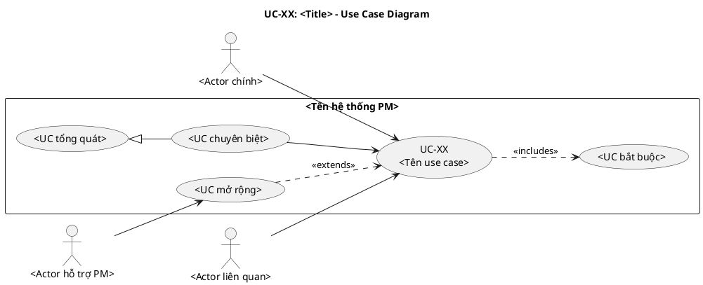
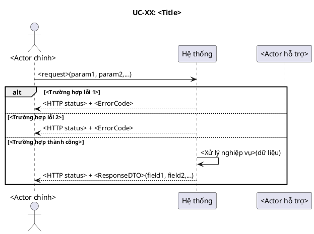
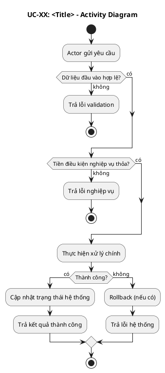
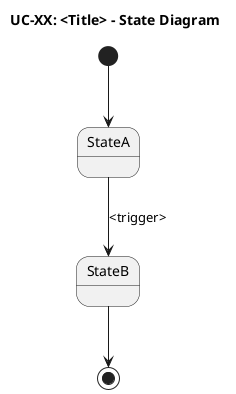
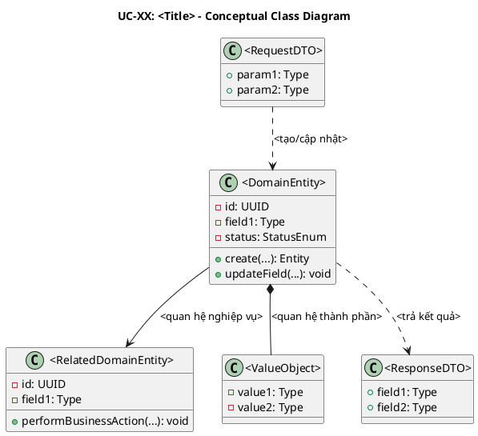
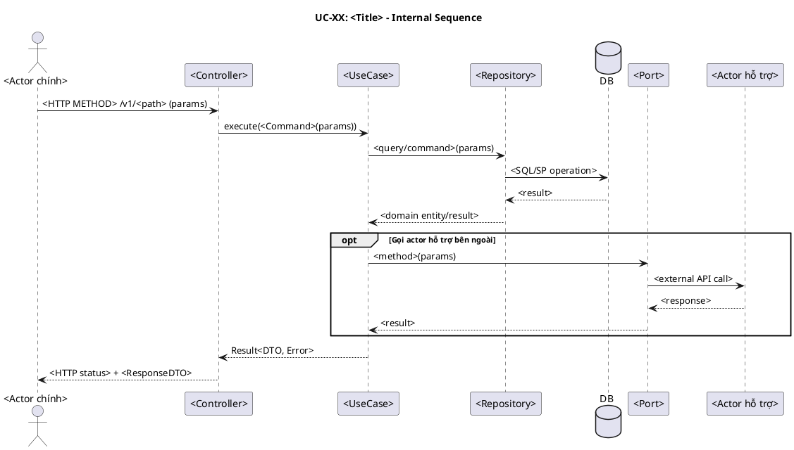
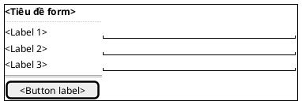

# UC-XX: <Tên use case>

# Mô tả use case

| Mục                         | Nội dung                                                                                                        |
| --------------------------- | --------------------------------------------------------------------------------------------------------------- |
| Quan hệ UC                  | **`<<includes>>` (bắt buộc)**: <UC được bao gồm 1>, <UC được bao gồm 2> hoặc <Không>   **`<<extends>>` (tùy chọn)**: <UC mở rộng 1> tại <điểm mở rộng>, <UC mở rộng 2> tại <điểm mở rộng> hoặc <Không>   **Generalization**: <UC cha> / <UC con chuyên biệt> hoặc <Không> |
| Mục đích                    | <Nêu rõ tình huống mà actor cần PM trợ giúp, ích lợi cụ thể PM mang lại cho actor trong tình huống này>         |
| Mô tả                       | <Mô tả ngắn gọn mục đích chức năng từ góc nhìn khách hàng>                                                      |
| Actor chính                 | <Actor trực tiếp kích hoạt use case — vai trò trong tổ chức, không phải "User" hay "Admin">                    |
| Actor liên quan             | <Các actor tham gia gián tiếp: actor hỗ trợ PM, actor nhận kết quả,... Nếu không có, ghi "Không">              |
| Tiền điều kiện              | <Điều kiện bắt buộc trước khi thực hiện>                                                                        |
| Luồng chính                 | 1. <Bước 1>   2. <Bước 2>   3. <Bước 3>                                                                   |
| Hậu điều kiện (thành công)  | <Trạng thái hệ thống sau khi use case hoàn thành thành công>                                                    |
| Hậu điều kiện (thất bại)    | <Trạng thái hệ thống khi use case thất bại — dữ liệu có rollback không, trạng thái entity nào bị ảnh hưởng,...> |
| Luồng ngoại lệ              | <Ngoại lệ 1> → <Hành vi hệ thống>   <Ngoại lệ 2> → <Hành vi hệ thống>                                        |

# Lược đồ Use Case

<!-- Lược đồ use case thể hiện vị trí của UC này trong hệ thống:
     actor nghiệp vụ, actor liên quan, quan hệ actor-usecase,
     quan hệ usecase-usecase bằng <<includes>>, <<extends>> và generalization.
     Actor phải là vai trò thực tế trong tổ chức, không dùng "User" hay "Admin". -->

# Lược đồ tuần tự

<!-- Lược đồ cấp 1: Actor ↔ PM (hệ thống là hộp đen).
     Mọi thông điệp đi đến PM PHẢI có tham số dữ liệu để định nghĩa chức năng cho PM.
     Lược đồ cấp 2 (nội bộ PM) nằm ở mục 7. -->

# Lược đồ hoạt động

<!-- Dùng để đối chiếu với lược đồ tuần tự (mục 3), kiểm tra độ phủ kịch bản
     và xác định thêm luồng ngoại lệ nếu thiếu. -->

<!-- Chỉ giữ mục này khi use case có thay đổi trạng thái -->

# Lược đồ trạng thái

<!-- Ràng buộc chuyển trạng thái sẽ thành CHECK constraint trong DB
     và business rule trong lớp UseCase. -->

# Lược đồ lớp ý niệm

<!-- Các domain entity, value object, DTO tham gia vào use case.
     Thuộc tính và phương thức ở mức ý niệm (conceptual), lấy từ thực tế.
     Tên lớp phải nhất quán với các lược đồ khác trong cùng UC.
     PHẢI thể hiện đầy đủ mọi quan hệ giữa các domain entity tham gia UC.
     Tên thuộc tính và phương thức phải xuất phát từ thuật ngữ nghiệp vụ thực tế,
     không đặt theo chi tiết kỹ thuật nếu chưa bước sang thiết kế/hiện thực. -->

# Phân rã thành phần PM

<!-- Xem PM là một hệ thống. Phân rã các thành phần xử lý UC này
     theo kiến trúc Clean Architecture + DDD:
     Controller (lớp biên) → UseCase (lớp xử lý) → Repository (lớp thực thể) → DB
     Mô tả nhiệm vụ, API, inputs/outputs cho từng thành phần. -->

## Controller: `<ControllerName>`

- **Nhiệm vụ**: Nhận HTTP request từ actor, xác thực đầu vào, ủy thác cho
  UseCase.
- **Endpoint**: `<METHOD> /v1/<path>`
- **Input**: `<RequestDTO>` — `{ field1: Type, field2: Type, ... }`
- **Output thành công**: `<HTTP status>` + `<ResponseDTO>` —
  `{ field1: Type, ... }`
- **Output lỗi**: `<HTTP status>` + `JsendResponse` — `{ errorCode, message }`

## UseCase: `<UseCaseName>`

- **Nhiệm vụ**: Orchestrate nghiệp vụ cho UC này.
- **Input**: `<Command/Query>` — `{ field1: Type, ... }`
- **Output**: `Result<ResponseDTO, Error>`
- **Gọi đến**:
    - `<Repository>.method()` — <mục đích>
    - `<Port>.method()` — <mục đích> (nếu có actor hỗ trợ bên ngoài)
- **Phát sinh sự kiện**: `<DomainEvent>` (nếu có)

## Repository: `<RepositoryName>`

- **Nhiệm vụ**: Truy xuất/lưu trữ domain entity `<Entity>`.
- **Phương thức liên quan đến UC**:
    - `findById(id): Optional<Entity>` — <mục đích>
    - `save(entity): Entity` — <mục đích>
- **Table**: `<table_name>`
- **Stored Procedure sử dụng**: `<stored_procedure_name>`

## Thiết kế cơ sở dữ liệu

### ERD

- **Tham chiếu ERD**: `<Đường dẫn hoặc tên lược đồ ERD liên quan đến UC>`
- **Bảng/View liên quan**: `<table_or_view_1>`, `<table_or_view_2>`

### Stored Procedure: `<StoredProcedureName>`

| Mục             | Nội dung                                                   |
| --------------- | ---------------------------------------------------------- |
| Tên             | `<StoredProcedureName>`                                    |
| Nhiệm vụ        | <Nhiệm vụ xử lý dữ liệu trong CSDL>                        |
| Inputs          | `<param1: Type>`, `<param2: Type>`                         |
| Outputs         | `<Dataset/Status/GeneratedId>`                             |
| Quyền sử dụng   | `<Role được phép gọi SP 1>`, `<Role được phép gọi SP 2>`   |

### Trigger: `<TriggerName>`

| Mục       | Nội dung                                          |
| --------- | ------------------------------------------------- |
| Tên       | `<TriggerName>`                                   |
| Nhiệm vụ  | <Ràng buộc toàn vẹn dữ liệu hoặc tự động xử lý>   |
| Event     | `<BEFORE/AFTER INSERT/UPDATE/DELETE ON table>`    |
| Action    | <Hành động được thực hiện khi trigger kích hoạt>  |

## Port: `<PortName>` _(nếu có)_

- **Nhiệm vụ**: Giao tiếp với actor hỗ trợ bên ngoài (vd: Stripe, Email
  Service,...).
- **Phương thức liên quan đến UC**:
    - `methodName(params): ReturnType` — <mục đích>

## Lược đồ tuần tự nội bộ PM

<!-- Lược đồ cấp 2: phân rã tương tác nội bộ hệ thống.
     Diễn tả cách các thành phần PM phối hợp xử lý UC. -->

## Giao diện

### Giao diện mẫu

<!-- Wireframe mô tả giao diện mặc định của UC sử dụng PlantUML Salt.
     Chỉ thể hiện trạng thái form mặc định (default state).
     Tham khảo: https://plantuml.com/salt -->

| Control          | Nhiệm vụ                              | Inputs                         | Outputs                         | Gọi API                    |
| ---------------- | ------------------------------------- | ------------------------------ | ------------------------------- | -------------------------- |
| `<FormControl>`  | <Nhiệm vụ của control trong form>     | `<field1>`, `<field2>`         | `<data/form/status>`            | `<METHOD> /v1/<path>`      |
| `<Button>`       | <Hành động khi actor kích hoạt>       | `<RequestDTO>`                 | `<ResponseDTO>` hoặc `<Error>`  | `<ApiName>`                |

### Giao diện ứng dụng

<!-- Ảnh chụp màn hình giao diện thực tế sau khi hiện thực.
     Bổ sung khi hoàn thành implementation. -->

Chưa hiện thực. Sẽ bổ sung ảnh chụp màn hình khi hoàn thành.

# Bảng tham chiếu dò vết

<!-- Dùng để dò vết, đối chiếu, sửa và kiểm thử.
     Mỗi dòng map từ UC → Controller endpoint → UseCase → Repository method → Stored Procedure → DB table.
     Giúp đảm bảo không có chức năng bị bỏ sót khi hiện thực. -->

| Use Case | Controller | Endpoint              | UseCase        | Repository             | SP                  | Table      |
| -------- | ---------- | --------------------- | -------------- | ---------------------- | ------------------- | ---------- |
| UC-XX    | XxxCtl     | `METHOD /v1/path`     | XxxUseCase     | XxxRepository.method() | stored_procedure    | table_name |
|          |            | `METHOD /v1/path/:id` | XxxByIdUseCase | XxxRepository.method() | stored_procedure    | table_name |

# Tiêu chí kiểm thử

<!-- Tiêu chí kiểm thử được chia theo 3 mức: phân tích, thiết kế và hiện thực.
     Các tiêu chí phải truy vết được về UC, lược đồ, thành phần PM, API, SP và bảng dữ liệu. -->

## Mức phân tích

| Tiêu chí             | Phép thử                                                                   | Kết quả mong đợi                          | Ghi chú                              |
| -------------------- | -------------------------------------------------------------------------- | ----------------------------------------- | ------------------------------------ |
| Toàn diện (coverage) | Đối chiếu Activity Diagram ↔ Sequence Diagram: mọi luồng đều được thể hiện | Không bỏ sót luồng chính lẫn ngoại lệ     | Rà soát chéo giữa mục 3 và mục 4     |
| Nhất quán            | Rà soát tên lớp, trạng thái, API giữa các lược đồ trong cùng UC            | Không mâu thuẫn giữa các mục 2–7          | Đặc biệt kiểm tra tên trong mục 6–7  |
| Truy vết             | Đối chiếu bảng tham chiếu (mục 8) với lược đồ tuần tự nội bộ (mục 7.6)     | Mọi tương tác trong sequence đều có entry | Kiểm tra không thiếu endpoint/method |

## Mức thiết kế

| Tiêu chí      | Phép thử                                                       | Kết quả mong đợi                                  | Ghi chú                         |
| ------------- | -------------------------------------------------------------- | ------------------------------------------------- | ------------------------------- |
| Chuẩn hóa     | Rà soát thiết kế Controller, UseCase, Repository, Port và DB   | Tuân thủ kiến trúc, quy ước đặt tên và hợp đồng   | Walkthrough/inspection          |
| Testability   | Rà soát khả năng tách phụ thuộc, mock port/repository và dữ liệu test | Có thể kiểm thử từng thành phần độc lập      | Ưu tiên input/output rõ ràng    |
| Modularity    | Rà soát ranh giới trách nhiệm giữa các thành phần PM           | Dễ hiểu, dễ thay đổi, không trùng lặp trách nhiệm | Kiểm tra coupling/cohesion      |

## Mức hiện thực

| Tiêu chí          | Phép thử                                                 | Kết quả mong đợi                                  | Ghi chú                           |
| ----------------- | -------------------------------------------------------- | ------------------------------------------------- | --------------------------------- |
| Xử lý chính xác   | Black-box và white-box test cho luồng chính/ngoại lệ     | Kết quả đúng theo yêu cầu UC và hợp đồng API      | Kết hợp test tự động và thủ công  |
| Hiệu năng         | Stress test hoặc benchmark với `<test-inputs>`           | Đạt `<ngưỡng hiệu năng>` trong điều kiện tải giả định | Ghi rõ môi trường test        |
| Bảo mật           | Code review, kiểm thử phân quyền, kiểm thử dữ liệu đầu vào | Không lộ dữ liệu, không vượt quyền, không injection | Bổ sung pen-test nếu cần       |

## Bảng tiêu chí chất lượng theo chức năng

| Chức năng trong UC | Tiêu chí mức Ý niệm                              | Tiêu chí mức Thiết kế                                     | Tiêu chí mức Hiện thực                              |
| ------------------ | ------------------------------------------------ | --------------------------------------------------------- | --------------------------------------------------- |
| `<Chức năng 1>`    | <Đúng nhu cầu actor, thiết thực cho tình huống>  | <Luồng xử lý chuẩn hóa, dễ test, module rõ trách nhiệm>   | <Testcase xử lý đúng, hiệu năng đạt, bảo mật đạt>   |
| `<Chức năng 2>`    | <Không bỏ sót luồng chính và luồng ngoại lệ>     | <API/Form/SP hỗ trợ đủ dữ liệu vào/ra>                    | <Test tích hợp, test dữ liệu, test lỗi đầy đủ>      |

# Yêu cầu phi chức năng

<!-- Yêu cầu phi chức năng phải có nguồn gốc rõ ràng từ môi trường nghiệp vụ,
     môi trường vận hành hoặc môi trường phát triển. -->

| Loại yêu cầu                         | Nội dung                                      | Nguồn gốc                                      |
| ------------------------------------ | --------------------------------------------- | --------------------------------------------- |
| Business                             | <Yêu cầu tạo giá trị sử dụng cho tổ chức>     | <Vai trò/tài liệu/quy định nghiệp vụ>         |
| Operation                            | <Yêu cầu vận hành ổn định, bảo mật, tuân thủ> | <Luật/quy định vận hành/chính sách an toàn>   |
| Development                          | <Yêu cầu kiến trúc, công nghệ, quy ước phát triển> | <Chuẩn kỹ thuật/quy ước nhóm/tài liệu công nghệ> |
