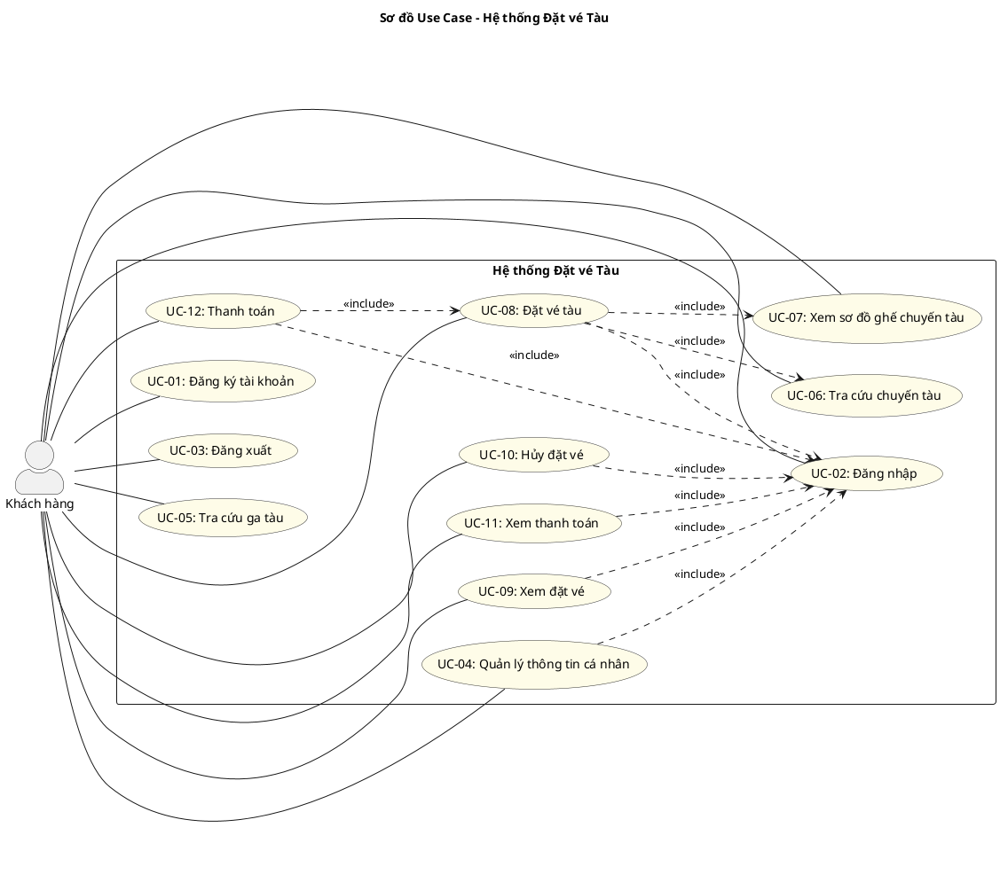
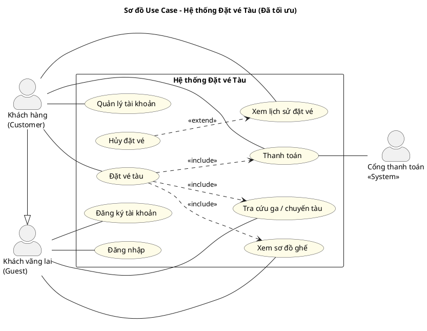

# Chương 3: Phân tích yêu cầu

```plantuml
@startuml usecase-diagram
title Sơ đồ Use Case - Hệ thống Đặt vé Tàu

left to right direction
skinparam packageStyle rectangle
skinparam actorStyle awesome
skinparam usecase {
  BackgroundColor #FEFCE8
  BorderColor #333333
}

actor "Khách hàng" as Customer

rectangle "Hệ thống Đặt vé Tàu" {
  ' ── Quản lý tài khoản ──
  usecase "UC-01: Đăng ký tài khoản" as UC01
  usecase "UC-02: Đăng nhập" as UC02
  usecase "UC-03: Đăng xuất" as UC03
  usecase "UC-04: Quản lý thông tin cá nhân" as UC04

  ' ── Tra cứu ──
  usecase "UC-05: Tra cứu ga tàu" as UC05
  usecase "UC-06: Tra cứu chuyến tàu" as UC06
  usecase "UC-07: Xem sơ đồ ghế chuyến tàu" as UC07

  ' ── Đặt vé & Thanh toán ──
  usecase "UC-08: Đặt vé tàu" as UC08
  usecase "UC-09: Xem đặt vé" as UC09
  usecase "UC-10: Hủy đặt vé" as UC10
  usecase "UC-11: Xem thanh toán" as UC11
  usecase "UC-12: Thanh toán" as UC12

  ' ── Relationships ──
  UC08 ..> UC02 : <<include>>
  UC08 ..> UC06 : <<include>>
  UC08 ..> UC07 : <<include>>

  UC04 ..> UC02 : <<include>>
  UC09 ..> UC02 : <<include>>
  UC10 ..> UC02 : <<include>>
  UC11 ..> UC02 : <<include>>
  UC12 ..> UC02 : <<include>>
  UC12 ..> UC08 : <<include>>
}

' ── Actor associations ──
Customer -- UC01
Customer -- UC02
Customer -- UC03
Customer -- UC04
Customer -- UC05
Customer -- UC06
Customer -- UC07
Customer -- UC08
Customer -- UC09
Customer -- UC10
Customer -- UC11
Customer -- UC12

@enduml
```

```plantuml
@startuml usecase-diagram
title Sơ đồ Use Case - Hệ thống Đặt vé Tàu (Đã tối ưu)

left to right direction
skinparam packageStyle rectangle
skinparam actorStyle awesome
skinparam usecase {
  BackgroundColor #FEFCE8
  BorderColor #333333
}

' ── Actors ──
actor "Khách vãng lai\n(Guest)" as Guest
actor "Khách hàng\n(Customer)" as Customer
actor "Cổng thanh toán\n<<System>>" as PaymentGW

' Customer kế thừa toàn bộ quyền của Guest
Customer -|> Guest

rectangle "Hệ thống Đặt vé Tàu" {

  ' ── Cấp độ Guest (Chưa đăng nhập) ──
  usecase "Tra cứu ga / chuyến tàu" as UC_Search
  usecase "Xem sơ đồ ghế" as UC_ViewSeat
  usecase "Đăng ký tài khoản" as UC_Register
  usecase "Đăng nhập" as UC_Login

  ' ── Cấp độ Customer (Đã đăng nhập) ──
  usecase "Quản lý tài khoản" as UC_Account
  usecase "Xem lịch sử đặt vé" as UC_ViewHistory
  usecase "Đặt vé tàu" as UC_Book
  usecase "Thanh toán" as UC_Payment
  usecase "Hủy đặt vé" as UC_Cancel

  ' ── Relationships (Includes / Extends) ──
  ' Muốn đặt vé thì bắt buộc phải tìm chuyến và chọn ghế
  UC_Book ..> UC_Search : <<include>>
  UC_Book ..> UC_ViewSeat : <<include>>
  ' Đặt vé bắt buộc phải thanh toán
  UC_Book ..> UC_Payment : <<include>>

  ' Hủy vé là một tính năng mở rộng có thể thực hiện từ màn hình Xem lịch sử
  UC_Cancel ..> UC_ViewHistory : <<extend>>
}

' ── Phân quyền Actor ──
Guest -- UC_Search
Guest -- UC_ViewSeat
Guest -- UC_Register
Guest -- UC_Login

Customer -- UC_Account
Customer -- UC_ViewHistory
Customer -- UC_Book
Customer -- UC_Payment

' ── Tương tác hệ thống bên ngoài ──
UC_Payment -- PaymentGW

@enduml
```
